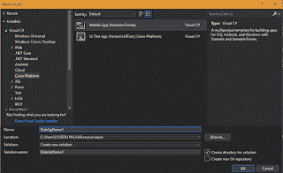

# Xamarin。表单-上滑面板应用程序

> 原文：<https://dev.to/logeshpalani98/xamarin-forms-slide-up-panel-app-4pio>

**简介**

**这篇文章演示了如何在 Xamarin 中启用上滑面板。表单应用程序。这意味着如果用户从下向上拖动面板，它会显示标题、图像、描述等等。类似地，用户可以从上到下拖动面板，它将只显示标题并设置它的自定义行为。默认情况下，Xamarin 中不会列出这些功能。表单应用程序。所以，我们需要为此安装一个插件。**

* *NuGet 包-搜索 Xamarin。表单**

*   黑暗的滑动面板
*   被动反应。福迪雀

**Xamarin。安卓输出**

我们开始吧。

**第一步:**

可以创建 Xamarin。表单 app 通过去文件> >新建> > Visual C# > >跨平台> >跨平台 App (Xamarin。原生或 Xamarin。表单)，给出应用程序名称，然后单击 OK。

(例如-项目名称:SlidingDemo)

**步骤 2**

项目创建完成后，将下面的 NuGet 包添加到您的项目中。

*   黑暗的滑动面板
*   被动反应。为此，打开解决方案资源管理器并选择您的解决方案。右键单击并选择“管理解决方案的 Nuget 包”。在弹出窗口中，打开“浏览”选项卡并浏览“DK。SlideUpPanel”，“反应性。Fody”并选择下面的 NuGet 包，选择您的然后安装它。

**第三步**
之后，添加 ViewModels 文件夹。为此，打开解决方案浏览器> > SlidingDemo(PCL) > >右键单击并选择 *Add，然后选择名为 ViewModels 的新文件夹。*

打开解决方案资源管理器> > SlidinDemo(PCL)> >右键单击并选择*通过选择新项目添加 folloed。在弹出窗口中选择类别。这样，你就可以创建一个新的类。*

在此步骤中，添加一个名为 AbstractViewModels.cs 的新类，并添加以下代码。

**C#代码**

接下来，添加另一个名为 TestPageAllXamlViewModel.cs 的类，并插入下面给出的代码。

* *C#代码**

**第四步**
打开解决方案浏览器> > SlidingDemo(PCL) > >双击打开主页面。Xaml 页，您可以将程序集和 XAML 代码添加到项目中。这是代码。

*   *滑动面板。MainiView -主视图布局。*
*   *滑动面板。我们需要在隐藏模式下显示滑动面板的标题，所以启用 true。*
*   *滑动面板。我们需要在隐藏模式下显示导航条，所以启用 true 或 false。*
*   *滑动面板。HeaderView -这是滑动面板的标题视图。*
*   *滑动面板。PictureView-是滑动面板的图片视图。*
*   *滑动面板。车身视图-这是滑动面板的车身视图。*
*   *滑动面板。PanelRatio -设置滑动面板的面板比率。*

**XAML 电码**

**第五步**
接下来，打开解决方案浏览器> > SlidingDemo(PCL) > >点击打开主页面的设计视图。这是这个页面的代码。

*   浮动按钮——在我们向上滑动之前，浮动按钮会显示出来
    *   第二个浮动按钮——这个浮动按钮在我们向上滑动后显示出来

**C#代码后面**

**第六步**
添加 FodyWeavers.xml 文件。为此，打开解决方案浏览器> > SlidingDemo(PCL) > >右键单击并选择 _New Item。_ 在弹出窗口中，选择名为 FodyWeavers.xml 的 Xml 文件，然后单击确定。将此文件复制并粘贴到所有项目(Xamarin。安卓，Xamarin。IOS)。

添加以下代码。

**XML 代码**

现在，进入“构建”菜单，点击“配置管理器”。在这里，您可以配置启动项目。单击 F5 或 start 构建并运行您的应用程序。

几秒钟后，应用程序将开始在 Android 模拟器或仿真器上运行，我们将看到您的应用程序成功工作。

最后，我们成功地创造了一个 Xamarin。使用 DK 的窗体滑动演示程序。SlideUpPanel 插件。

请从[这里](https://github.com/logeshpalani98/SlideUpPanel/)下载源代码。