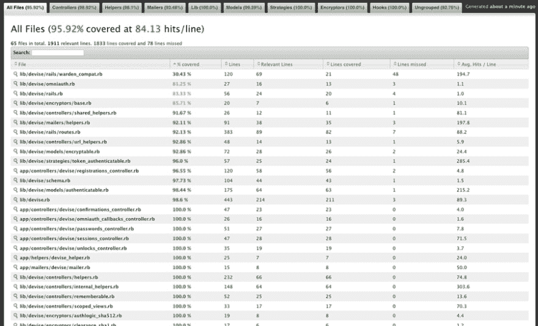
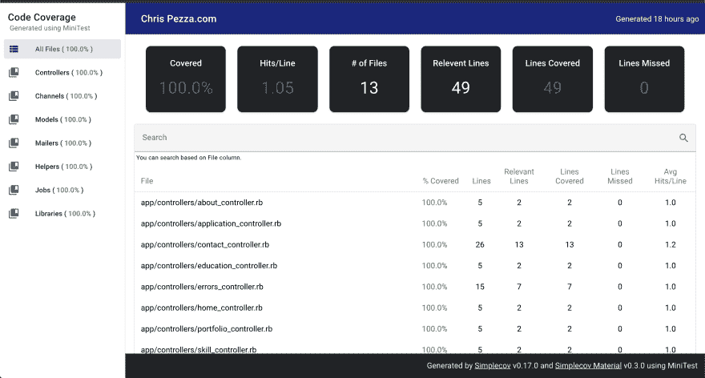
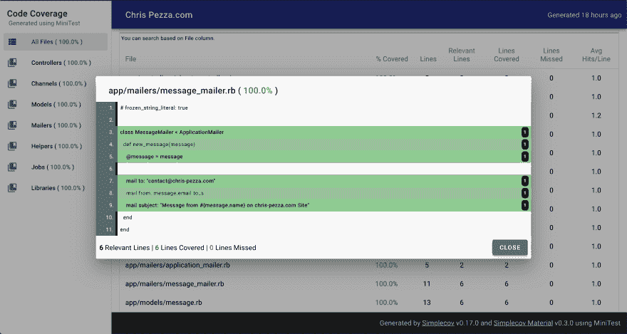

# 使用干净的格式化程序进行 Ruby 测试

> 原文：<https://dev.to/chiefpansancolt/using-a-clean-formatter-for-ruby-testing-2khe>

测试是开发的顶峰，当你在 MVC 模型中开发时，控制器期望单元测试来证明它如预期的那样工作。很多 Ruby 的库都是类似于 [Minitest](https://github.com/seattlerb/minitest) 、 [RSpec](https://github.com/rspec/rspec) 等等。

在 Ruby 中，一个用于查看输出代码覆盖率的公共库是 [Simplecov](https://github.com/colszowka/simplecov) 。我很喜欢这个工具，它可以显示哪些行被覆盖，哪些行被遗漏，以及哪些行被你定义为跳过。您还可以配置许多其他设置。其中一个设置是格式化程序。您可以描述一个或多个，开箱即用的 HTML 格式化程序可以生成 coverage/index.html 中的网页。这是我多年来一直使用的格式，但是当我在具有大文件集和长文件名的大型项目中使用它时，它并不是最干净的 UX。我发现它已经过时了，需要升级。

有了这个，我决定去绘图板设计和建立一个新的 HTML 网页输出 UX，利用新标准的[材料设计](https://material.io/)。我分析了 HTML 格式器提供的哪些有效，哪些无效，并得出以下结论。

### 货物

*   能够在一个组中搜索文件。
*   能够看到组。

### 恶

*   当群组总数超过 6 个时，页面就会变得奇怪。
*   当文件名变长而屏幕变小时，行会从表格视图中消失，变得不可读。
*   难以读取每个文件和每个组的覆盖率。
*   如果光标在错误的位置，在文件视图上滚动可能会滚过文件。
*   当查看一个单独的文件源时，如果不关闭模式来查看表格，你真的不知道你点击了什么文件或者关于那个文件的细节是什么。

我知道我必须维护一个单独的页面生成，以确保生成时不需要太多的依赖文件。这使我不再使用表格方法，而更多地使用左侧导航方法。这将允许可滚动的用户交互。我还想移动关于数字的句子，这个句子太多了，很难读懂。所以我想把它改成每个群组页面顶部的平铺网格。在整个页面上可以注意到一些小的变化，例如，页脚更加整洁，项目名称显示时去掉了破折号和下划线，文件的文本在表格中用省略号截断，以确保行符合相应的列宽。从 repo 结构中，我希望实现并使用 Webpack 来生成输出应用程序 js 和 css 文件以供使用。

结果如下，带有前( [simplecov-html](https://github.com/colszowka/simplecov-html) )和后( [simplecov-material](https://github.com/chiefpansancolt/simplecov-material) )。

### 之前(simplecov-html)

#### 全看

[](https://res.cloudinary.com/practicaldev/image/fetch/s--StDZIsR6--/c_limit%2Cf_auto%2Cfl_progressive%2Cq_auto%2Cw_880/https://thepracticaldev.s3.amazonaws.com/i/0vj2dzy2k6khtmtpfb26.png)

#### 个人文件视图

[](https://res.cloudinary.com/practicaldev/image/fetch/s--_O1H_AfM--/c_limit%2Cf_auto%2Cfl_progressive%2Cq_auto%2Cw_880/https://thepracticaldev.s3.amazonaws.com/i/qjxsb759t8tmlf5yb9x1.png)

### (simple cov-material)之后

#### 全看

[](https://res.cloudinary.com/practicaldev/image/fetch/s--4Zwt21Nf--/c_limit%2Cf_auto%2Cfl_progressive%2Cq_auto%2Cw_880/https://thepracticaldev.s3.amazonaws.com/i/66keo0thbrmg7cse5wy6.png)

#### 个人观点

[](https://res.cloudinary.com/practicaldev/image/fetch/s--lFq_-C-l--/c_limit%2Cf_auto%2Cfl_progressive%2Cq_auto%2Cw_880/https://thepracticaldev.s3.amazonaws.com/i/f8buhic7vca3ka3z7a22.png)

如上所述，外观在风格上有很大的不同，但仍然保持相同的数据和功能。我希望随着时间的推移，基于社区反馈来扩展功能，因此如果您有任何反馈，请在此处查看报告[并在下面留下您的评论:](https://github.com/chiefpansancolt/simplecov-material)

*   [**Bug**T3】](https://github.com/chiefpansancolt/simplecov-material/issues/new?assignees=chiefpansancolt&labels=bug%2C+new&template=bug_report.md&title=)
*   [**特征请求**](https://github.com/chiefpansancolt/simplecov-material/issues/new?assignees=chiefpansancolt&labels=enhancement%2C+new&template=feature-request.md&title=Feature+Request)
*   [**问题**](https://github.com/chiefpansancolt/simplecov-material/issues/new?assignees=&labels=new%2C+question&template=question.md&title=Question)

感谢您花时间阅读我用来开发[simple cov Material](https://github.com/chiefpansancolt/simplecov-material)Formatter 的方法，希望您和我一样喜欢它！就是这么干净好用！！

要使用此 gem，只需将 gem 添加到您的 gem 文件中，将其安装到您的回购协议中。这个 gem 托管在[rubygems.org](https://rubygems.org/gems/simplecov-material)和新 [Github 注册表](https://github.com/chiefpansancolt/simplecov-material/packages)上

要添加到您的 gem 文件，请参见下文或查看 repo 上的 [Readme.md](https://github.com/chiefpansancolt/simplecov-material/blob/master/README.md) 以供参考

#### 红宝石宝石主机

```
# ./Gemfile

group :test do
  gem "simplecov"
  gem "simplecov-material"
end 
```

#### Github Rubygems 主机

```
# ./Gemfile

group :test do
  gem "simplecov"
end

source "https://rubygems.pkg.github.com/chiefpansancolt" 
  group :test do
    gem "simplecov-material"
  end
end 
```