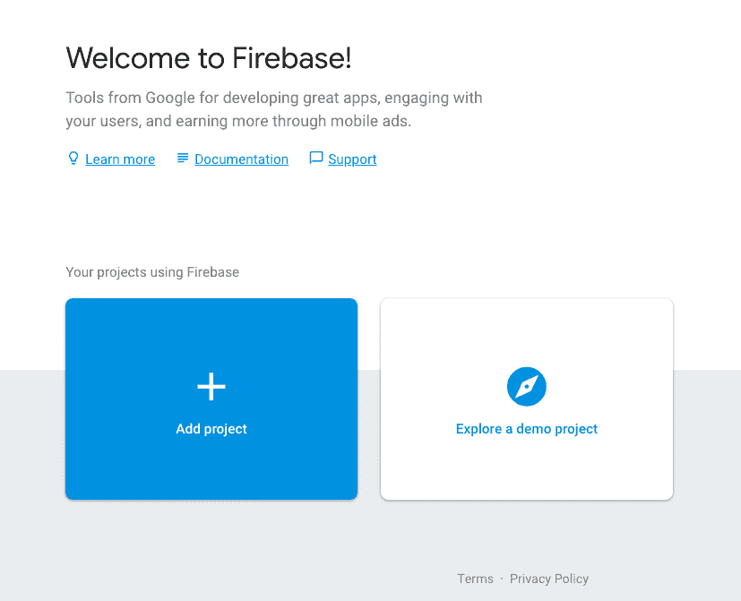
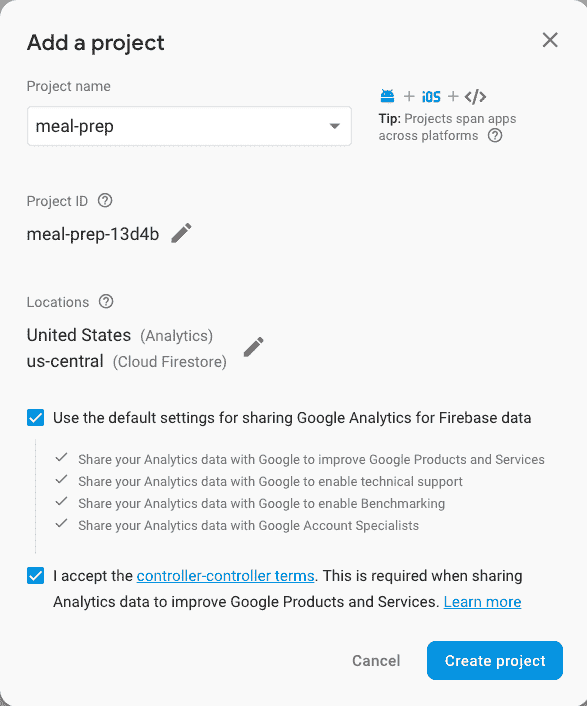
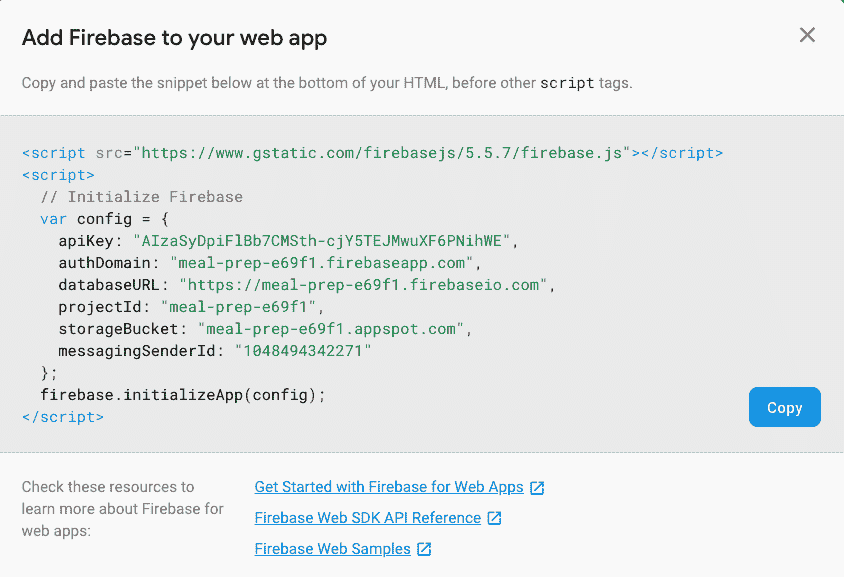
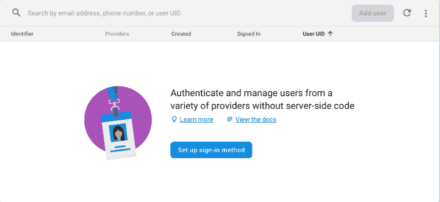
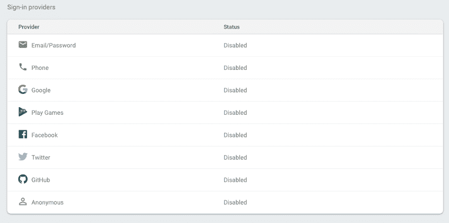

# 如何使用 Vue.js、Vuex、Vuetify 和 Firebase 构建单页面应用程序(第 4 部分，共 4 部分)

> 原文：<https://dev.to/ratracegrad/how-to-build-a-single-page-application-using-vue-js-vuex-vuetify-and-firebase-part-4-of-4-51hh>

了解如何使用 Vue.js、Vuex、Vue Router 和 Firebase 创建送餐网站。

这是我的构建 Vue 应用程序系列的第四部分。以下是所有零件的清单:

[第 1 部分:安装 Vue 并使用 Vue 化和 Vue 路由器构建 SPA](https://dev.to/ratracegrad/how-to-build-a-single-page-application-using-vue-js-vuex-vuetify-and-firebase-part-1-of-4-3a63)

[第二部分:使用 Vue 路由器](https://dev.to/ratracegrad/how-to-build-a-single-page-application-using-vue-js-vuex-vuetify-and-firebase-part-2-of-4-3pj6)

[第三部分:使用 Vuex 和访问 API](https://dev.to/ratracegrad/how-to-build-a-single-page-application-using-vue-js-vuex-vuetify-and-firebase-part-3-of-4-3k3p)

[第 4 部分:使用 Firebase 进行认证](https://dev.to/ratracegrad/how-to-build-a-single-page-application-using-vue-js-vuex-vuetify-and-firebase-part-4-of-4-51hh)

## 重述

在本系列的第一部分中，我们使用 Vue CLI 创建了 Vue 应用程序。此外，我们在应用程序中添加了 Vuetify。我们使用 Vuetify 来设计我们的主页。

在第二部分中，我们使用 Vue Router 在应用程序的不同页面之间添加导航。我们为应用程序中的所有页面添加了组件。

在第三部分，我们被介绍到 Vuex。我们注册了一个 API 来提供食谱，并使用 axios 来检索它们。这些数据存储在 Vuex 存储中，应用程序中的每个组件都可以访问这些数据。

## 什么是 Firebase？

Firebase 是一个面向客户端应用的实时云基础设施。Firebase 可以将任何*前端*应用程序转变为能够在云中无限扩展的全栈产品。它抽象化了大多数复杂的服务器端功能，如用户身份验证、数据持久化、文件存储和微服务，因此您可以专注于为最终用户构建出色的体验。

第一步是转到 [firebase 并创建一个新帐户](https://firebase.google.com)。登录到您创建的帐户。您将看到这个仪表板:

[](https://res.cloudinary.com/practicaldev/image/fetch/s--GwsrdRqe--/c_limit%2Cf_auto%2Cfl_progressive%2Cq_auto%2Cw_880/https://res.cloudinary.com/ratracegrad/image/upload/v1563798716/demo_nue1c0.png)

点击`Add Project`按钮。输入项目的名称。我输入“膳食准备”作为我的项目名称。选中所有复选框。然后点击`create project`按钮。

[](https://res.cloudinary.com/practicaldev/image/fetch/s--OZTWSMDn--/c_limit%2Cf_auto%2Cfl_progressive%2Cq_auto%2Cw_880/https://res.cloudinary.com/ratracegrad/image/upload/v1563798790/add_jradvn.png)

一旦你的项目被创建，Firebase 将带你到你的项目的主页。

[](https://res.cloudinary.com/practicaldev/image/fetch/s--CE8GjqAK--/c_limit%2Cf_auto%2Cfl_progressive%2Cq_auto%2Cw_880/https://res.cloudinary.com/ratracegrad/image/upload/v1563798820/project_miepsp.png)

我们需要将项目的配置集成到我们的膳食准备应用程序中。单击 web 按钮，将 Firebase 添加到您的应用程序中。(注:如果你不确定是哪个按钮，那就是带`</>`的按钮。在上图中，按钮就在“开始”字样的正上方单击“复制”按钮将代码片段复制到剪贴板。

[](https://res.cloudinary.com/practicaldev/image/fetch/s--QAZ1ZR7T--/c_limit%2Cf_auto%2Cfl_progressive%2Cq_auto%2Cw_880/https://res.cloudinary.com/ratracegrad/image/upload/v1563798857/config_mamnkn.png)

接下来，我们需要将这个片段合并到我们的膳食准备应用程序中。您可以在`main.js`文件中初始化 firebase 应用程序。可以在`App.vue`文件里做。

相反，我们将在 src 文件夹中创建一个名为 firebase 的新目录。在这个新目录中创建一个名为`index.js`的文件。将剪贴板的内容粘贴到该文件中。移除带有`script`标签的两条线。在文件的第一行导入 firebase。在最后一行初始化 firebase。你的文件应该是这样的:

```
import firebase from 'firebase';

const config = {
    apiKey: "<youKeyHere>",
    authDomain: "<youKeyHere>",
    databaseURL: "<youKeyHere>",
    projectId: "<youKeyHere>",
    storageBucket: "<youKeyHere>",
    messagingSenderId: "<youKeyHere>"
};
firebase.initializeApp(config); 
```

我们正在从尚未安装的 npm 包中导入 firebase。让我们现在安装它。在您的终端中，使用以下命令安装 firebase:

`npm install firebase --save`

现在我们已经安装了 firebase 并创建了一个配置文件，我们需要将这个文件添加到我们的应用程序中，这样 Vue 就知道了。打开`main.js`文件，导入我们创建的配置文件。下面是我的`main.js`文件的样子:

```
import '@babel/polyfill';
import Vue from 'vue';
import './plugins/vuetify';
import App from './App.vue';
import router from './router';
import store from './store';
import '@/firebase/';

Vue.config.productionTip = false;

new Vue({
    router,
    store,
    render: h => h(App)
}).$mount('#app'); 
```

在浏览器中返回到 firebase 控制台。点击`Authentication`。点击`set up sign-in method`按钮。

[](https://res.cloudinary.com/practicaldev/image/fetch/s--BJOhIQwi--/c_limit%2Cf_auto%2Cfl_progressive%2Cq_auto%2Cw_880/https://res.cloudinary.com/ratracegrad/image/upload/v1563798910/auth_wa5hoi.png)

在登录提供商列表中，单击电子邮件/密码:

[](https://res.cloudinary.com/practicaldev/image/fetch/s--zlBp-XT2--/c_limit%2Cf_auto%2Cfl_progressive%2Cq_auto%2Cw_880/https://www.jenniferbland.com/wp-content/uploads/listof.png)

允许所有用户使用他们的电子邮件地址和密码注册。然后点击`save`按钮。

[](https://res.cloudinary.com/practicaldev/image/fetch/s--pRNYAQpa--/c_limit%2Cf_auto%2Cfl_progressive%2Cq_auto%2Cw_880/https://res.cloudinary.com/ratracegrad/image/upload/v1563798955/listof_ndmbos.png)

## 创建注册表单

在之前的帖子中，我们剔除了 Join.vue 和 Signin.vue 文件。这两个文件的代码几乎相同。我们将首先创建连接表单。完成后，我们会将其复制/粘贴到登录表单中。

打开 Join.vue 组件。您可以删除模板中的所有内容。Vuetify 有一个默认的组件布局结构。它是这样流动的:

*   v 型容器
*   垂直布局
*   v-flex

现在让我们在组件中创建布局。我们文件的开始看起来像这样:

```
<template>
    <v-container fill-height>
        <v-layout align-center justify-center>
            <v-flex xs12 sm8 md4>

            </v-flex>
        </v-layout>
    </v-container>
</template> 
```

对于`v-container`，我们添加了`fill-height`。我们添加它是为了使窗体在窗口中垂直居中。对于`v-flex`，我们添加`xs12` `sm8`和`md4`值。这类似于 Bootstraps 列宽度定义。在超小型设备上，表单将占据整个屏幕的全部 12 列。在小型设备上，窗体将是屏幕宽度的 3/4。在中型和大型屏幕上，表单将是屏幕的 1/3。

在`v-flex`中，我们将使用一个`v-card`。我们将`class=”elevation-12"`添加到`v-card`中，使其看起来悬浮在页面上方。对于表单的顶部，我们将使用一个`v-toolbar`。我们给它一个颜色`primary`。对于 Vuetify 的默认安装，主要颜色是蓝色。我们希望工具栏中的文本是白色文本，而不是默认的黑色。为了将文本变白，我们将`dark`添加到`v-toolbar`中。

接下来，我们有一个`v-card-text`。在它里面，我们有一个`v-form`。对于表格，我们给它一个名为`form`的参考。我们将它赋给值为`valid`的`v-model`。

我们最后加的是`lazy-validation`。我们的表单需要捕获用户的电子邮件和密码。我们将使用两个`v-text-field`来捕捉这些值。为了让事情看起来更好，我为每个字段预先添加了一个图标。每个字段都有一个`v-model`和`rules`。

在提交表单之前，将根据定义的所有规则验证该字段。如果他们通过了，你就可以提交表格了。当用户点击加入按钮时，我们将利用这一点。

添加到表单的最后一项是按钮。我们加一个`v-card-actions`加一个按钮。下面是我们组件的模板外观:

```
<template>
    <v-container fill-height>
        <v-layout align-center justify-center>
            <v-flex xs12 sm8 md4>
                <v-card class="elevation-12">
                    <v-toolbar dark color="primary">
                        <v-toolbar-title>Join Form</v-toolbar-title>
                    </v-toolbar>
                    <v-card-text>
                        <v-form ref="form" v-model="valid" lazy-validation>
                            <v-text-field prepend-icon="person" name="email" label="Email" type="email"
                                          v-model="email" :rules="emailRules" required>
                            </v-text-field>
                            <v-text-field prepend-icon="lock" name="password" label="Password" id="password"
                                          type="password" required v-model="password" :rules="passwordRules">
                            </v-text-field>
                        </v-form>
                    </v-card-text>
                    <v-card-actions>
                        <v-spacer></v-spacer>
                        <v-btn color="primary" :disabled="!valid" @click="submit">Join</v-btn>
                    </v-card-actions>
                </v-card>
            </v-flex>
        </v-layout>
    </v-container>
</template> 
```

我们在模板中定义了几个模型。我们需要将它们添加到脚本的`data`部分。在脚本中添加一个数据对象。我们将添加有效的，电子邮件，密码，电子邮件规则和密码规则。

电子邮件和密码将包含用户在两个文本字段中输入的值。Valid 将判断我们的表单是否通过了我们创建的所有规则。对于电子邮件，我们检查以确保该字段不为空。我们还检查内容是否与基本的 RegExp 匹配，以验证电子邮件地址。对于密码，我们检查以确保该字段不为空。我们还检查以确保密码长度至少为 6 个字符。

下面是数据对象现在的样子:

```
data() {
    return {
        valid: false,
        email: '',
        password: '',
        emailRules: [
            v => !!v || 'E-mail is required',
            v => /.+@.+/.test(v) || 'E-mail must be valid'
        ],
        passwordRules: [
            v => !!v || 'Password is required',
            v =>
                v.length >= 6 ||
                'Password must be greater than 6 characters'
        ]
    };
}, 
```

我们需要添加的最后一件事是方法。在方法中，我们有`submit()`。这个方法将首先验证我们的表单。如果它通过了验证，那么它将调用我们的 Vuex 存储中的一个动作`userJoin`。我们将用户在表单中输入的电子邮件和密码传递给它。

下面是这些方法的样子:

```
methods: {
    submit() {
        if (this.$refs.form.validate()) {
            this.$store.dispatch('userJoin', {
                email: this.email,
                password: this.password
            });
        }
    }
} 
```

## 在 Vuex 中创建用户加入动作

打开`store.js`文件。我们将创建一个名为`userJoin`的新动作。默认情况下，传递给这个动作的第一个参数是`context`。我将使用对象析构来从`context`中获取`commit`。提交是我如何称呼我的突变。

我将使用 firebase 在 firebase 数据库中创建新用户。为了能够在商店中使用 firebase，我需要导入它。在文件的顶部用这个命令导入 firebase:

`import firebase from 'firebase';`

Firebase 认证提供了一种叫做`createUserWithEmailAndPassword`的方法。我们将把用户的电子邮件和密码传递到这个方法中。如果成功注册了用户，它将返回一个用户对象。当它成功时，我们将调用两个突变:`setUser`和`setIsAuthenticated`。下面是这个动作的样子:

```
userJoin({ commit }, { email, password }) {
    firebase
        .auth()
        .createUserWithEmailAndPassword(email, password)
        .then(user => {
            commit('setUser', user);
            commit('setIsAuthenticated', true);
        })
        .catch(() => {
            commit('setUser', null);
            commit('setIsAuthenticated', false);
        });
} 
```

这个动作调用两个突变。所以让我们现在就开始创造吧。在突变中增加一个新的突变叫做`setUser`。将用户的状态值设置为有效负载。接下来，创建名为`setIsAuthenticated`的第二个突变。将 isAuthenticated 的状态值设置为有效负载。下面是这两种突变的样子:

```
setUser(state, payload) {
    state.user = payload;
},
setIsAuthenticated(state, payload) {
    state.isAuthenticated = payload;
} 
```

在 state 中，我们需要添加两个新值:`user`和`isAuthenticated`。下面是这个州现在的样子:

```
state: {
    recipes: \[\],
    apiUrl: 'https://api.edamam.com/search',
    user: null,
    isAuthenticated: false
}, 
```

## 测试添加新用户

用命令`npm run serve`启动您的服务器。点击导航中的`Join`按钮。输入您的电子邮件和密码，然后单击加入按钮。当你点击这个按钮时，什么也看不见。要验证用户是否已注册，请在浏览器中进入 firebase 控制台。点击`Authentication`。您应该会看到已经为您的应用程序注册的用户列表。在这里，您可以看到我刚刚注册的用户已经创建。

[](https://res.cloudinary.com/practicaldev/image/fetch/s--IGvQT7pd--/c_limit%2Cf_auto%2Cfl_progressive%2Cq_auto%2Cw_880/https://res.cloudinary.com/ratracegrad/image/upload/v1563799054/registered_wp8suw.png)

我们需要通知用户它们已经被成功创建。我们稍后会这样做。首先，我们将把 Join.vue 组件的内容复制并粘贴到 Signin.vue 组件中。您只需要对模板进行两处修改。将标题更改为“登录表单”对于按钮，让文本显示“登录”在提交方法中让它分派到`userLogin`。就是这样。现在，您已经创建了加入和登录表单。

我们需要为登录创建动作。打开`store.js`文件。创建一个名为 userLogin 的新操作。我们将使用 firebase 登录用户。Firebase 提供了一个叫做`signInWithEmailAndPassword`的方法。我们将调用这个方法，并传递用户在表单中输入的电子邮件和密码。如果用户正确地输入了他们的电子邮件和密码，那么我们将把这两个变异称为`setUser`和`setIsAuthenticated`。下面是`userLogin`动作的样子:

```
userLogin({ commit }, { email, password }) {
    firebase
        .auth()
        .signInWithEmailAndPassword(email, password)
        .then(user => {
            commit('setUser', user);
            commit('setIsAuthenticated', true);
        })
        .catch(() => {
            commit('setUser', null);
            commit('setIsAuthenticated', false);
        });
}, 
```

## 重定向到概要文件

当用户成功注册或登录时，我们希望将他们重定向到他们的个人资料。当我们最初创建我们的应用程序 Vue CLI 3 时，它为我们创建了两条路线。这些路线是`/`和`/about`。最终，该配置文件将包含用户从`menu`页面订购的所有食谱的列表。还记得我们放在每个食谱底部的按钮吗？该按钮会将食谱添加到用户的个人资料中，并将其存储在 firebase 的数据库中。

为了将用户重定向到配置文件，我们将首先在 store.js 文件的顶部导入 router。使用命令
导入路由器

`import router from '@/router';`

接下来，在这两个操作中，我们将用户重定向到/关于他们是否成功注册或登录。您可以使用以下命令进行重定向:

```
 If the user fails to register an account or login successfully we will redirect the user to the home page. _(NOTE: in a perfect scenario we will provide some notice to the user why the registration or login failed). You can redirect them to the home page with this command:_

```router.push('/');```

To test the redirection, start your server and click on the Login button. Enter the email and password you used when you created your user account. Click the Join button. If everything worked successfully you should be redirected to the About page.

Updating the navigation
-----------------------

The navigation has buttons for `Sign In` and `Join`. When a user successfully registers or login we would like to hide these two buttons. In their place, we want to show a `Logout` button.

Open up the `AppNavigation` component. We are going to group the two current buttons in a div. We are going to remove the class to hide the buttons on small and extra-small devices. Instead, we will place this class on the div. We add a `v-if` to the div to only show if the user is currently not authenticated. Below the `div` we will add a new button for Logout. This new button will have a style of outline with a color of white. When you click on this button it will call the method `logout`. We add a v-else to this button to show when the user is authenticated.

Next, add a method called `logout`. This method will call an action in our store called `userSignOut`.

We also need to add a new computed property called `isAuthenticated`. This property returns the value of isAuthenticated in the state of our store.

Here is what your AppNavigation should look like:

```html
<template>
    <span>
        <v-navigation-drawer app v-model="drawer" class="brown lighten-2" dark disable-resize-watcher>
            <v-list>
                <template v-for="(item, index) in items">
                    <v-list-tile :key="index">
                        <v-list-tile-content>
                            {{item.title}}
                        </v-list-tile-content>
                    </v-list-tile>
                    <v-divider :key="\`divider-${index}\`"></v-divider>
                </template>
            </v-list>
        </v-navigation-drawer>
        <v-toolbar app color="brown darken-4" dark>
            <v-toolbar-side-icon class="hidden-md-and-up" @click="drawer = !drawer"></v-toolbar-side-icon>
            <v-spacer class="hidden-md-and-up"></v-spacer>
            <router-link to="/">
                <v-toolbar-title to="/">{{appTitle}}</v-toolbar-title>
            </router-link>
            <v-btn flat class="hidden-sm-and-down" to="/menu">Menu</v-btn>
            <v-spacer class="hidden-sm-and-down"></v-spacer>
            <div v-if="!isAuthenticated" class="hidden-sm-and-down">
                <v-btn flat to="/sign-in">SIGN IN</v-btn>
                <v-btn color="brown lighten-3" to="/join">JOIN</v-btn>
            </div>
            <v-btn v-else outline color="white" @click="logout">Logout</v-btn>

        </v-toolbar>
    </span>
</template>

<script>
export default {
    name: 'AppNavigation',
    data() {
        return {
            appTitle: 'Meal Prep',
            drawer: false,
            items: \[{ title: 'Menu' }, { title: 'Sign In' }, { title: 'Join' }\]
        };
    },
    computed: {
        isAuthenticated() {
            return this.$store.getters.isAuthenticated;
        }
    },
    methods: {
        logout() {
            this.$store.dispatch('userSignOut');
        }
    }
};
</script>

<style scoped>
a {
    color: white;
    text-decoration: none;
}
</style> 
```

我们需要添加刚刚定义的 getter 和 action。打开`store.js`文件。创建一个名为`userSignout`的新动作。该操作将使用 firebase.auth()注销用户。在用户退出后，它将状态变量`user`设置为空，将`isAuthenticated`设置为假。下面是店里的`userSignout`方法:

```
userSignOut({ commit }) {
    firebase
        .auth()
        .signOut()
        .then(() =&gt; {
            commit('setUser', <em class="markup--em markup--pre-em">null</em>);
            commit('setIsAuthenticated', <em class="markup--em markup--pre-em">false</em>);
            router.push('/');
        })
        .catch(() =&gt; {
            commit('setUser', <em class="markup--em markup--pre-em">null</em>);
            commit('setIsAuthenticated', <em class="markup--em markup--pre-em">false</em>);
            router.push('/');
        });
} 
```

接下来，我们需要向 store 对象添加一个`getters`部分。`isAuthenticated` getters 方法将根据用户认证返回 true 或 false。这里是商店的`getters`部分的样子:

```
getters: {
    isAuthenticated(state) {
        <em class="markup--em markup--pre-em">return </em>state.user !== <em class="markup--em markup--pre-em">null </em>&amp;&amp; state.user !== <em class="markup--em markup--pre-em">undefined</em>;
    }
} 
```

## 向数据库添加配方

一旦用户登录，他们可以点击任何食谱添加到他们的帐户。他们的食谱将显示在他们的个人资料中，也就是`/about`路线。我们需要一个数据库来存储这些食谱。在浏览器中转到 firebase 控制台。点击左侧导航面板中的`database`。在下一个屏幕上，您将看到创建实时数据库或云 firestore 数据库的按钮。确保创建一个新的实时数据库。在对话框中确保你选择了`start in test mode`。然后点击`enable`按钮。

[](https://res.cloudinary.com/practicaldev/image/fetch/s--vVjX4IgY--/c_limit%2Cf_auto%2Cfl_progressive%2Cq_auto%2Cw_880/https://res.cloudinary.com/ratracegrad/image/upload/v1563799160/startdb_geyf8g.png)

现在，我们希望将用户的食谱存储在数据库中。打开 MealPlans 组件。如果用户试图订购一个食谱，但他们没有登录，那么我们应该将他们重定向到登录页面。所以让我们现在就解决这个问题。在`Order`按钮上添加一个@click 来调用 orderRecipe 方法。确保将`item`作为参数传递给该方法。你的按钮应该是这样的:

```
<v-card-actions>
    <v-btn color="green" dark @click="orderRecipe(item)">Order</v-btn>
</v-card-actions> 
```

在创建方法之前，我们将为 isAuthenticated 创建一个计算值。这与我们在前面的`AppNavigation`中使用的正确显示和隐藏登录和注销按钮的代码完全相同。添加一个计算的 isAuthenticated。应该是这样的:

```
export default {
    name: 'MealRecipes',
    computed: {
        recipes() {
            return this.$store.state.recipes;
        },
        isAuthenticated() {
            return this.$store.getters.isAuthenticated;
        }
    }
}; 
```

现在我们准备创建 orderRecipe 方法。添加此方法及其参数。在这个方法中，我们想首先检查用户是否登录。如果不是，我们希望将它们重定向到`/sign-in`。如果他们已经登录，那么我们希望在 Vuex 商店中调用一个动作，将配方添加到数据库中的用户帐户。下面是我们的方法的样子:

```
methods: {
    orderRecipe(item) {
        if (this.isAuthenticated) {
            this.$store.dispatch('addRecipe', item);
        } else {
            this.$router.push('/sign-in');
        }
    }
} 
```

打开 store.js 文件。我们需要创建一个新的动作来添加食谱。在这个操作中，我们将使用 firebase 将配方添加到名为`users`的数据库中。当用户在 firebase 中注册时，他们会被分配一个唯一的 userid。我们将使用这个`uid`在数据库中存储配方的名称。在这个操作中，我们将使用`state`来获取当前所选用户的值。`state`中的`user`是一个物体。该对象有一个名为 user 的键。在那个物体中，我们会找到`uid`。我们用它将所选食谱的标题推入数据库。动作如下:

```
addRecipe({ state }, payload) {
    firebase
        .database()
        .ref('users')
        .child(state.user.user.uid)
        .push(payload.label);
} 
```

现在启动您的服务器并登录。从菜单页面中选择一种饮食。然后点几个菜谱。你点的食谱应该会显示在 firebase 的数据库中。

[](https://res.cloudinary.com/practicaldev/image/fetch/s--R_WUz2_U--/c_limit%2Cf_auto%2Cfl_progressive%2Cq_auto%2Cw_880/https://res.cloudinary.com/ratracegrad/image/upload/v1563799226/recipes_c635rt.png)

既然我们已经将食谱添加到数据库中，我们实际上需要在用户的个人资料页面上显示它们。打开`About.vue`文件。每当这个页面被加载，它应该获取所有用户的食谱。为此，我们在脚本中添加了`mounted()`。这将调用一个叫做`getRecipes`的方法。

现在让我们创建这个方法。在该方法中，我们将调用 Vuex 商店中的一个动作，该动作将获取所有用户的食谱。我们还没有在商店中创建这个动作，但简单来说，这个动作将获得用户的食谱。然后，它会将它们存储在名为`userRecipes`的变量`state`中。在我们离开 About.vue 之前，为`userRecipes`添加一个计算属性。这将从我们商店的`state`退回`userRecipes`。About.vue 脚本应该是这样的:

```
export default {
    name: 'About',
    computed: {
        userRecipes() {
            return this.$store.state.userRecipes;
        }
    },
    mounted() {
        this.getRecipes();
    },
    methods: {
        getRecipes() {
            this.$store.dispatch('getUserRecipes');
        }
    }
}; 
```

接下来，打开您的`store.js`文件。我们需要创建`getUserRecipes`动作。当用户登录时，我们在`state`中存储一个名为 user 的变量。该变量将拥有在 firebase 中注册时分配给该用户的唯一用户 ID。我们希望获得用户数据库中具有该用户 ID 的所有食谱。一旦我们得到所有的食谱，我们希望设置用户食谱来包含它们。下面是 getUserRecipes 操作:

```
getUserRecipes({ state, commit }) {
    <em class="markup--em markup--pre-em">return </em>firebase
        .database()
        .ref('users/' + state.user.user.uid)
        .once('value', snapshot =&gt; {
            commit('setUserRecipes', snapshot.val());
        });
} 
```

在我们的突变中，我们需要添加一个`setUserRecipes`。看起来是这样的:

```
setUserRecipes(state, payload) {
    state.userRecipes = payload;
} 
```

我们还需要在`state`中添加一个`userRecipes`。我们将其初始值设置为空数组。这里是我的整个状态对象:

```
state: {
    recipes: \[\],
    apiUrl: 'https://api.edamam.com/search',
    user: <em class="markup--em markup--pre-em">null</em>,
    isAuthenticated: <em class="markup--em markup--pre-em">false</em>,
    userRecipes: \[\]
}, 
```

现在我们得到了食谱，我们需要在页面上向用户显示它们。所以回到你的`About.vue`文件。在模板中，我们将遍历所有用户的食谱并显示它们。我会先给你看我的模板代码，然后解释我做了什么:

```
<template>
    <v-container >
        <v-layout column>
            <h1 class="title my-3">My Recipes</h1>
            <div v-for="(item, idx) in userRecipes" class="subheading mb-2" :key="idx">
                {{item}}
            </div>
        </v-layout>
    </v-container>
</template> 
```

我已经将布局设置为`column`。我这样做是因为我希望每个食谱都列在页面上。为了让事情看起来更清楚，我添加了一个标题。我添加了 my-3 来添加上边距和下边距，这样标题和食谱列表之间就有了间隔。接下来，我循环浏览每个食谱并显示出来。如果用户有食谱，他们会看到以下内容:

[](https://res.cloudinary.com/practicaldev/image/fetch/s--4tQxi8Yf--/c_limit%2Cf_auto%2Cfl_progressive%2Cq_auto%2Cw_880/https://res.cloudinary.com/ratracegrad/image/upload/v1563799327/listRecipes_x31wwl.png)

这很好，但是如果用户登录后没有任何食谱呢？他们看到标题“我的食谱”和一个空白页。这不是一个用户友好的设计。所以让我们改变它来展示一些更友好的东西。我们将显示一个按钮，将用户带到`menu`页面。在我们的模板中，我们将添加这个按钮。为了让按钮重定向到菜单页面，我们可以在按钮上添加`to=”/menu”`。这是我的`About.vue`组件的最终模板。

```
<template>
    <v-container >
        <v-layout column>
            <h1 class="title my-3">My Recipes</h1>
            <div v-for="(item, idx) in userRecipes" class="subheading mb-2" :key="idx">
                {{item}}
            </div>
            <v-flex mt-4>
                <v-btn color="primary" to="/menu">Go To Menu</v-btn>
            </v-flex>
        </v-layout>
    </v-container>
</template> 
```

## 在导航中显示个人资料

我们需要添加的最后一件事是能够在导航中显示到概要文件的链接。就像注销按钮一样，这应该只在用户通过身份验证时显示。打开 AppNavigation 组件。我们将配置文件按钮和注销按钮组合在一个 div 中。这与我们之前对`Sign In`和`Join`按钮所做的是一样的。添加一个 div 并将注销按钮移动到这个 div 中。为`profile`再加一个按钮。该按钮将与`Sign In`按钮一样扁平。下面是我的 AppNavigation 现在的样子:

```
<template>
    <span>
        <v-navigation-drawer app v-model="drawer" class="brown lighten-2" dark disable-resize-watcher>
            <v-list>
                <template v-for="(item, index) in items">
                    <v-list-tile :key="index">
                        <v-list-tile-content>
                            {{item.title}}
                        </v-list-tile-content>
                    </v-list-tile>
                    <v-divider :key="\`divider-${index}\`"></v-divider>
                </template>
            </v-list>
        </v-navigation-drawer>
        <v-toolbar app color="brown darken-4" dark>
            <v-toolbar-side-icon class="hidden-md-and-up" @click="drawer = !drawer"></v-toolbar-side-icon>
            <v-spacer class="hidden-md-and-up"></v-spacer>
            <router-link to="/">
                <v-toolbar-title to="/">{{appTitle}}</v-toolbar-title>
            </router-link>
            <v-btn flat class="hidden-sm-and-down" to="/menu">Menu</v-btn>
            <v-spacer class="hidden-sm-and-down"></v-spacer>
            <div v-if="!isAuthenticated" class="hidden-sm-and-down">
                <v-btn flat to="/sign-in">SIGN IN</v-btn>
                <v-btn color="brown lighten-3" to="/join">JOIN</v-btn>
            </div>
            <div v-else>
                <v-btn flat to="/about">PROFILE</v-btn>
                <v-btn outline color="white" @click="logout">Logout</v-btn>
            </div>

        </v-toolbar>
    </span>
</template> 
```

## 添加路线守卫

目前，用户可以通过输入浏览器的 URL 导航到个人资料页面，如果用户没有登录，我们不想让他们这样做。Vue 路由器提供了在导航到 URL 之前添加路由保护的能力。我们想在允许用户重定向到`/about`页面之前测试他们是否通过了身份验证。

打开`router.js`文件。路由保护与元标签协同工作。找到`/about`路线。我们将添加一个`authRequired`元标签。路线应该是这样的:

```
{
    path: '/about',
    name: 'about',
    component: () =&gt; <em class="markup--em markup--pre-em">import</em>('./views/About.vue'),
    meta: {
        authRequired: <em class="markup--em markup--pre-em">true
    </em>}
}, 
```

作为 Vue 路由器的一部分，路由防护通过名为 beforeEach 的方法进行检查。此方法传递了三个参数:

*   你要去的路线
*   你来的路线
*   继续当前路线的下一个方法

我们的 beforeEach 方法将检查我们要去的每条路由，看它是否包含 authRequired 的 meta 标记。如果是，它将检查用户是否通过了身份验证。如果用户没有通过认证，它会将他们重定向到`/sign-in`页面。如果用户登录，那么它将允许路线继续。如果用户路由到任何没有 authRequired meta 标签的页面，那么路由将继续。下面是我添加到我的路由器中进行检查的方法:

```
router.beforeEach((to, from, next) =&gt; {
    <em class="markup--em markup--pre-em">if </em>(to.matched.some(record =&gt; record.meta.authRequired)) {
        <em class="markup--em markup--pre-em">if </em>(!store.state.user) {
            next({
                path: '/sign-in'
            });
        } <em class="markup--em markup--pre-em">else </em>{
            next();
        }
    } <em class="markup--em markup--pre-em">else </em>{
        next();
    }
}); 
```

## 获取代码

尽管这是一个由 4 部分组成的系列，但你可以在我的 GitHub 帐户中获得[完成的代码。](https://github.com/ratracegrad/meal-prep)请帮帮我，**拿到代码后开始回购**。

## 总结

在本系列的这一部分中，您已经学习了:

*   什么是 firebase
*   使用 firebase 验证使用电子邮件和密码登录的用户
*   使用 firebase 存储用户订购的食谱
*   如果用户没有通过身份验证，使用路由保护禁止用户访问页面
*   在 firebase 上显示数据库中的用户食谱列表

## 培训课程

我在我的网站 CodePrep 上创建培训课程。我有关于 Vue、Webpack、Flexbox、函数式编程等等的培训课程。点击这里查看。