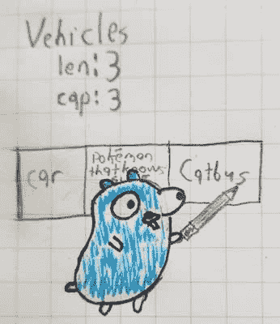
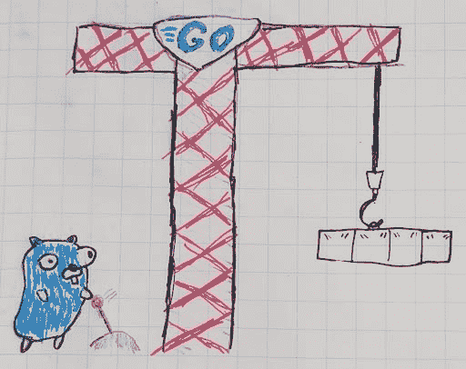
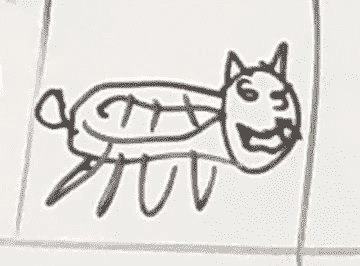

# 仔细看看 Go 的追加功能

> 原文：<https://dev.to/andyhaskell/a-closer-look-at-go-s-slice-append-function-3bhb>

向数组和类似数组的对象添加项在许多编程语言中很常见，像 JavaScript 的`Array.push`和 Python 的`List.append`这样的函数可以添加项。在 Go 中，向其切片类型添加项目的函数被称为`append`，它看起来非常类似于您从另一种语言中所期望的。

```
var numbers []int
numbers = append(numbers, 250)
numbers = append(numbers, 2071)
numbers = append(numbers, 1123)
// logs [250, 2071, 1123]
fmt.Println(numbers) 
```

在这个代码片段中，我们将数字 250、2071 和 1123 添加到一片 int 中，然后打印出它的内容。

大多数时候，很容易认为`append`只是将项目添加到切片上。然而，当你追加到一个片时，知道在幕后发生了什么有助于你编写运行更快的 Go 代码，并避免使用片和追加函数时容易错过的陷阱。所以在本教程中，我们将仔细看看当你运行`append`时你的计算机在做什么。

## 看着一片成长

当你有一片时，它能告诉你五件事:

🐛它的长度；`len(slice)`
📦其容量；`cap(slice)`
🎊里面有什么；`fmt.Sprintf("%v", slice)`T7】🗺️在哪里，在你电脑的内存里，它在哪里；`fmt.Sprintf("%p", slice)`
❓其物品是什么类型；`fmt.Sprintf("%T", slice)`

因此，让我们来看看如果我们向一个切片追加五次，前四个会发生什么:

```
var numbers []int
for i := 0; i < 5; i++  {
    numbers = append(numbers, i)
    fmt.Printf("address: %p, length: %d, capacity: %d, items: %v\n",
        numbers, len(numbers), cap(numbers), numbers)
} 
```

这是我运行时的输出。任何时候运行它，内存地址应该是不同的，但是其他的都应该是相同的:

```
address: 0xc00009a000, length: 1, capacity: 1, items: [0]
address: 0xc00009a030, length: 2, capacity: 2, items: [0 1]
address: 0xc0000a6000, length: 3, capacity: 4, items: [0 1 2]
address: 0xc0000a6000, length: 4, capacity: 4, items: [0 1 2 3]
address: 0xc000092080, length: 5, capacity: 8, items: [0 1 2 3 4] 
```

请注意:

*   每次我们添加一个条目时，`len(numbers)`和`numbers`切片中的条目都会改变，正如我们所预料的那样。
*   每次`len(numbers)`和`cap(numbers)`相同时，切片处于最大容量。如果我们以最大容量向一个存储片添加另一个项目，则该存储片的容量会增加。

```
address: 0xc0000a6000, length: 3, capacity: 4, items: [0 1 2]
address: 0xc0000a6000, length: 4, capacity: 4, items: [0 1 2 3]
address: 0xc000092080, length: 5, capacity: 8, items: [0 1 2 3 4] 
```

*   不仅如此，当我们添加到最大容量的存储片时，它的**地址**也会改变！

关于最后一点，这意味着当第五个数字加到这个片上时，你的计算机为我们的片分配了一个新的**内存块**。`numbers`变量现在指向刚刚分配给该片的内存部分。为了理解我们为什么需要这种分配，让我们看一下切片背后的数据结构:Go arrays！

## 围棋中的数组

如果您在 Go 中使用连续有序的项目集合，那么您很可能使用的是切片。然而，这并不意味着没有 Go 数组这样的东西。Go 使用数组，但我们不经常直接使用它们的原因是数组主要用于存储切片的底层数据。

Go 数组和 Go 切片之间的一个很大的区别是，当你声明一个数组的时候，你必须事先声明它的大小。例如，您可以用类型`[2]string`而不是`[]string`来声明两个字符串的数组:

```
// A slice of strings, with two items in it
vehiclesSlice := []string{"car", "Pokémon that knows SURF"}
// An array with two items in it, with its size set to two
vehiclesArray := [2]string{"car", "Pokémon that knows SURF"} 
```

这些看起来很相似，您可以用同样的方式访问数组或切片中的项目。例如，要查看您的所有车辆，这个循环对`vehiclesSlice`和`vehiclesArray` :
都有效

```
for i, v := range vehiclesArray {
    if i == 0 {
        fmt.Printf("I get around by riding a %s\n", v)
    } else {
        fmt.Printf("My other ride is a %s\n", v)
    }
} 
```

然而，除了语法之外，片和数组之间的最大区别，以及为什么你必须预先声明数组的大小，是片可以改变大小，而数组是固定大小的。因为一个固定大小的数组是一个切片中的项目所在的位置，所以当您用一行类似于`vehiclesSlice = append(vehiclesSlice, "Catbus")`的代码附加到一个切片时，实际发生的情况是:

1)切片增加其长度，因此`len(vehicles)`现在是 3
2a)如果底层数组中还有剩余空间，我们的切片没有达到最大容量，因此该项只是被添加到数组中的一个新槽中:

[](https://res.cloudinary.com/practicaldev/image/fetch/s--2X2d7gVX--/c_limit%2Cf_auto%2Cfl_progressive%2Cq_auto%2Cw_880/https://thepracticaldev.s3.amazonaws.com/i/9prhhj9xaol1op4vqglh.jpg)

2b)但是，如果底层数组已经满了，因为数组是固定大小的，这意味着我们需要在内存中分配一个新的更大的数组，然后将所有内容复制到其中。

[](https://res.cloudinary.com/practicaldev/image/fetch/s--6XW175k8--/c_limit%2Cf_auto%2Cfl_progressive%2Cq_auto%2Cw_880/https://thepracticaldev.s3.amazonaws.com/i/a4fp18bnabi8a8n9vzg1.jpg)

无论哪种方式，从一个切片的项目来看，结果都是一样的；该切片将有一个包含这个绘制良好的 Catbus 的底层数组:

<figure>

[](https://res.cloudinary.com/practicaldev/image/fetch/s--o5RdYqfn--/c_limit%2Cf_auto%2Cfl_progressive%2Cq_auto%2Cw_880/https://thepracticaldev.s3.amazonaws.com/i/o67yd7yab9mdb607m4cn.jpg)

<figcaption>Boston Museum of Fine Arts, here I come!</figcaption>

</figure>

## 切片、数组和性能

在只有几个项的例子中，您不会注意到这一点，但是追加带来的这些重新分配很重要的原因是，如果您的切片中有数百万个项，您可能会花费大量时间来分配内存和重新复制它。从计算机的角度来看，内存分配是一项缓慢的操作。

要了解这一点，请尝试运行这个 Go 测试基准，用十亿个 8 位整数填充一个片(如果您有超过 4gb 的 RAM)。

```
package main

import (
    "testing"
)

var aBillion=1000*1000*1000

// Add items to a slice with a billion-item array allocated up-front
func BenchmarkBillionPreallocatedSlice(b *testing.B) {
    b.ReportAllocs()

    for i := 0; i < b.N; i++ {
        items := make([]uint8, 0, aBillion)
        for j := 0; j < aBillion; j++ {
            items = append(items, 255)
        }
    }
}

// Add items to a slice that starts out nil; the underlying array gets
// re-allocated and re-copied several times
func BenchmarkBillionEmptySlice(b *testing.B) {
    b.ReportAllocs()

    for i := 0; i < b.N; i++ {
        var items []uint8
        for j := 0; j < aBillion; j++ {
            items = append(items, 255)
        }
    }
} 
```

在我的 Mac 上，将 10 亿个项目添加到一个没有预先分配内存的片上通常需要大约 0.5 到 0.6 秒，而将它们添加到一个开始为空的片上需要大约 2.5 到 2.8 秒，处理的字节数是原来的六倍！

```
goos: darwin
goarch: amd64
pkg: benchmark
BenchmarkBillionPreallocatedSlice-8            2     583063935 ns/op    1000005728 B/op        2 allocs/op
BenchmarkBillionEmptySlice-8                   1    2799137688 ns/op    6168961152 B/op       73 allocs/op 
```

这显示了额外的分配和重复的数据复制会降低代码的速度。因此，如果您希望提高大量使用片的代码的性能，您应该考虑防止不必要的重新分配。

例如，这里有一个代码片段，我们填充一个切片，然后处理它的数据，但是我们使用切片操作符来允许我们在再次填充它时重用它的底层数组。

```
s := make([]int, 0, 1000)

// Fill the slice up and then send the items in the slice on their merry way
// down our data pipeline.
for i := 0; i < 1000; i++ {
    s = append(s, i)
}
fmt.Printf("address: %p, length: %d, capacity: %d\n", s, len(s), cap(s))
processSliceItems(s)

// Set the slice's length to 0 so we can start re-filling it. We're still using
// the same underlying array, so we can append to it and fill it up as many
// times as we want without any new allocations slowing down our code's
// performance.
s = s[:0]
fmt.Printf("address: %p, length: %d, capacity: %d\n", s, len(s), cap(s))

for i := 0; i < 1000; i++ {
    s = append(s, i)
} 
```

当我们说`s = s[:0]`时，这意味着我们正在给`s`分配一个片，与**相同的底层数组**，但是片的长度被重置。因此，不需要进行新的内存分配，所以我们两次打印时都会看到相同的地址。

[](https://res.cloudinary.com/practicaldev/image/fetch/s--tvjiBpWL--/c_limit%2Cf_auto%2Cfl_progressive%2Cq_auto%2Cw_880/https://thepracticaldev.s3.amazonaws.com/i/10f20rq07kc1cj23x153.jpg)

## 追加切片安全

除了性能之外，切片的底层数组对我们如何使用 append 还有另一个影响。那就是为了安全地使用 slice append，我们需要确保我们知道我们要追加到数组中的什么位置。如果我们拿这个树懒家庭的购物清单来说:

```
groceryList := []string{
    "Cecropia leaves",     // Leaves sloths eat a lot of
    "Hibiscus flowers",    // 🌺 They're like sloth chocolate!
    "Green Sheen shampoo", // How sloths groom the algae ecosystem in their fur
}

foodstuffs := groceryList[:2]
personalCare := groceryList[2:]

fmt.Println("Food grocery items:", foodstuffs)
fmt.Println("Personal care items:", personalCare) 
```

到目前为止，这看起来是正确的；我们打印出食品切片，得到前两项，打印出个人护理切片，得到第三项。

在内存级别，我们有三个存储片，它们都使用相同的底层阵列:

[](https://res.cloudinary.com/practicaldev/image/fetch/s--1g9l4j4F--/c_limit%2Cf_auto%2Cfl_progressive%2Cq_auto%2Cw_880/https://thepracticaldev.s3.amazonaws.com/i/js7rax3ddicsv14wgw10.jpg)

然而，如果我们试图把它附加到食物切片上，那就麻烦了。如果我们像这样在`foodstuffs`后面加上“鳄梨”(古代的巨型树懒帮助传播了将演变成今天的鳄梨的种子):

```
foodstuffs := groceryList[0:2]
personalCare := groceryList[2:3]

foodstuffs = append(foodstuffs, "Avocados")

fmt.Println("Food grocery items:", foodstuffs)
fmt.Println("Personal care items:", personalCare) 
```

然后，即使语句`foodstuffs := groceryList[0:2]`和`foodstuffs = append(foodstuffs, "Avocados")`看起来像是在创建新的数组，我们仍然在使用相同的内存区域。这意味着当我们追加到`foodstuffs`片时，我们实际上做的是这样的:

[](https://res.cloudinary.com/practicaldev/image/fetch/s--SHwGbiOc--/c_limit%2Cf_auto%2Cfl_progressive%2Cq_auto%2Cw_880/https://thepracticaldev.s3.amazonaws.com/i/bqw5fc91ckruyt4fqf9h.jpg)

我们将`"Avocados"`放入底层数组的第三个槽，在内存中，这也是`personalCare`片的**第一个槽**的位置。所以现在食品部分是`[]string{"Cecropia leaves", "Hibiscus flowers", "Avocados"}`，但是个人护理部分是`[]string{"Avocados"}`。我们将“绿色光泽洗发水”从数组中删除！

因此，为了在 Go 中安全地添加到切片中，您需要确保添加到包含我们添加的每个项目的切片中，在本例中是`groceryList`。这意味着，一般来说，`foodstuffs`和`personalCare`片应该只被读取，而不是被追加。

如果需要追加切片的副本，可以使用 Go 内置的`copy`函数，像这样:

```
// The foodstuffs slice now has a different underlying array from groceryList;
// we can now append to it without overwriting personalCare[0]!
foodstuffs := make([]string, 2)
copy(foodstuffs, groceryList[:2])
foodstuffs = append(foodstuffs, "Avocados")

fmt.Println("Food grocery items:", foodstuffs)
fmt.Println("Personal care items:", personalCare) 
```

现在，随着`foodstuffs`有了不同的底层数组，鳄梨可以添加到食品切片中，这不会覆盖杂货店清单上的绿色光泽洗发水！树懒们已经准备好去商店了，你已经准备好用`append`编写既高效又安全的代码了。直到下一次，

[](https://res.cloudinary.com/practicaldev/image/fetch/s--rOeizJE5--/c_limit%2Cf_auto%2Cfl_progressive%2Cq_auto%2Cw_880/https://thepracticaldev.s3.amazonaws.com/i/j03q1hkjgn94dshxena8.jpg)

### 偷懒！

维基百科上的[树懒图片](https://en.wikipedia.org/wiki/Hoffmann%27s_two-toed_sloth#/media/File:Two-toed_sloth_Costa_Rica_-_cropped.jpg)图片来源于 Stevenj，原摄影师是维基百科上的 Leyo 图片授权 [CC-BY-2.5](https://creativecommons.org/licenses/by/2.5/) 。

标题横幅上的 Go Gopher 最初是由 Renee French 绘制的，并获得了 3.0 CC 的许可。

另外，在 Nicole Archambault 的[metro west freecode campers meetup](https://www.meetup.com/MetroWest-FreeCodeCampers/)中，我画了 Catbus 图来演示切片重新分配！