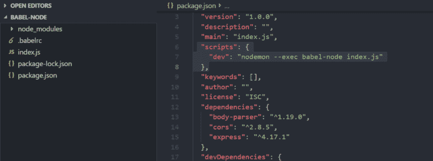
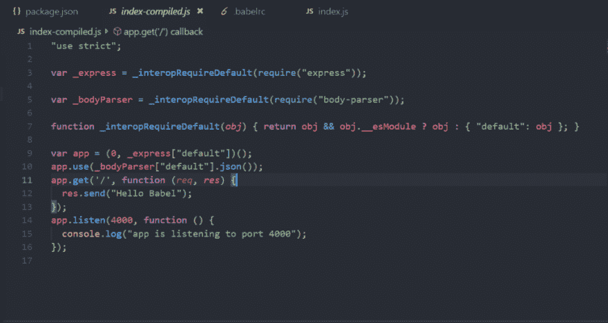

# 为 Node.js/Express 服务器配置巴别塔

> 原文：<https://dev.to/ganeshmani/configuring-babel-for-node-js-express-server-35hp>

在本文中，我们将了解如何为 Express server 配置 babel。为 Node.js/Express 服务器配置巴别塔。了解关于 [Node.js](https://cloudnweb.dev/tag/node-js/) 的更多信息

ECMAScript 是一个 Javascript 标准，每年都会更新，更新我们的代码也是一个好习惯。 [ES6 特性](http://es6-features.org)

有时，浏览器与最新的 javascript 标准不兼容。

为了解决这种问题，我们需要一个类似 babel 的东西，它只不过是 javascript 的一个 transpiler。

### 巴别塔设置

首先，我们需要安装两个主要的软件包来安装项目中的 babel。

*   babel-core 是运行任何 babel 设置或配置的主要软件包
*   babel-node 是用来从 ES(任何标准)转换成普通 javascript 的包。
*   **babel-preset-env**——这个包用来利用 node.js 无法理解的即将到来的特性。比如，默认情况下，node.js 中的一些新特性需要时间来实现。

### 最佳实践

使用 babel 的主要原因是为了利用代码库中的 Javascript 新特性。我们不知道服务器中的 node.js 是否能理解特定的代码，除非它是一个普通的 javascript。

因此，总是建议在部署之前转换代码。有两种巴别塔 transpiling 代码。

*   一个是生产
*   一个是发展

### 开发设置

```
$ npm init --yes
$ npm install --save express body-parser cors
$npm install --save nodemon
```

在这里，我们初始化 **package.json** 并用 **nodemon** 安装基本的 **express** 服务器。

接下来我们需要安装 **[@babel](https://dev.to/babel) /core** 和 **[@babel](https://dev.to/babel) /node** 包。

```
$ npm install @babel/core @babel/node --save-dev
```

之后，我们需要创建一个名为**的文件。babelrc** 包含了所有的巴别塔配置。

```
{
    "presets": [
        "@babel/preset-env"
    ]
}
```

现在，设置已经就绪。我们需要创建一个脚本，在运行时传输我们的代码。

```
 "scripts": {
    "dev": "nodemon --exec babel-node index.js"
  }
```

[](https://res.cloudinary.com/practicaldev/image/fetch/s--4EAZJxqz--/c_limit%2Cf_auto%2Cfl_progressive%2Cq_auto%2Cw_880/https://cloudnweb.dev/wp-content/uploads/2019/07/Capture-1-1024x380.png)

最后，在 index.js 中添加以下代码并运行脚本。

```
import express from 'express';
import bodyParser from 'body-parser';

const app = express();

app.use(bodyParser.json());

app.get('/',(req,res) => {
    res.send("Hello Babel")
})

app.listen(4000,() => {
    console.log(`app is listening to port 4000`);
})
```

[](https://res.cloudinary.com/practicaldev/image/fetch/s--vKjb1SZi--/c_limit%2Cf_auto%2Cfl_progressive%2Cq_auto%2Cw_880/https://cloudnweb.dev/wp-content/uploads/2019/07/Capture_new.png)

```
$ npm run dev
```

最后你会看到类似 **Hello Babel** 的输出。

### 生产设置

主要是，我们不能在生产运行时传输代码。因此，我们需要做的是，将代码编译成普通的 javascript，并将编译后的版本部署到 node.js 生产服务器。

添加以下命令来构建代码的编译版本

```
"scripts": {
    "build" : "babel index.js --out-file index-compiled.js",
    "dev": "nodemon --exec babel-node index.js"
  }
```

Babel 编译 index.js 文件，并将编译后的版本写入 index-compiled.js

同时，当您运行该命令时，您将获得编译后的版本，如

[](https://res.cloudinary.com/practicaldev/image/fetch/s--oFufIIC1--/c_limit%2Cf_auto%2Cfl_progressive%2Cq_auto%2Cw_880/https://cloudnweb.dev/wp-content/uploads/2019/07/Capture_adasda-1024x307.png)

[](https://res.cloudinary.com/practicaldev/image/fetch/s--F0BsGSOd--/c_limit%2Cf_auto%2Cfl_progressive%2Cq_auto%2Cw_880/https://cloudnweb.dev/wp-content/uploads/2019/07/Capture_1212-1024x545.png)

最后，我们需要在 node.js 生产服务器中部署编译后的版本。

要深入了解巴别塔，可以参考布拉德·特拉弗斯的这段视频

[https://www.youtube.com/embed/iWUR04B42Hc](https://www.youtube.com/embed/iWUR04B42Hc)

这是本文的内容，我们将在接下来的文章中看到更多关于 babel 和 webpack 的内容。

在那之前，快乐编码:-)