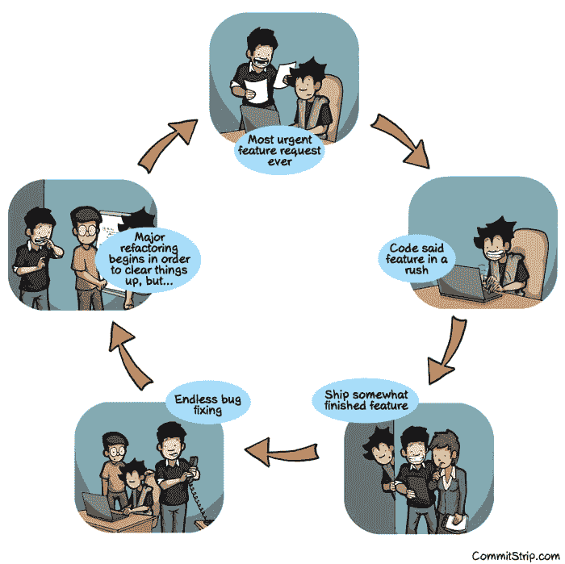

# 技术债务不仅仅是技术上的

> 原文：<https://dev.to/remotesynth/technical-debt-is-not-just-technical-11ad>

我要承认一些尴尬的事情。回顾我的职业生涯，我相信在我职业生涯的早期，我可能很难共事。我相信我已经从那些错误中吸取了教训。让我解释一下。

## 技术债务

开发者经常提到[技术债](https://martinfowler.com/bliki/TechnicalDebt.html)的概念。从本质上来说，技术债务是应用程序中的“残羹剩饭”,这是由于一些关于如何构建它的糟糕的初始决策。这些选择有时是有意的，有时是无意的。关于技术债务的事情是，它经常建立在自己的基础上——糟糕的选择最初会限制选择，最终会变得极其痛苦、困难，是的，纠正起来代价高昂。

> “这个技术债可以等。我有一个功能要交付！”[pic.twitter.com/OrUZgGUbwV](https://t.co/OrUZgGUbwV)
> 
> — Changelog (@changelog) [March 7, 2019](https://twitter.com/changelog/status/1103511794855936000?ref_src=twsrc%5Etfw)

关于技术债务的另一件事，当你刚接触一个公司或项目时，通常更容易发现——尤其是无意的那种。

## 误诊

所以，这是我，大约在 2005 年左右，作为一名开发人员，我有了几年的自信。我对这些公司的陌生感(是的，在我职业生涯的这个时期，我经历了一段时间)使得识别技术债务变得相对容易。从技术角度来看，我有足够的知识来诊断问题。

但是关于技术债务，我是通过多年痛苦的经历才了解到的——尽管它的名字，技术债务不仅仅是技术上的。它是组织性的、制度性的、政治性的，是的，常常是个人的。

每一点技术债的背后，都有一个故事。有时候故事可能很简单，比如，“哦，糟糕！我没有意识到应该这样做。”然而，更常见的情况是，有一个更复杂的故事，涉及到那些自尊心可能受到威胁的人，那些出于非技术原因推动解决方案的组织(一个例子是“ [dogfooding](https://en.wikipedia.org/wiki/Eating_your_own_dog_food) ”或高级经理从一个伙伴那里购买的软件选择)。有时候，技术选择可以被包裹在如此复杂的历史中，以至于很难弄清楚这个选择是如何做出的。

这里的要点是，2005 年的我从技术的角度已经学到了足够的知识来诊断，甚至可能解决我所加入的公司的这些问题。有了技术知识的武装，我一头扎了进去，结果却落在了本质上并非技术性的强力阻挡器上。我的失败在于不能看到和诊断技术债务的非技术方面，这个失败让我经常感到沮丧。

## 学会倾听

基本上，当答案很简单时，我有一种“先编码后提问”的心态——花时间提问并倾听。找出做出某些选择的原因。这样做让我获得了诊断技术问题所需的知识(令我惊讶的是，有时更好地理解非技术原因使我意识到我实际上是将一些东西误诊为技术债务)。但是，更重要的是，它使我能够提供不仅仅从代码角度工作的解决方案，而且为我必须一起工作的人和我工作的公司工作。

记住提问和倾听需要时间和耐心。你不能像我一样，认为你知道所有的答案。我能想到的最好的类比就是去看医生治疗疼痛。医生可以迅速治疗症状，疼痛会消退，但可能会让问题恶化而未被发现。然而，一个好的医生会花时间了解你，你的问题，调查疼痛的潜在原因，并整体治疗。做一个 2005 年的好医生。