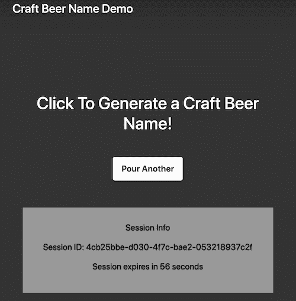
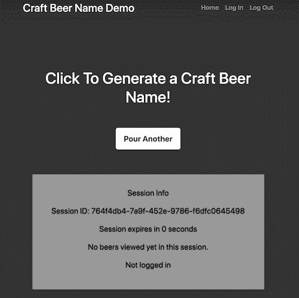
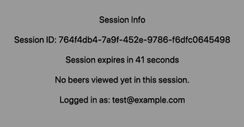
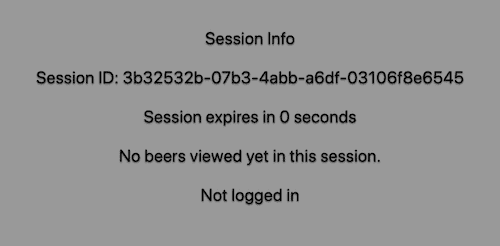

# 使用 Express Sessions、Redis 和 Passport 的 Node.js 会话管理——第 2 部分

> 原文：<https://dev.to/jankleinert/node-js-session-management-using-express-sessions-redis-and-passport-part-2-4132>

在本教程的第 1 部分中，我们一步一步地介绍了使用 Node.js 和 Express 构建 web 应用程序的过程，该应用程序使用 [express-session](https://github.com/expressjs/session) 和 [connect-redis](https://github.com/tj/connect-redis) 来帮助用户理解会话管理是如何工作的。

在第二部分中，我们将通过使用 [Passport](http://www.passportjs.org/) 实现身份验证，并探索身份验证和会话如何协同工作，从而对之前的应用进行扩展。

### 先决条件

如果您遵循了[第 1 部分](https://dev.to/jankleinert/node-js-session-management-using-express-sessions-redis-and-passport-part-1-cja)中的步骤，那么您可以继续下一部分。如果没有，下面是你需要做的。

克隆这个包含演示应用程序代码的 GitHub repo。主分支包含第 1 部分末尾的代码。如果您还没有安装 Redis，还需要安装并启动 Redis 服务器。如果需要安装 Redis，可以看看[这个文档](https://redis.io/topics/quickstart)。

```
$ git clone https://github.com/jankleinert/redis-session-demo
$ cd redis-session-demo 
```

<svg width="20px" height="20px" viewBox="0 0 24 24" class="highlight-action crayons-icon highlight-action--fullscreen-on"><title>Enter fullscreen mode</title></svg> <svg width="20px" height="20px" viewBox="0 0 24 24" class="highlight-action crayons-icon highlight-action--fullscreen-off"><title>Exit fullscreen mode</title></svg>

让我们试着运行应用程序，以确保它能正常工作。

```
$ npm install
$ export SESSION_SECRET=some_secret_value_here
$ npm run dev 
```

<svg width="20px" height="20px" viewBox="0 0 24 24" class="highlight-action crayons-icon highlight-action--fullscreen-on"><title>Enter fullscreen mode</title></svg> <svg width="20px" height="20px" viewBox="0 0 24 24" class="highlight-action crayons-icon highlight-action--fullscreen-off"><title>Exit fullscreen mode</title></svg>

在浏览器中打开 [http://localhost:3000](http://localhost:3000) ，应该会看到这样的内容。

[](https://res.cloudinary.com/practicaldev/image/fetch/s--ZdP0mKdY--/c_limit%2Cf_auto%2Cfl_progressive%2Cq_auto%2Cw_880/https://jankleinert.com/asseimg/blog/node-redis-session-id-first-load.png)

### 建立一个 MySQL 用户数据库

不管您是否完成了第 1 部分，您都需要确保安装了 MySQL。[如果你需要安装和设置 MySQL，这里有说明](https://dev.mysql.com/doc/refman/8.0/en/installing.html)。接下来，启动`mysql`并创建一个新数据库和一个新表。

```
mysql> CREATE DATABASE redis_session_demo; 
mysql> USE redis_session_demo;
mysql> CREATE TABLE users (id varchar(20), email varchar(20), password varchar(60)); 
```

<svg width="20px" height="20px" viewBox="0 0 24 24" class="highlight-action crayons-icon highlight-action--fullscreen-on"><title>Enter fullscreen mode</title></svg> <svg width="20px" height="20px" viewBox="0 0 24 24" class="highlight-action crayons-icon highlight-action--fullscreen-off"><title>Exit fullscreen mode</title></svg>

这将是我们的用户数据库。为了加快速度，我们将手动在数据库中插入一个测试用户，而不是创建一个帐户页面。该应用程序将使用`bcrypt`为我们的密码创建一个哈希。我们的测试用户将有`id = a1b2c3d4`、`email = test@example.com`和`password = password`。你可以使用[这个网站](https://bcrypt-generator.com/)创建一个散列密码。接下来，我们将把它插入我们的用户数据库。

```
mysql> INSERT INTO users (id, email, password) VALUES ('a1b2c3e4', 'test@example.com', '$2y$12$7Mj1fG3bdlpmRcXtZpwimOI4pItCQcj5x2.ZqydPbR5wWlKGVaQVe'); 
```

<svg width="20px" height="20px" viewBox="0 0 24 24" class="highlight-action crayons-icon highlight-action--fullscreen-on"><title>Enter fullscreen mode</title></svg> <svg width="20px" height="20px" viewBox="0 0 24 24" class="highlight-action crayons-icon highlight-action--fullscreen-off"><title>Exit fullscreen mode</title></svg>

### 演示应用的快速回顾

演示应用程序是使用 [express-generator](https://expressjs.com/en/starter/generator.html) 创建应用程序框架构建的。它使用[插件](https://pugjs.org/api/getting-started.html)作为视图引擎。当你点击“再倒一杯”按钮时，它向一个 [API](https://www.craftbeernamegenerator.com/about.html) 发出请求，该 API 将返回一个机器学习生成的精酿啤酒名称。

在第 1 部分中，我们添加了一个会话信息面板，显示会话 ID、会话到期前还有多少秒，以及我们的会话数据:在当前会话中被查看的啤酒名称的数量。为了实现会话管理，我们使用 [express-session](https://github.com/expressjs/session) 作为会话中间件，使用 [connect-redis](https://github.com/tj/connect-redis) 作为会话存储。下一步，我们将添加登录和注销的链接，创建登录页面，并重构最初直接包含在`/views/index.pug`中的会话面板。

### 给前端添加认证支持

我们将从重构会话信息面板开始。通过将它移动到一个单独的文件中，可以更容易地将它包含在多个页面中。创建一个新文件`/views/session.pug`并粘贴这段代码。现在在底部有一个部分显示用户是否通过了身份验证。

```
 .session
      p Session Info
      if sessionID
        p= 'Session ID: ' + sessionID 
      if sessionExpireTime
        p= 'Session expires in ' + Math.round(sessionExpireTime/1000) + ' seconds'
      if beersViewed
        p= 'Beers viewed in this session: ' + beersViewed
      else 
        p= 'No beers viewed yet in this session.'
      if isAuthenticated
        p= 'Logged in as: ' + email
      else  
        p= 'Not logged in' 
```

<svg width="20px" height="20px" viewBox="0 0 24 24" class="highlight-action crayons-icon highlight-action--fullscreen-on"><title>Enter fullscreen mode</title></svg> <svg width="20px" height="20px" viewBox="0 0 24 24" class="highlight-action crayons-icon highlight-action--fullscreen-off"><title>Exit fullscreen mode</title></svg>

现在，打开`/views/index.pug`，用下面的代码替换`.session`部分。它应该和`h1`在同一列。

```
 include session.pug 
```

<svg width="20px" height="20px" viewBox="0 0 24 24" class="highlight-action crayons-icon highlight-action--fullscreen-on"><title>Enter fullscreen mode</title></svg> <svg width="20px" height="20px" viewBox="0 0 24 24" class="highlight-action crayons-icon highlight-action--fullscreen-off"><title>Exit fullscreen mode</title></svg>

是时候创建登录页面了。创建`/views/login.pug`并粘贴这段代码。这是一个简单的表单，有电子邮件和密码字段。

```
 extends layout

    block content
      h1= 'Log In'
      .lead
        form#login-form(action='/login', method='post')
          .form-group
            input(name='email', type='text', placeholder='Email', required='')
          .form-group
            input(name='password', type='password', placeholder='Password', required='')
          button.btn.btn-primary(type='submit')= 'Log In'
        if error
          p= error

      include session.pug 
```

<svg width="20px" height="20px" viewBox="0 0 24 24" class="highlight-action crayons-icon highlight-action--fullscreen-on"><title>Enter fullscreen mode</title></svg> <svg width="20px" height="20px" viewBox="0 0 24 24" class="highlight-action crayons-icon highlight-action--fullscreen-off"><title>Exit fullscreen mode</title></svg>

现在，我们需要将主页、登录和注销链接添加到导航中。打开`layout.pug`，将这段代码直接添加到`h3.masthead-brand Craft Beer Name Demo`下面。

```
 nav.nav.nav-masthead.justify-content-center
      a.nav-link(href='/') Home
      a.nav-link(href='/login') Log In
      a.nav-link(href='/logout') Log Out 
```

<svg width="20px" height="20px" viewBox="0 0 24 24" class="highlight-action crayons-icon highlight-action--fullscreen-on"><title>Enter fullscreen mode</title></svg> <svg width="20px" height="20px" viewBox="0 0 24 24" class="highlight-action crayons-icon highlight-action--fullscreen-off"><title>Exit fullscreen mode</title></svg>

### 更新 app.js

为了支持向应用程序添加身份验证，我们需要安装一些额外的包。

```
npm install --save bcryptjs mysql passport passport-local 
```

<svg width="20px" height="20px" viewBox="0 0 24 24" class="highlight-action crayons-icon highlight-action--fullscreen-on"><title>Enter fullscreen mode</title></svg> <svg width="20px" height="20px" viewBox="0 0 24 24" class="highlight-action crayons-icon highlight-action--fullscreen-off"><title>Exit fullscreen mode</title></svg>

`bcryptjs`用于散列和检查密码。 [`passport`](http://www.passportjs.org/) 是我们使用的认证中间件， [`passport-local`](http://www.passportjs.org/packages/passport-local/) 是认证策略，意味着我们使用用户名和密码进行认证。

接下来，打开`app.js`并在现有的`require` s.
下添加以下代码

```
const loginRouter = require('./routes/login');
const logoutRouter = require('./routes/logout');
const mysql = require('mysql');
const passport = require('passport');
const LocalStrategy = require('passport-local').Strategy;
const bcrypt = require('bcryptjs');

const mysqlConnection = mysql.createConnection({
  host: 'localhost',
  user: 'root',
  password: '', // demo purposes only
  database: 'redis_session_demo'
});

mysqlConnection.connect(function(err) {
  if (err) {
    console.log('error connecting to mysql: ' + err.stack);
    return;
  }
}); 
```

<svg width="20px" height="20px" viewBox="0 0 24 24" class="highlight-action crayons-icon highlight-action--fullscreen-on"><title>Enter fullscreen mode</title></svg> <svg width="20px" height="20px" viewBox="0 0 24 24" class="highlight-action crayons-icon highlight-action--fullscreen-off"><title>Exit fullscreen mode</title></svg>

注意，我们使用 MySQL 数据库，用`root`和`''`作为登录名和密码。这仅用于演示目的；不要在生产中这样做！你可能也注意到了不存在的`loginRouter`和`logoutRouter`参考文件。我们将在下一节中创建它们。

向下滚动一点，直到看到`const redisClient = redis.createClient();`。直接在该行之后，添加以下代码。

```
// configure passport.js to use the local strategy
passport.use(new LocalStrategy(
  { usernameField: 'email' },
  (email, password, done) => {
    mysqlConnection.query('SELECT * FROM users WHERE email = ?', [email], function (error, results, fields) {
      if (error) throw error;
      var user = results[0];
      if (!user) {
        return done(null, false, { message: 'Invalid credentials.\n' });
      }
      if (!bcrypt.compareSync(password, user.password)) {
        return done(null, false, { message: 'Invalid credentials.\n' });
      }
      return done(null, user);
    });
  }
));

passport.serializeUser((user, done) => {
  done(null, user.id);
});

passport.deserializeUser((id, done) => {
  mysqlConnection.query('SELECT * FROM users WHERE id = ?', [id], function (error, results, fields) {
    if (error) {
      done(error, false);
    }
    done(null, results[0]);  
  });
}); 
```

<svg width="20px" height="20px" viewBox="0 0 24 24" class="highlight-action crayons-icon highlight-action--fullscreen-on"><title>Enter fullscreen mode</title></svg> <svg width="20px" height="20px" viewBox="0 0 24 24" class="highlight-action crayons-icon highlight-action--fullscreen-off"><title>Exit fullscreen mode</title></svg>

我发现[这篇文章](https://medium.com/@evangow/server-authentication-basics-express-sessions-passport-and-curl-359b7456003d)非常有助于理解认证过程中发生的事情。您会注意到，在那篇文章之后，我对该代码的某些部分进行了建模。

在文件中再向下滚动一点，直到找到`app.use('/', indexRouter);`。用以下代码替换该行。

```
app.use(passport.initialize());
app.use(passport.session());

app.use('/', indexRouter);
app.use('/login', loginRouter);
app.use('/logout', logoutRouter); 
```

<svg width="20px" height="20px" viewBox="0 0 24 24" class="highlight-action crayons-icon highlight-action--fullscreen-on"><title>Enter fullscreen mode</title></svg> <svg width="20px" height="20px" viewBox="0 0 24 24" class="highlight-action crayons-icon highlight-action--fullscreen-off"><title>Exit fullscreen mode</title></svg>

这段代码将我们的应用程序设置为使用 passport 作为中间件，然后我们添加了两条新的登录和注销路径。

### 更新路线

我们需要采取的最后一步是更新`/routes/index.js`并创建两个新文件:`/routes/login.js`和`/routes/logout.js`。打开`/routes/index.js`。在四个`res.render()`调用的每一个中，将这个添加到 locals 对象的属性列表的末尾。

```
, isAuthenticated: req.isAuthenticated(), email: (req.isAuthenticated() ? req.user.email : null) 
```

<svg width="20px" height="20px" viewBox="0 0 24 24" class="highlight-action crayons-icon highlight-action--fullscreen-on"><title>Enter fullscreen mode</title></svg> <svg width="20px" height="20px" viewBox="0 0 24 24" class="highlight-action crayons-icon highlight-action--fullscreen-off"><title>Exit fullscreen mode</title></svg>

因此，举例来说，`router.get()`中的`res.render()`呼叫将变成:

```
res.render('index', { sessionID: req.sessionID, sessionExpireTime: expireTime, beersViewed: req.session.views, beerName: null, beerStyle: null, error: null, isAuthenticated: req.isAuthenticated(), email: (req.isAuthenticated() ? req.user.email : null) }); 
```

<svg width="20px" height="20px" viewBox="0 0 24 24" class="highlight-action crayons-icon highlight-action--fullscreen-on"><title>Enter fullscreen mode</title></svg> <svg width="20px" height="20px" viewBox="0 0 24 24" class="highlight-action crayons-icon highlight-action--fullscreen-off"><title>Exit fullscreen mode</title></svg>

接下来创建`/routes/login.js`并粘贴这段代码。

```
const express = require('express');
const router = express.Router();
const passport = require('passport');

/* GET request for login page */
router.get('/', function(req, res, next) {
  var expireTime = new Date(req.session.cookie.expires) - new Date();
  res.render('login', { sessionID: req.sessionID, sessionExpireTime: expireTime, beersViewed: req.session.views, error: null, isAuthenticated: req.isAuthenticated(), email: (req.isAuthenticated() ? req.user.email : null) });
});

router.post('/', function (req, res, next) {
  var expireTime = new Date(req.session.cookie.expires) - new Date();
  passport.authenticate('local', (err, user, info) => {
    if(info) {return res.send(info.message)}
    if (err) { return next(err); }
    if (!user) { return res.redirect('/login'); }
    req.login(user, (err) => {
      if (err) { return next(err); }
      res.render('login', {sessionID: req.sessionID, sessionExpireTime: expireTime, beersViewed: req.session.views, username: req.user.id, error: null, isAuthenticated: req.isAuthenticated(), email: (req.isAuthenticated() ? req.user.email : null)});
    })
  })(req, res, next);
})  

router.get('')

module.exports = router; 
```

<svg width="20px" height="20px" viewBox="0 0 24 24" class="highlight-action crayons-icon highlight-action--fullscreen-on"><title>Enter fullscreen mode</title></svg> <svg width="20px" height="20px" viewBox="0 0 24 24" class="highlight-action crayons-icon highlight-action--fullscreen-off"><title>Exit fullscreen mode</title></svg>

`router.post()`是使用 passport 和本地策略处理我们提交的登录表单的地方。

最后创建`/routes/logout.js`并粘贴这段代码。

```
const express = require('express');
const router = express.Router();

/* GET request for logout page */
router.get('/', function(req, res, next) {
  var expireTime = new Date(req.session.cookie.expires) - new Date();   
  req.logout();
  req.session.destroy(function() {
    res.redirect('/');
  });
});

router.get('')

module.exports = router; 
```

<svg width="20px" height="20px" viewBox="0 0 24 24" class="highlight-action crayons-icon highlight-action--fullscreen-on"><title>Enter fullscreen mode</title></svg> <svg width="20px" height="20px" viewBox="0 0 24 24" class="highlight-action crayons-icon highlight-action--fullscreen-off"><title>Exit fullscreen mode</title></svg>

没有专为注销而显示的页面。相反，当向`/logout`发出`GET`请求时，应用程序会将用户注销，销毁会话，然后将他们重定向到主页。此时将没有经过身份验证的用户，并将创建一个新的会话。

### 试试吧！

我们来试试吧！在浏览器中打开 [http://localhost:3000](http://localhost:3000) 。当它第一次加载时，您应该看到信息面板显示一个会话 ID 和一个直到会话过期的时间，以及“未登录”。

[](https://res.cloudinary.com/practicaldev/image/fetch/s--1Sq-xgJo--/c_limit%2Cf_auto%2Cfl_progressive%2Cq_auto%2Cw_880/https://jankleinert.com/asseimg/blog/node-redis-add-auth.png)

单击标题中的“登录”链接，并使用我们的测试凭据进行身份验证:`test@example.com` / `password`。当页面重新加载时，您应该看到您现在以 test@example.com[的身份登录](mailto:test@example.com)

[](https://res.cloudinary.com/practicaldev/image/fetch/s--QDu1yl1y--/c_limit%2Cf_auto%2Cfl_progressive%2Cq_auto%2Cw_880/https://jankleinert.com/asseimg/blog/node-redis-user-logged-in.png)

当您在站点上执行其他操作时，您会看到您仍处于登录状态，但是如果您在导航中单击“注销”，您将不再登录，并将开始一个新的会话。

[](https://res.cloudinary.com/practicaldev/image/fetch/s--ERfCTKhK--/c_limit%2Cf_auto%2Cfl_progressive%2Cq_auto%2Cw_880/https://jankleinert.com/asseimg/blog/node-redis-logged-out.png)

就是这样！现在，您有了一个简单的应用程序来处理会话管理和身份验证。完成了吗？肯定不是！有很多改进和补充可以做，包括帐户创建页面，更好的错误处理等。你可以在 GitHub 上找到第 2 部分[的完整代码。](https://github.com/jankleinert/redis-session-demo/tree/auth)