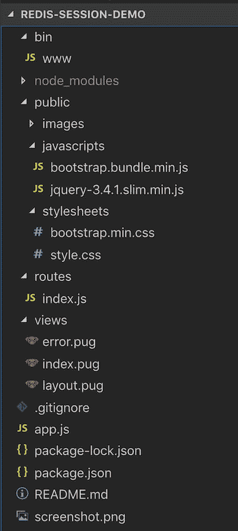
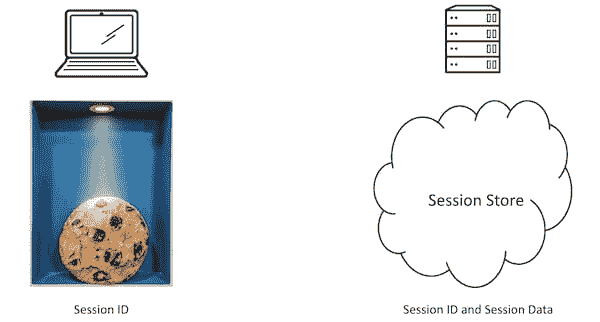
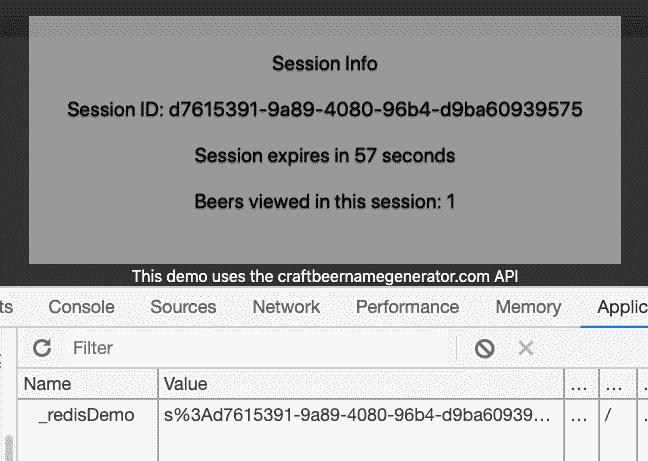
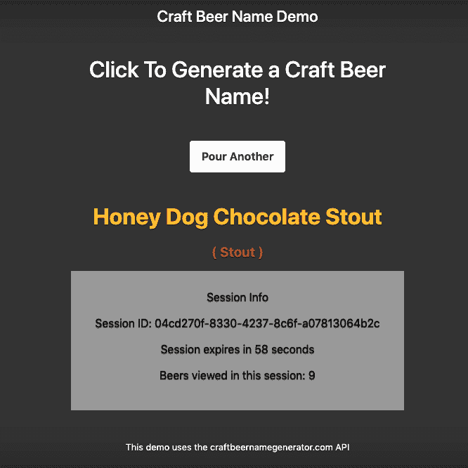

# 使用 Express Sessions、Redis 和 Passport 的 Node.js 会话管理——第 1 部分

> 原文：<https://dev.to/jankleinert/node-js-session-management-using-express-sessions-redis-and-passport-part-1-cja>

最近，我开始为我在纽约 Redis Day 的演讲创建一个演示应用程序，它展示了会话管理如何在 Node.js/Express web 应用程序中工作，使用 Redis 作为会话存储，然后在所有这些之上添加身份验证。理解这些概念以及它们是如何协同工作的是一回事，但我以前从未真正开发过一个将所有这些组件结合在一起使用的应用程序。

作为我最初研究的一部分，我寻找现有的教程或例子来做我想做的事情。我找到了几个好的[博客](https://codeforgeek.com/manage-session-using-node-js-express-4/) [帖子](https://medium.com/mtholla/managing-node-js-express-sessions-with-redis-94cd099d6f2f) [和](https://blog.risingstack.com/node-hero-node-js-authentication-passport-js/) [教程](https://medium.com/@evangow/server-authentication-basics-express-sessions-passport-and-curl-359b7456003d)，但是没有一个完全符合我的要求。本教程的第 1 部分将带您一步步完成使用 Node.js 和 Express 构建 web 应用程序的过程，该应用程序使用 [express-session](https://github.com/expressjs/session) 和 [connect-redis](https://github.com/tj/connect-redis) 作为帮助用户理解会话管理如何工作的一种方式。第 2 部分将通过使用 [Passport](http://www.passportjs.org/) 实现身份验证并探索身份验证和会话如何协同工作来对此进行扩展。

### 获取精酿啤酒名称演示应用的代码

我们将从一个简单的演示应用程序开始，一旦启动并运行，我们将添加会话管理和身份验证。让我们从克隆包含演示应用程序代码的 GitHub repo 开始，然后切换到 beer-demo 分支。

```
$ git clone https://github.com/jankleinert/redis-session-demo
$ cd redis-session-demo
$ git checkout beer-demo 
```

<svg width="20px" height="20px" viewBox="0 0 24 24" class="highlight-action crayons-icon highlight-action--fullscreen-on"><title>Enter fullscreen mode</title></svg> <svg width="20px" height="20px" viewBox="0 0 24 24" class="highlight-action crayons-icon highlight-action--fullscreen-off"><title>Exit fullscreen mode</title></svg>

让我们试着运行应用程序，以确保它能正常工作。

```
$ npm install
$ npm run dev 
```

<svg width="20px" height="20px" viewBox="0 0 24 24" class="highlight-action crayons-icon highlight-action--fullscreen-on"><title>Enter fullscreen mode</title></svg> <svg width="20px" height="20px" viewBox="0 0 24 24" class="highlight-action crayons-icon highlight-action--fullscreen-off"><title>Exit fullscreen mode</title></svg>

在浏览器中打开 [http://localhost:3000](http://localhost:3000) ，应该会看到这样的内容。

[](https://res.cloudinary.com/practicaldev/image/fetch/s--Ahj5M_Ns--/c_limit%2Cf_auto%2Cfl_progressive%2Cq_auto%2Cw_880/https://jankleinert.com/asseimg/blog/node-redis-beer-demo.png)

### 了解演示应用

演示应用程序是使用 [express-generator](https://expressjs.com/en/starter/generator.html) 创建应用程序框架构建的。它使用[插件](https://pugjs.org/api/getting-started.html)作为视图引擎。当你点击“再倒一杯”按钮时，它向一个 [API](https://www.craftbeernamegenerator.com/about.html) 发出请求，该 API 将返回一个机器学习生成的精酿啤酒名称。这就是这个应用程序目前所做的全部工作。

我们将使用的三个主要文件是`app.js`、`/routes/index.js`和`/views/index.pug`。

[](https://res.cloudinary.com/practicaldev/image/fetch/s--5GSfoYIb--/c_limit%2Cf_auto%2Cfl_progressive%2Cq_auto%2Cw_880/https://jankleinert.com/asseimg/blog/node-redis-dir-structure.png)

### 为什么我们要关心会话管理？

“会话”就是这样一个超负荷的术语，根据上下文的不同，它可以有非常不同的含义。在本教程中，我们将讨论 web 应用程序中的用户会话。您可以将它想象为 web 应用程序中的一组请求和响应，由单个用户发起，从他们开始交互直到他们结束会话或会话过期。

为什么我们关心或需要像会话这样的结构？HTTP 是无状态的，所以每个请求和响应对都是相互独立的。默认情况下，不维护任何状态，服务器从一个请求到另一个请求不知道你是谁。会话管理使我们能够为用户会话分配一个标识符，并使用该 ID 来存储与会话相关的状态或数据。这可能是用户是否经过身份验证、购物车中的商品等等——在会话期间需要保持的任何状态。

处理会话管理有多种方式，但我们将研究一种特定的方式，其中会话数据保存在会话存储中，我们将使用 Redis 作为会话存储。

[](https://res.cloudinary.com/practicaldev/image/fetch/s--VibQhl5---/c_limit%2Cf_auto%2Cfl_progressive%2Cq_auto%2Cw_880/https://jankleinert.com/asseimg/blog/node-redis-cookie.png)

在客户端，cookie 与会话 ID 一起存储，但不存储任何会话数据。在应用程序的会话存储中(在本例中是 Redis)，会话 ID 也与会话数据一起存储。

### 给应用程序添加会话信息面板

为了便于可视化会话中发生的事情，我们将在应用程序中添加一个会话信息面板。打开`/views/index.pug`并将以下代码添加到文件底部。注意你的缩进；`.session`应该和`h1`排在同一列。

```
 .session
      p Session Info
      if sessionID
        p= 'Session ID: ' + sessionID 
      if sessionExpireTime
        p= 'Session expires in ' + Math.round(sessionExpireTime) + ' seconds'
      if beersViewed
        p= 'Beers viewed in this session: ' + beersViewed 
```

<svg width="20px" height="20px" viewBox="0 0 24 24" class="highlight-action crayons-icon highlight-action--fullscreen-on"><title>Enter fullscreen mode</title></svg> <svg width="20px" height="20px" viewBox="0 0 24 24" class="highlight-action crayons-icon highlight-action--fullscreen-off"><title>Exit fullscreen mode</title></svg>

该面板将显示会话 ID、会话到期前还有多少秒，以及我们的会话数据:在该会话中已被查看的啤酒名称的数量。我们将在后面的步骤中在`/routes/index.js`中指定这些值。

### 将 express-session 和 connect-redis 添加到 app.js

`express-session`是 Express 的会话中间件。它的设置和使用非常简单。有相当多的[兼容的会话存储](https://github.com/expressjs/session#compatible-session-stores)可以用来存储会话数据。我们将使用 [`connect-redis`](https://www.npmjs.com/package/connect-redis) 。让我们从安装我们需要的 npm 模块开始。

```
$ npm install --save express-session uuid redis connect-redis 
```

<svg width="20px" height="20px" viewBox="0 0 24 24" class="highlight-action crayons-icon highlight-action--fullscreen-on"><title>Enter fullscreen mode</title></svg> <svg width="20px" height="20px" viewBox="0 0 24 24" class="highlight-action crayons-icon highlight-action--fullscreen-off"><title>Exit fullscreen mode</title></svg>

接下来，打开`app.js`，在现有的`require`下添加以下代码。`uuid`将用于生成一个惟一的 ID，作为我们的会话 ID。

```
const uuid = require('uuid/v4')
const session = require('express-session');
const redis = require('redis');
const redisStore = require('connect-redis')(session);   

const redisClient = redis.createClient();

redisClient.on('error', (err) => {
  console.log('Redis error: ', err);
}); 
```

<svg width="20px" height="20px" viewBox="0 0 24 24" class="highlight-action crayons-icon highlight-action--fullscreen-on"><title>Enter fullscreen mode</title></svg> <svg width="20px" height="20px" viewBox="0 0 24 24" class="highlight-action crayons-icon highlight-action--fullscreen-off"><title>Exit fullscreen mode</title></svg>

在我们继续之前，请确保您已经安装了 Redis，并且 Redis 服务器正在运行。如果你需要安装 Redis，可以看看[这个文档](https://redis.io/topics/quickstart)。现在我们可以设置会话中间件，并告诉它使用我们的 Redis 存储作为会话存储。将这段代码添加到第`app.use('/', indexRouter);`行的上方。

```
app.use(session({
  genid: (req) => {
    return uuid()
  },
  store: new redisStore({ host: 'localhost', port: 6379, client: redisClient }),
  name: '_redisDemo', 
  secret: process.env.SESSION_SECRET,
  resave: false,
  cookie: { secure: false, maxAge: 60000 }, // Set to secure:false and expire in 1 minute for demo purposes
  saveUninitialized: true
})); 
```

<svg width="20px" height="20px" viewBox="0 0 24 24" class="highlight-action crayons-icon highlight-action--fullscreen-on"><title>Enter fullscreen mode</title></svg> <svg width="20px" height="20px" viewBox="0 0 24 24" class="highlight-action crayons-icon highlight-action--fullscreen-off"><title>Exit fullscreen mode</title></svg>

关于这段代码，有几点需要注意。存储会话 ID 的 cookie 将被命名为“_redisDemo”。我们使用一个环境变量来设置这个秘密。下一步，我们将导出那个 env 变量(您可以将它设置为您喜欢的任何值)。我们将会话到期时间设置为 1 分钟，以便更容易理解演示应用程序中发生的事情。在实际的应用程序中，您可以将 maxAge 设置为对您的应用程序更合理的值。在您的终端中，停止`nodemon`，然后运行以下命令。

```
$ export SESSION_SECRET=some_secret_value_here && npm run dev 
```

<svg width="20px" height="20px" viewBox="0 0 24 24" class="highlight-action crayons-icon highlight-action--fullscreen-on"><title>Enter fullscreen mode</title></svg> <svg width="20px" height="20px" viewBox="0 0 24 24" class="highlight-action crayons-icon highlight-action--fullscreen-off"><title>Exit fullscreen mode</title></svg>

### 向/routes/index.js 添加会话管理代码

最后一步是添加逻辑来跟踪每个会话中查看的啤酒名称的数量，并将会话相关信息传递给会话面板。打开`/routes/index.js`，用下面的代码替换现有的`get`和`post`。

```
router.get('/', function(req, res, next) {
  var expireTime = req.session.cookie.maxAge / 1000; 
  res.render('index', { sessionID: req.sessionID, sessionExpireTime: expireTime, beersViewed: req.session.views, beerName: null, beerStyle: null, error: null });
});

router.post('/', function (req, res) {
  request('https://www.craftbeernamegenerator.com/api/api.php?type=trained', function (err, response, body) {
    if (req.session.views) {
      req.session.views++
    } else {
      req.session.views = 1
    }
    var expireTime = req.session.cookie.maxAge / 1000;   

    if(err){
      res.render('index', { sessionID: req.sessionID, sessionExpireTime: expireTime, beersViewed: req.session.views, beerName: null, beerStyle: null, error: 'Error, please try again'});
    } else {
      var beerInfo = JSON.parse(body)

      if(beerInfo.status != 200){
        res.render('index', { sessionID: req.sessionID, sessionExpireTime: expireTime, beersViewed: req.session.views, beerName: null, beerStyle: null, error: 'Error, please try again'});
      } else {
        res.render('index', { sessionID: req.sessionID, sessionExpireTime: expireTime, beersViewed: req.session.views, beerName: beerInfo.data.name, beerStyle: beerInfo.data.style, error: null});
      }
    }
  });
}); 
```

<svg width="20px" height="20px" viewBox="0 0 24 24" class="highlight-action crayons-icon highlight-action--fullscreen-on"><title>Enter fullscreen mode</title></svg> <svg width="20px" height="20px" viewBox="0 0 24 24" class="highlight-action crayons-icon highlight-action--fullscreen-off"><title>Exit fullscreen mode</title></svg>

我们改变了什么？在`router.get`中，我们添加了`expireTime`,这样我们可以计算会话到期前的时间。然后在`res.render`中，我们传递一些额外的值:来自`req.sessionID`的会话 ID，我们刚刚计算的过期时间，以及每个会话查看的啤酒数量，它存储为`req.session.views`。在会话的第一个页面视图中，没有`req.session.views`的值，但是我们的模板知道如何处理它。

在`router.post`中，在我们对啤酒名称发出 API 请求后，如果这是会话中查看的第一个啤酒名称，我们要么递增`req.session.views`要么将其设置为`1`。然后，类似于我们上面看到的，我们在`res.render`中传递额外的会话相关信息。

### 会话管理在行动！

现在一切就绪，在浏览器中打开 [http://localhost:3000](http://localhost:3000) 。当它第一次加载时，您应该看到信息面板显示一个会话 ID 和一个直到会话过期的时间。

单击“再倒一杯”按钮(在 60 秒内，这样您的会话不会过期)，您应该会看到会话 ID 保持不变，现在您还会看到会话中查看的啤酒数量设置为`1`。如果您在浏览器中打开 dev tools 并查看 cookie，您应该会看到一个名为`_redisDemo`的 cookie，其值的一部分将包含会话 ID。

[](https://res.cloudinary.com/practicaldev/image/fetch/s--muCYxhuQ--/c_limit%2Cf_auto%2Cfl_progressive%2Cq_auto%2Cw_880/https://jankleinert.com/asseimg/blog/node-redis-session-id-cookie.png)

最后，如果您启动`redis-cli`，然后发出下面的命令，其中`YOUR_SESSION_ID`被浏览器中显示的会话 ID 所替换，您应该看到存储在 Redis 中的会话数据，包括视图。

```
$ redis-cli
$ get "sess:YOUR_SESSION_ID" 
```

<svg width="20px" height="20px" viewBox="0 0 24 24" class="highlight-action crayons-icon highlight-action--fullscreen-on"><title>Enter fullscreen mode</title></svg> <svg width="20px" height="20px" viewBox="0 0 24 24" class="highlight-action crayons-icon highlight-action--fullscreen-off"><title>Exit fullscreen mode</title></svg>

输出应该如下所示:

[](https://res.cloudinary.com/practicaldev/image/fetch/s--Pieh5EM---/c_limit%2Cf_auto%2Cfl_progressive%2Cq_auto%2Cw_880/https://jankleinert.com/asseimg/blog/node-redis-redis-cli.png)

更多地使用该应用程序，以便更好地了解会议是如何进行的。如果您关闭浏览器，然后迅速重新打开，会发生什么情况？如果你等待超过 60 秒然后刷新页面会发生什么？

至此，希望您对什么是会话管理以及如何使用`express-session`和`connect-redis`为 Node.js 应用程序实现会话管理有了更好的理解。在第 2 部分中，我们将在本教程的基础上，使用 Passport 向应用程序添加身份验证。

只想要第 1 部分的代码？拿到这里:

## [1 月小](https://github.com/jankleinert) / [复会示范](https://github.com/jankleinert/redis-session-demo)

### 这个演示应用程序使用 express-sessions 和 connect-redis 展示了 Node.js 应用程序的会话管理

<article class="markdown-body entry-content container-lg" itemprop="text">

# redis 会话演示概述

这个演示应用程序使用 express-sessions 和 connect-redis 展示了 Node.js 应用程序的会话管理。最初为 2019 年纽约 Redis 日创作:[https://events.redislabs.com/sessions/life-user-session/](https://events.redislabs.com/sessions/life-user-session/)

该应用程序在 API 中查询 ML 生成的精酿啤酒名称，并将其显示在页面上。有一个会话管理面板，显示会话 ID、会话到期前的时间以及在该会话中查看的啤酒名称的数量。

在这个[教程中了解更多关于它是如何工作的:](https://jankleinert.com/blog/2019/07/11/nodejs-session-management-using-express-sessions-and-redis-part-1.html)

# 怎么跑

确保已经在本地运行 Redis 服务器:

```
redis-server 
```

然后克隆此存储库，运行 npm install，然后在开发模式下运行它:

```
git clone https://github.com/jankleinert/redis-session-demo
cd redis-session-demo
npm install
export SESSION_SECRET=<some value you choose&gt
npm run dev 
```

然后在你的浏览器中，进入 [http://localhost:3000](http://localhost:3000) 。它应该是这样的:

[](https://raw.githubusercontent.com/jankleinert/redis-session-demo/master/screenshot.png)

# 它是如何工作的

这个演示使用 [express-session](https://github.com/expressjs/session) 进行会话管理，使用 [connect-redis](https://github.com/tj/connect-redis) 作为会话存储。

# 分支

*主*分支……

</article>

[View on GitHub](https://github.com/jankleinert/redis-session-demo)