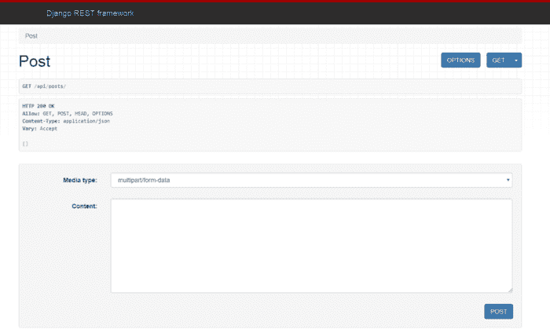
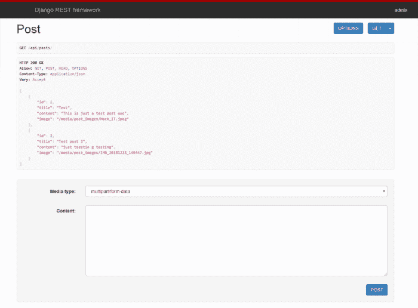

# 将图像上传到 React JS 中的 REST API 后端

> 原文：<https://dev.to/cole_ruche/placeholder-2chb>

因此，我将写下我在为我申请的工作构建测试项目时面临的一个非常具有挑战性的任务:我被要求构建一个 React 应用程序，让用户在使用 API 的同时添加带有描述、类别和图像的产品。所以问题是，我已经构建了一些学习应用程序，它们从 React 表单获取数据，并通过对 REST API 的 API POST 调用将数据发送到后端——但从来没有图像！那天我花了很多时间(第二天也是！)努力把这件事做好。我在网上看到很多教程和文章说要利用 FormData，但是我就是不明白。因此，在经历了许多考验和心碎之后，我做到了，我在这里教你如何去做。

> 免责声明:
> 
> 本教程假设您对 Django 和 React JS 有基本的了解。这不是给他们的教程。
> 
> 这里的流程使用 django 和 django rest 框架进行后端配置。但是 React 逻辑适用于任何后端框架。关于你的框架，多做一点谷歌搜索。

### 工具和框架

*   React:我们将使用 React 来构建表单的 UI 组件。我想现在你已经理解了 React 的概念和它是什么了。

*   Axios:我们将使用 axios 来发出 post 请求。Axios 是一个基于 Promise 的 HTTP 客户端，用于浏览器和 node.js。

*   Django: Django 是 Python 编程语言的 web 框架。

*   Django Rest 框架:DRF 是一个框架(实际上是一个 Django 应用程序),它使我们能够构建简单但高度可定制的 RESTful APIs。

*   Django-CORS-Headers:Django-CORS-Headers 是一个 Django 应用程序，用于处理跨源资源共享(CORS)所需的服务器头。

*   Pillow:这是一个 Python 图像库，当您的模型有一个图像字段时，您需要安装它，否则您将在运行迁移和迁移时得到一个错误。

### 项目设置:

*请注意，我在这里使用的命令行是针对 Windows 的*

该项目将被分为两个目录-前端和后端。
将 cd 放入您的首选目录并创建根项目文件夹:

```
#cmd

mkdir react-form-data && cd react-form-data 
```

<svg width="20px" height="20px" viewBox="0 0 24 24" class="highlight-action crayons-icon highlight-action--fullscreen-on"><title>Enter fullscreen mode</title></svg> <svg width="20px" height="20px" viewBox="0 0 24 24" class="highlight-action crayons-icon highlight-action--fullscreen-off"><title>Exit fullscreen mode</title></svg>

现在，我们将创建两个文件夹前端和后端，分别包含代码。前端将由 [create-react-app](https://facebook.github.io/create-react-app/) 创建——我假设你对此感到满意——而后端将由 django-admin 创建。

现在，在 react-form-data 目录中，运行以下命令:

```
#cmd

mkdir backend && cd backend
django-admin startproject backend .
cd .. && npx create-react-app frontend 
```

<svg width="20px" height="20px" viewBox="0 0 24 24" class="highlight-action crayons-icon highlight-action--fullscreen-on"><title>Enter fullscreen mode</title></svg> <svg width="20px" height="20px" viewBox="0 0 24 24" class="highlight-action crayons-icon highlight-action--fullscreen-off"><title>Exit fullscreen mode</title></svg>

上面的代码创建了一个后端目录，我们将它移入并创建我们的 django 应用程序，也称为后端。记得添加。以免在那里创建另一个文件夹。

### 入门:

我们将从后端开始。与大多数 Python 项目一样，我们需要使用 virtualenv 建立一个虚拟环境。`cd`用 CLI 进入根`react-form-data`项目文件夹，键入`virtualenv env`，用`env\Scripts\activate`启动虚拟环境。在根项目文件夹中运行`ls`，你应该会看到:

```
backend env frontend 
```

<svg width="20px" height="20px" viewBox="0 0 24 24" class="highlight-action crayons-icon highlight-action--fullscreen-on"><title>Enter fullscreen mode</title></svg> <svg width="20px" height="20px" viewBox="0 0 24 24" class="highlight-action crayons-icon highlight-action--fullscreen-off"><title>Exit fullscreen mode</title></svg>

现在，确保虚拟环境正在运行，在 CLI 中运行以下命令来安装所需的软件包:

```
cd backend
pip install django djangorestframework django-cors-headers Pillow 
```

<svg width="20px" height="20px" viewBox="0 0 24 24" class="highlight-action crayons-icon highlight-action--fullscreen-on"><title>Enter fullscreen mode</title></svg> <svg width="20px" height="20px" viewBox="0 0 24 24" class="highlight-action crayons-icon highlight-action--fullscreen-off"><title>Exit fullscreen mode</title></svg>

这将安装所需的软件包。现在，在您喜欢的 IDE 中打开 settings.py 文件，并更新 INSTALLED_APPS 以包含已安装的应用:

```
INSTALLED_APPS = [
    ...,
    'rest_framework',  # for rest api
    'corsheaders',  # for cors policies ] 
```

<svg width="20px" height="20px" viewBox="0 0 24 24" class="highlight-action crayons-icon highlight-action--fullscreen-on"><title>Enter fullscreen mode</title></svg> <svg width="20px" height="20px" viewBox="0 0 24 24" class="highlight-action crayons-icon highlight-action--fullscreen-off"><title>Exit fullscreen mode</title></svg>

现在，我们创建自己的“post”应用程序来处理 API 逻辑和视图。将

光盘放入根目录`backend`并运行`python manage.py startapp post`。记得把这个包括在`INSTALLED_APPS`里。

接下来，添加这两行

```
'corsheaders.middleware.CorsMiddleware' 
```

<svg width="20px" height="20px" viewBox="0 0 24 24" class="highlight-action crayons-icon highlight-action--fullscreen-on"><title>Enter fullscreen mode</title></svg> <svg width="20px" height="20px" viewBox="0 0 24 24" class="highlight-action crayons-icon highlight-action--fullscreen-off"><title>Exit fullscreen mode</title></svg>

和

```
'django.middleware.common.CommonMiddleware' 
```

<svg width="20px" height="20px" viewBox="0 0 24 24" class="highlight-action crayons-icon highlight-action--fullscreen-on"><title>Enter fullscreen mode</title></svg> <svg width="20px" height="20px" viewBox="0 0 24 24" class="highlight-action crayons-icon highlight-action--fullscreen-off"><title>Exit fullscreen mode</title></svg>

在中间件部分的其他行之上，确保

```
 corsheaders.middleware.CorsMiddleware 
```

<svg width="20px" height="20px" viewBox="0 0 24 24" class="highlight-action crayons-icon highlight-action--fullscreen-on"><title>Enter fullscreen mode</title></svg> <svg width="20px" height="20px" viewBox="0 0 24 24" class="highlight-action crayons-icon highlight-action--fullscreen-off"><title>Exit fullscreen mode</title></svg>

高于一切。你的中间件应该是这样的:

```
MIDDLEWARE = [
    'corsheaders.middleware.CorsMiddleware',
    'django.middleware.common.CommonMiddleware',
    'django.middleware.security.SecurityMiddleware',
    'django.contrib.sessions.middleware.SessionMiddleware',
    'django.middleware.common.CommonMiddleware',
    'django.middleware.csrf.CsrfViewMiddleware',
    'django.contrib.auth.middleware.AuthenticationMiddleware',
    'django.contrib.messages.middleware.MessageMiddleware',
    'django.middleware.clickjacking.XFrameOptionsMiddleware',
] 
```

<svg width="20px" height="20px" viewBox="0 0 24 24" class="highlight-action crayons-icon highlight-action--fullscreen-on"><title>Enter fullscreen mode</title></svg> <svg width="20px" height="20px" viewBox="0 0 24 24" class="highlight-action crayons-icon highlight-action--fullscreen-off"><title>Exit fullscreen mode</title></svg>

在中间件部分的正下方，添加这一行:`CORS_ORIGIN_ALLOW_ALL = True`。这使得来自不同服务器的所有 API 请求都被允许。
此外，因为我们正在处理上传的图像，所以在 settings.py 文件的底部添加以下内容:

```
MEDIA_ROOT = os.path.join(BASE_DIR, 'media')
MEDIA_URL = '/media/' 
```

<svg width="20px" height="20px" viewBox="0 0 24 24" class="highlight-action crayons-icon highlight-action--fullscreen-on"><title>Enter fullscreen mode</title></svg> <svg width="20px" height="20px" viewBox="0 0 24 24" class="highlight-action crayons-icon highlight-action--fullscreen-off"><title>Exit fullscreen mode</title></svg>

总的来说，你的 settings.py 文件应该是这样的:

```
Django settings for backend project.
Generated by 'django-admin startproject' using Django 2.1.7.
For more information on this file, see
https://docs.djangoproject.com/en/2.1/topics/settings/
For the full list of settings and their values, see
https://docs.djangoproject.com/en/2.1/ref/settings/
"""

import os

# Build paths inside the project like this: os.path.join(BASE_DIR, ...)
BASE_DIR = os.path.dirname(os.path.dirname(os.path.abspath(__file__)))

# Quick-start development settings - unsuitable for production
# See https://docs.djangoproject.com/en/2.1/howto/deployment/checklist/

# SECURITY WARNING: keep the secret key used in production secret!
SECRET_KEY = '9zff9-n4#2g--_$4@g4uu-zauef(s^i3^z_!7wtpzduma59ku8'

# SECURITY WARNING: don't run with debug turned on in production!
DEBUG = True

ALLOWED_HOSTS = []

# Application definition

INSTALLED_APPS = [
    'django.contrib.admin',
    'django.contrib.auth',
    'django.contrib.contenttypes',
    'django.contrib.sessions',
    'django.contrib.messages',
    'django.contrib.staticfiles',
    'post',
    'rest_framework',  # for django rest api
    'corsheaders',  # for rest api
]

MIDDLEWARE = [
    'corsheaders.middleware.CorsMiddleware',
    'django.middleware.common.CommonMiddleware',
    'django.middleware.security.SecurityMiddleware',
    'django.contrib.sessions.middleware.SessionMiddleware',
    'django.middleware.common.CommonMiddleware',
    'django.middleware.csrf.CsrfViewMiddleware',
    'django.contrib.auth.middleware.AuthenticationMiddleware',
    'django.contrib.messages.middleware.MessageMiddleware',
    'django.middleware.clickjacking.XFrameOptionsMiddleware',
]

CORS_ORIGIN_ALLOW_ALL = True

ROOT_URLCONF = 'backend.urls'

TEMPLATES = [
    {
        'BACKEND': 'django.template.backends.django.DjangoTemplates',
        'DIRS': [],
        'APP_DIRS': True,
        'OPTIONS': {
            'context_processors': [
                'django.template.context_processors.debug',
                'django.template.context_processors.request',
                'django.contrib.auth.context_processors.auth',
                'django.contrib.messages.context_processors.messages',
            ],
        },
    },
]

WSGI_APPLICATION = 'backend.wsgi.application'

# Database
# https://docs.djangoproject.com/en/2.1/ref/settings/#databases

DATABASES = {
    'default': {
        'ENGINE': 'django.db.backends.sqlite3',
        'NAME': os.path.join(BASE_DIR, 'db.sqlite3'),
    }
}

# Password validation
# https://docs.djangoproject.com/en/2.1/ref/settings/#auth-password-validators

AUTH_PASSWORD_VALIDATORS = [
    {
        'NAME': 'django.contrib.auth.password_validation.UserAttributeSimilarityValidator',
    },
    {
        'NAME': 'django.contrib.auth.password_validation.MinimumLengthValidator',
    },
    {
        'NAME': 'django.contrib.auth.password_validation.CommonPasswordValidator',
    },
    {
        'NAME': 'django.contrib.auth.password_validation.NumericPasswordValidator',
    },
]

# Internationalization
# https://docs.djangoproject.com/en/2.1/topics/i18n/

LANGUAGE_CODE = 'en-us'

TIME_ZONE = 'UTC'

USE_I18N = True

USE_L10N = True

USE_TZ = True

# Static files (CSS, JavaScript, Images)
# https://docs.djangoproject.com/en/2.1/howto/static-files/

STATIC_URL = '/static/'

MEDIA_ROOT = os.path.join(BASE_DIR, 'media')
MEDIA_URL = '/media/' 
```

<svg width="20px" height="20px" viewBox="0 0 24 24" class="highlight-action crayons-icon highlight-action--fullscreen-on"><title>Enter fullscreen mode</title></svg> <svg width="20px" height="20px" viewBox="0 0 24 24" class="highlight-action crayons-icon highlight-action--fullscreen-off"><title>Exit fullscreen mode</title></svg>

现在让我们为帖子创建模型。
打开 post/models.py 并粘贴以下代码:

```
from django.db import models

# Create your models here. 
class Post(models.Model):
    title = models.CharField(max_length=100)
    content = models.TextField()
    image = models.ImageField(upload_to='post_images')

    def __str__(self):
        return self.title 
```

<svg width="20px" height="20px" viewBox="0 0 24 24" class="highlight-action crayons-icon highlight-action--fullscreen-on"><title>Enter fullscreen mode</title></svg> <svg width="20px" height="20px" viewBox="0 0 24 24" class="highlight-action crayons-icon highlight-action--fullscreen-off"><title>Exit fullscreen mode</title></svg>

在与 manage.py 相同的级别创建一个新的媒体目录来存储我们上传的图像。现在，注册我们的模型。打开 post/admin.py 并粘贴以下代码:

```
from django.contrib import admin
from .models import Post

# Register your models here. 
admin.site.register(Post) 
```

<svg width="20px" height="20px" viewBox="0 0 24 24" class="highlight-action crayons-icon highlight-action--fullscreen-on"><title>Enter fullscreen mode</title></svg> <svg width="20px" height="20px" viewBox="0 0 24 24" class="highlight-action crayons-icon highlight-action--fullscreen-off"><title>Exit fullscreen mode</title></svg>

现在，您一定想知道，我们什么时候运行迁移？现在！使用命令行，将`cd`放入根项目文件夹并运行:
`python manage.py makemigrations`然后是`python manage.py migrate.`

现在，到 juicy part—serializer！Serializers 是一种将 Python 数据转换为 API JSON 格式的方法，反之亦然。
在 post 目录下创建一个新的 serializers.py 文件并粘贴代码:

```
 from rest_framework import serializers
from .models import Post

class PostSerializer(serializers.ModelSerializer):
    class Meta:
        model = Post
        fields = '__all__' 
```

<svg width="20px" height="20px" viewBox="0 0 24 24" class="highlight-action crayons-icon highlight-action--fullscreen-on"><title>Enter fullscreen mode</title></svg> <svg width="20px" height="20px" viewBox="0 0 24 24" class="highlight-action crayons-icon highlight-action--fullscreen-off"><title>Exit fullscreen mode</title></svg>

我们刚刚创建了一个新类，它扩展了 DRF 的 ModelSerializer。Meta 类中的 model 只是指定要使用的模型，而 field 可以是一个元组或一个保存模型中各个字段的列表，或者接受`__all__`来序列化所有字段。
现在，打开 post/views.py 文件，粘贴以下内容:

```
from .serializers import PostSerializer
from .models import Post
from rest_framework.views import APIView
from rest_framework.parsers import MultiPartParser, FormParser
from rest_framework.response import Response
from rest_framework import status
# Create your views here. 
class PostView(APIView):
    parser_classes = (MultiPartParser, FormParser)

    def get(self, request, *args, **kwargs):
        posts = Post.objects.all()
        serializer = PostSerializer(posts, many=True)
        return Response(serializer.data)

    def post(self, request, *args, **kwargs):
        posts_serializer = PostSerializer(data=request.data)
        if posts_serializer.is_valid():
            posts_serializer.save()
            return Response(posts_serializer.data, status=status.HTTP_201_CREATED)
        else:
            print('error', posts_serializer.errors)
            return Response(posts_serializer.errors, status=status.HTTP_400_BAD_REQUEST) 
```

<svg width="20px" height="20px" viewBox="0 0 24 24" class="highlight-action crayons-icon highlight-action--fullscreen-on"><title>Enter fullscreen mode</title></svg> <svg width="20px" height="20px" viewBox="0 0 24 24" class="highlight-action crayons-icon highlight-action--fullscreen-off"><title>Exit fullscreen mode</title></svg>

我相信你理解进口。使用`parser_class`是因为我们正在处理以 FormData 形式输入的请求数据。定义了两个类方法`get`和`post`来处理各自的请求。

现在，到网址了。在 post 目录下创建一个新的`urls.py`文件。打开它，添加下面的代码:

```
 from django.urls import path
from . import views

urlpatterns = [
    path('posts/', views.PostView.as_view(), name= 'posts_list'),
] 
```

<svg width="20px" height="20px" viewBox="0 0 24 24" class="highlight-action crayons-icon highlight-action--fullscreen-on"><title>Enter fullscreen mode</title></svg> <svg width="20px" height="20px" viewBox="0 0 24 24" class="highlight-action crayons-icon highlight-action--fullscreen-off"><title>Exit fullscreen mode</title></svg>

现在，要将这个新的 url 添加到我们的项目 URL 中，打开 backend/urls.py 并将代码改为:

```
from django.contrib import admin
from django.urls import path, include

urlpatterns = [
    path('admin/', admin.site.urls),
    path('api/', include('post.urls')),
] 
```

<svg width="20px" height="20px" viewBox="0 0 24 24" class="highlight-action crayons-icon highlight-action--fullscreen-on"><title>Enter fullscreen mode</title></svg> <svg width="20px" height="20px" viewBox="0 0 24 24" class="highlight-action crayons-icon highlight-action--fullscreen-off"><title>Exit fullscreen mode</title></svg>

现在，让我们创建一个超级用户，并测试我们一直在做的事情。使用命令行，cd 进入根后端目录和`run python manage.py createsuperuser`,并按照提示创建一个。现在通过运行`python manage.py runserver`启动服务器，并转到 [localhost:8000/api/posts](https://www.localhost:8000/api/posts) 。如果一切顺利，你将看到下面的页面:
[](https://res.cloudinary.com/practicaldev/image/fetch/s--9LDkEEJX--/c_limit%2Cf_auto%2Cfl_progressive%2Cq_auto%2Cw_880/https://thepracticaldev.s3.amazonaws.com/i/yzefxrz9ox0xapwsk1ur.png)

现在，看不到任何帖子，因为我们没有添加任何帖子。导航到 [localhost:8000/admin](https://localhost:8000/admin) 添加一些帖子。完成了吗？导航回[https://localhost:8000/API/posts](https://dev.tolocalhost:8000/api/posts)。你应该得到这个——但是用你输入的数据。

[](https://res.cloudinary.com/practicaldev/image/fetch/s--BODanAuk--/c_limit%2Cf_auto%2Cfl_progressive%2Cq_auto%2Cw_880/https://thepracticaldev.s3.amazonaws.com/i/c1iz18i0q5sqrwkpzog2.png)

记住，我们已经用`create-react-app`创建了一个 React `frontend`目录。现在，使用命令行，`cd`进入`frontend`目录并运行`npm install axios`。这将安装用于发出 HTTP 请求的 axios。现在运行`npm run start`。我们应该会看到受欢迎的 React 欢迎页面。
现在在您的编辑器中打开`frontend`目录，让我们从清除一些东西开始——删除`App.css`、`logo.svg`和`App.test.js`文件，因为我们不再需要它们。不要忘记删除在`App.js`中被引用的行。

由于这是一个小项目，我们的代码将在`App.js`
中修改您的`App.js`文件，使其看起来像:

```
import React, { Component } from 'react';
import axios from 'axios';

class App extends Component {

  state = {
    title: '',
    content: '',
    image: null
  };

  handleChange = (e) => {
    this.setState({
      [e.target.id]: e.target.value
    })
  };

  handleImageChange = (e) => {
    this.setState({
      image: e.target.files[0]
    })
  };

  handleSubmit = (e) => {
    e.preventDefault();
    console.log(this.state);
    let form_data = new FormData();
    form_data.append('image', this.state.image, this.state.image.name);
    form_data.append('title', this.state.title);
    form_data.append('content', this.state.content);
    let url = 'http://localhost:8000/api/posts/';
    axios.post(url, form_data, {
      headers: {
        'content-type': 'multipart/form-data'
      }
    })
        .then(res => {
          console.log(res.data);
        })
        .catch(err => console.log(err))
  };

  render() {
    return (
      <div className="App">
        <form onSubmit={this.handleSubmit}>
          <p>
            <input type="text" placeholder='Title' id='title' value={this.state.title} onChange={this.handleChange} required/>
          </p>
          <p>
            <input type="text" placeholder='Content' id='content' value={this.state.content} onChange={this.handleChange} required/>

          </p>
          <p>
            <input type="file"
                   id="image"
                   accept="image/png, image/jpeg"  onChange={this.handleImageChange} required/>
          </p>
          <input type="submit"/>
        </form>
      </div>
    );
  }
}

export default App; 
```

<svg width="20px" height="20px" viewBox="0 0 24 24" class="highlight-action crayons-icon highlight-action--fullscreen-on"><title>Enter fullscreen mode</title></svg> <svg width="20px" height="20px" viewBox="0 0 24 24" class="highlight-action crayons-icon highlight-action--fullscreen-off"><title>Exit fullscreen mode</title></svg>

我将试着解释这里发生了什么，因为这是这篇文章的主要焦点。

*   在`line 1`和`line 2`中，我们分别导入了 React(和 Component)和 axios。
*   在`line 6`中，我们设置我们的初始状态，这就是我们的`post`模型中各自的字段。我们用它将表单数据传递给后端。
*   `line 12`是我们处理表单值变化的地方，将我们的状态设置为新输入值的值。这种在 React 的表单中使用状态的方法被称为[受控表单](https://reactjs.org/docs/forms.html#controlled-components)。
*   `line 18`是很重要的一条。我们还设置了状态，但是现在状态的 image 属性被设置为事件目标的第一个文件数据，因为目标是一个文件数组。
*   另一个重要的部分是`line 24`中的`handleSubmit`方法。首先，表单的默认字符——重载网页——被阻止。然后通过调用`line 27`中的`new FormData()`来实例化内置 JavaScript 的 FormData 的一个新实例。FormData 的一个方法是`append`，它接受两个必需的参数——一个键:值对——第一个参数是键**和值**，第二个是值**和值**。密钥应该与 django 模型中的字段相对应——这对于避免错误非常重要！在三个不同的时间对传递的 FormData 调用`append`方法来添加表单值，现在保存在状态中。FormData 现在是一个大的数据包，作为 axios `POST`调用的主体传递给 Django REST API。
*   请注意 axios 标题中的`content-type`。应该设置为`multipart/form-data`。

现在，回到网页，试着填写表格并添加一张图片。提交。您将获得一个记录在控制台中的 JSON 响应，其中包含请求数据和一个 ID——这表明它已经成功上传到后端并创建了一个新对象。为了验证这一点，请转到 [localhost:8000/api/posts](http://localhost:8000/api/posts/) (当然是在 django 本地服务器运行的情况下)，您将看到新添加的帖子。

谢谢你的关注，我希望你是对的。