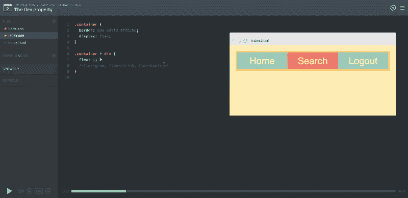

# 如何使用 Flexbox 创建完全响应的导航条

> 原文：<https://dev.to/scrimba/how-to-create-a-fully-responsive-navbar-with-flexbox-o9m>

在本文中，我将解释如何使用 Flexbox 和媒体查询创建一个适应各种屏幕尺寸的导航条。

这个教程也可以在我在 Scrimba 的免费 Flexbox 课程中找到。

#### 设置

让我们从一个非常简单的导航条的标记开始:

```
<nav>  
  <ul class="container">  
    <li>Home</li>  
    <li>Profile</li>  
    <li class="search">  
      <input type="text" class="search-input" placeholder="Search">  
    </li>  
    <li>Logout</li>  
  </ul>  
</nav> 
```

`<ul>`元素是我们的 flex 容器，`<li>`元素是我们的 flex 项目。为了把它变成一个 Flexbox 布局，我们要做:

```
.container {  
  display: flex;  
} 
```

这将导致以下布局:

[](https://res.cloudinary.com/practicaldev/image/fetch/s--ojoQyQCJ--/c_limit%2Cf_auto%2Cfl_progressive%2Cq_auto%2Cw_880/https://cdn-images-1.medium.com/max/800/1%2AbEclbRvpLBeEd8oRddNFaQ.png) 
我添加了一些造型，但那与 Flexbox 无关。

如你所见，我们在右手边有一点额外的空间。这是因为 Flexbox 从左到右排列项目，每个项目的宽度取决于其内容。

因为默认情况下 flex 容器是一个块级元素(并且比四个条目更宽),所以我们在最后得到了间隙。

搜索项比其他项更宽的原因是因为输入字段默认设置为`size="20"`，不同的浏览器和操作系统以不同的方式解释它。

### 响应性#1

为了让我们的 navbar 具有基本的响应能力，我们将简单地赋予搜索项一个 flex 值 1。

```
.search {  
  flex: 1;  
} 
```

这导致搜索项随着容器的宽度扩展和收缩，这意味着我们不会在右边得到额外的空间。

[](https://res.cloudinary.com/practicaldev/image/fetch/s--eBXsiGDr--/c_limit%2Cf_auto%2Cfl_progressive%2Cq_66%2Cw_880/https://cdn-images-1.medium.com/max/800/1%2ABZnmPAc4fNPNGkjCPS22kw.gif)

虽然让搜索项增长而其他项保持不变是有道理的，但你可能会认为与其他项相比，它可能变得太宽了。因此，如果您希望所有的项目都随着容器的宽度增长，您可以简单地给所有的项目一个值 1。

```
.container > li {  
  flex: 1;  
} 
```

事情是这样的:

[](https://res.cloudinary.com/practicaldev/image/fetch/s--RiLTPg_Z--/c_limit%2Cf_auto%2Cfl_progressive%2Cq_66%2Cw_880/https://cdn-images-1.medium.com/max/800/1%2ApXzuCWHyvuyQ3JZQPoWclA.gif)

您还可以给项目不同的 flex 值，这将使它们以不同的速度增长。在这个斯克林巴游乐场，你可以随意尝试。

对于本教程的其余部分，我们将继续第一个解决方案，其中搜索项是唯一具有`flex`值的项。

### 响应性#2

我们的导航条在宽屏上运行良好。然而，在更窄的范围内，它会遇到问题，正如您在这里看到的:

[](https://res.cloudinary.com/practicaldev/image/fetch/s--QORxR8B1--/c_limit%2Cf_auto%2Cfl_progressive%2Cq_66%2Cw_880/https://cdn-images-1.medium.com/max/800/1%2APCmf5iZCXLYIckEjMBbv4g.gif)

在某些情况下，将所有项目放在同一行是不可行的，因为容器变得太窄了。为了解决这个问题，我们将添加一个媒体查询，将我们的四个项目分成两行。当屏幕宽度为 600 像素时，媒体查询将启动:

```
@media all and (max-width: 600px) {  

  .container {  
    flex-wrap: wrap;  
  }  

  .container > li {  
    flex-basis: 50%;  
  }

} 
```

首先，我们允许 Flexbox 布局用`flex-wrap`包装。这是默认设置为`nowrap`，所以我们必须将其更改为`wrap`。

接下来，我们将条目的`flex-basis`值设置为 50%。这告诉 Flexbox 让每个项目占用 50%的可用宽度，这样每行就有两个项目，如下所示:

[](https://res.cloudinary.com/practicaldev/image/fetch/s--eqTRK2Z---/c_limit%2Cf_auto%2Cfl_progressive%2Cq_auto%2Cw_880/https://cdn-images-1.medium.com/max/800/1%2AXr3MxBFPb2-GTX7cDuKbVQ.png) 
注意:我还将占位符文本置于搜索输入字段的中心。

现在我们有两种不同的状态。然而，这种布局在非常小的屏幕上仍然不起作用，像纵向模式下的移动屏幕。

如果我们继续缩小屏幕，它最终会像下面的图像。

[](https://res.cloudinary.com/practicaldev/image/fetch/s--W0KwCCLV--/c_limit%2Cf_auto%2Cfl_progressive%2Cq_auto%2Cw_880/https://cdn-images-1.medium.com/max/800/1%2Ak_HzX7UVF152TVc1sfbhKg.png)

这里发生的情况是，第二排再也装不下两个项目。

注销和搜索项太宽了，因为你不能将它们缩小到最小宽度以下，这是它们填充内容所需的宽度。

虽然 home 和 profile 项目仍然能够出现在同一行，但是 Flexbox 将允许它们这样做。这不是最佳的，因为我们希望所有的行都以相同的方式运行。

### 响应性#3

所以一旦*行中的一行*不能在宽度上容纳两个项目，我们希望*行中的任何一行*都不能在宽度上容纳两个项目。换句话说，在非常小的屏幕上，我们实际上会让导航条垂直。我们将把这些物品一个叠一个地堆放起来。

要实现这一点，我们只需将 50%的宽度改为 100%，这样每一行只适合一个项目。我们将在 400 像素处添加这个断点。

```
@media all and (max-width: 400px) {  
  .container > li {  
    flex-basis: 100%;  
  }  
  .search {  
    order: 1;  
  }  
} 
```

除此之外，我想把搜索项放在底部，这就是为什么我也把搜索作为目标，并给它一个值 1。

这将导致以下结果:

[](https://res.cloudinary.com/practicaldev/image/fetch/s--LYhwfjp6--/c_limit%2Cf_auto%2Cfl_progressive%2Cq_auto%2Cw_880/https://cdn-images-1.medium.com/max/800/1%2A6Xgs5YcKu9Obq3dgk4qLZA.png)

`order: 1;`导致搜索项被放在底部的原因是因为默认情况下 flex 项的值为零，任何值大于该值的项都将被放在其他项之后。

为了了解这一切是如何进行的，下面是文章顶部的 gif 图:

[](https://res.cloudinary.com/practicaldev/image/fetch/s--SIoLzT_w--/c_limit%2Cf_auto%2Cfl_progressive%2Cq_66%2Cw_880/https://cdn-images-1.medium.com/max/800/1%2ACZikqoB4iZIIrV_rAW_qdg.gif)

恭喜你。现在您已经知道了如何使用 Flexbox 和媒体查询创建一个完全响应的 navbar。

如果你有兴趣了解更多关于 Flexbox 的知识，我推荐你去看看我在 Scrimba 的免费课程。

[ ](https://scrimba.com/g/gflexbox?utm_source=dev.to&utm_medium=referral&utm_campaign=gflexbox_tutorial_article) *点击图片进入我的免费 Flexbox 课程。*

感谢阅读！我叫 Per，我是 Scrimba 的联合创始人，我喜欢帮助人们学习新技能。如果你想获得关于新文章和资源的通知，请在 [Twitter](https://twitter.com/perborgen) 上关注我。