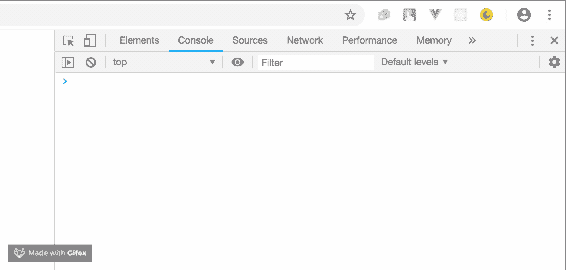

# 了解 RxJS 可观测量以及为什么需要它们

> 原文：<https://dev.to/bnevilleoneill/understanding-rxjs-observables-and-why-you-need-them-17gp>

[](https://res.cloudinary.com/practicaldev/image/fetch/s--nMyKXVHx--/c_limit%2Cf_auto%2Cfl_progressive%2Cq_auto%2Cw_880/https://thepracticaldev.s3.amazonaws.com/i/fcteb9li2egicl093xwt.png)

## RxJS 是什么？

RxJS 是一个反应式编程的框架，它利用了[可观察对象](https://rxjs-dev.firebaseapp.com/guide/observable)，使得编写异步代码变得非常容易。根据官方[文档](https://rxjs-dev.firebaseapp.com/)，这个项目是对 JavaScript 的一种反应式扩展，具有更好的性能、更好的模块化、更好的可调试调用堆栈，同时保持大部分向后兼容，并有一些减少 API 面的突破性变化。Angular 使用这个官方库来处理反应，将回调的拉操作转换成可观察的。

## 先决条件

为了能够完成本文的演示，您应该具备:

*   [在您的机器上安装了](https://nodejs.org/)节点版本 11.0。
*   [节点包管理器版本 6.7](https://nodejs.org/) (通常随节点安装一起提供)。
*   角度控制器版本 7.0
*   Angular 的最新版本(版本 7)

```
// run the command in a terminal
ng version 
```

Enter fullscreen mode Exit fullscreen mode

确认你使用的是版本 7，如果不是的话[更新到 7](https://angular.io/cli/update) 。

*   点击这里下载本教程的起始项目[来完成演示](http://github.com/viclotana/ng_canvas)
*   解压缩项目，并使用以下命令初始化终端中的节点模块

```
npm install 
```

Enter fullscreen mode Exit fullscreen mode

其他值得拥有的东西有:

*   初级水平的角度框架的工作知识

## 了解可观测量:拉与推

为了理解可观测量，你必须首先理解拉和推的背景。在 JavaScript 中，有两种通信系统，称为推和拉。

一个**拉系统**基本上就是一个函数。通常首先定义一个函数(一个称为*生产*的过程)，然后调用(这个过程称为*消费*)返回函数中的数据或值。对于函数，生产者(这是定义)不知道数据何时被消费，所以函数调用从生产者那里获取返回值或数据。

另一方面，推送系统控制在生产者手中，消费者不知道数据何时会被传递给它。一个常见的例子是 JavaScript 中的承诺，承诺(生产者)将已经解析的值推给回调(消费者)。另一个例子是 RxJS Observables，Observables 产生多个称为流的值(不同于返回一个值的承诺),并将它们推送给作为消费者的观察者。

[](https://logrocket.com/signup/)

## 什么是流？

[流](https://angular.io/guide/observables)基本上是一段时间内的数据值序列，其范围可以是 6 秒内打印的简单数字增量(0，1，2，3，4，5)或一段时间内打印的坐标，甚至是通过 web 套接字或 API 响应传递的表单或聊天文本中输入的数据值。这些都表示将随时间收集的数据值，因此称为 stream。

## 什么是可观测量？

理解流是很重要的，因为 RxJS 可观察性有助于理解流。一个可观察对象基本上是一个函数，它可以随着时间的推移向观察者返回一系列的值，这可以是同步的，也可以是异步的。返回的数据值可以从零到无限范围的值。

## 观察者和订阅者

要让 Observables 工作，需要有观察者和订阅。观察器是数据源包装器，当有新值或数据值发生变化时，观察器会执行一些指令。可观察对象通过订阅连接到执行的观察者，通过订阅方法，观察者连接到可观察对象以执行代码块。

## 可观察的生命周期

在观察者和订阅的帮助下，可观察实例在其整个生命周期中会经历以下四个阶段:

*   创造
*   签署
*   执行
*   破坏

## 创造可观测量

如果您从一开始就关注这篇文章，那么您一定已经用 VS 代码打开了 Angular starter 项目。要创建一个 Observable，你必须首先从 RxJS 导入 Observable 到你想要创建它的组件的`.ts`文件中。创建语法看起来像这样:

```
import { Observable } from "rxjs";

var observable = Observable.create((observer:any) => {
    observer.next('Hello World!')
}) 
```

Enter fullscreen mode Exit fullscreen mode

打开您的`app.component.ts`文件，并将下面的代码块复制到其中:

```
import { Component, OnInit } from '@angular/core';
import { Observable } from "rxjs/";
@Component({
  selector: 'app-root',
  templateUrl: './app.component.html',
  styleUrls: ['./app.component.css']
})
export class AppComponent implements OnInit{
  title = 'ngcanvas';
  ngOnInit(): void {
    var observable = Observable.create()
  }

} 
```

Enter fullscreen mode Exit fullscreen mode

## 订阅可观测量

要告诉 RxJS 在可观察对象上执行代码块，或者用一个更简单的术语来说，调用可观察对象开始执行，您必须使用这样的 subscribe 方法:

```
export class AppComponent implements OnInit{
  title = 'ngcanvas';
  ngOnInit(): void {
    var observable = Observable.create((observer:any) => {
      observer.next('Hello World!')
  })
  observable.subscribe(function logMessage(message:any) {
    console.log(message);
  })
} 
```

Enter fullscreen mode Exit fullscreen mode

这个 subscribe 方法将导致在控制台中记录“hello world”。

## 执行可观测量

观察者负责执行可观察对象中的指令，因此每个订阅的观察者可以向可观察对象传递三个值:

1.  **下一个值:**对于下一个值，observer 发送一个值，可以是数字、字符串或者对象。特定可观察对象上可以设置多个后续通知
2.  **错误值:**利用错误值，观察者发送一个 JavaScript 异常。如果在可观察对象中发现一个错误，其他任何东西都不能交付给可观察对象
3.  **完整值:**有了完整值，观察者不发送任何值。这通常表示特定可观察对象的订阅已完成。如果发送了完整的值，就不能向可观察对象发送其他任何东西。

这可以用下面的代码块来说明:

```
export class AppComponent implements OnInit{
  title = 'ngcanvas';
  ngOnInit(): void {
    var observable = Observable.create((observer:any) => {
      observer.next('I am number 1')
      observer.next('I am number 2')
      observer.error('I am number 3')
      observer.complete('I am number 4')
      observer.next('I am number 5')
  })
  observable.subscribe(function logMessage(message:any) {
    console.log(message);
  })
}
} 
```

Enter fullscreen mode Exit fullscreen mode

如果您此时在开发服务器中用
运行应用程序

```
ng serve 
```

Enter fullscreen mode Exit fullscreen mode

当您在开发人员工具中打开控制台时，您的日志将如下所示:

[](https://res.cloudinary.com/practicaldev/image/fetch/s--IKbySu6D--/c_limit%2Cf_auto%2Cfl_progressive%2Cq_auto%2Cw_880/https://i2.wp.com/blog.logrocket.com/wp-content/uploads/2019/07/angularerrorconsole.png%3Fresize%3D1362%252C422%26ssl%3D1)

您会注意到，错误值或完整值会自动停止执行，因此数字 5 不会出现在控制台中。这是一个简单的同步练习。为了使它异步，让我们在一些值周围包装计时器。

```
export class AppComponent implements OnInit{
  title = 'ngcanvas';
  ngOnInit(): void {
    var observable = Observable.create((observer:any) => {
      observer.next('I am number 1')
      observer.next('I am number 2')
      setInterval(() => {
        observer.next('Random Async log message')
    }, 2000)
    observer.next('I am number 3')
    observer.next('I am number 4')
      setInterval(() => {
        observer.error('This is the end')
    }, 6001)
    observer.next('I am number 5')
  })
  observable.subscribe(function logMessage(message:any) {
    console.log(message);
  })
}
} 
```

Enter fullscreen mode Exit fullscreen mode

这将在您的浏览器控制台中显示如下:

[](https://res.cloudinary.com/practicaldev/image/fetch/s--sFs8xL0g--/c_limit%2Cf_auto%2Cfl_progressive%2Cq_66%2Cw_880/https://i1.wp.com/blog.logrocket.com/wp-content/uploads/2019/07/consoleerrors.gif%3Fresize%3D566%252C270%26ssl%3D1)

注意，值的显示是在 setInterval 模块的帮助下异步完成的。

## 摧毁一个可观察的东西

销毁一个可观察对象实质上是通过取消订阅从 DOM 中删除它。通常对于异步逻辑，RxJS 负责退订，在错误或完整通知之后，您的可观察对象立即退订。对于知识，您可以像这样手动触发退订:

```
return function unsubscribe() {
    clearInterval(observable);
  }; 
```

Enter fullscreen mode Exit fullscreen mode

## 为什么可观察的事物如此重要

*   用 Observables 异步发出多个值非常容易处理
*   错误处理程序也可以很容易地在 Observables 内部完成，而不是像 promises 这样的构造
*   可观测量被认为是惰性的，因此在没有订阅的情况下，不会发出数据值
*   与功能甚至承诺相反，可观察到的问题可以解决多次

## 结论

我们已经对 RxJS 中的可观察对象、观察者和订阅进行了全面的介绍。我们还通过实际例子了解了可观测量的生命周期过程。更多 RxJS 的帖子可以在博客上找到，黑客快乐！

* * *

## Plug: [LogRocket](https://logrocket.com/signup/) ，一款适用于网络应用的 DVR

[](https://res.cloudinary.com/practicaldev/image/fetch/s--6FG5kvEL--/c_limit%2Cf_auto%2Cfl_progressive%2Cq_auto%2Cw_880/https://i2.wp.com/blog.logrocket.com/wp-content/uploads/2017/03/1d0cd-1s_rmyo6nbrasp-xtvbaxfg.png%3Fresize%3D1200%252C677%26ssl%3D1)

[log rocket](https://logrocket.com/signup/)是一个前端日志工具，让你重放问题，就像它们发生在你自己的浏览器中一样。LogRocket 不需要猜测错误发生的原因，也不需要向用户询问截图和日志转储，而是让您重放会话以快速了解哪里出错了。它可以与任何应用程序完美配合，不管是什么框架，并且有插件可以记录来自 Redux、Vuex 和@ngrx/store 的额外上下文。

除了记录 Redux 动作和状态，LogRocket 还记录控制台日志、JavaScript 错误、stacktraces、带有头+体的网络请求/响应、浏览器元数据、自定义日志。它还使用 DOM 来记录页面上的 HTML 和 CSS，甚至为最复杂的单页面应用程序重新创建像素级完美视频。

[免费试用](https://logrocket.com/signup/)。

* * *

帖子[了解 RxJS 可观测量以及你为什么需要它们](https://blog.logrocket.com/understanding-rxjs-observables/)首先出现在[日志博客](https://blog.logrocket.com)上。