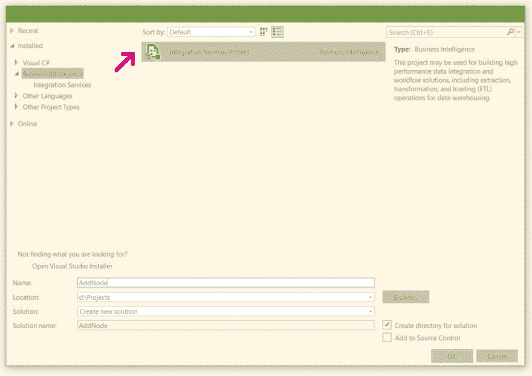
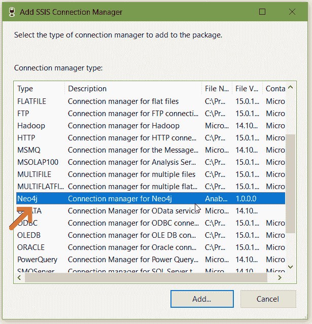
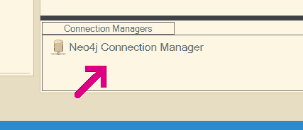
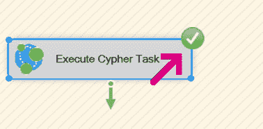
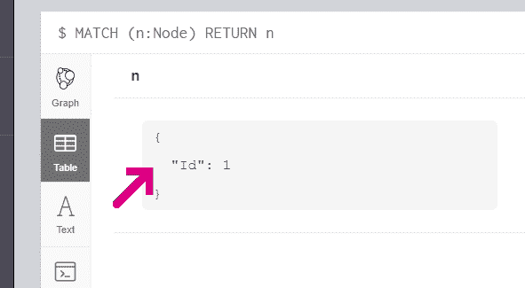

# neo4j & SSIS——在控制流中连接和执行密码

> 原文：<https://dev.to/cskardon/neo4j-ssis-connecting-and-executing-cypher-in-a-control-flow-70k>

上周五，Anabranch 发布了 SSIS Neo4j 连接器的首个测试版。除了一个帖子说它存在，我没有详细说明，所以这将是一系列关于如何使用 Neo4j 使用您现有的 SSIS 基础设施的帖子。

今天我们来看连接器的两个部分，Neo4j 连接管理器(CM)和执行 Cypher 任务(ECT)。CM 是所有控件的基础，没有它，您就无法连接到数据库。我将在另一篇文章中详细介绍它的功能、设置等，但是现在，只要知道它提供了连接就足够了。ECT 允许我们针对给定的连接管理器执行密码。

**注意:1.0.0(测试版)中的* *

**——ECT 仅适用于您添加到包**中的*第一个* CM

该视频的主题与以下文字版本相同:

我将在 Visual Studio 2017 中开发这个，在写作的时候——我发现 2019 年的 SSIS 包有点古怪，而 2017 年迄今为止一直很坚固——虽然从“演示”的角度来看——2019 年的过程在你安装完所有程序后完全相同。

**设置**

如果你以前从未针对 SSIS 开发过，你需要一些东西，首先是 SSDT(特别是集成服务位)，Visual Studio——我认为社区版应该可以工作，但我不能确定。你还需要 Neo4j 的 Anabranch Ssis 控件——假设你已经注册(【http://anabranch.co.uk/Projects/Neo4jSsis】)并拥有下载链接，你会想要 **2017 x86** 版本的控件——(也适用于 VS2019！).

下载并安装控件。NB。你想在 Visual Studio *不运行*的时候安装它们——因为我们在 GAC 的令人兴奋的世界里，除非在那里启动它们，否则 VS 找不到它们。

自己做这个例子——你还需要运行一个 Neo4j 数据库实例，我推荐使用 [Neo4j 桌面](https://neo4j.com/download/),因为它更容易管理这个过程。

### 创建您的第一个包

1.  启动 Visual Studio
2.  创建新的 Integration Services 项目

<figure>[](https://res.cloudinary.com/practicaldev/image/fetch/s--rGjcwbdR--/c_limit%2Cf_auto%2Cfl_progressive%2Cq_auto%2Cw_880/https://xclave.co.uk/wp-content/uploads/2019/07/image-3.png) 

<figcaption>新项目…</figcaption>

</figure>

[](https://res.cloudinary.com/practicaldev/image/fetch/s--PLK39_iw--/c_limit%2Cf_auto%2Cfl_progressive%2Cq_auto%2Cw_880/https://xclave.co.uk/wp-content/uploads/2019/07/image-4-1024x724.png)

1.  在新的 *Package.dtsx* 文件中，我们需要添加一个连接管理器。右键单击底部的“连接管理器”栏并添加一个 Neo4j 连接——如果您没有看到它——您可能需要重新启动 Visual Studio，或者可能需要重新启动您的计算机。

[](https://res.cloudinary.com/practicaldev/image/fetch/s--krkCs3qC--/c_limit%2Cf_auto%2Cfl_progressive%2Cq_auto%2Cw_880/https://xclave.co.uk/wp-content/uploads/2019/07/image-5-1024x703.png)

然后选择 Neo4j 连接:

[](https://res.cloudinary.com/practicaldev/image/fetch/s--7O1An-UL--/c_limit%2Cf_auto%2Cfl_progressive%2Cq_auto%2Cw_880/https://xclave.co.uk/wp-content/uploads/2019/07/image-6.png)

您现在可以在“连接管理器”部分看到它:

[](https://res.cloudinary.com/practicaldev/image/fetch/s--qgx-c1B6--/c_limit%2Cf_auto%2Cfl_progressive%2Cq_auto%2Cw_880/https://xclave.co.uk/wp-content/uploads/2019/07/image-7.png)

选择它，并将连接属性更改为与您的数据库实例相匹配的属性，此时这是通过属性窗口完成的:

[](https://res.cloudinary.com/practicaldev/image/fetch/s--Y3T3arHm--/c_limit%2Cf_auto%2Cfl_progressive%2Cq_auto%2Cw_880/https://xclave.co.uk/wp-content/uploads/2019/07/image-8.png)

在此阶段，我们有一个连接，但我们没有使用它，所以让我们添加一个要执行的任务:

[](https://res.cloudinary.com/practicaldev/image/fetch/s--hHeUGw0N--/c_limit%2Cf_auto%2Cfl_progressive%2Cq_auto%2Cw_880/https://xclave.co.uk/wp-content/uploads/2019/07/image-9.png)

将“执行密码任务”拖到控制流中，然后双击它。然后添加以下密码:

```
CREATE (:Node {Id:1}) 
```

<svg width="20px" height="20px" viewBox="0 0 24 24" class="highlight-action crayons-icon highlight-action--fullscreen-on"><title>Enter fullscreen mode</title></svg> <svg width="20px" height="20px" viewBox="0 0 24 24" class="highlight-action crayons-icon highlight-action--fullscreen-off"><title>Exit fullscreen mode</title></svg>

[](https://res.cloudinary.com/practicaldev/image/fetch/s--yTpb3tnS--/c_limit%2Cf_auto%2Cfl_progressive%2Cq_auto%2Cw_880/https://xclave.co.uk/wp-content/uploads/2019/07/image-10.png)

按下**确认**

然后我们可以执行任务:

[](https://res.cloudinary.com/practicaldev/image/fetch/s--FAye21iJ--/c_limit%2Cf_auto%2Cfl_progressive%2Cq_auto%2Cw_880/https://xclave.co.uk/wp-content/uploads/2019/07/image-11.png)

完成后:

[](https://res.cloudinary.com/practicaldev/image/fetch/s--NaJnu599--/c_limit%2Cf_auto%2Cfl_progressive%2Cq_auto%2Cw_880/https://xclave.co.uk/wp-content/uploads/2019/07/image-12.png)

如果我们去我们的 Neo4j 数据库，我们可以运行:

```
MATCH (n:Node) RETURN n 
```

<svg width="20px" height="20px" viewBox="0 0 24 24" class="highlight-action crayons-icon highlight-action--fullscreen-on"><title>Enter fullscreen mode</title></svg> <svg width="20px" height="20px" viewBox="0 0 24 24" class="highlight-action crayons-icon highlight-action--fullscreen-off"><title>Exit fullscreen mode</title></svg>

如果我们查看“Id”属性，我们可以看到它是“1”

[](https://res.cloudinary.com/practicaldev/image/fetch/s--e409IqWl--/c_limit%2Cf_auto%2Cfl_progressive%2Cq_auto%2Cw_880/https://xclave.co.uk/wp-content/uploads/2019/07/image-13.png)

所以。现在我们有了一个针对 Neo4j 数据库执行的 SSIS 集成包。

这些控件目前处于公开测试阶段，要注册获得这些控件，请前往:[http://bit.ly/neo4jssis](http://bit.ly/neo4jssis)