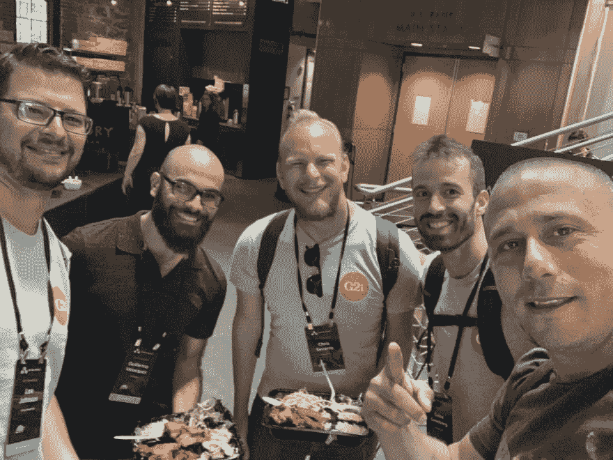
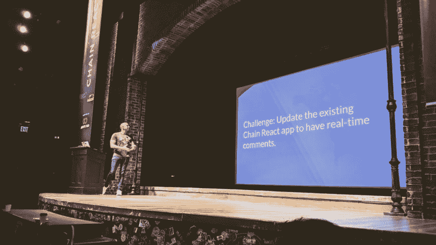
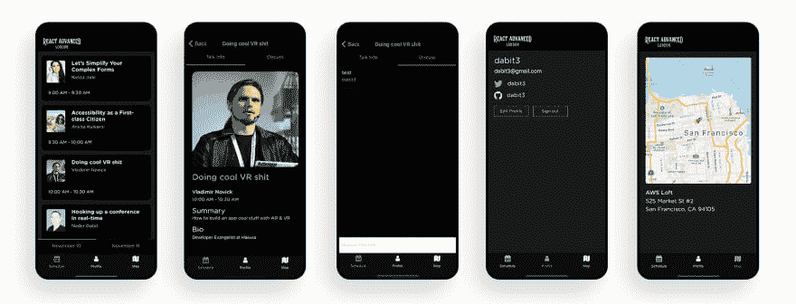
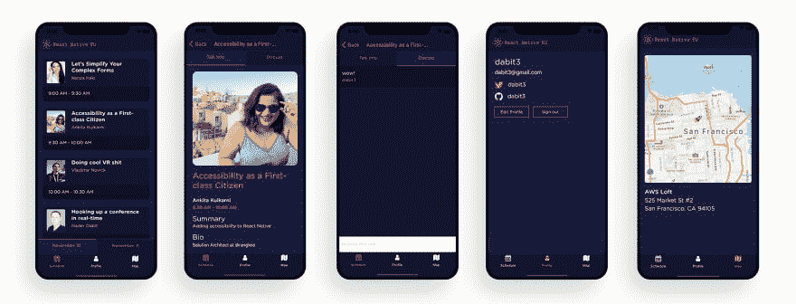

# 盒子里的会议应用介绍

> 原文：<https://dev.to/dabit3/introducing-conference-app-in-a-box-kgj>

### 在几分钟内为您的下一场活动部署主题化、可定制、全堆栈和跨平台的移动应用。

🛠用 React Native、GraphQL、 [AWS Amplify](https://aws-amplify.github.io/) 、&、T2】 AWS AppSync 打造。

> 这个应用程序是开源的。点击查看回购[。](https://github.com/dabit3/conference-app-in-a-box)

[](https://res.cloudinary.com/practicaldev/image/fetch/s--18oIkUCV--/c_limit%2Cf_auto%2Cfl_progressive%2Cq_auto%2Cw_880/https://thepracticaldev.s3.amazonaws.com/i/vs7xw4pld1iz54c7ga2e.jpg)

上周在 [Chain React](https://infinite.red/ChainReactConf) 上，我做了一个题为“用 GraphQL 实时组织会议”的演讲。

> 纳德·达比特[@达比特 3](https://dev.to/dabit3)一如既往 [@ChainReactConf](https://twitter.com/ChainReactConf) 太惊艳了，已经期待 2020 年了。这里有几张会议的照片！2019 年 7 月 13 日下午 13:50[](https://twitter.com/intent/tweet?in_reply_to=1150039743981223936)[](https://twitter.com/intent/retweet?tweet_id=1150039743981223936)6[](https://twitter.com/intent/like?tweet_id=1150039743981223936)54

在演示中，我谈到了 2019 年 1 月举行的 React 原生亚马逊会议，以及我们如何从他们的会议应用程序中获取一些想法，并将它们应用到连锁 React 会议应用程序中。

[](https://res.cloudinary.com/practicaldev/image/fetch/s--qrGtnAJ7--/c_limit%2Cf_auto%2Cfl_progressive%2Cq_auto%2Cw_880/https://thepracticaldev.s3.amazonaws.com/i/j5fm6qsm0uai4rb1dsz9.JPG)

我们想要添加的主要功能是实时聊天，这样与会者可以讨论每个演讲，甚至可以向演讲者提问，然后演讲者可以回答这些问题。

[](https://res.cloudinary.com/practicaldev/image/fetch/s--rQ_IBmvc--/c_limit%2Cf_auto%2Cfl_progressive%2Cq_auto%2Cw_880/https://thepracticaldev.s3.amazonaws.com/i/wjuuovz7ugj5euk5o4rg.jpg)

在演示期间，我展示了我们如何采用 2018 年版的 Chain React 会议应用程序，并将其更新为使用 GraphQL 后端来处理每次演讲的评论。我和来自[无限红](https://infinite.red/)的[罗宾·海因策](https://twitter.com/robin_heinze?lang=en)一起工作了几天来做这件事。

我还展示了我们如何通过添加报告评论的功能和构建一个[管理面板](https://github.com/dabit3/chainreact-admins)来处理身份和滥用，该面板允许版主监控报告的评论、阻止设备和删除报告的评论。

在开发这个应用的时候，我有一个想法就是让这个功能可以重复使用，因为我知道会有很多活动和会议突然出现。我想*为什么不试着创造一些每个人都可以使用的东西*？

挑战:这类事情的问题在于，构建包含后端的一切(认证、数据库、api)通常不容易被复制。

**解决方案:** AWS Amplify 允许您使用基本配置部署整个后端。例如，如果我有一个结合了身份验证、数据库、API 和无服务器功能的应用程序，我想在多个应用程序之间复制这个后端或与他人共享，我需要做的唯一事情就是共享 **amplify** 文件夹，任何人都可以在他们的终端上通过几个命令启动并运行同一个后端。

我决定建立一个主题化的会议和活动应用程序，它很容易定制，并且可以使用 Amplify 以这种方式部署。

[](https://res.cloudinary.com/practicaldev/image/fetch/s--a7Y0mpWx--/c_limit%2Cf_auto%2Cfl_progressive%2Cq_auto%2Cw_880/https://thepracticaldev.s3.amazonaws.com/i/iy2fcckj0mm66yv2uc8p.jpg)
[](https://res.cloudinary.com/practicaldev/image/fetch/s--cs-sNh3B--/c_limit%2Cf_auto%2Cfl_progressive%2Cq_auto%2Cw_880/https://thepracticaldev.s3.amazonaws.com/i/u6aq7jknhtlqnii178hg.jpg)
[](https://res.cloudinary.com/practicaldev/image/fetch/s--coI_Bcm---/c_limit%2Cf_auto%2Cfl_progressive%2Cq_auto%2Cw_880/https://thepracticaldev.s3.amazonaws.com/i/z3lqvnct3cqxj4kv2oa5.jpg)

## 部署 app

> 应用程序的代码位于[这里](https://github.com/dabit3/conference-app-in-a-box)。在部署应用程序之前，我还会看看下一部分(**它是如何工作的**)，这样你就知道一切是如何工作的。

要部署应用程序，您可以遵循以下步骤:

```
# 1\. Clone the repo & install the dependencies

~ git clone https://github.com/dabit3/conference-app-in-a-box.git

~ cd conference-app-in-a-box

~ npm install

# 2\. Initialize and deploy the Amplify project

~ amplify init

? Enter a name for the environment: dev (or whatever you would like to call this env)
? Choose your default editor: <YOUR_EDITOR_OF_CHOICE>
? Do you want to use an AWS profile? Y

~ amplify push

? Are you sure you want to continue? Y
? Do you want to generate code for your newly created GraphQL API? N

# We already have the GraphQL code generated for this project, so generating it here is not necessary.

# 3\. Start the app

~ react-native run-ios

# or

~ react-native run-android 
```

现在后端已经部署，您可以打开应用程序，创建一个帐户并登录。

### 填充数据库

接下来进入 AppSync 控制台，通过运行以下命令与 API 进行交互:

```
~ amplify console api 
```

从 AppSync 控制台，点击**查询**打开 GraphiQL 编辑器。当提示“使用用户池登录”时，您可以使用您的新用户名登录，并使用位于 **aws-exports.js** 中的`aws_user_pools_web_client_id`作为客户端 Id。

#### 创造突变

用以下变化创建一个新对话:

```
mutation  createTalk  {  createTalk(input:  {  name:  "Performance In React Native",  summary:  "In this talk, we will look at the various tips and tricks for taking full advantage of React Native and using the performance attributes of the new architecture.",  speakerName:  "Ram Narasimhan",  speakerBio:  "Software Engineer at Facebook",  time:  "9:00 AM - 9:30 AM",  timeStamp:  "1573491600",  date:  "November 10",  location:  "Armory",  speakerAvatar:  "https://pbs.twimg.com/profile_images/875450414161772544/UjefWmmL_400x400.jpg"  })  {  id  name  speakerBio  speakerName  speakerAvatar  location  date  time  timeStamp  }  } 
```

#### 查询数据

当你重新加载应用程序时，它应该会在启动时列出这个演讲。

要在 AppSync 控制台中查询所有对话，您可以运行以下查询:

```
query  listTalks  {  listTalks  {  items  {  id  name  summary  speakerName  speakerBio  time  timeStamp  date  location  speakerAvatar  }  }  } 
```

## 工作原理

应用程序的代码位于[这里](https://github.com/dabit3/conference-app-in-a-box)。

在项目中，你会注意到一个名为 **amplify** 的文件夹。该文件夹包含应用程序的后端，可以在任何人的帐户中重新部署。在**放大**文件夹中你会看到一个**后端**文件夹。在该文件夹中，您将看到两个主要功能的配置:

1.  认证服务(由 Amazon Cognito 提供支持)
2.  GraphQL API(使用 AWS AppSync 构建)

在**后端/api** 文件夹中，你会看到 GraphQL API 配置以及基础 [GraphQL 模式](https://github.com/dabit3/conference-app-in-a-box/blob/master/amplify/backend/api/rnconfinabox/schema.graphql)。

这是基本的 GraphQL 模式。您将看到基础模式如下所示:

```
type  Talk  @model  {  id:  ID!  name:  String!  speakerName:  String!  speakerBio:  String!  time:  String  timeStamp:  String  date:  String  location:  String  summary:  String!  twitter:  String  github:  String  speakerAvatar:  String  comments:  [Comment]  @connection(name:  "TalkComments")  }  type  Comment  @model  {  id:  ID!  talkId:  ID  talk:  Talk  @connection(sortField:  "createdAt",  name:  "TalkComments",  keyField:  "talkId")  message:  String  createdAt:  String  createdBy:  String  deviceId:  ID  }  type  Report  @model  {  id:  ID!  commentId:  ID!  comment:  String!  talkTitle:  String!  deviceId:  ID  }  type  ModelCommentConnection  {  items:  [Comment]  nextToken:  String  }  type  Query  {  listCommentsByTalkId(talkId:  ID!):  ModelCommentConnection  } 
```

> 并不是说报告功能没有在应用程序中实现，但它是存在的，所以如果你想添加一个报告功能和管理仪表板，你不必配置任何其他东西。

如果你以前从未使用过 Amplify，你可能不知道**@模型**和**@连接**指令。这些是 Amplify CLI 的 [GraphQL 变换](https://aws-amplify.github.io/docs/cli-toolchain/graphql?sdk=js)库的一部分。

**@ model**——用这个指令修饰任何基本类型，以获得 CRUD 并列出查询和变异定义、DynamoDB 表以及为 GraphQL 操作创建的解析器。

**@connection** -使用这个指令来指定字段之间的关系(一对多，多对多)。

### 定制 GraphQL 模式

此模式可以编辑。如果您的活动需要其他字段，您可以通过执行以下操作来更新后端:

1.  更新模式(位于**amplify/back end/API/rnconfinabox/schema . graph QL**)。

2.  重新部署后端

```
~ amplify push 
```

如果您或您认识的任何人需要帮助，以便使用此项目为您的下一个活动设置和运行应用程序，[请在 Twitter 上联系我](https://twitter.com/dabit3/)，我很乐意提供帮助！

> 我的名字是纳德·达比特 T2。我是亚马逊网络服务的开发者倡导者，负责类似 [AWS AppSync](https://aws.amazon.com/appsync/) 和 [AWS Amplify](https://aws-amplify.github.io/) 这样的项目。我专攻跨平台&云应用开发。