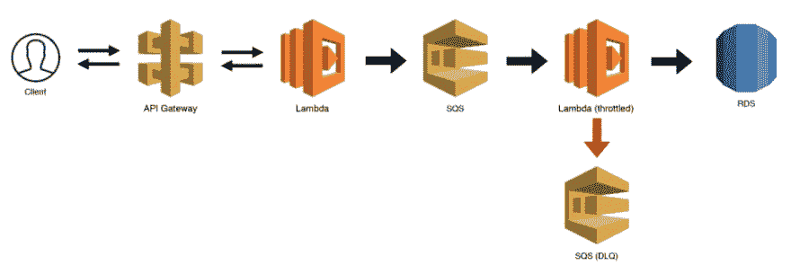
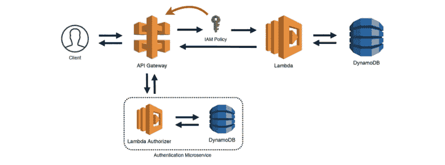
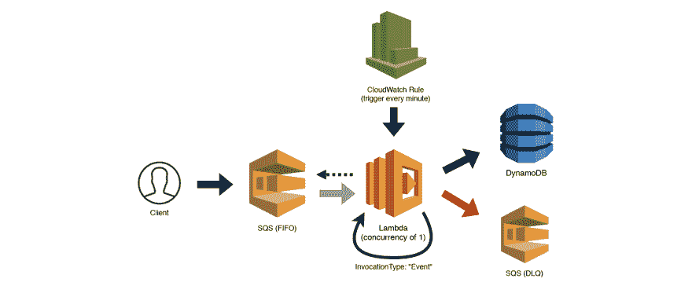

# AWS 无服务器:无服务器微服务

> 原文：<https://dev.to/oieduardorabelo/aws-serverless-padroes-de-micro-servicos-serverless-1gb5>

## 显示 AWS 服务器无电能力的 19 种标准指南

我是用*【无服务器】* 系统构建微服务的大粉丝。serverless 使我们能够专注于代码和数据，而不必担心维护和配置下面的计算资源。云服务提供商(如 AWS)还为我们提供了大量托管服务，我们可以将这些服务结合起来，创建功能强大且可大规模扩展的无服务器微服务。

我读了很多提到无服务器微服务的帖子，但他们通常不太详细。我觉得这可能会让人困惑，使自己的解决方案难以实施。因为我一直在处理无服务器的微服务，所以我想，汇编一份设计标准列表，以及如何在 AWS 中实施这些标准，对社区来说将是一件有趣的事情。下面我描述其中 19 个，尽管我确信还有更多！

在此帖子中，我们将详细介绍所有 19 个，以便您可以将其用作开始设计自己的无服务器微服务的模板。

目录

*   标准 01:简单网络服务
*   标准 02: **可扩展的 web 手册**
*   标准 03: **搬运工**
*   标准 04:内部 API
*   标准 05:内部交货
*   标准 06: **或聚合器**
*   标准 07: **或通知人**
*   标准 08: **或菲菲**
*   标准 09: **O 说我是一个或连续流**
*   标准 10: **或扼流圈**
*   帕德罗 11: **一个国家的 máquina**
*   标准 12:路由器
*   标准 13: **坚固的 API**
*   标准 14: **简单消费者**
*   标准 15: **重读报告机制**
*   padro 16:**O 扇出/扇入**
*   标准 17: **或最终一致**
*   标准 18: **分布式召唤**
*   标准 19: **或断路器**

# 一个关于微服务间通信的快语

在我们进入主题之前，我想确定我们清楚同步和异步通信之间的重要区别。我写了一篇关于[混合 VPC 和非 VPC lambda 函数用于高性能微服务](https://www.jeremydaly.com/mixing-vpc-and-non-vpc-lambda-functions-for-higher-performing-microservices)的文章，详细介绍了通信类型、可能的一致性等微服务主题。如果你不熟悉这些东西也许值得一读。下面是通信类型的快速摘要:

## 同步通信

同步通信服务可由其他服务调用，必须等待响应。这被视为阻塞请求，因为在收到响应之前，调用服务无法完成执行。

## 异步通信

这是一个没有阻塞的请求。一个服务可以直接调用(或触发)另一个服务，也可以使用另一种通信通道将信息入队。通常，服务只需等待请求已提交的确认(“t0”【ack】。

* * *

太好了！既然我们都清楚了，就直说吧！

* * *

# 微服务无服务器标准

以下 19 个标准表示 AWS 中开发人员正在使用的几种常见的微服务设计。绝大多数是我在生产中使用的，但它们都是(在我看来)构建无服务器微服务的有效方式。他们中有些人拥有人们多年来积累起来的合法名字。如果图案很熟悉而且我知道名字，我就用真名。但是，在很多这样的情况下，我不得不有一些乐趣发明一些！

为了清晰一致，下面的图表使用相同的符号来表示组件之间的通信:

*   一个**黑色大箭头**表示异步请求。
*   两个黑色小箭头代表同步请求。
*   红色箭头表示错误。

好好享受吧！😁

* * *

# 01:简单的 Web 服务

这是您可能在 serverless 应用程序中看到的最基本的标准。**简单 Web 服务**是具有网关 API 的 lambda 函数的前端。我在这里展示了 DynamoDB 数据库，因为它很适合 lambdas 的高并发特性。

 
*标准 01:简单的 Web 服务*

# 02:可扩展 web 手册

如果您正在创建 webhook，则流量可能无法预测。这对 Lambda 很好，但如果使用 RDS 这样的“不太可扩展”后端，则可能会遇到一些瓶颈。有[处理这种情况的方法](https://www.jeremydaly.com/manage-rds-connections-aws-lambda)，但现在 Lambda 支持[【SQS】](https://www.jeremydaly.com/serverless-consumers-with-lambda-and-sqs-triggers)调用，我们可以通过排队请求，然后使用有限的 Lambda 函数(**throtted】来限制工作负载在大多数情况下，其传输速率应接近实时。如果在一段时间内有一些重负载，可能会经历一些小的延迟，因为有限的 lambda(“T6”【throtted】**将花费较长的时间来处理消息。sq 对 Lambda [函数的调用现在在限制(**【throtted】**](https://www.jeremydaly.com/serverless-consumers-with-lambda-and-sqs-triggers))下正常工作，因此不再需要管理自己的*政策*

 * 
*标准 02:可扩展的 web 手册*

# 03:搬运工

这是**简单网络服务**模式的变体。使用网关 API 中的“Lambda 授权者”(**可以连接处理标头`Authorization`的 Lambda 函数，并返回 IAM 策略。网关 API 使用此策略来确定该策略对资源是否有效，并转发请求或拒绝请求。网关 API 缓存 IAM 策略，因此您也可以将其归类为默认值“valet key”。如下图所示，“授权服务器”是独立的微服务。您的“授权服务”可以有多个界面来添加/删除用户、更新权限等。**

 ** 
*标准 03:授权/票务钥匙*

# 04:一个 API 内部

标准**内部 API**实质上是网关 API 中没有前端的 web 服务。如果要创建只需从 AWS 基础架构访问的微服务，则可以使用 AWS SDK 直接访问 lambda http API。如果使用`RequestResponse`中的`InvocationType`，则会对目标 Lambda 函数执行同步调用请求，调用其脚本(或函数)并等待响应。有人说调用其他函数的函数是反标准的，但我不同意。来自微服务内部的 HTTP 调用是标准做法(通常是必需的)。无论您是调用 DynamoDB(基于 HTTP)、外部 API(基于 http)还是其他内部微服务(基于 http)，您的服务都可能需要等待 http 响应数据得到解析。

 
*标准 04:内部 API*

## 05:一个企业内部

就像**内部 API**一样，标准**内部交付**使用 AWS SDK 访问 Lambda 的 http API。但是，在这种情况下，我们使用的是`Event`型的`InvocationType`，一收到*表示订单已成功发送，就断开了发布者的连接。Lambda 函数现在正在接收异步事件，因此它将自动使用内置的重复机制(**red rev 的策略** *)。这意味着两件事:*

 *1 -事件可能会被处理多次，因此我们必须确保我们的事件是同步的。
2 -由于我们与呼叫功能断开连接，因此需要确保捕获故障，以便我们能够分析并可能重现故障。

将**死信队列** (DLQ)附加到异步 Lambda 函数总是个好主意。我喜欢使用 SQS 队列并使用 CloudWatch Metrics 监视队列大小。这样，如果故障队列达到特定阈值，我就可以获得警报。

 
*标准 05:内部交货*

# 06: O 同意者

说到内部 API 调用，**聚合器**是另一种常见的微服务模式。下图中的 Lambda 函数对三个单独的微服务进行三次同步调用。假设每个微服务都使用类似标准的东西**【内部 API】**，并将数据返回给呼叫者。下面的微服务也可以是外部服务，如第三方 API。Lambda 函数聚合所有响应，并将组合响应返回到网关 API 的另一端的客户端。

 
*标准 06:聚合器*

# 07: O 通知者

我和很多人进行了这场辩论，但我认为简单通知服务(SNS)是他们自己的微服务标准。微服务的一个重要属性是有一个“定义完善的 API”，以便其他服务和系统与它们进行通信。SNS(以及 SQS 和 Kinesis)具有可通过 AWS SDK 访问的标准化 API。如果微服务供内部使用，SNS 的一个独立主题有助于提供极其有用的微服务。例如，如果您有多个开单服务(一个用于产品，一个用于订阅，一个用于服务)，则很可能需要在生成新的开单记录时通知多个服务。上述服务可以将事件发布到“开单通知”服务，该服务将事件发布到订阅服务。我们想让我们的微服务保持分离，因此依赖服务(如计费服务、付款处理服务等)。)他们负责自行签署“通知开单”服务。随着需要此数据的新服务的添加，他们也可以注册。

 
*标准 07:通知人*

# 08:00 点钟方向

让我们稍微增加复杂性。[支援 SQS 呼叫 lambdes](https://www.jeremydaly.com/serverless-consumers-with-lambda-and-sqs-triggers)令人难以置信，但不幸的是，它不适用于先进先出伫列( **first in，first out** ，first in，first out，first out，first out)。这是合理的，因为调用的目的是并行处理消息，而不是一次处理一个消息。但是，我们可以通过少量的 CloudWatch 规则和 Lambda 并发设置来构建 FIFO 服务器用户。在下图中，我们有一个客户正在将消息发送到 FIFO 队列。由于我们不能自动激活消费者，我们添加了一条 CloudWatch 规则(也称为“**crontab**”)，该规则在几分钟内(异步)调用我们的功能。我们将 Lambda 函数的并发性设置为“`1`”，因此我们不会尝试并行执行并发请求。此函数会搜寻(最多 10 个)排序讯息的伫列，并进行必要的处理，例如将资料写入 DynamoDB 表格。

完成我们的处理后，该函数将消息从队列中删除，然后使用 AWS SDK(异步)重新调用自己，以访问调用类型为“`Event`”的 lambda http API。此过程将重复，直到所有项目都已从队列中移除。是的，这有级联效应，我不是很喜欢把它用于其他任何目的，但在这种情况下效果很好。如果 Lambda 函数正忙于处理一组消息，则 CloudWatch 规则将因 Lambda 并发设置而失败。如果由于任何原因阻止了自动调用，则重试将继续级联。最坏情况下，处理将停止，然后由 CloudWatch 规则重新启动。

如果消息有缺陷或导致处理错误，请记住将它们放在退货队列(DLQ)中，以便进行更详细的检查，并且能够回放它们。

 

 *# 09:“他们说我是流通者”或连续流动

另一个有点复杂的模式是流处理器。这对于捕获点击流、IoT 数据等非常有用。在下面的方案中，我使用网关 API 作为 Kinesis 的代理。这使用网关 API 提供的“AWS 服务”集成类型(“T0”【在此了解详情。您可以使用任意数量的服务向 Kinesis 流发送数据，所以这只是一个例子。Kinesis 将向我们配置的 shards 分发数据，然后我们可以使用 kinesis fire pants 将数据聚合到 S3 中，并将其批量上传到 Redshift 中。实现这一点还有其他方法，但令人惊讶的是，当你达到更高的规模(例如 vs SNS)时，这最终会变得更便宜。

 
*标准 09:“他们说我是流通者”或*

# 10: O 埃斯特拉达

**扼流圈**是另一种流行的模式，它允许以新的或更新的服务逐步取代部分应用程序。通常，您会创建一种“前端扼流圈”来路由您的请求，但网关 API 实际上可以使用“AWS 服务”和“HTTP”集成类型为我们执行此操作。例如，现有 API(带有弹性负载平衡器)可以通过网关 API 通过“HTTP”集成进行路由。您可以拥有对旧 API 的所有标准请求，并可随时将特定路径定向到新的无服务器服务。

 
*标准 10:扼流者*

# 11: A Máquina de Estado

通常，无服务器体系结构需要提供某种形式的协调。 [AWS Step Functions](https://aws.amazon.com/step-functions/) 无疑是在其 AWS Serverless 应用程序中处理编排的最佳方法。如果您不熟悉 *Step 功能*，请查看 AWS 文档中的这些[两个示例项目](https://docs.aws.amazon.com/step-functions/latest/dg/create-sample-projects.html)。状态机非常适合协调各种任务，并通过实施新的尝试(“T6”、*【延期】、*以及等待和回退，确保其正确完成。但是，它们是完全异步的，这意味着您不能等待 Step 函数的结果并响应同步请求。

AWS 提倡使用 Step 函数来编排整个工作流，即协调各种微服务。我认为这适用于某些异步模式，但肯定不适用于需要向客户提供同步响应的服务。就我个人而言，我喜欢将步骤功能封装在一个微服务中，从而降低代码的复杂性并增加恢复能力，同时保持我的服务处于分离状态。

 

 *# 12:路由器

标准**状态机**功能强大，因为它为我们提供了简单的工具来管理复杂性、并行性、错误处理等。但是，Step 函数不是免费的，如果您将它们用于任何目的，您可能会积累一些巨大的帐户。对于不太在意状态转换的不太复杂的管弦乐团，我们可以使用**路由器**的标准来操纵它们。

在下面的示例中，对 Lambda 函数的异步调用确定了用于处理请求的任务类型。这基本上是一个‘t0’的说法，但如有必要也可以加上一些额外的上下文和丰富的数据。请注意，Lambda 的主要功能只是调用此处三种可能的任务之一。如前所述，异步 lambde 应具有一个 DLQ 来存储失败的呼叫，从而允许 replays，包括下面的三个“任务类型”lambde。然后，任务执行其工作(无论是什么)。这里我们只是为 DynamoDB 表写。

 
*标准 12:路由器*

# 13:一种 API Robusta

当客户不知道如何将请求拆分为单独的端点时，路由器的模式**运行良好。但是，客户通常知道如何执行此操作，例如 rest API。通过使用网关 API 及其基于方法和*端点*路由请求的能力，我们可以让客户决定要与之交互的“后端”服务。以下示例使用来自客户端的同步请求，但这与异步请求一样有效。**

虽然这有点类似于标准简单的 Web 服务，但我认为该标准是**强健的 API**，因为我们在整体应用程序中与附加服务交互时增加了复杂性。如下图所示，多个角色可以共享同一数据源，角色可以异步调用其他服务，角色可以同步调用其他外部服务或 API，并需要响应。还必须注意的是，如果使用**内部 API**模式创建服务，则可以使用网关 API 将其公开。

 

 *# 14: O 消费或简单

我们已经提到了“[SQS 触发器”(](https://www.jeremydaly.com/serverless-consumers-with-lambda-and-sqs-triggers/))以及它们如何使我们能够过滤对 RDS 等“不太可扩展”服务的请求。**简单消费者**基本上是没有网关 API 和 Lambda 函数预处理的标准**【可扩展 web 手册】**。我认为这是一个单独的模式，因为它可能作为一项独立的服务存在。与 SNS 一样，SQS 具有定义完善的 API，可通过 AWS SDK 进行访问。多个服务可以直接将消息入队，并使 Lambda 函数处理您的请求。sq 对 Lambda 函数的调用现在在限制(“T6”【throtted】)下正常工作，因此不再需要管理自己的*[【关于**【red】策略**](https://docs.aws.amazon.com/AWSSimpleQueueService/latest/SQSDeveloperGuide/sqs-dead-letter-queues.html)*

 
*标准 14:简单消费者*

# 15:重读报告机制

正如在 RDS 等“不太可扩展”服务中接收数据时存在限制一样，数据输出也可能存在限制。亚马逊在这个空间里用***【aurora read replicas】***和[【aurora server less】](https://www.jeremydaly.com/aurora-serverless-the-good-the-bad-and-the-scalable/)做了一些不可思议的事情，但不幸的是，达到极限`max_connections`还是很有可能的，特别是对于具有以下功能的应用缓存是一种经过测试的真实的读取衰减策略，可以作为本文所描述的各种模式的一部分来实现。下面的例子在我们 RDS 群集的前面推出了一个群集**【弹性缓存】**(可以处理数万个连接)。这里的要点是确保正确设置**【TTL】***【直播时间】*** )，包括缓存失效(可能作为其他服务的订阅)和新连接**

注:弹性缓存不直接与 RDS 对话，我只是试图使缓存层清晰。技术上，Lambda 函数需要与这两个服务进行通信。

*标准 15: 15:重读报告机制*

# 16: O 扇出/扇入

这是另一个很好的模式，特别是对于批处理作业。Lambda 的功能限制在总运行时间 15 分钟以内，因此大型 ETL 任务(***【extract，transform and load】***和其他耗时的流程很容易超过这一限制。为了避免这种情况，我们可以使用单个 lambda 函数将我们的伟大工作分成一系列小任务。这可以通过用`Event`类型为每一个小工作调用一个舔手的**工人**来完成，从而断开调用功能。这被称为**【扇出】**，因为我们正在分担工作量。

在某些情况下，传播我们的工作可能是我们所需要做的一切。但是，有时我们需要汇总这些小工作的结果。一旦女工们的叫声全部与我们原来的叫声脱钩，我们就不得不把结果**【扇入】**搬到一个共同的地方。这真的比看起来容易多了。每个工人只需将主任务 id、子任务 id 和工作结果写入 DynamoDB 表。或者，每个作业都可以写入 S3 中的同一文件夹，然后从该文件夹聚合数据。不要忘了你的‘T2’【dlqs】舔舔舔舔舔舔舔舔舔舔舔舔舔舔舔舔舔舔舔舔舔舔舔舔舔舔舔舔舔舔舔舔舔舔舔舔舔舔舔舔舔舔舔舔舔舔舔舔舔舔舔舔舔舔舔舔舔舔舔舔舔舔舔舔舔舔舔舔舔舔舔舔舔舔舔舔舔舔舔舔舔。

*padro 16:O 扇出/扇入*

# 17: O 最终一致

微服务依赖“可能的一致性”概念将数据复制到其他服务。由于复制速度通常很快，因此最终用户通常不会察觉到短暂的延迟。试想一下，当您更改 Twitter 配置文件照片时，它可能需要几秒钟才能在标题中更新。数据需要复制，缓存需要清理。在微服务中为不同目的使用相同的数据往往意味着我们必须多次存储相同的数据。

在下面的示例中，我们通过调用通过网关 API 路由到 lambda 函数的某些端点，将数据保留在 DynamoDB 表中。对于我们的前端 API 用途，NoSQL 解决方案运行良好。但是，我们也想在我们的报告系统中使用这些数据的副本，需要进行一些联接，使关系数据库成为最佳选择。我们可以配置另一个用于签名 DynamoDB 表流的 lambda 函数，该函数将在添加或更改数据时触发事件。

DynamoDB 流的作用类似于 Kinesis，因此批将会多次重复(并保持有序)。这意味着我们可以限制我们的 lambda 功能，以确保我们不会给 RDS 实例带来负担。请务必管理您自己的 DLQ 以存储无效的更新，并包括一个包含所有注册表更改的“`last_updated`”字段。您可以使用此功能来限制 SQL 查询，并确保您拥有最新版本。

 
*标准 17:或者最终一致*

# 18:分布式调用

我前面提到的 SNS(也称为标准**【通报员】**的自主话题，鉴于其服务于几位高手的能力，极为有力。但是，将 SNS 主题直接绑定到微服务也有其优点。如果主题真的只有一个目的，并且只需要从自己的微服务接收消息，下面描述的**分布式调用模式将运行得很好。**

我们以 CloudWatch Logs 为例，但从技术上讲，它可以使用任何支持的事件类型。事件触发我们的 Lambda 函数(附加了 DLQ)，然后将事件发送到 SNS 主题。在下图中，我展示了三个具有*【缓冲器】* SQS 的微服务被通知。但是，SNS 主题的签名将由个别微服务负责。

 
*标准 18:分布式调用*

# 19:断路器

我把最好的留到最后！这是我最喜欢的标准之一，因为我在无服务器应用程序中使用了许多第三方 API。**断路器**模式控制使用某种状态机进行的故障(或缓慢)API 调用的次数。为了我们的目的，我们使用弹性缓存群集来保留信息(但如果您要避免 VPCs，也可以使用 DynamoDB)。

看看这是怎么回事。当故障数量达到一定限度时，我们“打开”电路，并立即将错误发送回呼叫它的客户，而无需尝试调用 API。经过短暂的等待，我们“部分打开”了电路，只发送了一些请求，看看 API 是否终于做出了正确的响应。所有其他请求都会收到错误。如果样例请求成功，“关闭”回路并开始释放所有流量。但是，如果这些请求中的任何或所有请求失败，回路将重新打开，并使用某种算法重复该过程，以增加重试“半打开”之间的时间间隔。

对于任何类型的同步请求来说，这是一个非常强大(且经济实惠)的模式。每次运行 lambda 函数并等待另一个任务完成时，您都会累计费用。使您的系统能够自动识别此类问题，提供增量后退，然后在服务恢复在线时执行自我恢复，让您感觉自己是超级英雄！

 
*标准 19:断路器*

* * *

# 我们从这里去哪里？

在设计您的无服务器微服务时，上述 19 个标准应为您提供一个良好的起点。我能给出的最好建议是仔细思考每个微服务真正需要做什么，它需要什么数据，以及它需要与哪些其他服务进行交互。当你只需要几个的时候，就可以建造很多小型的微服务，这是很诱人的。

就像“无服务器”一词一样，对于“微服务”究竟是什么，没有正式商定的定义。但是，无服务器微服务必须至少遵守以下标准:

*   **服务必须有自己的私人数据。**如果您的微服务与其他服务共享一个数据库，请分离/复制数据或合并服务。如果这些对你都不起作用，请重新考虑你的战略和体系结构。
*   **服务必须独立部署。**微服务(尤其是无服务器服务)必须完全独立自主。他们最好依赖或依赖其他服务，但这些依赖必须完全基于他们之间明确定义的通信渠道。
*   **可能的一致性。**数据复制和非标准化是微服务体系结构中的基本原则。服务 a 需要服务 b 中的某些数据，但这并不意味着它们应该合并。数据可以通过同步通信(如果可能)进行实时接口，也可以在服务之间进行复制。从关系数据库中呼吸个人背景，这是可以做到的。
*   **尽可能异步工作负载。** AWS Lambda 蛇每 100 毫秒使用一次加工时间。如果您正在等待其他流程完成，则您正在支付功能等待。这对于许多使用案例来说可能是必要的，但如果可能，请交付您的任务并让它们在后台运行。对于更复杂的管弦乐队，请使用 Step 函数。
*   **小型但有价值的服务。**可以走得很小，但也很有可能你太大了。其“微服务”体系结构不应是处理大型应用程序组件的小型“整体”集合。将某些函数、数据库表和队列作为单个微服务的一部分是可以接受的。如果能限制规模，但仍能提供足够的商业价值的话，大概就在需要的地方吧。

祝你好运，好好享受构建你的无服务器微服务。有没有您正在使用的模式，想分享一下？有没有合法的名字来代替我刚刚发明的那些图案？在[推特](https://twitter.com/jeremy_daly)上留言或跟我说话，通知我。

# [t1【学分】](#cr%C3%A9ditos-%EF%B8%8F)

*   [AWS 的无服务器微服务模式](https://www.jeremydaly.com/serverless-microservice-patterns-for-aws)，escrito origination por[Jeremy Daly](https://twitter.com/jeremy_daly)*******