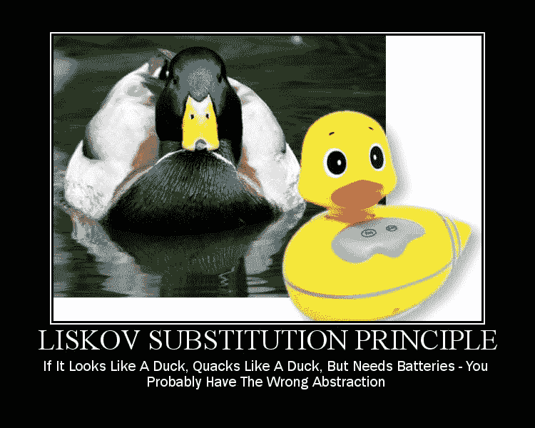

# Liskov (LSP)替换原则

> [https://dev . to/missing SNC/de-liskov-LSP-1koh 替代原则](https://dev.to/mangelsnc/principio-de-sustitucion-de-liskov-lsp-1koh)

[](https://res.cloudinary.com/practicaldev/image/fetch/s--VwsOrApE--/c_limit%2Cf_auto%2Cfl_progressive%2Cq_auto%2Cw_880/https://cdn-images-1.medium.com/max/2048/1%2A3Zkkuo-XO_h5C1YUwFg9DQ.jpeg)

1987 年，当[【Barbara liskov】](https://es.wikipedia.org/wiki/Barbara_Liskov)在一次名为*【数据和等级的抽象】*的裁判会议上，首次谈到**的强定性，提到了物体间的继承**

 **几年后(1994 年)，与[【珍妮特翼】](https://en.wikipedia.org/wiki/Jeannette_Wing)一起，终于形成了我们今天所称的**【liskov(LSP)**替换原则，即**【l5t】在 5 个坚实的原则范围内。**

Liskov 和 Wing 阐述的原则如下:

> # *is about the testable properties of T-shaped X objects. Therefore, ∞ must be true for objects and S-type, where S is a subtype of T* .

换句话说:

> # [If a category **[is expanded by a category **, we must be able to replace any item in **with any item in **[h]. 】********

 ****或者更清楚的是：

[](https://res.cloudinary.com/practicaldev/image/fetch/s--5EoEPL7n--/c_limit%2Cf_auto%2Cfl_progressive%2Cq_auto%2Cw_880/https://cdn-images-1.medium.com/max/2000/1%2Ai8wVfXZX-AUA-F7bo0mE_w.jpeg)

这一原则强化了 [**【合同设计】**](https://es.wikipedia.org/wiki/Dise%C3%B1o_por_contrato) 的概念，由 [Bertrand Meyer](https://es.wikipedia.org/wiki/Bertrand_Meyer) 提出，到目前为止，我认为大家都很熟悉。

## 我们是否符合 LSP？

下面是一个不符合 LSP 的代码示例:

从数学上讲，一个正方形等于一个矩形，所以我们班 *Square* 从 *Rectangle* 继承而来】可能看起来完全合乎逻辑。

但是，setWidth($width)和 setHeight($height)方法怎么办？对于正方形而言，宽度等于高度，因此就像本例一样，我们可以通过每次调用这些方法之一来解决此问题，方法是将高度和宽度值设置为相同的值。

乍一看，这可能看起来是一个有效的解决方案，但让我们看一个可能失败的例子:

```
public function testAreaIsBeingCalculated(Rectangle $rectangle)
{
    $rectangle->setHeight(6);
    $rectangle->setWidth(4);

    $this->assertEquals(24, $rectangle->area());

} 
```

假如我们通过一个纯粹的*矩形*物体，一切都会按预期进行，但由于我们通过一个*正方形*将会给我们返回一个错误，因为该区域将是 16 个，而不是我们预期的 24 个。

问题在于 setHeight 和 setWidth 方法仍然是公用的，因为它们都是从有意义的“*rectangle*继承而来的，因此面向开发人员可以使用这些方法。

另一个不好的解决方法是强制类别 *Square* 使用这两种方法中的任何一种(setWidth 或 setHeight，但不能同时使用这两种方法)，否则会失去全部功能。而且我说不好的解决方法，因为没有人会期待这样一种基本的方法的结果从 *Rectangle* 类，以至于在基类本身也不例外。

记住:**被复写的方法必须保留原有行为，如果原始方法不引发异常或不允许返回 *null* ，被复写的方法也不应该。**

在这种情况下，解决方案需要使我们的类层次结构更加具体，使一个更高的类具有共同特征，并让每个特定类来模拟其差异:

## 我们是否检测到不符合 LSP？

或者换句话说，不符合 LSP 标准的班级闻起来像什么？

检测 LSP 不遵守情况的最简单方法是查看从其他类扩展的类。如果它们具有返回 null 或抛出异常的被复盖方法，并且知道它们继承的类不会返回 null 或抛出异常，则表明存在明显违反 LSP 的情况。

另一方面，如果我们继承了抽象类，这些类还要求我们抛出异常或返回 null，则我们也面临 LSP 违规的情况。

## 结论

虽然 LSP 看起来似乎微不足道，但不应轻视 LSP，但分层结构是我们整个应用程序的基础，而这一级别的设计失败可能会带来灾难，当它增长时很难纠正。现在我们有了明确的警告信号，知道如何避免错误，不惜一切代价避免违反 lsp）

下次见！******