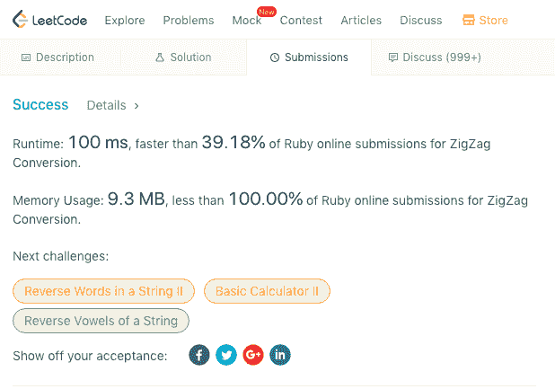

# 为什么我应该检查我的代码的性能？

> 原文：<https://dev.to/kelvin9877/why-i-should-check-the-performance-of-my-code-19cl>

[](https://res.cloudinary.com/practicaldev/image/fetch/s--KPkB6lPj--/c_limit%2Cf_auto%2Cfl_progressive%2Cq_auto%2Cw_880/https://cdn.hashnode.com/res/hashnode/image/upload/v1563379443643/STy0Oc0tc.jpeg)

> 作为一名 **#CodeNewbie，**我通常不关心我如何解决了一个编码挑战，只要我得到了结果(也许我确实有点关心代码的优雅和干净)。直到有一天，我看到了我的代码和队友代码的不同:

```
Comparison:
     Yunus's method :   119030.6 i/s
     Ebuka's method :    63232.0 i/s - 1.88x  slower
    Kelvin's method :     6848.0 i/s - 17.38x  slower 
```

从那以后我改变了主意。

下面，我将探讨为什么我认为检查代码的性能是重要的，以及我们如何做到这一点。

## 首先是好玩。

[](https://res.cloudinary.com/practicaldev/image/fetch/s--TB2uD1aV--/c_limit%2Cf_auto%2Cfl_progressive%2Cq_auto%2Cw_880/https://cdn.hashnode.com/res/hashnode/image/upload/v1562237928237/3w0qFYZwF.jpeg) 
*照片由伊利亚·巴甫洛夫在 Unsplash 上拍摄*

当进行编码挑战时，与你的编码伙伴竞争看谁能首先解决同样的问题是很有趣的。

同样的逻辑也适用于代码性能检查，不同之处在于，你不仅可以与你的编码伙伴或队友竞争，还可以与你自己竞争，甚至与 ruby 贡献者的团队竞争。

下面是一个例子

*   挑战-返回未排序数组的中值(数组的大小总是奇数)。

```
# get the median by search every number in the array

def median(array)
  array.each do |x|
    count = 0
    array.each {|y| count += 1 if y <= x}
    return x if count == array.size/2 + 1
  end
end 
```

```
# Use Ruby build-In sort to find the array

def median_r(array)
  array.sort[array.size/2]  
end 
```

如果在我的笔记本电脑上运行上述方法，我几乎可以同时得到相同的结果。但是密码真的一样吗？感谢 [Evan Phoenix](https://github.com/evanphx) 提供的[基准测试工具](https://github.com/evanphx/benchmark-ips)，我可以通过添加几行代码，在我的笔记本电脑上对这两个代码块进行基准测试。

```
Benchmark.ips do |x|
    x.config(:time => 3, :warmup => 2)

    x.report("Kelvin's Method") {median(list)}
    x.report("Ruby Sort") {median_r(list)}

    x.compare!    
  end 
```

*请注意——所有编码块应该在同一个文件*

结果-

```
# Benchmark test with [7, 3, 9, 8, 2, 1, 5]
Comparison:
               Ruby Sort:  1098170.4 i/s
     Kelvin's Method:   171681.3 i/s - 6.40x  slower 
```

好吧，所以我的方法比 ruby 内置方法慢，这是合理的，我只是学习 Ruby，我无法与团队复杂的 Ruby 开发者竞争。(我一会儿再试试！！)

我队友的代码怎么样？

```
# Benchmark test with [7, 3, 9, 8, 2, 1, 5]
Comparison:
           Ruby Sort:  1098147.9 i/s
      Yunus's Method:   528263.9 i/s - 2.08x  slower
      Kelvin's Method:   173466.6 i/s - 6.33x  slower 
```

哇，我队友的代码运行速度比我快 3 倍，我想找出原因和方法。

最后，我用我自己的排序方法(高级快速排序)创建了另一个版本的查找中位数的方法。

```
def median_k1(array)
  temp = array.clone .    #for not modify the original array
  advanced_quicksort(temp) 
  temp[array.size/2]
end 
```

并再次运行基准测试。

```
# Benchmark test with [7, 3, 9, 8, 2, 1, 5]
Comparison:
           Ruby Sort:              1087509.0 i/s
      Yunus's Method:        525471.1 i/s - 2.07x  slower
     Kelvin's Method:         166969.8 i/s - 6.51x  slower
Kelvin's Adv Sort Method:    151304.6 i/s - 7.19x  slower 
```

好吧，它运行得更慢了，但当我们尝试过并看到结果时，这很有趣，不是吗？(就像我们看赛马，但我们比赛的是代码而不是马)

有时，我会一遍又一遍地重复上述过程，直到我想不出任何方法来改进我的代码。

我可能最终会重写我的代码，或者只是对我写的代码有更深的理解。关键是，以后我可以写出更好、更快的代码，我喜欢更多地学习编码，这给了我前进的动力。

## 其次，它帮助我在更深层次上学习如何编码。

当和我的团队一起做编码挑战时，我们通常不会注意到解决方案之间的差异，因此，我们永远不会讨论一个解决方案是否比另一个更好，因为它们都给出相同的结果。

但是通过比较，我们突然有了更多的话题来讨论和竞争，每个团队成员都想写更快的代码，然后我们会互相学习。

例如，我的一个团队成员试图研究在相同的情况下，哪种 Ruby 可枚举方法更有效。[他的文章](https://medium.com/@YunusAybey/a784d01148f9)

此外，从我前面提到的示例中，一旦我看到我的代码的性能，我就有深入挖掘我的代码运行缓慢的方式和原因的欲望，即使我只是试图找到一种方法来击败自己。

实际上，除了比较代码之外，还有一件事我们可以测试——输入(或数据集),一些代码在一种输入下工作得更好，但在另一种输入下工作得更差。下面是一些例子:

```
# Benchmark test with [7, 3, 9, 8, 2, 1, 5]
Comparison:
           Ruby Sort:  1041021.5 i/s
      Yunus's Method:   500895.3 i/s - 2.08x  slower
     Kelvin's Method:   165341.8 i/s - 6.30x  slower
    Kelvin's AdvSort:   141434.0 i/s - 7.36x  slower 
```

这种情况正在随着一个几乎排序的数组而改变...

```
# Benchmark test with [0, 1, 2, 4, 6, 5, 3, 8, 9]
Comparison:
           Ruby Sort:   926798.7 i/s
     Kelvin's Method:   253107.0 i/s - 3.66x  slower
      Yunus's Method:   117203.3 i/s - 7.91x  slower
    Kelvin's AdvSort:    68769.3 i/s - 13.48x  slower 
```

该表随着更大的数据集再次翻转...

```
# Benchmark test with an array with 100 unsorted numbers
Comparison:
           Ruby Sort:   108950.9 i/s
    Kelvin's AdvSort:     4935.3 i/s - 22.08x  slower
      Yunus's Method:     4794.6 i/s - 22.72x  slower
     Kelvin's Method:     1216.6 i/s - 89.55x  slower 
```

很有趣，对吧？在这样的测试之后，我和我的团队不会像以前一样看待代码，我们现在明白没有绝对最好的代码，一些代码在一种情况下工作得更好，一些在另一种情况下工作得更好。

还有很多例子可以展示我们如何更深入地研究代码以了解更多，查看代码性能的能力有助于我们继续这样做。

[](https://res.cloudinary.com/practicaldev/image/fetch/s--HVDj-qUM--/c_limit%2Cf_auto%2Cfl_progressive%2Cq_auto%2Cw_880/https://cdn.hashnode.com/res/hashnode/image/upload/v1563365381068/HWWDA0Sub.png)

我猜这也是为什么大部分编码挑战平台如 [LeetCode](https://leetcode.com) 都想在你完成后给你看性能的原因。

## 最后，我觉得在工作中会很重要。

当解决编码挑战这样的小问题时，即使我们可以从性能测试中看出差异，但这种比较可能只是 0.001 秒对 0.01 秒，没有人能真正知道，并且在现实世界中影响很小。

但这一切都是因为编码挑战通常只使用非常小的数据集来证明概念或解释算法容易。一旦 start 使用更大的数据集，情况将会完全不同。

```
# Benchmark with 1,000 size array
Comparison:
           Ruby Sort:     6454.5 i/s
    Kelvin's AdvSort:      336.0 i/s - 19.21x  slower
      Yunus's Method:       45.5 i/s - 141.97x  slower
     Kelvin's Method:       20.1 i/s - 321.18x  slower 
```

```
# Benchmark with 10,000 size array
Comparison:
           Ruby Sort:      477.6 i/s
    Kelvin's AdvSort:       27.4 i/s - 17.40x  slower
      Yunus's Method:        0.7 i/s - 681.21x  slower
     Kelvin's Method:        0.4 i/s - 1254.91x  slower 
```

数据集大小分别为 1，000 和 10，000，我的一个方法甚至不能在 3 秒内完成(我在这个基准测试中预设为 3 秒)。

现在我真的能感觉到差别，是 5 秒。vs 0.005 秒，如果我把它放到我的 web 应用程序中，一旦我的产品类别接近 10k，我的 web 应用程序可能几乎无法工作。

我的第一个代码不能在这样的生产系统中工作，我的第二个代码(应用了高级排序方法)可能会工作得更好，但是仍然离 Ruby 基线代码很远。这就是业余和专业的区别，但如果我不做性能测试，我永远不会知道。

这也让我想起为什么一些程序员拿着 10 倍甚至 100 倍的薪水，因为他们可以编写更高效的代码，帮助公司的网站以 1000 或 100000 倍的速度运行数百万到数十亿的数据。

因此，如果我不断检查我的代码的性能，了解什么工作得更好，什么工作得更差，沿着#LeanToCode 的道路学习诀窍，我可能有机会成为那些程序员中的一员。(永远要有希望！)

最后，也许我只是太乐观了，但是检查性能或进行基准测试对于学习代码或为工作编写代码来说仍然是一个非常好的实践，更不用说它使旅程更加有趣，同意吗？

[](https://res.cloudinary.com/practicaldev/image/fetch/s--n75ixwYt--/c_limit%2Cf_auto%2Cfl_progressive%2Cq_auto%2Cw_880/https://cdn.hashnode.com/res/hashnode/image/upload/v1563377756362/-rXkmaIPW.jpeg) 
*照片由罗布·温盖特在 Unsplash 上拍摄*

## 最后，我会告诉你怎么做。

我在本文中使用的[基准测试工具](https://github.com/evanphx/benchmark-ips)来自 [Evan Phoenix](https://github.com/evanphx) ，仅用于#Ruby 语言。在其他语言中也可能有类似的工具，你总是可以通过谷歌找到它们。

首先，您需要为 ruby 安装软件包。

```
$  gem install benchmark-ips 
```

其次，将其导入到您想要测试的文件中。

```
# Find-the-median.rb
require 'benchmark/ips'
... 
```

最后，在文件末尾添加基准测试代码。

```
...
# all the methods are in the same file.
# also for all the test datasets. 
Benchmark.ips do |x|
    x.config(:time => 3, :warmup => 2)

    x.report("Kelvin's Method") {median_k(list)}           
    x.report("Kelvin's AdvSort") {median_k1(list)}
    x.report("Yunus's Method") {median_y(list)}
    x.report("Ruby Sort") {median_r(list)}

    x.compare!    
  end 
```

你可以在这里找到完整的代码。

可能有更好的测试方法，在生产环境中有不同的测试方法，但是这篇文章的重点是告诉我们性能测试对于我们的学习和工作是多么重要。

我希望这篇文章对你有所帮助，我很乐意听到你的任何评论和想法，并祝你们所有人- * *编码快乐！**

[](https://res.cloudinary.com/practicaldev/image/fetch/s----cWBtCi--/c_limit%2Cf_auto%2Cfl_progressive%2Cq_auto%2Cw_880/https://cdn.hashnode.com/res/hashnode/image/upload/v1563377954055/MSPLDEppv.png)