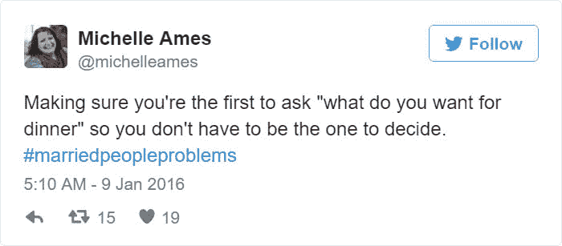

# 反应钩子:使用状态

> 原文：<https://dev.to/coffeecraftcode/react-hooks-usestate-3hfo>

本周 Lambda 的学生正在学习反应！学生们感到困惑的一个领域是**什么是使用状态？**

我已经结婚 12 年了。一个古老的关系问题是决定吃什么。😂
[T3】](https://res.cloudinary.com/practicaldev/image/fetch/s--5xCpFNTE--/c_limit%2Cf_auto%2Cfl_progressive%2Cq_auto%2Cw_880/https://thepracticaldev.s3.amazonaws.com/i/ahlhn7mpqpzhv733cp4u.jpg)

所以我创建了一个简单的食物应用程序来帮助我和我丈夫决定我们晚餐应该吃什么。为了帮助大家理解使用状态🎉

我将在整篇文章中引用这个代码沙箱。

[https://codesandbox.io/embed/ryppu](https://codesandbox.io/embed/ryppu)
[](https://codesandbox.io/s/jsx-demo-ryppu?fontsize=14)

## 什么是 useState？

useState 是一个钩子，让你**给函数组件添加反应状态。**
这里我们声明一个新的状态变量，我称之为“active food”

```
const [activeFood, setActiveFood] = useState(0); 
```

Enter fullscreen mode Exit fullscreen mode

**边注**
上面的 JavaScript 语法叫做“数组析构”。
这意味着我们正在创建两个新变量 activeFood 和 setActiveFood，其中 ActiveFood 被设置为 useState 返回的第一个值，setActiveFood 是第二个值。

相当于这个代码:

```
 var foodStateVariable = useState(0); // Returns a pair
  var activeFood = foodStateVariable[0]; // First item in a pair
  var stActiveFood= foodStateVariable[1]; // Second item in a pair 
```

Enter fullscreen mode Exit fullscreen mode

### 那么 useState 是做什么的呢？

在本例中，它声明了一个“状态变量”，我们将其命名为 activeFood。像任何变量一样，我们可以随意命名。
处于反应状态的变量被保留。当函数退出时，它们不会像通常那样消失。

### 我们传递什么来使用 State 作为参数？

根据[React Docs:](https://reactjs.org/docs/hooks-state.html#tip-what-do-square-brackets-mean)
useState()钩子的唯一参数是初始状态。与类不同，状态不必是一个对象。

这里我们将 0 作为变量的初始状态。

### useState 返回什么？

它返回一对值:当前状态(我们的变量 activeFood)和更新它的函数(setActFood)。这就是为什么我们写 const [activeFood，setActiveFood]= useState(0)；在这个应用程序中，我使用了另一个函数 randomFood，当用户点击按钮时，它会使 setActiveFood 随机化。

让我们回顾一下我所做的。

**第 1 行:**我们从 React 导入了 useState 钩子。它让我们在函数组件中保持局部状态。

**第 36 行:**在 Card 组件内部，我们通过调用 useState 钩子来声明一个新的状态变量。
它返回一对值，我们给它们命名。
我们称我们的变量为 activeFood，因为它是将要显示的食物。
我们通过传递 0 作为唯一的 useState 参数将其初始化为零。
第二个返回的项目本身就是一个函数。它让我们更新 activeFood，所以我们将它命名为 setActiveFood。

**第 48 行:**当用户点击时，我们调用我们的函数 randomFood，它将我们的 setActiveFood 函数随机化。然后 React 将重新呈现 Card 组件，将新的 activeFood 值传递给它。