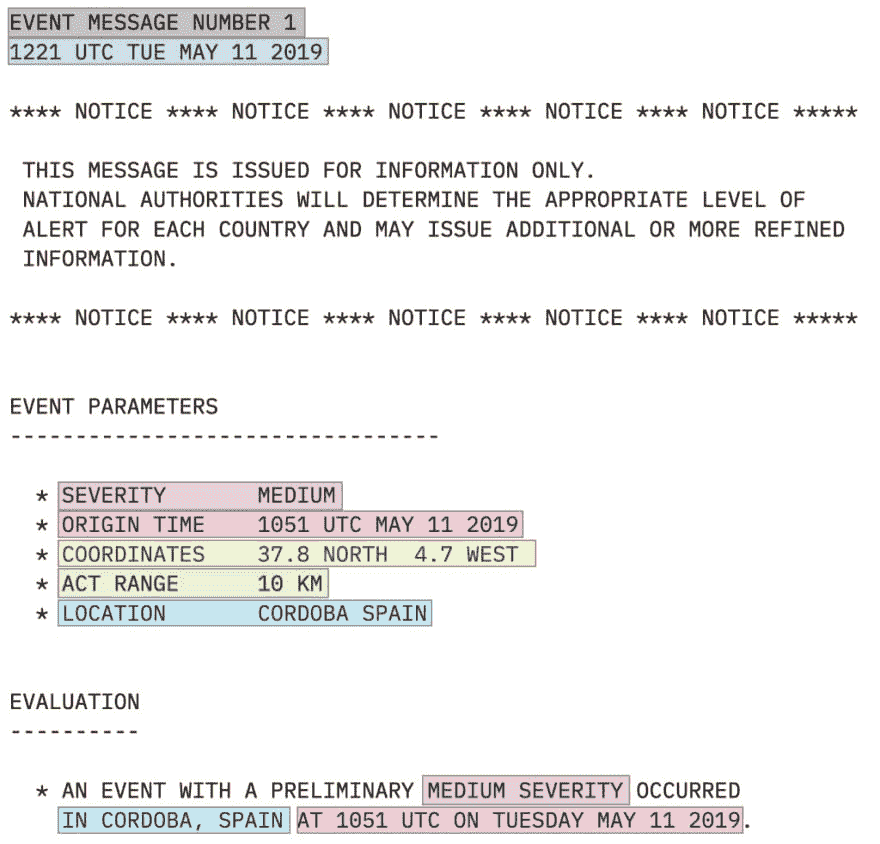

# 使用 Google Cloud AutoML 为更安全的人类进行自然语言处理

> 原文：<https://dev.to/theneonproject/natural-language-processing-with-google-cloud-automl-for-safer-humans-5cne>

在 Neon 项目中，我们喜欢参与需要应用人工智能等数据技术的项目，更具体地说，是机器学习。这些技术帮助我们提取和分析大量数据，以做出更好的决策。

## **我们上一个项目中的自然语言处理**

在我们最近为美国的一个组织所做的项目中，我们被赋予了通过自然语言处理来帮助减少并最终消除灾难预防系统中的错误的任务。

该组织目前使用一个依赖传统解析器的系统，以便从信息文档中提取相关数据。这些文档是由可信组织的人员手工编写的。在这种情况下，解析器没有处理的格式错误的文档对于基础设施的其余部分来说是至关重要的。

由于系统对假阴性(被解析器忽略但实际上相关且关键的文档)的敏感性，组织要求工程师在解析器拒绝的大量文档到来时对其进行检查。

从技术上讲，问题的根源在于数据是异构的，报告不一定符合标准或模板。人类打字错误是可以预料的，因为它们是在关键和紧张的环境中产生的。在这种情况下，传统的解析器有很大的技术局限性。

我们的方法是设计一个自然语言处理模型，它可以在一个巨大的文档集合中识别一组身份。经过几次训练和验证迭代，该模型可以取代当前的解析器，更好地识别相关文档。这降低了假阴性的风险和人为干预校正的需要。

## **将 Google Cloud AutoML 加入我们的技术堆栈**

谷歌去年 4 月推出了一套新的机器学习开发服务，名为 Google Cloud AutoML。我们非常兴奋能在现实世界的用例中使用它们，所以这似乎是一个很好的机会。

AutoML 提供了一个简单的接口，我们可以轻松地上传样本文档来创建数据集。我们有客户共享的文件。我们用从互联网上可靠来源搜集的类似文档完成了这个数据集。

一旦文档被上传，我们必须用标签标记我们希望我们的模型识别的实体。只有在数据集对每个标签都有了最小数量的样本后，我们才能开始模型的训练。一旦完成，我们的模型就能够识别新文档中的实体，这是系统以前不知道的。

一旦我们验证了模型被正确地设计和训练，我们就使用 AutoML API 的 [Node.js 库](https://github.com/googleapis/nodejs-automl)。此外，我们还构建了一个代理 API 服务和一个简单的 web 接口。在该界面中，用户可以上传文档，并根据文档的内容和上下文而不是其格式来查看系统对报告的重要性有多有信心。

多亏了 Google Cloud AutoML，构建模型和用户界面只需要几天而不是几周，这让我们能够让客户满意。我们发现 AutoML 是一个创建机器学习解决方案的令人兴奋的平台。把事情做好非常简单，结果也相当不错。我们以后还会继续用！

### **你有对话项目吗？**

## [**我们一起努力**](mailto:hola@theneonproject.org)

《用谷歌云自动语言处理更安全的人类》这篇文章最初发表在[Neon Project——数字化转型机构](https://theneonproject.org)。