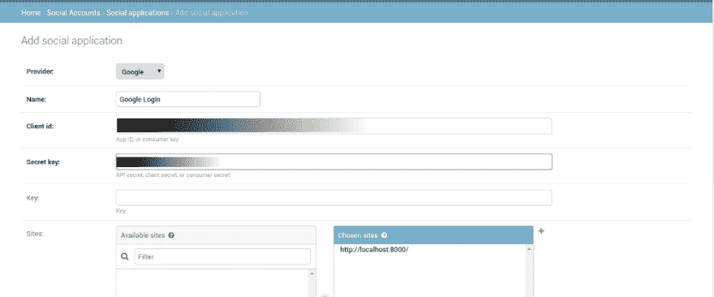

# django alluth:django-alluth 完全指南

> 原文：<https://dev.to/gajesh/the-complete-django-allauth-guide-la3>

用户注册和认证是 web 应用程序最重要的组件之一。本教程讨论 django-allauth 的设置、配置和定制，以及 django web 应用程序的高级调整和社交登录设置。本教程旨在为希望快速入门 django-allauth 并在此过程中轻松进行有用的定制的新用户提供指导。

## 为什么要这样引导？

由于雷蒙德·彭纳斯的努力，`django-allauth`是一个写得非常好的库。然而，对于第一次使用`django-allauth`的新手或高级用户来说，这可能会让人不知所措。虽然它有很好的文档，但由于开发人员的时间和资源限制，关于该库的文章和深入教程并不多。因此，本教程试图通过制作一个全面的指南来解决这个问题，以便快速入门并了解高级定制。

## 基本设置

您可以[下载](https://github.com/gajeshbhat/django-experiments/tree/master/allauthdemo)教程中使用的文件，以便抢先一步。以下步骤将详细指导您完成设置。

1.  如果您还没有 Django 项目，请创建一个。

2.  使用命令`pip install django-allauth`安装`django-allauth`

在`settings.py`中的`INSTALLED_APPS`部分添加、`allauthallauth.account`、`allauth.socialaccount`以及您需要的所有社交登录功能。

您可以在此查看支持的 API[的完整列表。](http://django-allauth.readthedocs.io/en/latest/installation.html)

社会登录功能将在文章的后面描述。如果你想看的话，可以向下滚动到那个副标题。在您配置了已安装的应用程序部分之后，它应该类似于下面给出的代码。

```
INSTALLED_APPS = [
    'django.contrib.admin',
    'allauth',
    'allauth.account',
    'allauth.socialaccount',
    'allauth.socialaccount.providers.google',
    'allauth.socialaccount.providers.facebook',
    'django.contrib.auth',
    'django.contrib.sites',
    'django.contrib.contenttypes',
    'django.contrib.sessions',
    'django.contrib.messages',
    'django.contrib.staticfiles',
] 
```

<svg width="20px" height="20px" viewBox="0 0 24 24" class="highlight-action crayons-icon highlight-action--fullscreen-on"><title>Enter fullscreen mode</title></svg> <svg width="20px" height="20px" viewBox="0 0 24 24" class="highlight-action crayons-icon highlight-action--fullscreen-off"><title>Exit fullscreen mode</title></svg>

在`settings.py`中配置`template`上下文处理器设置，并在项目的`urls.py`中添加 url 模式。

```
TEMPLATES = [
  {
        'BACKEND': 'django.template.backends.django.DjangoTemplates',
        'DIRS': [
            os.path.normpath(os.path.join(BASE_DIR, 'templates')),
        ],
        'APP_DIRS': True,
        'OPTIONS': {
            'context_processors': [
                'django.template.context_processors.debug',
                'django.template.context_processors.request',
                'django.contrib.auth.context_processors.auth',
                'django.contrib.messages.context_processors.messages',
                'django.template.context_processors.request',
            ],
        },
    },
] 
```

<svg width="20px" height="20px" viewBox="0 0 24 24" class="highlight-action crayons-icon highlight-action--fullscreen-on"><title>Enter fullscreen mode</title></svg> <svg width="20px" height="20px" viewBox="0 0 24 24" class="highlight-action crayons-icon highlight-action--fullscreen-off"><title>Exit fullscreen mode</title></svg>

添加以下身份验证后端。

```
AUTHENTICATION_BACKENDS = (
    'django.contrib.auth.backends.ModelBackend',
    'allauth.account.auth_backends.AuthenticationBackend',
) 
```

<svg width="20px" height="20px" viewBox="0 0 24 24" class="highlight-action crayons-icon highlight-action--fullscreen-on"><title>Enter fullscreen mode</title></svg> <svg width="20px" height="20px" viewBox="0 0 24 24" class="highlight-action crayons-icon highlight-action--fullscreen-off"><title>Exit fullscreen mode</title></svg>

从`django-allauth`库复制模板文件或者你也可以使用我的[自定义库](https://github.com/gajeshbhat/django-experiments/tree/master/allauthdemo/templates)(我已经做了一些修改和一些好的结构化)并粘贴到你的项目目录的文件夹`templates`中。

将 allauth urls 添加到主项目目录的`urls.py`中。添加 allauth urls 后，URL 文件应该类似于，

```
from django.contrib import admin
from django.urls import path
from django.conf.urls import url, include

urlpatterns = [
    path('admin/', admin.site.urls),
    url(r'^accounts/', include('allauth.urls')),
] 
```

<svg width="20px" height="20px" viewBox="0 0 24 24" class="highlight-action crayons-icon highlight-action--fullscreen-on"><title>Enter fullscreen mode</title></svg> <svg width="20px" height="20px" viewBox="0 0 24 24" class="highlight-action crayons-icon highlight-action--fullscreen-off"><title>Exit fullscreen mode</title></svg>

您也可以自己添加自定义 CSS，或者添加我在使用 allauth 模板时创建的我的 CSS(有很好的注释和文档，但很简单)。它包括几乎所有页面的样式，甚至包括用于确认和密码重置电子邮件的移动友好电子邮件模板。您可以通过在项目目录中创建一个`static`文件夹并将 CSS 放在文件夹`accounts`中来实现。

运行`python manage.py makemigrations`和`python manage.py migrate`进行所有必要的迁移，运行`python manage.py runserver`启动 django 服务器。

按照 URL 模式显示注册表单。
**例如**:访问`localhost:8000/accounts/login`显示登录页面。

## 基本配置

大多数`django-allauth`特性可以通过将内置适配器和变量放在文件`settings.py`中来配置。尽管[文档](http://django-allauth.readthedocs.io/en/latest/configuration.html)中有大量这样的选项，并给出了很好的解释，但我还是在下面强调了一些重要的选项。

**邮件确认到期**:设置账户激活的天数。

**例如** : `ACCOUNT_EMAIL_CONFIRMATION_EXPIRE_DAYS=7`

**激活所需的电子邮件**:该选项允许您设置是否需要验证电子邮件地址才能注册。设置为 False 将禁用电子邮件要求。

**例如** : `ACCOUNT_EMAIL_REQUIRED = True`

**账户邮件验证**:该选项可以设置用户注册账户后，是否需要进行邮件验证。您可以使用“强制”来阻止用户登录，直到电子邮件得到验证。您可以设置发送电子邮件的选项，但允许用户在没有电子邮件的情况下登录。您也可以将“无”设定为不发送验证电子邮件。(不推荐)

**例如** : `ACCOUNT_EMAIL_VERIFICATION = "mandatory"`

**登录尝试限制**:这是一个重要的功能，可以用来防止对您网站上的用户登录页面进行暴力攻击。可以设置最大登录尝试次数，并且在超时之前，用户无法重新登录。该功能利用了`ACCOUNT_LOGIN_ATTEMPTS_TIMEOUT`设置。

**例如** : `ACCOUNT_LOGIN_ATTEMPTS_LIMIT = 5`

**登录尝试限制超时**:该设置应与设置`ACCOUNT_LOGIN_ATTEMPTS_LIMIT`一起使用。该值设置为从最后一次不成功的登录尝试开始的秒数。请注意，这并不保护管理员登录。

**如** : `ACCOUNT_LOGIN_ATTEMPTS_TIMEOUT` = 86400 # 1 天秒

**登录和注销 URL 重定向**:当用户登录或注销时，您可能希望将用户重定向到特定的 URL 或页面，以下设置可用于设置该 URL。默认情况下，allauth 将登录重定向到`/accounts/profile/` URL，并注销到 localhost:8000 或任何 localhost 主页。

**Eg**:`ACCOUNT_LOGOUT_REDIRECT_URL ='/accounts/login/'`
T5】Eg:`LOGIN_REDIRECT_URL = '/accounts/email/'`

完成后，您的 allauth 设置应该类似于下面的设置。

```
ACCOUNT_EMAIL_CONFIRMATION_EXPIRE_DAYS =1
ACCOUNT_EMAIL_REQUIRED = True
ACCOUNT_EMAIL_VERIFICATION = "mandatory"
ACCOUNT_LOGIN_ATTEMPTS_LIMIT = 5
ACCOUNT_LOGIN_ATTEMPTS_TIMEOUT = 86400 # 1 day in seconds
ACCOUNT_LOGOUT_REDIRECT_URL ='/accounts/login/'
LOGIN_REDIRECT_URL = '/accounts/email/' # default to /accounts/profile 
```

<svg width="20px" height="20px" viewBox="0 0 24 24" class="highlight-action crayons-icon highlight-action--fullscreen-on"><title>Enter fullscreen mode</title></svg> <svg width="20px" height="20px" viewBox="0 0 24 24" class="highlight-action crayons-icon highlight-action--fullscreen-off"><title>Exit fullscreen mode</title></svg>

## 扩展 django-alluth 类和高级定制

本节讨论定制 django-allauth 注册表单，干预注册流程以添加定制流程和您自己的验证。

关于 allauth 最常见的一个问题是向注册表单添加额外的字段或自定义字段。你可以从`allauth.account.forms`扩展`SignupForm`类。你需要做的就是创建一个自定义类，将`SignupForm`传递给自定义类，定义自定义字段并保存它。返回用户对象是至关重要的，因为它将被传递给其他模块进行验证。你还需要在`settings.py`中包含变量`ACCOUNT_FORMS`。

让我们看一个例子。在`forms.py`里。

```
from allauth.account.forms import SignupForm
from django import forms

class CustomSignupForm(SignupForm):
    first_name = forms.CharField(max_length=30, label='First Name')
    last_name = forms.CharField(max_length=30, label='Last Name')
    def signup(self, request, user):
        user.first_name = self.cleaned_data['first_name']
        user.last_name = self.cleaned_data['last_name']
        user.save()
        return user 
```

<svg width="20px" height="20px" viewBox="0 0 24 24" class="highlight-action crayons-icon highlight-action--fullscreen-on"><title>Enter fullscreen mode</title></svg> <svg width="20px" height="20px" viewBox="0 0 24 24" class="highlight-action crayons-icon highlight-action--fullscreen-off"><title>Exit fullscreen mode</title></svg>

在上面的代码片段中，`CustomSignupForm`是一个扩展类，它继承了`SignupForm`类的所有特性，并添加了必要的特性。在这里，名为`first_name`和`last_name`的自定义字段是使用同一个类中的注册模块创建和保存的。

上述代码的`settings.py`中的`ACCOUNT_FORMS`为

```
ACCOUNT_FORMS = {
'signup': 'YourProject.forms.CustomSignupForm',
} 
```

<svg width="20px" height="20px" viewBox="0 0 24 24" class="highlight-action crayons-icon highlight-action--fullscreen-on"><title>Enter fullscreen mode</title></svg> <svg width="20px" height="20px" viewBox="0 0 24 24" class="highlight-action crayons-icon highlight-action--fullscreen-off"><title>Exit fullscreen mode</title></svg>

创建的任何其他自定义表单都可以在`ACCOUNT_FORMS`中扩展。该列表在[文档](http://django-allauth.readthedocs.io/en/latest/forms.html#account-forms)中有说明。

同样，`LoginForm` `UserForm` `AddEmailForm`等都可以引申。但是，请记住，当您扩展这些表单并在`settings.py`中链接它们时。不要忘记将原始表单(例如`SignupForm`)作为参数传递给你的类，有时你可能需要处理自定义验证并返回用户或其他值。请参考[源代码](https://github.com/pennersr/django-allauth/blob/master/allauth/account/forms.py#L362)遵循正确的流程。

### 用户干预和自定义验证

我最近遇到了一些关于堆栈溢出和存储库问题的好问题，这些问题与添加定制验证和干预用户注册流程有关。在研究解决方案和浏览文档时，我发现`DefaultAccountAdapter`非常有用，确实可以用来解决用户在使用`django-allauth`时可能遇到的大多数定制问题。我在下面复制了答案和一些说明。

### 示例 1:允许电子邮件的受限列表

在找到存储和获取受限列表的方法后，您可以使用适配器，并在受限电子邮件试图注册时在注册表中引发验证错误。扩展一个`DefaultAccountAdapter`并覆盖`clean_email`方法。在您的项目目录中创建一个`adapter.py`，并扩展默认的适配器类。您还可以限制电子邮件提供商(如临时电子邮件提供商)使用正则表达式注册。我将不讨论如何识别电子邮件证明者(`user@provider.com`)，因为这超出了本文的范围。但是流程保持不变。

```
from allauth.account.adapter import DefaultAccountAdapter
from django.forms import ValidationError

class RestrictEmailAdapter(DefaultAccountAdapter):
    def clean_email(self,email):
        RestrictedList = ['Your restricted list goes here.']
        if email in RestrictedList
            raise ValidationError('You are restricted from registering. Please contact admin.')
        return email 
```

<svg width="20px" height="20px" viewBox="0 0 24 24" class="highlight-action crayons-icon highlight-action--fullscreen-on"><title>Enter fullscreen mode</title></svg> <svg width="20px" height="20px" viewBox="0 0 24 24" class="highlight-action crayons-icon highlight-action--fullscreen-off"><title>Exit fullscreen mode</title></svg>

最后，将`settings.py`文件中的帐户适配器指向您的扩展类。`ACCOUNT_ADAPTER = 'YourProject.adapter.RestrictEmailAdapter'`

### 例 2:给用户名添加最大长度

由于`ACCOUNT_USERNAME_MAX_LENGTH`在 allauth 库中不存在，所以可以使用`DefaultAccountAdapter`来轻松实现这个特性。扩展`DefaultAccountAdapter`类并重写`clean_username`方法。**您还需要在自定义验证后再次引用`clean_username`来完成其他内置验证**。

**注**:上段最后一句话是配合`DefaultAccountAdapter`工作的关键。您永远不应该忘记引用模块的原始模块名来完成其他验证。

```
from allauth.account.adapter import DefaultAccountAdapter
from django.forms import ValidationError

class UsernameMaxAdapter(DefaultAccountAdapter):
    def clean_username(self, username):
        if len(username) > 'Your Max Size':
            raise ValidationError('Please enter a username value less than the current one')
        return DefaultAccountAdapter.clean_username(self,username) # For other default validations. 
```

<svg width="20px" height="20px" viewBox="0 0 24 24" class="highlight-action crayons-icon highlight-action--fullscreen-on"><title>Enter fullscreen mode</title></svg> <svg width="20px" height="20px" viewBox="0 0 24 24" class="highlight-action crayons-icon highlight-action--fullscreen-off"><title>Exit fullscreen mode</title></svg>

最后，指向你的`settings.py`
中的子类`ACCOUNT_ADAPTER = 'YourProject.adapter.UsernameMaxAdapter'`

可以参考源代码中的`adapters.py` [文件](https://github.com/pennersr/django-allauth/blob/master/allauth/account/adapter.py)扩展其他模块，增加一个处理器，改变其流程。`populate_username`、`clean_password`(可以自定义限制常用密码)等模块可以有自定义的流程和流程，无需重写。

`DefaultAccountAdapter`如果在适当的情况下使用，可以成为干预 allauth 默认流程的有力工具。allauth 有各种各样的内置设置，它们都可以在[这里](http://django-allauth.readthedocs.io/en/latest/configuration.html)看到。您也可以从参考资料中的链接下载完整的源代码。

## 使用 django-allauth 设置社交登录

### 添加必要的应用程序:

如 allauth 文档和上一节所述，我们需要添加与我们将要使用的登录相关的必要应用程序。本节演示了使用`allauth.socialaccount.providers.google`的 Google API 配置和使用`allauth.socialaccount.providers.facebook`的脸书 API 配置。你需要把它们添加到`INSTALLED_APPS`。

这样做之后，您安装的应用程序应该看起来像这样，

```
INSTALLED_APPS = [
    'django.contrib.admin',
    'allauth',
    'allauth.account',
    'allauth.socialaccount',
    'allauth.socialaccount.providers.google',
    'allauth.socialaccount.providers.facebook',
    'django.contrib.auth',
    'django.contrib.sites',
    'django.contrib.contenttypes',
    'django.contrib.sessions',
    'django.contrib.messages',
    'django.contrib.staticfiles',
] 
```

<svg width="20px" height="20px" viewBox="0 0 24 24" class="highlight-action crayons-icon highlight-action--fullscreen-on"><title>Enter fullscreen mode</title></svg> <svg width="20px" height="20px" viewBox="0 0 24 24" class="highlight-action crayons-icon highlight-action--fullscreen-off"><title>Exit fullscreen mode</title></svg>

设置`SOCIALACCOUNT_QUERY_EMAIL=ACCOUNT_EMAIL_REQUIRED`、`SOCIALACCOUNT_EMAIL_REQUIRED=ACCOUNT_EMAIL_REQUIRED`和`SOCIALACCOUNT_STORE_TOKENS=False`。如果需要，您可以在此阅读更多关于这些设置的信息。我们还将在`SOCIALACCOUNT_PROVIDERS`下为脸书和谷歌配置一些设置。有关设置的详细信息，请参见文档[此处](http://django-allauth.readthedocs.io/en/latest/providers.html#)。

您的`SOCIALACCOUNT_PROVIDERS`设置应该类似于，

```
SOCIALACCOUNT_PROVIDERS = {
    'facebook': {
        'METHOD': 'oauth2',
        'SCOPE': ['email', 'public_profile', 'user_friends'],
        'AUTH_PARAMS': {'auth_type': 'reauthenticate'},
        'INIT_PARAMS': {'cookie': True},
        'FIELDS': [
            'id',
            'email',
            'name',
            'first_name',
            'last_name',
            'verified',
            'locale',
            'timezone',
            'link',
            'gender',
            'updated_time',
        ],
        'EXCHANGE_TOKEN': True,
        'LOCALE_FUNC': 'path.to.callable',
        'VERIFIED_EMAIL': False,
        'VERSION': 'v2.12',
    },
     'google': {
        'SCOPE': [
            'profile',
            'email',
        ],
        'AUTH_PARAMS': {
            'access_type': 'online',
        }
    }
} 
```

<svg width="20px" height="20px" viewBox="0 0 24 24" class="highlight-action crayons-icon highlight-action--fullscreen-on"><title>Enter fullscreen mode</title></svg> <svg width="20px" height="20px" viewBox="0 0 24 24" class="highlight-action crayons-icon highlight-action--fullscreen-off"><title>Exit fullscreen mode</title></svg>

运行`python manage.py make makemigrations`和`python manage.py migrate`来创建数据库条目。我们现在可以创建脸书和谷歌 API 密钥。我在下面简单描述了这个过程。我建议您遵循他们各自官方网站上的说明，因为他们的服务和政策可能会发生变化。

### API 创建和配置:

按照下面的步骤，在互联网上寻找额外的推荐人或教程。简单描述如下。

#### 脸书

1.  通过访问 developers.facebook.com 并填写所有细节来创建一个测试应用程序。

2.  复制应用 Id 和密钥。

[](https://res.cloudinary.com/practicaldev/image/fetch/s--eTmB2p0l--/c_limit%2Cf_auto%2Cfl_progressive%2Cq_auto%2Cw_880/https://thepracticaldev.s3.amazonaws.com/i/rk851jwy9steodslj43m.png)
[](https://res.cloudinary.com/practicaldev/image/fetch/s--1gRyuINF--/c_limit%2Cf_auto%2Cfl_progressive%2Cq_auto%2Cw_880/https://thepracticaldev.s3.amazonaws.com/i/jj8t48tksrj2k7ze503s.png)
[](https://res.cloudinary.com/practicaldev/image/fetch/s--26Ch1DS4--/c_limit%2Cf_auto%2Cfl_progressive%2Cq_auto%2Cw_880/https://thepracticaldev.s3.amazonaws.com/i/gw5hbmh0wb8r0hxw0o2g.png)

#### 谷歌

1.  创建登录 API 并复制秘密凭证。
2.  在创建 API 时，不要忘记放置正确的回调 URL。将`http://localhost:8000/accounts/google/login/callback/`放在回调 URL 中。

[](https://res.cloudinary.com/practicaldev/image/fetch/s--4BO7TsJG--/c_limit%2Cf_auto%2Cfl_progressive%2Cq_auto%2Cw_880/https://thepracticaldev.s3.amazonaws.com/i/8j79nfivbkdvfbjgr9id.png)

##### 管理员配置

1.  通过运行`python manage.py createsuperuser`创建一个超级用户(admin)并填写详细信息。
2.  转到`http://localhost:8000/admin`并登录管理控制台。
3.  转到站点，将域名和显示名称中的`example.com`都改为`http://localhost:8000`。
4.  现在转到社交应用程序，添加社交应用程序并填写详细信息。
5.  对脸书和谷歌重复同样的步骤。

[](https://res.cloudinary.com/practicaldev/image/fetch/s--EBM1x0j6--/c_limit%2Cf_auto%2Cfl_progressive%2Cq_auto%2Cw_880/https://thepracticaldev.s3.amazonaws.com/i/3n9ssk4fsyaw30n9zf5p.png)

你已经准备好了。你现在可以继续使用脸书和谷歌登录。

这是 dev.to 上第一个最全面的帖子之一。请随意发送拥抱或错误。

## 参考文献及进一步阅读:

1.  [django-allauth GitHub 页面](https://github.com/pennersr/django-allauth)
2.  [django-allauth 官方文件](http://django-allauth.readthedocs.io/en/latest/)
3.  [我的自定义模板和 CSS](https://github.com/gajeshbhat/django-experiments/tree/master/allauthdemo)
4.  [在例 1 上堆栈溢出线程](https://stackoverflow.com/questions/50924482/django-allauth-restrict-registration-to-list-of-emails/50934047#50934047)
5.  [在例 2 上堆栈溢出线程](https://stackoverflow.com/questions/50548685/how-to-add-max-length-to-allauth-username/50941366#50941366)
6.  [源代码中的 Adapters.py 文件](https://github.com/pennersr/django-allauth/blob/master/allauth/account/adapter.py)
7.  [脸书 API](http://django-allauth.readthedocs.io/en/latest/providers.html#facebook) 和[谷歌 API](http://django-allauth.readthedocs.io/en/latest/providers.html#google) 全授权文档。
8.  [指南的完整源代码](https://github.com/gajeshbhat/django-experiments)