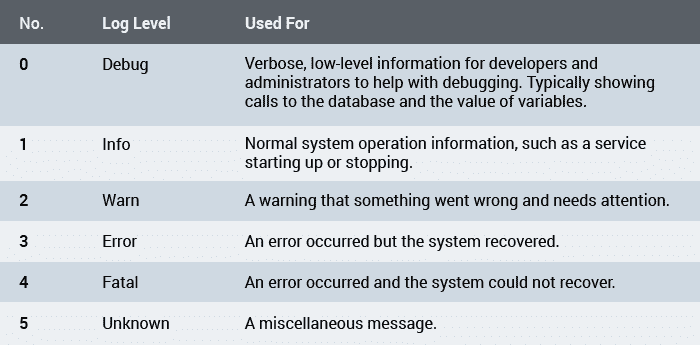
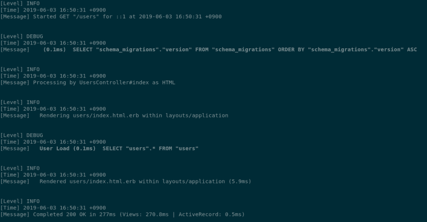

# 用 Rails 记录器调试

> 原文：<https://dev.to/scoutapm/debugging-with-rails-logger-1739>

*这篇文章最初出现在[童子军博客](https://scoutapm.com/blog/debugging-with-rails-logger)上。*

如果您是 Rails 开发人员，那么您可能至少在某个场合使用过 Rails Logger。或者你可能已经使用过它而没有意识到，比如当你运行“rails server”时，它会将信息打印到终端窗口。Rails Logger 为我们提供了一种调试应用程序的强大方法，并让我们在出现错误时能够深入理解错误。但是您使用了所有的 Rails Logger 特性吗？很有可能你不是！因此，让我们更深入地了解一下 Rails 中的日志记录系统，看看它的一些未知特性，并为我们将来的日志创建建立一些最佳实践。

## 什么是 Rails Logger？

Rails Logger 是 **ActiveSupport** 库的一部分，后者是一个实用程序库，是核心 Ruby 语言的一组扩展。它建立在 Ruby 的**记录器**类之上，为我们提供了一个简单的机制来记录应用程序生命周期中发生的事件。日志记录使我们能够在运行时记录关于应用程序的信息，并持久地存储它以供以后分析和调试。

Rails 被配置为为三种默认环境中的每一种创建单独的日志文件:开发、测试和生产。默认情况下，它将这些日志文件放在项目的 **log/** 目录中。所以如果你打开那个文件夹，你会看到一个**开发.日志**和**测试.日志**文件，也许还有一个**生产.日志**文件，这取决于你的项目是如何设置的。

使用 Rails Logger 非常简单，只需将如下所示的一行代码添加到您的控制器、模型或邮件程序中:

```
logger.debug "User created: #{@user.inspect}" 
```

<svg width="20px" height="20px" viewBox="0 0 24 24" class="highlight-action crayons-icon highlight-action--fullscreen-on"><title>Enter fullscreen mode</title></svg> <svg width="20px" height="20px" viewBox="0 0 24 24" class="highlight-action crayons-icon highlight-action--fullscreen-off"><title>Exit fullscreen mode</title></svg>

这里我们使用全局可访问的**记录器**的 **debug** 方法将一个包含对象细节的消息写入日志。在我们的开发环境中，这会将我们的日志消息打印到终端和 **development.log** 文件中:

[](https://res.cloudinary.com/practicaldev/image/fetch/s--46XszfaT--/c_limit%2Cf_auto%2Cfl_progressive%2Cq_auto%2Cw_880/https://thepracticaldev.s3.amazonaws.com/i/09utczqm8jvz2elgyho0.png)

我们指定的调试级别只是我们可以使用的六个可能级别中的一个，每个级别都有一个相应的调用方法。通过为我们的日志设置一个级别系统，它允许我们将日志分组在一起，然后有选择地选择报告哪些级别，哪些级别不报告。例如，我们可能不太注意生产环境中的低级调试信息，相反，我们希望听到正在发生的错误和警告。让我们来看看每个级别，看看它们可以用于什么:

[](https://res.cloudinary.com/practicaldev/image/fetch/s--ycFhb-EG--/c_limit%2Cf_auto%2Cfl_progressive%2Cq_auto%2Cw_880/https://thepracticaldev.s3.amazonaws.com/i/b0zu9nghnf12j8dmlrbl.png)

## 定制我们的日志

也许这就是大多数 Rails 开发人员对 Rails Logger 的理解；只是记录开发过程中偶尔出现的调试消息。但是我们可以用这个强大的工具做更多的事情。让我们看看如何定制日志记录系统，使其与默认设置不同。

我们可以在主 **application.rb** 文件中集体定制我们的记录器设置，或者在每个 **config/development.rb** 、 **config/test.rb** 和 **config/production.rb** 文件中为每个环境单独定制。在这里，我们可以更改报告的日志级别，为日志定义不同的位置，甚至以我们自己定义的不同格式写入日志。

### 改变日志级别

如果我们想防止特定于开发人员的日志消息填满我们生产环境中的日志，我们可以将日志级别设置为 **:error** 。这将只显示错误级别以下的日志消息。换句话说，只会报告错误和致命消息。

```
# config/environments/production.rb
config.log_level = :error 
```

<svg width="20px" height="20px" viewBox="0 0 24 24" class="highlight-action crayons-icon highlight-action--fullscreen-on"><title>Enter fullscreen mode</title></svg> <svg width="20px" height="20px" viewBox="0 0 24 24" class="highlight-action crayons-icon highlight-action--fullscreen-off"><title>Exit fullscreen mode</title></svg>

在这些环境初始化文件之外，你也可以在代码的任何地方动态地临时改变日志级别，就像这样:

```
# From anywhere, you can specify a value from 0 to 5
Rails.logger.level = 3 
```

<svg width="20px" height="20px" viewBox="0 0 24 24" class="highlight-action crayons-icon highlight-action--fullscreen-on"><title>Enter fullscreen mode</title></svg> <svg width="20px" height="20px" viewBox="0 0 24 24" class="highlight-action crayons-icon highlight-action--fullscreen-off"><title>Exit fullscreen mode</title></svg>

如果您想打开某个任务的详细日志记录，然后快速关闭它，这可能会很有用。

### 改变日志位置

要将我们的日志文件保存到除了 **log/** 之外的地方，我们可以定义一个新的日志记录器并指定我们自己的路径，如下所示:

```
# config/environments/development.rb
config.logger = Logger.new("/path/to/file.log") 
```

<svg width="20px" height="20px" viewBox="0 0 24 24" class="highlight-action crayons-icon highlight-action--fullscreen-on"><title>Enter fullscreen mode</title></svg> <svg width="20px" height="20px" viewBox="0 0 24 24" class="highlight-action crayons-icon highlight-action--fullscreen-off"><title>Exit fullscreen mode</title></svg>

### 改变日志格式

为了更加灵活，我们可以更进一步，用我们自己的自定义类覆盖 Rails 的格式化程序类。这允许我们完全定义我们的日志是什么样子，如果我们愿意，我们也可以添加我们自己的复杂逻辑来确定记录什么以及如何记录。

```
class CustomFormatter < ActiveSupport::Logger::SimpleFormatter                  
  def call(severity, time, progname, msg)                                       
    "[Level] #{severity}  \n" +                                                  
    "[Time] #{time}  \n" +                                                       
    "[Message] #{msg}  \n\n\n"                                                   
  end                                                                           
end 
```

<svg width="20px" height="20px" viewBox="0 0 24 24" class="highlight-action crayons-icon highlight-action--fullscreen-on"><title>Enter fullscreen mode</title></svg> <svg width="20px" height="20px" viewBox="0 0 24 24" class="highlight-action crayons-icon highlight-action--fullscreen-off"><title>Exit fullscreen mode</title></svg>

将该文件放入我们的 **lib/** 文件夹后，我们可以告诉 Rails Logger 这样使用:

```
# config/environments/development.rb
config.log_formatter = CustomFormatter.new 
```

<svg width="20px" height="20px" viewBox="0 0 24 24" class="highlight-action crayons-icon highlight-action--fullscreen-on"><title>Enter fullscreen mode</title></svg> <svg width="20px" height="20px" viewBox="0 0 24 24" class="highlight-action crayons-icon highlight-action--fullscreen-off"><title>Exit fullscreen mode</title></svg>

正如您所看到的，即使是这个小而简单的更改也使日志更具可读性:

[](https://res.cloudinary.com/practicaldev/image/fetch/s--ElIoAhSQ--/c_limit%2Cf_auto%2Cfl_progressive%2Cq_auto%2Cw_880/https://thepracticaldev.s3.amazonaws.com/i/n80ir4fllswd79rey88x.png)

编写自己的格式化类的另一个很好的用例可能是，如果您希望以 JSON 格式输出日志，以便可以将日志与其他系统集成。

### 标记日志

Rails Logger 的另一个强大特性是标记日志条目的能力。例如，如果您的应用程序跨多个子域运行，这将非常有用。在这种情况下，通过添加一个子域标记，您将能够清楚地为您正在使用的不同子域分离日志条目。另一个例子是，您可以添加一个请求 ID 标记，这在调试时非常有用，这样您就可以隔离给定请求的所有日志条目。

要启用标记日志，您需要创建一个类型为 **TaggedLogging** 的新日志记录器，并在您的配置文件
中将它分配给 **config.logger**

```
# config/environments/development.rb
config.logger = ActiveSupport::TaggedLogging.new(Logger.new(STDOUT)) 
```

<svg width="20px" height="20px" viewBox="0 0 24 24" class="highlight-action crayons-icon highlight-action--fullscreen-on"><title>Enter fullscreen mode</title></svg> <svg width="20px" height="20px" viewBox="0 0 24 24" class="highlight-action crayons-icon highlight-action--fullscreen-off"><title>Exit fullscreen mode</title></svg>

一旦你完成了这些，你就可以在调用**标记的**方法:
之后将你的日志放入代码块中

```
# This will log: [my-subdomain] User created: ...
logger.tagged("my-subdomain") { logger.debug "User created: #{@user.inspect} }" 
```

<svg width="20px" height="20px" viewBox="0 0 24 24" class="highlight-action crayons-icon highlight-action--fullscreen-on"><title>Enter fullscreen mode</title></svg> <svg width="20px" height="20px" viewBox="0 0 24 24" class="highlight-action crayons-icon highlight-action--fullscreen-off"><title>Exit fullscreen mode</title></svg>

## 接下来是什么？

Rails Logger 是一个非常灵活的工具，应该是每个 Rails 开发人员开发过程的一部分，正如我们所看到的，通过做一些小的调整，我们可以在调试过程中变得更加高效。希望我们已经给了你一些好主意，告诉你如何开始这样做。