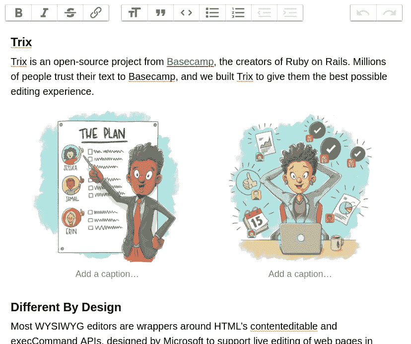

# Rails 6 有什么新功能？

> 原文：<https://dev.to/scoutapm/what-s-new-in-rails-6-5b5f>

*这篇文章最初出现在[童子军博客](https://scoutapm.com/blog/whats-new-in-rails-6)上。*

随着 Rails 6 的正式发布指日可待，我们总结了所有主要的新特性。由于 Basecamp 和 GitHub 项目的一些重要功能，这是一个令人兴奋的版本。在许多小的更新、有用的调整和漏洞修复中，Rails 6 将提供两个全新的框架: **ActionText** 和 **ActionMailbox** ，以及两个大的默认可扩展功能:**并行测试**和**多数据库支持**。因此，将您的 Gemfile 设置为获取 Rails 6.0.0.rc1，让我们开始吧！

## 多数据库支持

Rails 现在**支持多个数据库之间的切换**。这是对代码库的一个非常小的改变，但是许多开发人员会发现这是一个非常有用的特性。贡献来自 GitHub 开发人员的上游，并提供了一个用于在多个数据库之间轻松切换的 API。

这个新特性的可能用例是在查询速度慢的地方使用数据库的只读版本。另一个例子是，如果您需要根据哪个控制器正在执行来写入不同的数据库。

首先，您需要将额外的数据库添加到您的 **database.yml** 配置文件中，如下所示:

```
development:
  main: <<: *defaults
    database: main_db
  slow_queries: <<: *defaults
    database: readonly_main_db 
```

<svg width="20px" height="20px" viewBox="0 0 24 24" class="highlight-action crayons-icon highlight-action--fullscreen-on"><title>Enter fullscreen mode</title></svg> <svg width="20px" height="20px" viewBox="0 0 24 24" class="highlight-action crayons-icon highlight-action--fullscreen-off"><title>Exit fullscreen mode</title></svg>

然后，您可以在模型级别指定您想要使用的数据库:

```
class User < ApplicationRecord
  connects_to database: { writing: main, reading: slow_queries }
end 
```

<svg width="20px" height="20px" viewBox="0 0 24 24" class="highlight-action crayons-icon highlight-action--fullscreen-on"><title>Enter fullscreen mode</title></svg> <svg width="20px" height="20px" viewBox="0 0 24 24" class="highlight-action crayons-icon highlight-action--fullscreen-off"><title>Exit fullscreen mode</title></svg>

然后只需一行代码就可以在一个块内的数据库之间临时切换！

```
User.connected_to(role: :reading) do
  # Do something that you know will take a long time
end 
```

<svg width="20px" height="20px" viewBox="0 0 24 24" class="highlight-action crayons-icon highlight-action--fullscreen-on"><title>Enter fullscreen mode</title></svg> <svg width="20px" height="20px" viewBox="0 0 24 24" class="highlight-action crayons-icon highlight-action--fullscreen-off"><title>Exit fullscreen mode</title></svg>

## [行动文本](#actiontext)

**ActionText** 是从 Basecamp 中提取出来的即将进入 Rails 6 的两个全新框架之一(另一个是 ActionMailbox)。它为你的 rails 应用程序带来了**富文本支持**，这一切都是通过非常时尚的 **Trix** 编辑器实现的。您所要做的就是向您的模型(has_rich_text :column_name)添加一个行代码，然后您就可以在视图中使用“rich_text_area”字段了。

[](https://res.cloudinary.com/practicaldev/image/fetch/s--BemkHh6E--/c_limit%2Cf_auto%2Cfl_progressive%2Cq_auto%2Cw_880/https://thepracticaldev.s3.amazonaws.com/i/eqxkihdvwhc1gnzy9usb.png)

Trix 编辑器将捕获富文本信息(如粗体文本、标题、图像等)。)并将这些数据保存到您想要的存储解决方案中，同时将相关的元数据保存到一些新的表中(注意，这意味着 ActionText 要求您使用 ActiveStorage)。

## 动作邮箱

**ActionMailbox** 是一个令人兴奋的新框架，它允许你将**收到的邮件**路由到**类似控制器的邮箱**进行处理。这是从 Basecamp 中提取的另一个特性，准备在 Rails 6 中使用。收到的邮件存储在一个名为 InboundEmail 的数据库表中，ActiveJob 用于将自动化联系在一起。

这方面有很多令人兴奋的可能用例，我相信当你开始考虑它时，许多想法会突然出现在你的脑海中。例如，当用户回复您的应用程序发送的通知他们评论的自动电子邮件时。用户可以回复那封邮件，你的应用程序可以处理那封邮件，并在你的应用程序中自动把它变成回复评论。正如您所看到的，这是一个非常强大和灵活的功能，我们迫不及待地想要得到它。

## 支持并行测试

Rails 6 的另一个默认可扩展的特性是**支持并行测试**。通过在多个线程上运行测试套件(每个线程都有自己的测试数据库版本)，这一新特性将使**更快的测试套件运行时间**和效率。也许不是最令人兴奋的特点，但肯定是一个大项目将非常感谢。

您可以在环境变量中指定要使用的线程数量。这对于使用您的 CI 系统很有用，该系统通常与您的本地机器有不同的设置。

```
PARALLEL_WORKERS=3 rails test 
```

<svg width="20px" height="20px" viewBox="0 0 24 24" class="highlight-action crayons-icon highlight-action--fullscreen-on"><title>Enter fullscreen mode</title></svg> <svg width="20px" height="20px" viewBox="0 0 24 24" class="highlight-action crayons-icon highlight-action--fullscreen-off"><title>Exit fullscreen mode</title></svg>

或者，为了进行通用的更改，您可以将这行代码添加到父测试类:

```
class ActiveSupport::TestCase
  parallelize(workers: 3)
end 
```

<svg width="20px" height="20px" viewBox="0 0 24 24" class="highlight-action crayons-icon highlight-action--fullscreen-on"><title>Enter fullscreen mode</title></svg> <svg width="20px" height="20px" viewBox="0 0 24 24" class="highlight-action crayons-icon highlight-action--fullscreen-off"><title>Exit fullscreen mode</title></svg>

## Webpack

很高兴看到 Rails 与时俱进，永远不要害怕放弃已经变得不相关的想法。如今，许多项目都在使用前端 Javascript 框架，而不是默认的 Rails 视图层。这导致现有的 Rails 资产管道不再适合许多人。

[](https://res.cloudinary.com/practicaldev/image/fetch/s--gWSGCcIy--/c_limit%2Cf_auto%2Cfl_progressive%2Cq_auto%2Cw_880/https://thepracticaldev.s3.amazonaws.com/i/pjq0ppmjpb5ib4fgowbb.png)

而另一方面，Webpack 在最近几年已经成为前端社区的行业标准，因此朝着这个架构前进是有意义的。Webpacker gem 已经存在了一段时间，但现在在 Rails 6 中，它将成为 Rails 中 Javascript 资产绑定的默认解决方案。

## 时间工厂

最后但并非最不重要的一点是，这里有一个值得关注的有趣工具:Zeitwerk，一个新的改进的用于 Rails 的线程安全代码加载器。这取代了自 2004 年以来就存在的代码加载器，它做了很好的工作，但是有一些主要的限制。

## 接下来是什么？

如你所见，Rails 6 的发布有很多令人兴奋的地方。除了这些主要的新特性，还有许多次要的特性和修复，所以在升级之前一定要通读文档。那么，为什么不在今天的测试项目中尝试一下新的 Rails 6.0.0.rc1 gem 呢？