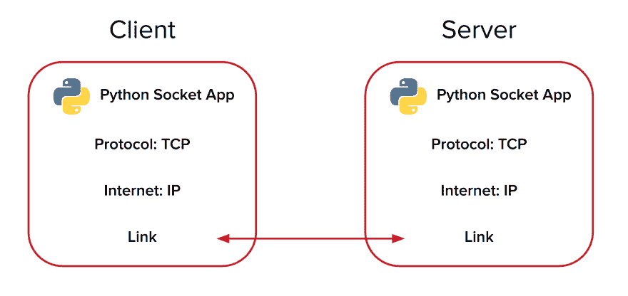

# Python 中的套接字编程:客户端、服务器端和对等端示例

> 原文：<https://dev.to/pubnub/socket-programming-in-python-client-server-and-peer-examples-5bkl>

套接字(又名套接字编程)使程序能够在任何给定的时刻双向发送和接收数据。本教程介绍了如何使用 [Python](https://www.python.org/) 中的套接字编程，从**的设备到设备**、**的客户端到服务器**以及**的客户端到服务器**的**发送数据**。

[https://www.youtube.com/embed/6sHGBXwkFQU](https://www.youtube.com/embed/6sHGBXwkFQU)

## 为什么使用套接字发送数据？

需要实时操作的互联网连接应用程序从它们的**网络代码**中的**套接字**的实现中受益匪浅。使用套接字编程的应用程序示例如下:

*   显示[实时通知](https://www.pubnub.com/solutions/realtime-updates/?utm_source=Syndication&utm_medium=DevTo&utm_campaign=SYN-CY19-Q3-DevTo-Jul-16)的网页(脸书、Twitch、易贝)
*   [多人在线游戏](https://www.pubnub.com/solutions/multiplayer-games/?utm_source=Syndication&utm_medium=DevTo&utm_campaign=SYN-CY19-Q3-DevTo-Jul-16)(英雄联盟、WoW、反恐精英)
*   [聊天应用](https://www.pubnub.com/solutions/chat/?utm_source=Syndication&utm_medium=DevTo&utm_campaign=SYN-CY19-Q3-DevTo-Jul-16) (WhatsApp、微信、Slack)
*   [实时数据仪表板](https://www.pubnub.com/solutions/realtime-dashboards/?utm_source=Syndication&utm_medium=DevTo&utm_campaign=SYN-CY19-Q3-DevTo-Jul-16)(比特币基地罗宾汉)
*   [物联网设备](https://www.pubnub.com/solutions/iot/?utm_source=Syndication&utm_medium=DevTo&utm_campaign=SYN-CY19-Q3-DevTo-Jul-16)(巢、八月锁)

Python 不同于 JavaScript，它是一种同步执行[和](https://hackernoon.com/javascript-promises-and-why-async-await-wins-the-battle-4fc9d15d509f)的语言。这就是为什么 **asyncio** 被开发出来——让 Python 更健壮，特别是对于套接字编程的本质。

使用流式套接字，可以随时发送或接收数据。如果您的 Python 程序正在执行一些代码，其他的**线程**可以处理新的套接字数据。像 [asyncio](https://docs.python.org/3/library/asyncio.html) 这样的库实现了多线程，所以你的 Python 程序可以异步工作。

## Python 套接字编程教程

Python 本身提供了一个 [socket 类](https://docs.python.org/3/library/socket.html)，因此开发人员可以在他们的源代码中轻松实现 **socket 对象**。要在程序中使用套接字对象，首先要导入套接字库。不需要安装一个包管理器，它是 Python 自带的。

```
import socket 
```

现在我们可以在代码中创建套接字对象。

```
sock = socket.socket(socket.AF_INET, socket.SOCK_STREAM) 
```

这段代码创建了一个 socket 对象，我们将它存储在“sock”变量中。为构造函数分别提供了一个族和类型参数。family 参数设置为默认值，即**地址格式互联网**。

type 参数设置为 **Socket Stream** ，这也是默认设置，通过**TCP**[T5】1](http://man7.org/linux/man-pages/man2/socket.2.html)启用“有序、可靠、双向、基于连接的字节流”。

一旦我们有了一个初始化的 socket 对象，我们可以用一些方法打开一个**连接**，**发送**数据，**接收**数据，最后**关闭**连接。

```
## Connect to an IP with Port, could be a URL sock.connect(('0.0.0.0', 8080))

## Send some data, this method can be called multiple times sock.send("Twenty-five bytes to send")

## Receive up to 4096 bytes from a peer sock.recv(4096)

## Close the socket connection, no more data transmission sock.close() 
```

## python socketserver

现在我们知道了一些传输字节的方法，让我们用 Python 创建一个客户机和服务器程序。

```
import socket

serv = socket.socket(socket.AF_INET, socket.SOCK_STREAM)

serv.bind(('0.0.0.0', 8080))
serv.listen(5)

while True:
    conn, addr = serv.accept()
    from_client = ''

    while True:
        data = conn.recv(4096)
        if not data: break
        from_client += data
        print from_client

        conn.send("I am SERVER\n")

    conn.close()
    print 'client disconnected' 
```

这段代码创建了一个 socket 对象，并将其绑定到 **localhost 的端口 8080** 作为 **socket 服务器**。当客户端通过套接字连接到该地址时，服务器监听数据，并将其存储在“data”变量中。

接下来，程序使用“print”记录客户机数据，然后向客户机发送一个字符串:**我是服务器**。

[](https://res.cloudinary.com/practicaldev/image/fetch/s--TlZoTypo--/c_limit%2Cf_auto%2Cfl_progressive%2Cq_auto%2Cw_880/https://www.pubnub.com/wp-content/uploads/2019/01/python-socket-connection-diagram.png)

让我们看一下将与这个服务器程序交互的客户机代码。

## Python 套接字客户端

下面是**客户端**套接字演示代码。

```
import socket

client = socket.socket(socket.AF_INET, socket.SOCK_STREAM)
client.connect(('0.0.0.0', 8080))

client.send("I am CLIENT\n")

from_server = client.recv(4096)

client.close()

print from_server 
```

这个客户端打开了一个与服务器的套接字连接，但是只有在服务器程序当前正在运行时才会打开**。要自己测试这个，你需要同时使用 **2 个终端窗口**。**

接下来，客户端向服务器发送一些数据:**我是客户端**

然后，客户端从服务器接收一些预期的数据。

搞定了。您现在可以开始使用一些基本的 Python 网络编程在客户端和服务器之间传输数据。

## 你如何在客户端之间发送数据？

通过互联网在两个或更多客户端设备之间发送数据**是很棘手的。由于网络安全实施的保护措施，并非所有连接到万维网的设备都具有可公开访问的互联网协议(IP)地址。**

这意味着我们实现的 Python 代码对于在我们的实时应用中发送对等数据来说不是 100%可靠的。我们在传输**点对点数据**时，如何达到**可靠性**和**速度**？

这可以通过在中间使用一个服务器来完成。使用互联网的客户端设备可以连接到具有公共 IP 地址(或网站域)的服务器。然后，中间的这个代理可以传递路由到一个或多个客户端的消息。

[](https://res.cloudinary.com/practicaldev/image/fetch/s--TTvEdh5e--/c_limit%2Cf_auto%2Cfl_progressive%2Cq_auto%2Cw_880/https://www.pubnub.com/wp-content/uploads/2019/01/pubsub-diagram.png)

PubNub 用 [**发布/订阅 API** 做得最好。](https://www.pubnub.com/products/realtime-messaging/?utm_source=Syndication&utm_medium=DevTo&utm_campaign=SYN-CY19-Q3-DevTo-Jul-16)它快速、可靠、安全，并且易于在**任何客户端设备**上实现。无论你有一个 Python 服务器，一个 JavaScript 网站，还是介于两者之间的任何东西，你都可以使用 PubNub 在 250 毫秒之内将数据发送给**中的任何人。**

通过**一对多**、**一对一**或**多对多**，PubNub **自动扩展**以支持任何应用负载。使用该 API 可以在所有拥有发布/订阅 API 密钥的客户端之间打开一个即时的、始终在线的连接。这实现了与套接字连接相同的目标。

## 使用 SSL 连接的 PubNub 和 Python

这里有一个使用 PubNub 在单通道上发送的**点对点数据**的例子，使用 **SSL** 。您可以将此想象成通过 TCP 套接字发送数据。当你注册了一个免费的 PubNub 账户，你就可以使用几乎**无限的频道**实时发送信息。在你尝试代码之前，请确保[创建一个免费的 PubNub 账户。](https://dashboard.pubnub.com/signup/?utm_source=Syndication&utm_medium=DevTo&utm_campaign=SYN-CY19-Q3-DevTo-Jul-16)

### 客户端 1

```
from pubnub.callbacks import SubscribeCallback
from pubnub.enums import PNStatusCategory
from pubnub.pnconfiguration import PNConfiguration
from pubnub.pubnub import PubNub
import time
import os

pnconfig = PNConfiguration()

pnconfig.publish_key = 'your pubnub publish key here'
pnconfig.subscribe_key = 'your pubnub subscribe key here'
pnconfig.ssl = True

pubnub = PubNub(pnconfig)

def my_publish_callback(envelope, status):
    # Check whether request successfully completed or not
    if not status.is_error():
        pass

class MySubscribeCallback(SubscribeCallback):
    def presence(self, pubnub, presence):
        pass
    def status(self, pubnub, status):
        pass
    def message(self, pubnub, message):
        print "from device 2: " + message.message

pubnub.add_listener(MySubscribeCallback())
pubnub.subscribe().channels("chan-1").execute()

## publish a message while True:
    msg = raw_input("Input a message to publish: ")
    if msg == 'exit': os._exit(1)
    pubnub.publish().channel("chan-1").message(str(msg)).pn_async(my_publish_callback) 
```

### 客户端 2

可以在命令行上为这两个客户端程序输入字符串。PubNub 发布的最大邮件大小为 32kb。使用 2 个终端窗口来测试代码！

```
from pubnub.callbacks import SubscribeCallback
from pubnub.enums import PNStatusCategory
from pubnub.pnconfiguration import PNConfiguration
from pubnub.pubnub import PubNub
import time
import os

pnconfig = PNConfiguration()

pnconfig.publish_key = 'your pubnub publish key here'
pnconfig.subscribe_key = 'your pubnub subscribe key here'
pnconfig.ssl = True

pubnub = PubNub(pnconfig)

def my_publish_callback(envelope, status):
    # Check whether request successfully completed or not
    if not status.is_error():
        pass

class MySubscribeCallback(SubscribeCallback):
    def presence(self, pubnub, presence):
        pass
    def status(self, pubnub, status):
        pass
    def message(self, pubnub, message):
        print "from device 1: " + message.message

pubnub.add_listener(MySubscribeCallback())
pubnub.subscribe().channels("chan-1").execute()

## publish a message while True:
    msg = raw_input("Input a message to publish: ")
    if msg == 'exit': os._exit(1)
    pubnub.publish().channel("chan-1").message(str(msg)).pn_async(my_publish_callback) 
```

本文中的所有代码都托管在 Python Socket 演示库中的 [GitHub 上。](https://github.com/ajb413/python-socket-demo)

PubNub 是完全免费的，每月有 100 万条消息。要了解 API 的更多功能，请查看 [PubNub Python v4 SDK 文档](https://www.pubnub.com/docs/python/pubnub-python-sdk?utm_source=Syndication&utm_medium=DevTo&utm_campaign=SYN-CY19-Q3-DevTo-Jul-16)，或其他任何 [75+ PubNub 客户端 SDK](https://www.pubnub.com/developers/?utm_source=Syndication&utm_medium=DevTo&utm_campaign=SYN-CY19-Q3-DevTo-Jul-16)。