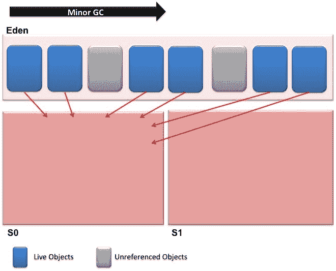
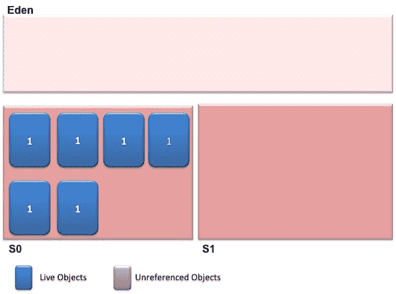
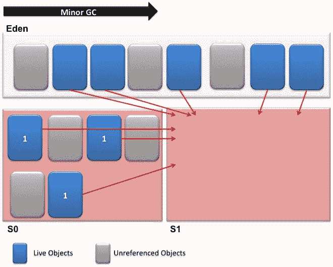
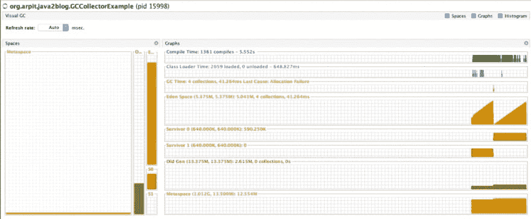
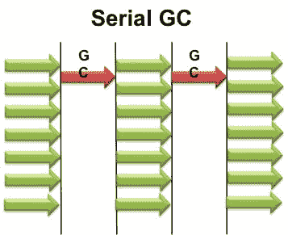
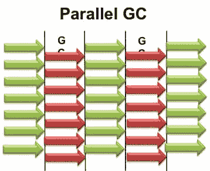
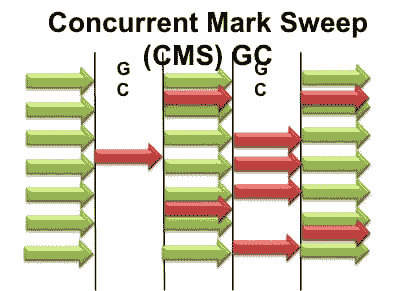

# 理解 java 中的垃圾收集

> 原文：<https://dev.to/arpitmandliya/understand-garbage-collection-in-java-54bh>

在这篇文章中，我们将会看到在 [java](https://java2blog.com/core-java-tutorial-for-beginners-experienced/) 中的垃圾收集。

我将尝试借助图表和例子而不是理论来解释。

JVM 内存分为三个部分

*   年轻一代
*   老一代
*   元空间(Perm Gen)

* * *

## 年轻一代

顾名思义，年轻一代是新创建的[对象](https://java2blog.com/object-class-java/)被分配的区域。

*   当年轻一代填满时，会导致较小垃圾收集，也称为较小的 GC。
*   当小 Gcs 发生时，死亡对象将从年轻一代中移除。
*   如果年轻一代中有很多死对象，那么小规模的 GC 会执行得更快。
*   所有次要 GC 都是“停止世界”事件，因此当次要 GC 发生时，应用程序线程也会停止。

让我们更多地了解对象在年轻一代中是如何分配的。

年轻一代分为三部分。

*   伊甸园空间
*   幸存者空间 S0
*   S1 幸存者空间

这是年轻一代和年老一代的插图。
[T3】](https://res.cloudinary.com/practicaldev/image/fetch/s--tAWoPtqb--/c_limit%2Cf_auto%2Cfl_progressive%2Cq_auto%2Cw_880/https://java2blog.com/wp-content/uploads/2019/05/YoungOldGeneration-1024x733.png)








*   一旦对象在多次小规模 GC 循环中幸存下来，它们将被转移到老一代。您可以通过 MaxTenuringThreshold 来控制此阈值。实际的任期阈值由 JVM 动态调整。

让我们试着借助例子来演示这种行为:
你有下面的类，在这个类中我创建了短命的对象来进行演示。

```
package org.arpit.java2blog;

import java.math.BigDecimal;

public class GCCollectorExample {
    public static void main(String args[])
    {
        createObjects();
    }
    private static void createObjects() {

        long count = 0;

        while(true) { 
            // Creating short-lived objects just for illustration
            BigDecimal shortLivedBigDecimal1 = new BigDecimal(count++);
        }
    }
}

```

当你运行程序时。让我们在 Visual GC(一个 visualVM 插件)中检查内存分配

[](https://res.cloudinary.com/practicaldev/image/fetch/s--TRSMCDaq--/c_limit%2Cf_auto%2Cfl_progressive%2Cq_auto%2Cw_880/https://java2blog.com/wp-content/uploads/2019/07/S0AndEdenDemonstation-1024x422.png) 
如您所见，S0 中的对象很少，一旦伊甸园空间完全填满，所有引用的对象都将被移动到 S1。

[](https://res.cloudinary.com/practicaldev/image/fetch/s--G3YFPwp3--/c_limit%2Cf_auto%2Cfl_progressive%2Cq_auto%2Cw_880/https://java2blog.com/wp-content/uploads/2019/07/S1FilledAndEdenDemonstration-1024x424.png)

* * *

## 老一代

*   它被用来保存古老的长期保存的物品
*   一般比年轻一代大。
*   当占有空间被对象完全填满(或达到预定义的阈值)时，就会发生大规模 GC。它将回收内存并释放空间。
*   通常，主要 GC 比次要 GC 速度更慢，频率更低。

你如何利用这些信息来优化记忆？
这要看申请的性质。
如果你有很多临时对象，那么就会有很多小的 gc。您可以提供参数 XX:NewRatio=1，将 50%分配给年轻一代，50%分配给年老一代。
默认情况下，NewRatio=2，因此年轻一代是总堆的 1/3。
类似地，如果你有太多的长寿命对象，那么你可能需要通过增加 NewRatio 的值来增加使用权空间的大小。

### 为什么有两个幸存者空间？

你一定想知道为什么我们有两个幸存者空间。我们有两个幸存者空间，以避免内存碎片。每次你从伊甸园复制对象到幸存者，你得到一个空的伊甸园空间和一个空的幸存者空间。

* * *

## 垃圾收集算法

JVM 为年轻一代和老一代提供了几种算法。有 3 种算法

### 串行收集器

它使用单线程来执行所有的垃圾收集，适用于单处理器机器的基本应用程序。

[](https://res.cloudinary.com/practicaldev/image/fetch/s--8BnLEpY2--/c_limit%2Cf_auto%2Cfl_progressive%2Cq_auto%2Cw_880/https://java2blog.com/wp-content/uploads/2019/07/SerialGC.jpg)

### 平行收集器

它使用多个 CPU 来执行垃圾收集器。串行收集器使用一个线程来执行垃圾收集，而并行垃圾收集使用多个线程来执行垃圾收集，这在有足够的内存和足够数量的内核时非常有用。

[](https://res.cloudinary.com/practicaldev/image/fetch/s--RWVS689F--/c_limit%2Cf_auto%2Cfl_progressive%2Cq_auto%2Cw_880/https://java2blog.com/wp-content/uploads/2019/07/parallelGC.jpg)

### 并发收集器

并发收集器使用应用程序线程执行垃圾收集。这对于具有中型到大型数据集并需要快速响应时间的应用程序非常有用。

[](https://res.cloudinary.com/practicaldev/image/fetch/s--p1G2MWqp--/c_limit%2Cf_auto%2Cfl_progressive%2Cq_auto%2Cw_880/https://java2blog.com/wp-content/uploads/2019/07/concurrentGC.jpg)

您可以对年轻一代和老一代使用不同的 GC 算法，但是您只能配对兼容的算法。

例如:您不能将年轻代的并行清除与旧代的并发标记清除配对，因为并行清除不提供 CMS 中所需的同步。

这里有垃圾收集器，你可以为年轻一代和老一代使用。
[table id=17 /]

Java 8 之后垃圾收集器有很多变化，我会在下一篇文章中介绍。

如果你对这篇文章有什么建议，请评论。
**原帖:**
[Java 中的垃圾收集](https://java2blog.com/garbage-collection-java/)

您可能还喜欢:

*   [核心 java 教程](https://java2blog.com/core-java-tutorial-for-beginners-experienced/)
*   [春季教程](https://java2blog.com/introduction-to-spring-framework/)
*   [春季 MVC 教程](https://java2blog.com/spring-mvc-tutorial/)
*   [Spring boot web 应用示例](https://java2blog.com/spring-boot-web-application-example/)
*   [春季开机休眠示例](https://java2blog.com/spring-boot-hibernate-example/)
*   [春季新兵面试问题](https://java2blog.com/spring-boot-interview-questions/)
*   [春季面试问题](https://java2blog.com/spring-interview-questions-and-answers/)