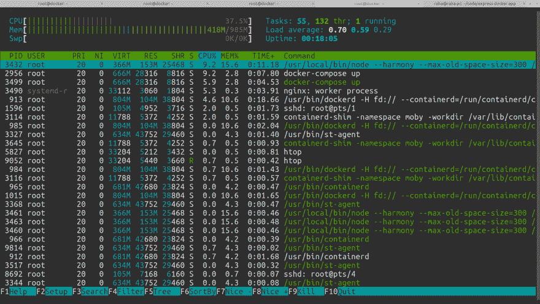
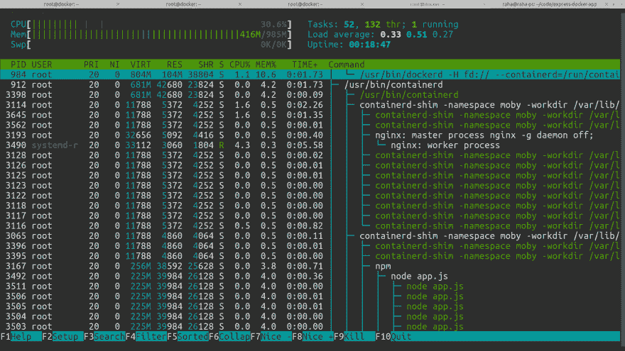
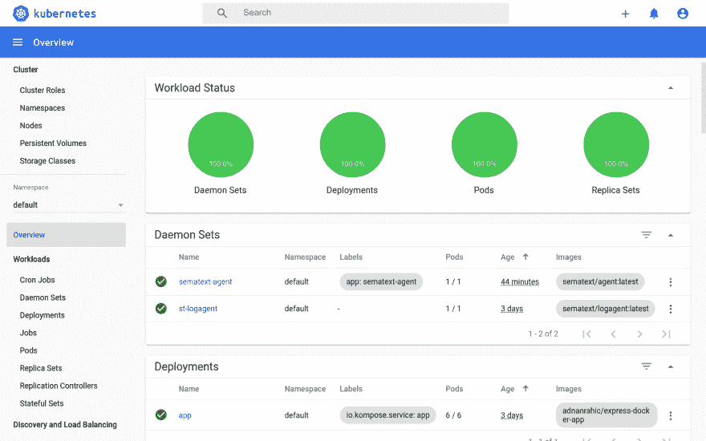

# 如何排除潜在的 DOS 攻击

> 原文：<https://dev.to/sematext/how-to-troubleshoot-potential-dos-attacks-4h5k>

在我作为开发人员的职业生涯中，我有过几次恐惧，但没有一次比尝试 ssh 进入虚拟机失败更可怕。正常人往往害怕蜘蛛、蛇或锯子。

> 无声地提到平庸的电影特许经营与各种类型的黑客设备和锯。

总之，不是我！连接挂起并超时，不知道为什么或如何解决问题，这是我的噩梦开始的原因。我已经感到气短了。

### TL；速度三角形定位法(dead reckoning)

本教程将带您了解我是如何解决潜在的拒绝服务问题的。有太多的工具供您使用来监控这些问题。

我将向您展示一些基于终端的工具以及 SaaS 产品。选择最适合自己的，就看你自己了。最终目标是使用一个 [SaaS 产品](https://sematext.com/),让您能够访问日志、指标以及它们之间的相互关系，这样您就可以查明 DOS 攻击来自哪里。然后你可以把 IP 列入黑名单，阻止他们伤害你。

准备好了吗？我们走吧。

## 拥有 Nginx web 服务器的场景

Nginx 已经成为基于 Kubernetes 和 Node.js 的应用程序的首选 web 服务器和反向代理。因为我非常关注这些技术，所以你必须容忍我用它们作为例子来解释本教程。

从一开始，您最有可能使用 Nginx 入口控制器作为集群前面的负载平衡器。从那里，将请求路由到托管前端代码的 Nginx 容器或运行 API 的 Node.js 容器。很简单，你不同意吗？

如果您注意到 API 的延迟和响应时间增加了，会发生什么呢？我去吃午饭，希望它消失。开玩笑的。我老板在看这个，所以当然不是！* *大汗淋漓* *

虽然没有恶意请求，但这种设置非常有效。

## 注意到通过终端的高请求延迟

反应慢可能意味着很多不同的事情。检查缓慢和资源消耗的进程，或者如果您编写的 JavaScript 代码优化不佳，则阻塞代码。如果你写任何真正的编程语言，你甚至会面临线程过多的问题。是的，这是一个“抨击 JavaScript”参考哈哈！* *嘀咕* * PHP 还差...😐

总之，`htop`是一个很好的检查资源使用情况的命令行工具。安装它是愚蠢的-简单。

```
$ sudo apt install htop 
```

<svg width="20px" height="20px" viewBox="0 0 24 24" class="highlight-action crayons-icon highlight-action--fullscreen-on"><title>Enter fullscreen mode</title></svg> <svg width="20px" height="20px" viewBox="0 0 24 24" class="highlight-action crayons-icon highlight-action--fullscreen-off"><title>Exit fullscreen mode</title></svg>

运行它只需要您输入一个命令。

```
$ htop 
```

<svg width="20px" height="20px" viewBox="0 0 24 24" class="highlight-action crayons-icon highlight-action--fullscreen-on"><title>Enter fullscreen mode</title></svg> <svg width="20px" height="20px" viewBox="0 0 24 24" class="highlight-action crayons-icon highlight-action--fullscreen-off"><title>Exit fullscreen mode</title></svg>

嘿，很快，你就有了一个很好的流程列表！

[](https://res.cloudinary.com/practicaldev/image/fetch/s--365p3CJl--/c_limit%2Cf_auto%2Cfl_progressive%2Cq_auto%2Cw_880/https://thepracticaldev.s3.amazonaws.com/i/2pfk7isfp7vpsj8se551.png)

您甚至可以通过点击`F5`对进程进行分组。

[](https://res.cloudinary.com/practicaldev/image/fetch/s--TFIuz8tL--/c_limit%2Cf_auto%2Cfl_progressive%2Cq_auto%2Cw_880/https://thepracticaldev.s3.amazonaws.com/i/sgwlydorazike8544jlr.png)

尽管`htop`是一个令人惊奇的工具，但是你首先要问的是它如何处理多个主机、节点和集群。嗯，真的没有。

## 使用 Kubernetes 仪表板查看您的库存

下一个合乎逻辑的步骤是确保资源正在运行，这意味着它们没有失败，也没有陷入永恒的重启循环。默认的`kubectl`命令将是第一道防线。发出这个命令:

```
$ kubectl get all 
```

<svg width="20px" height="20px" viewBox="0 0 24 24" class="highlight-action crayons-icon highlight-action--fullscreen-on"><title>Enter fullscreen mode</title></svg> <svg width="20px" height="20px" viewBox="0 0 24 24" class="highlight-action crayons-icon highlight-action--fullscreen-off"><title>Exit fullscreen mode</title></svg>

```
[output]
NAME                DESIRED   CURRENT   READY     UP-TO-DATE   AVAILABLE   NODE SELECTOR   AGE
ds/sematext-agent   1         1         1         1            1           <none>          Xm
ds/st-logagent      1         1         1         1            1           <none>          Xm

NAME            DESIRED   CURRENT   UP-TO-DATE   AVAILABLE   AGE
deploy/nodejs   3         3         3            3           Xm
deploy/nginx    3         3         3            3           Xm

NAME                   DESIRED   CURRENT   READY     AGE
rs/nodejs-788f59f8d4   3         3         3         Xm
rs/nginx-788e93r8a5    3         3         3         Xm

NAME                        READY     STATUS    RESTARTS   AGE
po/nginx-788e93r8a5-45t4d   1/1       Running   4          Xm
po/nginx-788e93r8a5-qsgdr   1/1       Running   4          Xm
po/nginx-788e93r8a5-tghhj   1/1       Running   4          Xm
po/nodejs-788f59f8d4-v9cjt  1/1       Running   4          Xm
po/nodejs-788f59f8d4-zllqj  1/1       Running   4          Xm
po/nodejs-788f59f8d4-ztjxw  1/1       Running   4          Xm
po/sematext-agent-rdfm8     1/1       Running   5          Xm
po/st-logagent-52zkt        1/1       Running   4          Xm

NAME            TYPE           CLUSTER-IP      EXTERNAL-IP   PORT(S)        AGE
svc/nginx       LoadBalancer   10.103.55.204   <pending>     80:31567/TCP   Xm
svc/nodejs      LoadBalancer   10.103.55.204   <pending>     3000:31567/TCP Xm
svc/kubernetes  ClusterIP      10.96.0.1       <none>        443/TCP        Xm 
```

<svg width="20px" height="20px" viewBox="0 0 24 24" class="highlight-action crayons-icon highlight-action--fullscreen-on"><title>Enter fullscreen mode</title></svg> <svg width="20px" height="20px" viewBox="0 0 24 24" class="highlight-action crayons-icon highlight-action--fullscreen-off"><title>Exit fullscreen mode</title></svg>

列出集群中所有可用的实体可以让您快速了解哪些正在运行，哪些没有运行。

从这开始的第一步是启动 [Kubernetes 仪表板](https://kubernetes.io/docs/tasks/access-application-cluster/web-ui-dashboard/)并获得一个漂亮的 UI。在这里，您可以了解您的库存概况。

[](https://res.cloudinary.com/practicaldev/image/fetch/s--ZJ38Ba_S--/c_limit%2Cf_auto%2Cfl_progressive%2Cq_auto%2Cw_880/https://thepracticaldev.s3.amazonaws.com/i/p64qsw86uizf5qmfxceq.png)

这是非常好的，但你不能深究和追根究底手头的问题。你唯一能接触到的就是日志。

[](https://res.cloudinary.com/practicaldev/image/fetch/s--e1RrBUvc--/c_limit%2Cf_auto%2Cfl_progressive%2Cq_auto%2Cw_880/https://thepracticaldev.s3.amazonaws.com/i/1eudctntsvz63celqh8z.png)

不管这有多好，都不能真正解决我的问题。

## 使用基础设施监控工具

归结起来就是找到一个工具，可以把所有东西都放在一个屋檐下。我不想`ssh`进入机器，运行几十个`kubectl`命令，也不想摆弄 Kubernetes 仪表板。当您需要在几个工具之间执行多个任务来解决一个问题时，这是一个巨大的开销。

监控市场已经饱和，从 [SumoLogic](https://www.sumologic.com/) 、 [Datadog](https://www.datadoghq.com/) 到 [New Relic](https://newrelic.com/) ，有大量的工具可供选择。

我使用 [Sematext](https://sematext.com/) 作为可观察性工具，将一切捆绑在一起。我有各种可以想象到的监控方式，包括可以与指标相关联的日志。警报可以基于指标和日志，使其更加强大。

这是当我认为自己被下药时，我的进程 CPU 使用率出现峰值时的样子。

[](https://res.cloudinary.com/practicaldev/image/fetch/s--GIh5I0b_--/c_limit%2Cf_auto%2Cfl_progressive%2Cq_auto%2Cw_880/https://thepracticaldev.s3.amazonaws.com/i/fnq7jg99l35b4jiquun9.png)

从进程屏幕中，我可以找到导致问题的确切 pod 和容器。在那里，我可以通过查看 Nginx 访问日志来确定 DOS 攻击来自哪里。

[](https://res.cloudinary.com/practicaldev/image/fetch/s--ZyPKGrlL--/c_limit%2Cf_auto%2Cfl_progressive%2Cq_auto%2Cw_880/https://thepracticaldev.s3.amazonaws.com/i/gd5n0uqvnath1ts3hqmo.png)

拦截这个 IP 就像在 Nginx Ingress 配置文件中添加一个`deny`段一样简单。

```
location / {
    # ...
    deny    142.93.252.121;
} 
```

<svg width="20px" height="20px" viewBox="0 0 24 24" class="highlight-action crayons-icon highlight-action--fullscreen-on"><title>Enter fullscreen mode</title></svg> <svg width="20px" height="20px" viewBox="0 0 24 24" class="highlight-action crayons-icon highlight-action--fullscreen-off"><title>Exit fullscreen mode</title></svg>

## 不再出汗

我在可观察性工具中寻找的是相关性，在这种相关性中，您可以很容易地看到哪个指标峰值与哪个日志事件相关联，并得到错误通知。每个工具都应该做的是，限制我需要做的工作，以便深入研究并找到问题。

希望你喜欢我差点心脏病发作的故事。请继续关注更多关于超酷的新 DevOps 和可观测性主题的生活故事。

如果你想要 Sematext 的 30 天免费试用，[在这里注册](https://apps.sematext.com/ui/registration)。否则，欢迎在 [DEV](https://dev.to/adnanrahic) 上关注我来支持我的写作。🙂