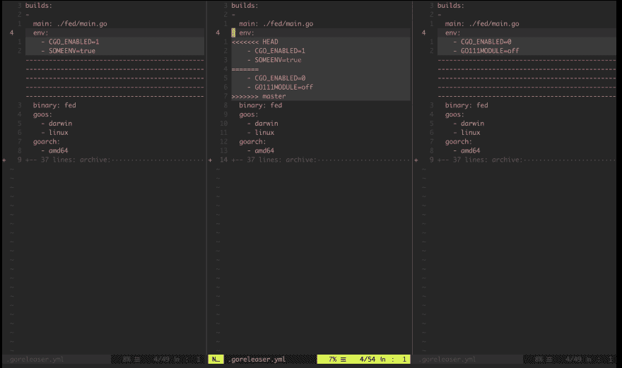

# 用 VIM 解决 git 合并冲突

> 原文：<https://dev.to/prodopsio/solving-git-merge-conflicts-with-vim-5275>

### *流畅得让你恨不得冲突发生*

[](https://res.cloudinary.com/practicaldev/image/fetch/s--FW0JxWS---/c_limit%2Cf_auto%2Cfl_progressive%2Cq_auto%2Cw_880/https://cdn-images-1.medium.com/max/10368/1%2AGvtZw4QPovl9OhjV0hmabw.jpeg)*pexels.com 摄*

[我用 VIM](https://dev.to/omerxx/vim-from-foe-to-friend-in-9-minutes-2np0) 。
这几行是用 VIM 写的，我写的每一行代码也是如此。
Git 已经成为技术领域几乎每个人的集成工具，而[合并-冲突](https://help.github.com/en/articles/about-merge-conflicts)经常是工作的一部分。

> 当两个人修改了文件中相同的行时，通常会产生冲突…
> 在这种情况下，Git 不能自动确定什么是正确的。
> 冲突只影响进行合并的开发人员，团队的其他成员并不知道这个冲突。
> Git 会将文件标记为冲突，并停止合并过程。
> 解决冲突是开发人员的责任。
> ——[亚特兰蒂斯 Git 教程](https://www.atlassian.com/git/tutorials/using-branches/merge-conflicts)

解决 git 冲突总是个人的障碍；要么我试图通过不在 HEAD 中进行合并/撤销更改来忽略它，要么我随机找到了另一个蹩脚的解决方案。
一旦我接受了冲突会发生的事实，我就试着重新设定基准，甚至将我的默认合并设置为`git merge --rebase`认为这样会让所有冲突消失。
但事实证明，改变基础不会让你远离冲突；rebase 将您的提交一个接一个地应用到目标分支的头上，
这样，rebase 经常引入必须由
`git merge --continue`处理的冲突。

* * *

### 亡命之道

[Vim 逃犯是由](https://github.com/tpope/vim-fugitive) [@tpope](http://twitter.com/tpope) 开发的一个很棒的插件。
它的一个很棒的特性是 Gstatus 和 Gdiff，它们允许你观察你的项目的状态和差异，就像从你的终端或者你喜欢的 git 接口使用 git status & git diff 一样。
在 VIM 中有一种非常平滑的方式来处理这些冲突；在编辑冲突文件时使用 Gdiff，逃犯将通过包围当前工作区文件来启动三向比较。将会出现两个新的缓冲区:一个用于目标分支(即您正在将 ***合并到*** 的分支)，另一个是合并分支(即正在被合并到的分支)。

前一个概念的验证:如果我在 master 上工作，并且我想将 staging 合并到其中，我将运行 git merge staging。
在这种情况下，主服务器是**目标**分支，暂存服务器是**合并**分支。
这个术语对于后面的参考很重要，可以帮助我们明确选择哪个缓冲区来解决冲突。

[这里有一个由](http://vimcasts.org/episodes/fugitive-vim-resolving-merge-conflicts-with-vimdiff/)[德鲁·尼尔](http://drewneil.com/)制作的精彩视频描述了上述内容(实用 VIM)。

* * *

### 还有什么好说的？

上面的方法使用了不方便的缓冲系统，并且很难执行 diffput 或 diffget 之类的命令，当我试图找出缓冲区名称引用时，这些命令对我来说没有什么意义。流程不顺畅，我觉得有些东西*不见了*。
为了解决我的问题，我用了几个化名整合到我的。vimrc 让解决冲突变得愉快、顺利，最重要的是——直观；我不想去想我在做什么，我想去做。此外，我希望它比我见过的做同样事情的任何其他工具都更好更快，因为它消除了路上的复杂性和不直观的过程。

* * *

### 我的加法

让我们回顾一下我在我的。vimrc 及其在解决冲突时的作用:

```
" Fugitive Conflict Resolution
nnoremap <leader>gd :Gvdiff<CR>
nnoremap gdh :diffget //2<CR>
nnoremap gdl :diffget //3<CR> 
```

<svg width="20px" height="20px" viewBox="0 0 24 24" class="highlight-action crayons-icon highlight-action--fullscreen-on"><title>Enter fullscreen mode</title></svg> <svg width="20px" height="20px" viewBox="0 0 24 24" class="highlight-action crayons-icon highlight-action--fullscreen-off"><title>Exit fullscreen mode</title></svg>

上面三行是轻松解决冲突所需要的全部；
首先键入`git diff`中的`<leader>gd`，这将创建一个如上所述的**三向分割**屏幕。在我的贴图中，我使用`Gvdiff`垂直分割窗格*。如果你的偏好是水平视图，就把 v 去掉:`Gdiff`。下面是它的样子:*

[ ](https://res.cloudinary.com/practicaldev/image/fetch/s--wixiGNL4--/c_limit%2Cf_auto%2Cfl_progressive%2Cq_auto%2Cw_880/https://cdn-images-1.medium.com/max/5760/1%2AR3b782nCOkP0P9g7hEZqgg.png) * Git 三向差分*

请注意，中间的窗格是我当前的工作区，左边是 HEAD，如果我选择该选项，我的代码看起来会是什么样子，而右边是描述主分支状态。

为了决定 HEAD 的变化，根据我的映射，我输入 gdh，gd 代表 git diff，h 是 VIM 的左键。我故意将 leader 键排除在这个序列之外，因为它是一个内部流程组合。
选择 master 后，我的当前工作区更改为:

[ ](https://res.cloudinary.com/practicaldev/image/fetch/s--G97vFSrK--/c_limit%2Cf_auto%2Cfl_progressive%2Cq_auto%2Cw_880/https://cdn-images-1.medium.com/max/3838/1%2AKhpOS112mL6_wLDVHrqUYg.png) *选择后工作区窗格左侧有`gdh`*

请注意，左下角的实际命令提到了
`:diffget //2`，这是逃犯从名称中带有`//2`的缓冲区获取更改的方式。

**使该流程完整的有用补充:**

1.  跳到下一个 git 块(或要修复的冲突)可以通过使用`[c`向后或`]c`向前搜索来完成

2.  当您对您的工作区感到满意时(通常是当所有冲突都已解决时)，是时候让此窗格保持打开状态了；我们可以用`<C-w>o`来实现，它告诉 VIM 的窗口管理器只离开当前窗格。

这就够了。习惯这种顺序是一件轻而易举的事，让冲突生活变得更容易(也更有趣)解决。

* * *

我叫 Omer，是一名工程师，在 [ProdOps](http://prodops.io) 工作，这是一家全球咨询公司，采用 DevOps 文化，以可靠、安全和简单的方式提供软件。请在下面的评论中告诉我你的想法，或者直接在 Twitter [**@** omergsr](https://twitter.com/omergsr) 上与我联系。如果你喜欢拍手，它帮助我集中我未来的写作。