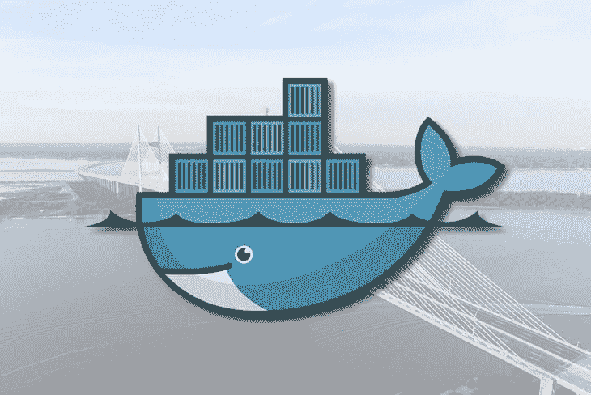

# 如何在 Docker 容器中运行 SQL Server

> 原文：<https://dev.to/bnevilleoneill/how-to-run-sql-server-in-a-docker-container-6j0>

[](https://res.cloudinary.com/practicaldev/image/fetch/s--_UotkkIx--/c_limit%2Cf_auto%2Cfl_progressive%2Cq_auto%2Cw_880/https://thepracticaldev.s3.amazonaws.com/i/mmo22vwmu24ya4q5e5cx.jpeg)

不久以前，在 Windows 之外的任何平台上运行--更不用说开发-- NET 应用程序或服务的想法都是可笑的。但是随着微软新的开源焦点，那些日子感觉像是遥远的记忆。

具备使用`dotnet core`开发的能力，跨平台的世界。网络已经开放。现在，您可以开发可以在 Windows、Mac 甚至 Linux 上运行的应用程序或服务。

但是数据库技术呢？

很多。专注于. NET 的开发人员倾向于使用 Microsoft SQL Server 来满足他们的关系数据库需求。但是在很多人的记忆中，SQL Server 只能在 Windows 平台上运行。我们的跨平台。NET 开发刚刚嘎然而止。

[](https://res.cloudinary.com/practicaldev/image/fetch/s--RG9kGapd--/c_limit%2Cf_auto%2Cfl_progressive%2Cq_66%2Cw_880/https://i1.wp.com/blog.logrocket.com/wp-content/uploads/2019/07/screeching-halt.gif%3Fresize%3D315%252C236%26ssl%3D1)

事实上，那个问题也已经解决了。通过利用 Docker，我们可以跨多个平台使用 Microsoft SQL Server。让我们看看如何在 Docker 容器中启动 SQL Server 数据库，以满足跨平台数据库的需求。

[](https://logrocket.com/signup/)

## 先决条件

要真正自己测试这一点，您应该具备一些先决条件。

1.  这是一个大问题:跨平台 SQL Server 仅适用于 SQL Server 2017 及更高版本，因此请确保该版本与您的任何建筑兼容。
2.  您必须安装包含`docker-compose`的`docker`。如果你使用[的 Mac 版 Docker 桌面](https://docs.docker.com/docker-for-mac/install/)，这一切通常都会为你处理好。
3.  在本文中，我将使用 npm 库 [mssql](https://www.npmjs.com/package/mssql) 来连接、更新和查询数据库容器。您可以从任何终端使用`npm install mssql`命令进行本地或全局安装。

都整理好了吗？很好，让我们来学习如何启动 SQL Server 数据库进行跨平台开发。

## 启动我们的 SQL Server 容器

为了启动我们的 SQL Server 容器，我们将首先在项目的根目录下创建一个`docker-compose.yml`文件。在该文件内部，我们将定义一个使用微软提供的 SQL Server 2017 映像的`sql-server-db`资源。

下面是我们的`docker-compose.yml`文件的样子:

```
version: "3.2"
services:

  sql-server-db:
    container_name: sql-server-db
    image: microsoft/mssql-server-linux:2017-latest
    ports:
      - "1433:1433"
    environment:
      SA_PASSWORD: "change_this_password"
      ACCEPT_EULA: "Y" 
```

Enter fullscreen mode Exit fullscreen mode

要启动我们的数据库，我们可以从命令行运行一个`up`命令:

```
$ docker-compose up -d
Pulling sql-server-db (microsoft/mssql-server-linux:2017-latest)...
2017-latest: Pulling from microsoft/mssql-server-linux
59ab41dd721a: Pull complete
57da90bec92c: Pull complete
06fe57530625: Pull complete
5a6315cba1ff: Pull complete
739f58768b3f: Pull complete
0b751601bca3: Pull complete
bcf04a22644a: Pull complete
6b5009e4f470: Pull complete
a9dca2f6722a: Pull complete
Creating sql-server-db ... done 
```

Enter fullscreen mode Exit fullscreen mode

我们可以在终端中看到,`sql-server-db`已经成功创建。现在我们可以探索如何连接到它来运行一些查询。让我们首先连接到我们的数据库容器:

```
$ mssql -u sa -p change_this_password 
```

Enter fullscreen mode Exit fullscreen mode

我们现在应该看到我们已经连接到数据库，并且`mssql`正在等待命令。让我们继续运行`.databases`命令，看看我们的 SQL Server 容器中有哪些数据库:

```
mssql> .databases
name  
------
master
model 
msdb  
tempdb

4 row(s) returned

Executed in 1 ms 
```

Enter fullscreen mode Exit fullscreen mode

我们看到标准的 SQL Server 数据库出现了— `master`、`model`、`msdb`和`tempdb`。让我们继续创建我们自己的数据库，并在其中创建一个表。我们可以通过创建一个名为`my_db_setup.sql`的 SQL 脚本文件来做到这一点，我们可以在我们的容器中运行它。

```
USE master;
GO

CREATE DATABASE SampleDB;
GO

CREATE TABLE dbo.MyTable (
  id bigint IDENTITY(1,1) PRIMARY KEY,
  name varchar(500) null
)
GO 
```

Enter fullscreen mode Exit fullscreen mode

现在我们有了设置脚本，我们可以使用`mssql` :
对数据库容器运行它

```
$ mssql -u sa -p change_this_password
mssql> .run my_db_setup.sql
USE master;
OK

Executed in 0 ms
CREATE DATABASE SampleDB;
OK

Executed in 0 ms
CREATE TABLE dbo.MyTable (
  id bigint IDENTITY(1,1) PRIMARY KEY,
  name varchar(500) null
)
OK

Executed in 0 ms 
```

Enter fullscreen mode Exit fullscreen mode

现在我们已经运行了我们的脚本，我们可以列出我们的数据库和表来查看刚刚创建的所有东西:

```
mssql> .databases
name    
--------
master  
model   
msdb    
SampleDB
tempdb  

5 row(s) returned

Executed in 1 ms
mssql> .tables
database  schema  name                   type      
--------  ------  ---------------------  ----------
master    dbo     MSreplication_options  BASE TABLE
master    dbo     MyTable                BASE TABLE
master    dbo     spt_fallback_db        BASE TABLE
master    dbo     spt_fallback_dev       BASE TABLE
master    dbo     spt_fallback_usg       BASE TABLE
master    dbo     spt_monitor            BASE TABLE
master    dbo     spt_values             VIEW      

7 row(s) returned

Executed in 1 ms 
```

Enter fullscreen mode Exit fullscreen mode

就这样，我们有了自己的数据库，并在其中配置了一个表。所有这些都作为 Docker 容器运行，我们可以与他人共享，并在各种不同的平台上运行。

## 结论

微软一直在移动越来越多的框架、工具和语言来支持跨平台开发。就而言是一个巨大的飞跃。NET/C#开发，因为它可以在 Windows、Mac 和 Linux 上运行。

酪 NET 仅仅是一个框架；我们还需要我们在该生态系统中经常使用的工具来支持多个平台。这就是我们在这里演示的:通过利用容器技术，SQL Server 2017 可以在任何平台上运行。

通过 Docker compose 文件中的几行代码和类似于`mssql`的简单 npm 库，我们可以在任何平台上启动 SQL Server 数据库。这不仅对于生产部署非常方便，对于开发环境也是如此。

团队中的其他开发人员现在可以通过运行`docker-compose up`和运行我们手头的任何种子数据库脚本来使用同一个数据库。我们甚至可以创建自己的配置了整个数据库的 Docker 映像，然后在 Docker 合成文件中使用该映像。

有了 Docker 和`dotnet core`这样的东西，使用。NET 生态系统比以往任何时候都更有可能。

如果你对这篇博文、AWS、无服务器或一般编码有任何问题，请随时通过 twitter [@kylegalbraith](https://twitter.com/kylegalbraith) 联系我。也可以看看我每周的[边做边学](https://kylegalbraith.com/learn-by-doing)时事通讯或者我的[通过使用 It 学习 AWS](https://kylegalbraith.com/learn-aws)课程来学习更多关于云、编码和 DevOps 的知识。

* * *

## Plug: [LogRocket](https://logrocket.com/signup/) ，一款适用于网络应用的 DVR

[](https://logrocket.com/signup/)

[log rocket](https://logrocket.com/signup/)是一个前端日志工具，让你重放问题，就像它们发生在你自己的浏览器中一样。LogRocket 不需要猜测错误发生的原因，也不需要向用户询问截图和日志转储，而是让您重放会话以快速了解哪里出错了。它可以与任何应用程序完美配合，不管是什么框架，并且有插件可以记录来自 Redux、Vuex 和@ngrx/store 的额外上下文。

除了记录 Redux 动作和状态，LogRocket 还记录控制台日志、JavaScript 错误、stacktraces、带有头+体的网络请求/响应、浏览器元数据、自定义日志。它还使用 DOM 来记录页面上的 HTML 和 CSS，甚至为最复杂的单页面应用程序重新创建像素级完美视频。

[免费试用](https://logrocket.com/signup/)。

* * *

帖子[如何在 Docker 容器中运行 SQL Server](https://blog.logrocket.com/how-to-run-sql-server-in-a-docker-container/)最先出现在[博客](https://blog.logrocket.com)上。