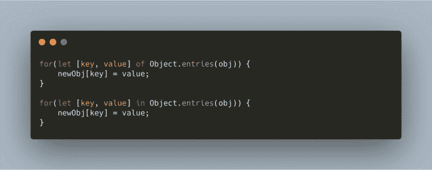

# 让我们绕圈...在 vs for...关于

> 原文：<https://dev.to/laurieontech/let-s-loop-for-in-vs-for-of-4loh>

不久前，我还在使用 [Object.entries](https://dev.to/laurieontech/introducing-object-fromentries-1d5l) ，却没有看到我期望的功能。我一直盯着看，一直盯着看，终于意识到我用的是“for in”，而不是“for of”。

> 劳里[@ laurieontech](https://dev.to/laurieontech)只是花了很长时间盯着一段行不通的代码片段。请注意，下面的两个语句都是有效的 JS...这导致了非常不同功能！2019 年 7 月 02 日下午 15:48[](https://twitter.com/intent/tweet?in_reply_to=1146083249107681282)[](https://twitter.com/intent/retweet?tweet_id=1146083249107681282)[](https://twitter.com/intent/like?tweet_id=1146083249107681282)

这让我想到我应该写一个帖子来谈论这些差异。所以我们来了！

# 一本入门书

`for...in`和`for...of`是传统 for 循环的替代。需要做这样的事情是很常见的。

```
for (let i = 0; i < arr.length; i++) {
  // do something here
} 
```

<svg width="20px" height="20px" viewBox="0 0 24 24" class="highlight-action crayons-icon highlight-action--fullscreen-on"><title>Enter fullscreen mode</title></svg> <svg width="20px" height="20px" viewBox="0 0 24 24" class="highlight-action crayons-icon highlight-action--fullscreen-off"><title>Exit fullscreen mode</title></svg>

所以迭代各种数据结构的能力是一个很好的捷径。

# 为...关于

`for...of`是为数组和其他可迭代对象设计的。这里有一个例子。

```
let arr = [1, 2, 3]
for (item of arr) {
  console.log(item)
}
// 1
// 2
// 3 
```

<svg width="20px" height="20px" viewBox="0 0 24 24" class="highlight-action crayons-icon highlight-action--fullscreen-on"><title>Enter fullscreen mode</title></svg> <svg width="20px" height="20px" viewBox="0 0 24 24" class="highlight-action crayons-icon highlight-action--fullscreen-off"><title>Exit fullscreen mode</title></svg>

请记住，在 JavaScript 中有许多东西是可迭代的。这包括数组、字符串、映射、集合等。

# 为...在

另一方面，`for...in`可以处理对象。

```
let obj = {a:1, b:2, c:3}
for (item in obj) {
  console.log(item)
}
// a
// b
// c 
```

<svg width="20px" height="20px" viewBox="0 0 24 24" class="highlight-action crayons-icon highlight-action--fullscreen-on"><title>Enter fullscreen mode</title></svg> <svg width="20px" height="20px" viewBox="0 0 24 24" class="highlight-action crayons-icon highlight-action--fullscreen-off"><title>Exit fullscreen mode</title></svg>

这里需要注意的是,`item`实际上引用的是给定的键-值对的键。如果我们想访问这个值，我们可以这样做。

```
let obj = {a:1, b:2, c:3}
for (item in obj) {
  console.log(obj[item])
}
// 1
// 2
// 3 
```

<svg width="20px" height="20px" viewBox="0 0 24 24" class="highlight-action crayons-icon highlight-action--fullscreen-on"><title>Enter fullscreen mode</title></svg> <svg width="20px" height="20px" viewBox="0 0 24 24" class="highlight-action crayons-icon highlight-action--fullscreen-off"><title>Exit fullscreen mode</title></svg>

# 为...in 和 iterables

事实证明，`for...in`既可以处理对象，也可以处理可重复项。

```
let arr = [1, 2, 3]
for (idx in arr) {
  console.log(idx)
}
// 0
// 1
// 2 
```

<svg width="20px" height="20px" viewBox="0 0 24 24" class="highlight-action crayons-icon highlight-action--fullscreen-on"><title>Enter fullscreen mode</title></svg> <svg width="20px" height="20px" viewBox="0 0 24 24" class="highlight-action crayons-icon highlight-action--fullscreen-off"><title>Exit fullscreen mode</title></svg>

它引用数组中给定元素的索引，而不是像对象那样引用键。

如果我们想访问元素本身，我们的代码应该是这样的。

```
let arr = [1, 2, 3]
for (idx in arr) {
  console.log(arr[idx])
}
// 1
// 2
// 3 
```

<svg width="20px" height="20px" viewBox="0 0 24 24" class="highlight-action crayons-icon highlight-action--fullscreen-on"><title>Enter fullscreen mode</title></svg> <svg width="20px" height="20px" viewBox="0 0 24 24" class="highlight-action crayons-icon highlight-action--fullscreen-off"><title>Exit fullscreen mode</title></svg>

# 我的不靠谱的例子

因此，有必要理解为什么这两个版本在我上面的例子中都有效，以及它们的区别是什么。

我们从`for...of`开始。

> 注意，这个例子使用了[析构赋值](https://dev.to/laurieontech/3-powerful-examples-of-destructuring-assignment-jlf)和 [Object.entries](https://dev.to/laurieontech/introducing-object-fromentries-1d5l) ，如果你想复习这些概念的话。

### 为...关于

```
let obj = {a:1, b:2, c:3}
let newObj = {}
for (let [key, value] of Object.entries(obj)) {
  newObj[key] = value;
}
// newObj is { a: 1, b: 2, c: 3 } 
```

<svg width="20px" height="20px" viewBox="0 0 24 24" class="highlight-action crayons-icon highlight-action--fullscreen-on"><title>Enter fullscreen mode</title></svg> <svg width="20px" height="20px" viewBox="0 0 24 24" class="highlight-action crayons-icon highlight-action--fullscreen-off"><title>Exit fullscreen mode</title></svg>

稍微分解一下可能会有所帮助。`Object.entries()`正在将我们的`obj`转换为多维数组表示。

```
[[a,1], [b,2], [c,3]] 
```

<svg width="20px" height="20px" viewBox="0 0 24 24" class="highlight-action crayons-icon highlight-action--fullscreen-on"><title>Enter fullscreen mode</title></svg> <svg width="20px" height="20px" viewBox="0 0 24 24" class="highlight-action crayons-icon highlight-action--fullscreen-off"><title>Exit fullscreen mode</title></svg>

当我们遍历数组时，我们看到的是每个元素，它本身就是一个数组。

从那里，我们向下一层，进入数组元素，将名称`key`分配给第一个元素，将`value`分配给第二个元素。

最后，我们将这些键值对添加到`newObj`。这似乎像预期的那样工作。

那么`for...in`会发生什么呢？

### 为...在

```
let obj = {a:1, b:2, c:3}
let newObj = {}
for (let [key, value] in Object.entries(obj)) {
  newObj[key] = value;
}
// newObj is { 0: undefined, 1: undefined, 2: undefined } 
```

<svg width="20px" height="20px" viewBox="0 0 24 24" class="highlight-action crayons-icon highlight-action--fullscreen-on"><title>Enter fullscreen mode</title></svg> <svg width="20px" height="20px" viewBox="0 0 24 24" class="highlight-action crayons-icon highlight-action--fullscreen-off"><title>Exit fullscreen mode</title></svg>

啊，什么？！我们来分析一下。

> 顺便说一下，现在你明白为什么这根本不是我期望的结果了。

就像之前一样，`Object.entries()`给了我们这个。

```
[[a,1], [b,2], [c,3]] 
```

<svg width="20px" height="20px" viewBox="0 0 24 24" class="highlight-action crayons-icon highlight-action--fullscreen-on"><title>Enter fullscreen mode</title></svg> <svg width="20px" height="20px" viewBox="0 0 24 24" class="highlight-action crayons-icon highlight-action--fullscreen-off"><title>Exit fullscreen mode</title></svg>

然而，当我们遍历数组时，我们看到的是数组索引**而不是**的值。所以我们的第一个条目是`0`，它没有`[key, value]`要析构。`key`变为`0`，并且`value`被赋予值`undefined`。

### 兔子洞

好的，我们一会儿就回到主要问题上，但是我陷入了一个很深的兔子洞，试图理解为什么这个方法有效。如果我们把它分解到最基本的层次，这就是我们正在看的代码。

```
const [key, value] = 0; 
```

<svg width="20px" height="20px" viewBox="0 0 24 24" class="highlight-action crayons-icon highlight-action--fullscreen-on"><title>Enter fullscreen mode</title></svg> <svg width="20px" height="20px" viewBox="0 0 24 24" class="highlight-action crayons-icon highlight-action--fullscreen-off"><title>Exit fullscreen mode</title></svg>

这是无效的！它抛出`TypeError: 0 is not iterable`。那么为什么使用`for...in`时会是这样的结果呢？

```
// key is 0
// value is undefined 
```

<svg width="20px" height="20px" viewBox="0 0 24 24" class="highlight-action crayons-icon highlight-action--fullscreen-on"><title>Enter fullscreen mode</title></svg> <svg width="20px" height="20px" viewBox="0 0 24 24" class="highlight-action crayons-icon highlight-action--fullscreen-off"><title>Exit fullscreen mode</title></svg>

摘自 [mozilla 文档](https://developer.mozilla.org/en-US/docs/Web/JavaScript/Reference/Statements/for...in)这就是为什么:
“数组索引只是具有整数名称的可枚举属性，在其他方面与一般对象属性相同。”

在我们的`const`例子中，`0`不是`number`类型，它实际上是一个字符串！

所以我们的超级深入的例子是关于在`[key, value]`析构中发生了什么。

```
let num = 0;
const [key, value] = num.toString();
// key is '0'
// value is undefined 
```

<svg width="20px" height="20px" viewBox="0 0 24 24" class="highlight-action crayons-icon highlight-action--fullscreen-on"><title>Enter fullscreen mode</title></svg> <svg width="20px" height="20px" viewBox="0 0 24 24" class="highlight-action crayons-icon highlight-action--fullscreen-off"><title>Exit fullscreen mode</title></svg>

### 好了，回到正题

如果我们在我的例子中使用了`for...in`,并且我们想要我期望看到的，有一种方法可以得到它。

```
let obj = {a:1, b:2, c:3}
let newObj = {}
for (let idx in Object.entries(obj)){
    const [key, value] = Object.entries(obj)[idx]
    newObj[key] = value
}
// newObj is { a: 1, b: 2, c: 3 } 
```

<svg width="20px" height="20px" viewBox="0 0 24 24" class="highlight-action crayons-icon highlight-action--fullscreen-on"><title>Enter fullscreen mode</title></svg> <svg width="20px" height="20px" viewBox="0 0 24 24" class="highlight-action crayons-icon highlight-action--fullscreen-off"><title>Exit fullscreen mode</title></svg>

然而，很明显在这种情况下使用`for...of`是更好的选择。

# 如此而已

有这么多选择当然很好，但是选择合适的工具很重要。否则，您将会以一些非常意外的行为而告终！