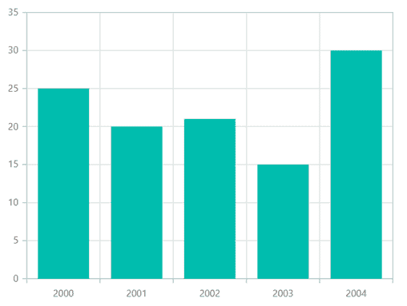
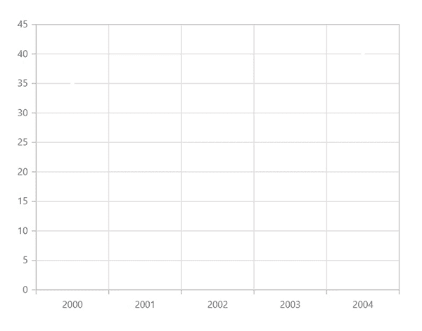
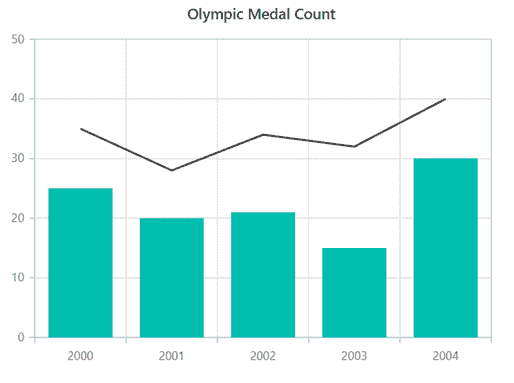
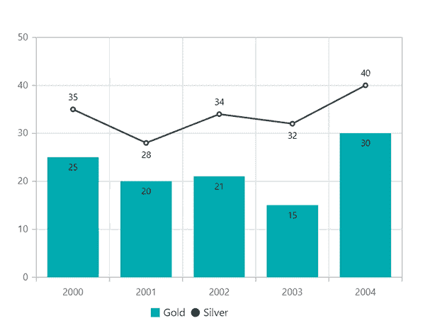

# 如何在 Angular 中创建漂亮的图表

> 原文：<https://dev.to/syncfusion/create-beautiful-charts-in-angular-4fj2>

在数据可视化中，图表在表示数据方面起着至关重要的作用。如果您正在为 Angular 框架寻找令人惊叹的图表， [Essential JS 2 chart](https://www.syncfusion.com/angular-ui-components/angular-charts) 组件为他们提供了各种令人印象深刻的特性。

在这篇博客中，我们将介绍在 Angular 应用程序中创建一个简单图表并配置基本功能的过程。完整的代码可以在我们的 [GitHub 库](https://github.com/SyncfusionSamples/ej2-chart-gettingstarted)中找到。

## 设置开发环境

在 Angular 中创建图表之前，您应该设置一个开发环境。由于源代码可以在 [GitHub](https://github.com/syncfusion/ej2-javascript-ui-controls/tree/master/controls/charts) 中获得，并且软件包可以在 npm 中获得，所以您可以通过几个简单的步骤开始使用图表。

## 创建角度应用

要创建角度应用程序，使用以下命令全局安装 [Angular CLI](https://github.com/angular/angular-cli) 。

```
npm install -g @angular-cli 
```

然后使用以下命令创建一个新的角度应用程序。

```
ng new my-app 
```

此命令下载所有需要的文件，并初始化 npm 安装。

## 安装图表组件

创建 Angular 应用程序后，使用以下命令安装图表包。

```
cd my-app

npm install @syncfusion/ej2-ng-charts –save 
```

–save 标志将图表包作为依赖项保存在 package.json 文件中。

## 配置图表

与环境设置相关的所有配置现在都已完成。在配置图表之前，需要一个组件来呈现图表。要创建角度组件，请使用以下角度 CLI 命令。

```
ng generate component chart 
```

接下来，在 app.module.ts 文件中导入图表模块。

```
import { BrowserModule } from '@angular/platform-browser';
import { NgModule } from '@angular/core';
import { AppComponent } from './app.component';
import { ChartComponent } from './chart/chart.component';
import { ChartModule } from '@syncfusion/ej2-ng-charts’; 

@NgModule ({
 declarations: [AppComponent,ChartComponent],
 imports: [BrowserModule, ChartModule],
 bootstrap: [AppComponent]
})
export class AppModule { } 
```

## 创建图表组件

与图表相关的所有配置现在都已完成。现在我们需要定义 chart.component.html 文件中的第一个图表。

```
<ejs-chart></ejs-chart> 
```

然后，在 app.component.html 文件中添加图表组件。

```
<app-chart></app-chart> 
```

## 为应用服务

使用以下命令转到应用程序目录并启动服务器。

```
ng serve -open 
```

所有文件编译成功后，基本图表应该如下图所示。
[T3】](https://res.cloudinary.com/practicaldev/image/fetch/s--8m09a7z---/c_limit%2Cf_auto%2Cfl_progressive%2Cq_auto%2Cw_880/https://blog.syncfusion.com/wp-content/uploads/2018/08/image-88.png)

## 注入模块

现在我们有了没有数据的基本图表。在向它提供一些数据之前，让我们了解一下 Syncfusion 支持的图表类型。

Syncfusion 图表组件可以绘制超过 25 种图表类型。每种类型都是模块化的，可以作为单独的服务使用，因此您可以只使用您需要的模块，以保持您的应用程序轻量级。例如，如果你想用柱形图可视化数据，在 **app.module.ts** 文件的提供者中定义 **columnSeriesService** 。此服务提供对柱形图功能的访问。

```
import { ChartModule } from '@syncfusion/ej2-ng-charts';
import { CategoryService, ColumnSeriesService } from '@syncfusion/ej2-ng-charts';

@NgModule({
  imports: [ BrowserModule, ChartModule ],
  providers: [CategoryService, ColumnSeriesService ]
 }) 
```

在提供者中注入 **columnSeriesService** 后，将序列类型设置为**列**，并使用接受 JavaScript 对象的**数据源**属性填充图表中的数据。

```
import {Component, OnInit } from '@angular/core';
@Component({
    selector: 'app-chart',
    template:`<ejs-chart id="chart-container" [primaryXAxis]="primaryXAxis">
              <e-series-collection>
              <e-series [dataSource]="chartData" type="Column" xName="year" yName="gold"
              name="Gold"> 
              </e-series>              
              </e-series-collection>
              </ejs-chart>`
})

export class AppComponent implements OnInit {
    public chartData: Object [];
    public primaryXAxis: Object; 
    ngOnInit(): void {
        // Data for chart series
        this.chartData = [
            { year:'2000', gold: 35, silver: 25 }, { year: '2001', gold: 28, silver: 20 },
            { year:'2002', gold: 34, silver: 21 }, { year: '2003', gold: 32, silver: 15 },
            { year:'2004', gold: 40, silver: 30 } 
         ];  
         this.primaryXAxis = { valueType: 'Category' };
    }

} 
```

填充后的柱形图如下所示:
[](https://res.cloudinary.com/practicaldev/image/fetch/s--kfGtrpAg--/c_limit%2Cf_auto%2Cfl_progressive%2Cq_auto%2Cw_880/https://blog.syncfusion.com/wp-content/uploads/2018/08/image-89.png)

## 构建其他图表类型

实现其他笛卡尔图表类型与实现柱形图非常相似。如果您想要一个面积图或折线图，只需在 providers 中注入相应的服务并更改 series 类型。

让我们通过向柱形图添加另一个系列来用折线图类型可视化一些其他数据集。

```
import { ChartModule } from '@syncfusion/ej2-ng-charts';
import { CategoryService, ColumnSeriesService, LineSeriesService} from '@syncfusion/ej2-ng-charts';

@NgModule({
imports: [ BrowserModule, ChartModule ],
providers: [CategoryService, ColumnSeriesService, LineSeriesService]
}) 
```

```
`<ejs-chart id="chart-container" [primaryXAxis]="primaryXAxis">

 <e-series [dataSource]="chartData" type="Column" xName="year" yName="gold" name="Gold">
 <e-series [dataSource]="chartData" type="Line" xName="year" yName="silver" name="Silver">

  </ejs-chart>` 
```

[](https://res.cloudinary.com/practicaldev/image/fetch/s--wN5XSgs7--/c_limit%2Cf_auto%2Cfl_progressive%2Cq_66%2Cw_880/https://blog.syncfusion.com/wp-content/uploads/2018/08/image-12.gif)

## Title

图表可以被赋予一个标题，以告知用户在图表中寻找什么。可以使用**标题**属性定制标题的文本。

```
`<ejs-chart id="chart-container" [primaryXAxis]="primaryXAxis" [title]="title">

        <e-series [dataSource]="chartData" type="Column" legendShape="Circle" xName="year" yName="gold" name="Gold">
        <e-series [dataSource]="chartData" type="Line" legendShape="Triangle" xName="year" yName="silver" name="Silver">

  </ejs-chart>`

export class AppComponent implements OnInit {
    public title: Object;
    public primaryXAxis: Object;
    ngOnInit(): void {
        this.primaryXAxis = { valueType: 'Category'  };
        this.title = 'Olympic Medal Count';
    }
} 
```

[](https://res.cloudinary.com/practicaldev/image/fetch/s--FOTzfcNs--/c_limit%2Cf_auto%2Cfl_progressive%2Cq_auto%2Cw_880/https://blog.syncfusion.com/wp-content/uploads/2018/08/image-90.png)

## 图例

最终用户与图表组件交互的另一种方式是通过图例。您可以通过在提供者中注入 **LegendService** 来访问图例功能。另外，您应该将**legends settings**中的 **visible** 属性设置为 **true** 。

每个系列类型都有自己的图例图标，将显示在图例中，为系列指定的**名称**将显示在其旁边。在下面的代码示例中，我们将通过系列中的 **legendShape** 属性将图例图标更改为矩形和圆形。

```
import { ChartModule } from '@syncfusion/ej2-ng-charts';
import { CategoryService, ColumnSeriesService, LineSeriesService, LegendService } from '@syncfusion/ej2-ng-charts';
@NgModule({
    imports: [ BrowserModule, ChartModule ],
    providers: [CategoryService, ColumnSeriesService, LineSeriesService, LegendService]
   }) 
```

```
<ejs-chart id="chart-container" [primaryXAxis]="primaryXAxis" [legendSettings]="legendSettings">

     <e-series [dataSource]="chartData" type="Column" legendShape="Rectangle" xName="year" yName="gold" name="Gold">
     <e-series [dataSource]="chartData" type="Line" legendShape="Circle" xName="year" yName="silver" name="Silver">

  </ejs-chart>` 
 export class AppComponent implements OnInit {  
    public title: Object;    
    public primaryXAxis: Object;
    public legendSettings: Object;
    ngOnInit(): void {  
       this.primaryXAxis = { valueType: 'Category' };      
       this.legendSettings = {visible : true};
  }
} 
```

启用图例后，图表将如下图所示。现在，您可以与图例进行交互，以折叠或选择所需的系列。
[T3】](https://res.cloudinary.com/practicaldev/image/fetch/s--KbVCg29_--/c_limit%2Cf_auto%2Cfl_progressive%2Cq_66%2Cw_880/https://blog.syncfusion.com/wp-content/uploads/2018/08/image-13.gif)

## 数据标签

数据标签是为希望提高数据可读性的情况而设计的。您可以通过在提供者中注入 **DataLabelService** 并在数据标签中启用 **visible** 属性来访问数据标签功能。

数据标签的位置也可以改变，这样它们就可以灵活地放置。在下面的代码示例中，我们使用 **position** 属性将柱形图的数据标签移动到条形图内部。

```
import { ChartModule } from '@syncfusion/ej2-ng-charts';
import { CategoryService, ColumnSeriesService, LineSeriesService, LegendService, DataLabelService  } from '@syncfusion/ej2-ng-charts';

@NgModule({
imports: [ BrowserModule, ChartModule ],
providers: [CategoryService, ColumnSeriesService, LineSeriesService, LegendService, DataLabelService ]
 }) 
```

```
`<ejs-chart id="chart-container" [primaryXAxis]="primaryXAxis" [legendSettings]="legendSettings">

      <e-series [dataSource]="chartData" type="Column" legendShape="Circle" xName="year" yName="gold" name="Gold" [marker]="columnMarker">
      <e-series [dataSource]="chartData" type="Line" legendShape="Triangle" xName="year" yName="silver" name="Silver" [marker]="lineMarker">

    </ejs-chart>`

   export class AppComponent implements OnInit {
    public title: Object;
    public primaryXAxis: Object;
    public legendSettings: Object;
    public lineMarker : Object;
    public columnMarker : Object;
    ngOnInit(): void {       
        this.primaryXAxis = { valueType: 'Category' };      
        this.legendSettings = {visible : true};      
        this.columnMarker = { dataLabel : { visible :true, position: 'Top'}};
        this.lineMarker = { visible : true, dataLabel : { visible :true }};
    }
} 
```

启用数据标签后，我们的图表将如下所示。
[T3】](https://res.cloudinary.com/practicaldev/image/fetch/s--uuzk5jn7--/c_limit%2Cf_auto%2Cfl_progressive%2Cq_auto%2Cw_880/https://blog.syncfusion.com/wp-content/uploads/2018/08/image-91.png)

## 工具提示

当使用工具提示指向图表数据点时，您还可以提供有关图表数据点的更多信息。要使用工具提示功能，只需在提供者中注入 **TooltipService** ，并通过将 **enable** 属性设置为 **true**
来启用工具提示

```
import { ChartModule } from '@syncfusion/ej2-ng-charts';
import { CategoryService, ColumnSeriesService, LineSeriesService, DataLabelService, LegendService, TooltipService  } from '@syncfusion/ej2-ng-charts';
@NgModule({
imports: [ BrowserModule, ChartModule ],
providers: [CategoryService, ColumnSeriesService, LineSeriesService, DataLabelService, LegendService, TooltipService ]
 }) 
```

```
`<ejs-chart id="chart-container" [primaryXAxis]="primaryXAxis" [legendSettings]="legendSettings" [tooltip]="tooltip">

     <e-series [dataSource]="chartData" type="Column" legendShape="Circle" xName="year" yName="gold" name="Gold" [marker]="columnMarker">
     <e-series [dataSource]="chartData" type="Line" legendShape="Triangle" xName="year" yName="silver" name="Silver" [marker]="lineMarker">

 </ejs-chart>`

export class AppComponent implements OnInit {
    public title: Object;
    public primaryXAxis: Object; 
    public legendSettings: Object;
    public lineMarker : Object;
    public columnMarker : Object;
    public tooltip : Object;
    ngOnInit(): void {
        this.primaryXAxis = { valueType: 'Category'  };
        this.legendSettings = {visible : true};
        this.columnMarker = { dataLabel : { visible :true, position: 'Top'}};
        this.lineMarker = { dataLabel : { visible :true }};
        this.tooltip = {enable : true};
    }
} 
```

[](https://res.cloudinary.com/practicaldev/image/fetch/s--ZqsZuN1O--/c_limit%2Cf_auto%2Cfl_progressive%2Cq_66%2Cw_880/https://blog.syncfusion.com/wp-content/uploads/2018/08/image-14.gif)

## 结论

在这篇博客中，我们学习了如何创建一个简单的图表并增强它的基本功能。图表组件提供了许多其他高级功能，如与不同适配器的数据绑定、缩放、选择、轨迹球、十字准线、财务图表、极坐标和雷达图、饼图、注释、轴类型、带状线条等等。

我们建议您自己通过 GitHub 上的[源、交互式](https://github.com/syncfusion/ej2-angular-ui-components/tree/master/components/charts)[样本浏览器](https://ej2.syncfusion.com/angular/demos/?_ga=2.75807123.743993366.1563115683-1065100418.1555049162#/material/chart/line)和[文档](https://ej2.syncfusion.com/angular/documentation/chart/?_ga=2.75807123.743993366.1563115683-1065100418.1555049162)来查看图表组件，探索它的所有特性和 API。此外，请务必查看 GitHub 上的[图表示例，它随时可以运行，看看创建和配置图表是多么容易。](https://github.com/SyncfusionSamples/ej2-chart-gettingstarted)

希望该图表可以用于其他框架？你很幸运。它目前适用于[ASP.NET 核心](https://aspdotnetcore.syncfusion.com/Chart/Line?_ga=2.146610610.743993366.1563115683-1065100418.1555049162#/material)、[ASP.NET MVC](https://aspnetmvc.syncfusion.com/Chart/Line?_ga=2.146610610.743993366.1563115683-1065100418.1555049162#/material)、 [JavaScript](https://ej2.syncfusion.com/javascript/demos/?_ga=2.111941378.743993366.1563115683-1065100418.1555049162#/material/chart/line.html) 和 [React](https://ej2.syncfusion.com/react/demos/?_ga=2.111941378.743993366.1563115683-1065100418.1555049162#/material/chart/line) ，很快也将适用于 Vue(预计在 2018 Volume 2 发布)。

如果您有任何问题或意见，请在下面的评论中告诉我们。您也可以通过我们的[支持论坛](https://www.syncfusion.com/forums?_ga=2.111941378.743993366.1563115683-1065100418.1555049162)或 [Direct-Trac](https://www.syncfusion.com/support/directtrac/?_ga=2.41160740.743993366.1563115683-1065100418.1555049162) 联系我们。我们很乐意为您提供帮助！

帖子[在角度上创造美丽的图表](https://blog.syncfusion.com/post/create-beautiful-charts-in-angular.aspx)最早出现在[的 Syncfusion 博客](https://blog.syncfusion.com)上。