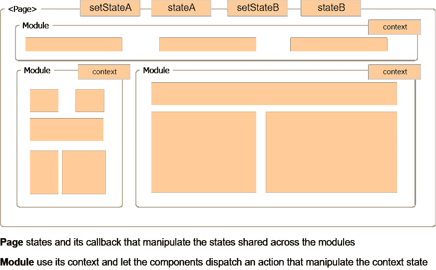

# 在 React 中创建页面

> 原文：<https://dev.to/aziziyazit/create-page-in-react-1mj6>

## 页面

页面可以被定义为模块的容器。Page 是其模块(容器子代)的最近的共同祖先。

创建页面的一个重要技巧是[提升状态](https://reactjs.org/docs/lifting-state-up.html)。我们之所以不在页面中使用上下文 API，是因为我们希望限制页面级别的重新呈现。

> 当最近的组件更新时，这个钩子(useContext)将触发一个 rerender，将最新的上下文值传递给 MyContext 提供程序。
> (反应文件)

[你可以在这里参考“在 React 中创建模块”的文章](https://dev.to/aziziyazit/create-module-in-react-5gg)

### 页面为 moduleA 和 moduleB 最接近的共同祖先

```
function PageA() {
 const [stateA, setStateA] = useState('')
 const [stateB, setStateB] = useState('')

 return (
  <div>
   <moduleA setStateA={setStateA} stateB={stateB} />
   <moduleB setStateB={setStateB} stateA={stateA} />
  </div>
 )

} 
```

### moduleA

```
function moduleA(props) {
 const { setStateA, stateB } = props
 const moduleAContextValue = {setStateA, stateB}

 return (
  <ModuleAContext.Provider value={moduleAContextValue}>
   <componentA1 />
   <componentA2 />
  </ModuleAContext.Provider>
 )

} 
```

### moduleB

```
function moduleB(props) {
 const { setStateB, stateA } = props
 const moduleBContextValue = {setStateB, stateA}

 return (
  <ModuleBContext.Provider value={moduleBContextValue}>
   <componentB1 />
   <componentB2 />
  </ModuleBContext.Provider>
 )

} 
```

### 组件可能是这样的

```
function componentA1() {
  const moduleAContext = useContext(ModuleAContext)
  const { stateB, setStateA } = moduleAContext

  function handleClick() {
   setStateA('state A')
  }

  return (
   <div onClick={handleClick}>{stateB}</di>
  )

} 
```

页面状态和模块上下文如下所示:

[](https://res.cloudinary.com/practicaldev/image/fetch/s--KB83o6xy--/c_limit%2Cf_auto%2Cfl_progressive%2Cq_auto%2Cw_880/https://thepracticaldev.s3.amazonaws.com/i/g0iesl40ah2gvsr7e0if.png)

> 页面使用称为提升状态的技术来管理模块之间的通信。而模块使用上下文 API (createContext & useContext)和 useReducer 管理组件之间的通信。

### 下一系列

在下一篇文章中，我们将讨论管理页面之间的通信,“页面通信管理器”可以是 Redux、Router 或[自定义钩子](https://github.com/dai-shi/reactive-react-redux)。

### 代码

所有的代码示例都可以在这里查看 [Codesandbox](https://codesandbox.io/s/react-architecture-c1rx2?fontsize=14)