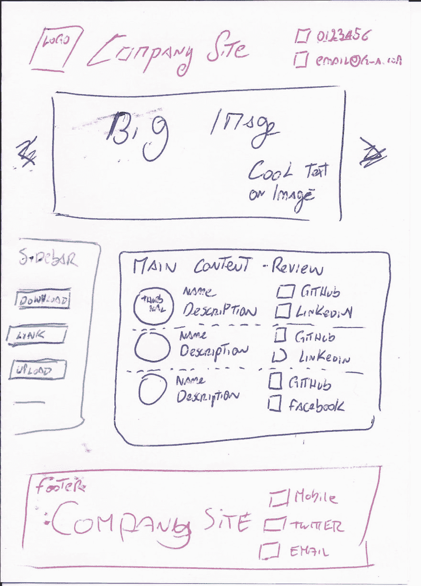
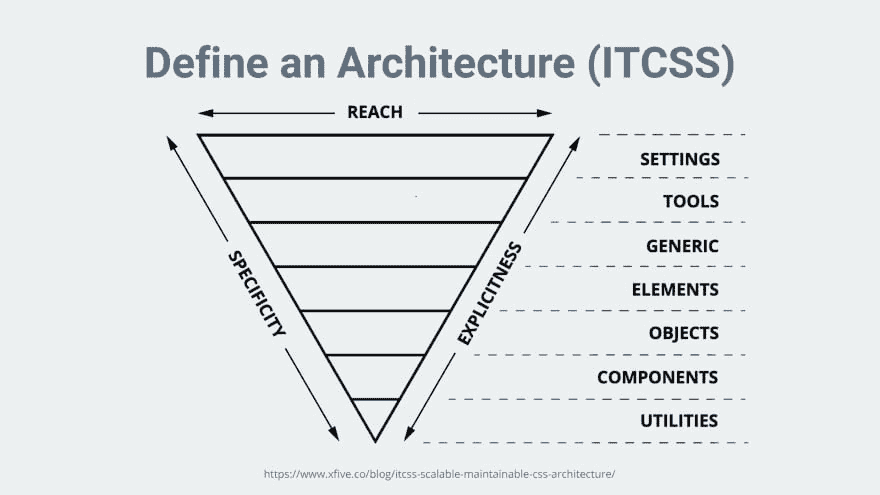
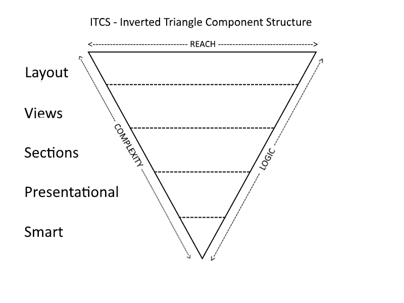

# ITCS 倒三角组件结构

> 原文：<https://dev.to/thisdotmedia/itcs-inverted-triangle-components-structure-3nan>

今天的大多数框架通过提供基于组件的架构为用户提供了极大的灵活性。这是为了将一个项目分成可重用的、小的、简单易懂的代码块，就像乐高积木一样。

不幸的是，现实并不像“hello world”的例子让我们相信的那样美好。组件定义良好，所有的文件夹都非常有意义。但是随着项目的发展，一切都开始变得有点混乱。

组件太多，它的结构实际上开始成为负担。

在这篇博文中，我将分享我的经历，这是我职业生涯中犯下的许多错误的结果。本文旨在通过提供有用的技巧和资源来帮助您创建一个结构良好的代码库，从而避免我的错误。

我们将使用 VueJs 作为选择的框架，但是讨论的大多数主题都是有意义的，并且可以适用于不同的框架。

放弃

我会尝试用参考资料来支持我的大部分决定，但最终大部分决定都是个人的，你完全可以根据你的个人项目来调整它们。

## 网站创意

每个伟大的产品都始于一个简单的想法。我们的文章将遵循同样的方法。

我们正在绘制一个简单的草图，并用它来构建我们的应用程序。本文将涵盖以下主题:

*   设计一个文件夹结构，将支持我们的应用程序的增长

*   定义什么是好的组件

## 草图

[](https://res.cloudinary.com/practicaldev/image/fetch/s--o0G4uAwD--/c_limit%2Cf_auto%2Cfl_progressive%2Cq_auto%2Cw_880/https://thepracticaldev.s3.amazonaws.com/i/k0ls94zo35h9mzmeqdvz.jpg)

草图可能看起来不太漂亮，但它会帮助我们面对第一个困境。我们如何把它分成不同的部分？这样做的最佳方法是什么？最后，哪一个是需要采取的第一步？

许多开发人员，包括年轻的我，会简单地通过定义以下组件来回答:

*   页眉

*   页脚

*   补充报道

*   主要内容

这非常有意义，用一把锋利的刀分割页面，直到我定义我的组件。这种方法实际上可能没有错，但在我看来，这不是我们应该开始的地方。

## 拆分设计

当我第一次开始使用其 CLI 提供的 vue started pack 时，我非常兴奋地进入了框架，以至于我没有注意到项目的实际结构，因此错过了以不同方式构建东西来支持我的应用程序的机会。

提议的实际设计对于快速设置您的项目非常有用，而且它们的结构没有任何问题。不幸的是，它们是为每个人而构建的，但是众所周知，每个项目都是独一无二的，可能需要特定的修改。

定义你的组件没有对错之分，但我通常喜欢将我的想法与 *ITCSS* (倒三角形 CSS)的构造方式结合起来。为了造型的目的而学习它，帮助我理解了 *CSS* “特异性”的核心。在我们的组件结构上使用相同的方法，应该为我们的每个项目创建一个良好的、强大的和可重用的基础。

如果你以前没有用过或者听说过 ITCSS，它是一种风格架构，将你的风格划分在不同的层。使用三个主要属性来形成层:**范围、特异性和明确性**。例如，在第一层，您将定义结构(例如，主体宽度)，随着您开始沿着金字塔向下，您将开始使组件更加具体，并减少它们在 DOM 上的范围(例如，设计一个没有类的简单按钮)，随着我们继续深入，您可能会开始创建按钮的不同迭代，以支持您的品牌(例如，button.cta-1，button.cta2)。

使用上面的方法，允许我在不同的项目中“重用”我的风格的最顶层，只需要应用小的修改。

[](https://res.cloudinary.com/practicaldev/image/fetch/s--vMb61lEd--/c_limit%2Cf_auto%2Cfl_progressive%2Cq_auto%2Cw_880/https://thepracticaldev.s3.amazonaws.com/i/x1w4vpq08es26dwok6pn.png)

今天我们将利用 *ITCSS* 的概念，创造一个新的术语**ITCS——倒三角形构件结构**。我们将要介绍的方法，可能与应用于 CSS 的基本原理不同，但对我们的目的仍然是有用的。

创建 CSS 和 JS 之间的桥梁，也将支持我们在应用程序中实现 ITCSS，同时能够充分利用基于组件的架构。vue 文件)

构建 big SPA 的一个常见错误是组件的定义，以及在应用程序中分离和组织组件的方法。与 ITCSS 一样，我们将考虑三个方面来分离我们的组件:范围、逻辑和复杂性。

**Reach:** 这是组件对主 UI 的影响程度。布局组件有很大的范围，而特定的按钮可能很小。

**逻辑:**这是业务逻辑。您在轴中的位置越高，您的组件包含的业务逻辑就越少。在理想的情况下，金字塔的前几层应该在项目中共享，因为它们没有“项目”特定的逻辑。

复杂性:这个术语通常指的是愚蠢和聪明。随着我们沿着金字塔往下走，组件预计会变得更加复杂。

[](https://res.cloudinary.com/practicaldev/image/fetch/s--cmtqarlM--/c_limit%2Cf_auto%2Cfl_progressive%2Cq_auto%2Cw_880/https://thepracticaldev.s3.amazonaws.com/i/0wvl4n6nme9i7is8bkar.png)

## 各层

需要注意的是，本文将主要讨论关于组件的一些方面，而不会涉及诸如资产、混合、条目文件或应用程序中可用的其他文件等信息。

既然我们的金字塔已经建好，是时候填补这些空缺并开始为我们的 web 应用程序引入一些结构了。如果我们考虑我们方法的三个主要支柱，我们的第一层和最顶层将被**布局**类型的组件占据。

### 布局

布局组件在 VueJs 中被称为名为 slot 的*，并且可以在 React 中使用更高阶的组件进行复制。这一层将包括公开高层次的**达到**，是**简单**实现，并且没有**业务逻辑的组件。*** 

```
<template>
  <header>
    <slot name="header"></slot>
  </header>
  <main>
    <slot></slot>
  </main>
  <footer>
    <slot name="footer"></slot>
  </footer>
</template> 
```

Enter fullscreen mode Exit fullscreen mode

一些网站可能最终只建立在一个单一的布局上，但这并不意味着不应该实现布局层。实施它的好处如下:

*   该组件中的所有样式都可以与 ITCSS 中的通用层进行比较

*   允许我们在未来轻松改变布局和/或风格

*   可以很容易地进行单元测试

*   它为未来的布局提供了一个脚手架

如果你想了解更多关于这种方法的信息，请阅读下面标题为[的文章，这里是如何用 Vue 和 Vue-router](https://itnext.io/anyway-heres-how-to-create-a-multiple-layout-system-with-vue-and-vue-router-b379baa91a05) 创建一个多布局系统

### 视图

现在我们的层已经完全定义好了，是时候为我们的 *ITCS* 结构:**视图引入另一层了。**

该层将是所有先前定义的*布局*的主页。通常这些组件也被称为页面，因为它们将类似于我们网站的页面。

```
<layout-main>
 <template v-slot:header>
   <s-logo ></s-logo>
   <s-navbar></s-navbar>
   <s-social ></s-social>
 </template>

 <template v-slot:default>
   <s-sidebar ></s-sidebar>
   <s-main></s-main>
   <s-advertisement></s-advertisement>
 </template>

 <template v-slot:footer>
   <s-social></s-social>
   <s-links></s-links>
 </template>
</layout-main> 
```

Enter fullscreen mode Exit fullscreen mode

### 章节

当我们说明我们的*视图*层时，我们用一组组件填充了我们的命名槽。这些将占据我们的下一个金字塔层——**部分。**

与我们之前的图层相比，这些部分将会有一个有限的**范围**，但是它们的设计仍然非常**简单**。所有的*部分*组件都应该有**稀缺或缺失的业务逻辑**。

部分，使我们能够轻松地构建多个视图。例如，我们可以创建一个新层，并简单地从这个页面中删除侧边栏，或者添加一个幻灯片(`<s-slideshow>`)。该组件主要职责是利用金字塔的下两层，**表象型**和**智能型**组件。

这两个部分相互依赖，它们在金字塔中的位置没有严格定义。

我个人倾向于首先使用表示组件，原因如下:

*   它们帮助我构建它们，而不需要链接到它的逻辑使用(这使得它们更加可重用)

*   它们开发起来更快，并且有助于构建快速的生命周期(产品所有者能够更早地对成品的外观进行评论)。

### 表象成分/哑成分

这一层是*表示组件*的家。这个名字来源于这样一个事实，即这个组件的主要职责是在 DOM 中定义它的 UI 和定义，它不应该包含任何业务或状态逻辑。这些在官方的 VueJs 风格指南文档中被称为**基础组件。**

基础组件可以在内部开发，也可以从第三方 UI 库中派生。我们将在下面分析这两个方面。

#### 在房屋构件中

如上所述，表示组件的主要目的是定义由框架呈现的 DOM 元素。除了 UI 方面，这一层还将负责创建方法和事件处理程序，这些方法和事件处理程序稍后将用于为我们的 it 提供额外的功能。例如，一个 BaseButton 将拥有所有需要的 HTML、一个用于其名称的 prop(或一个 slot)和一个为 click 事件定义的方法。该方法将只在。vue 模板，不会有任何相应的 JS(或者如果有，也只是一个占位符)。

```
<template>
 <button @click="onClick($event)">{{name}}</button>
</template>

<script>
export default {
 name: "pButton",
 props: {
   name: String
 },
 methods: {
   onClick: function(event) {
     alert(this);
   }
 }
};
</script>

<style scoped>
button {
 background-color: red;
 color: White;
 padding: 10px 15px;
 border-radius: 5px 5px;
 border: none;
 box-shadow: 2px 1px lightgray;
}
</style> 
```

Enter fullscreen mode Exit fullscreen mode

我通常喜欢使这些组件尽可能简单，然后在真正必要的时候创建更多的处理程序和属性(记住，这个组件只是定义 UI 中的处理程序，而不是它的实现)

#### 第三方库组件

如果您计划使用第三方 UI 库，表示层将包含所用组件的单独导入。这是一个非常有用的抽象方法，它使你与第三方库松散耦合，允许你在将来改变它，而不需要去改变其他组件。

```
Import { Checkbox } from 'specificUiLibrary';

Export default Checkbox 
```

Enter fullscreen mode Exit fullscreen mode

### 智能组件

最后，是时候定义我们金字塔的最后也是最复杂的一层了。处于金字塔的底部，这一层将展示出**低层次的 reach** ，包括**高层次的业务逻辑**，并且有时可能是**复杂**。

一个智能组件，通常会通过为其现有的 *UI* 提供一组相关的**业务逻辑**和**功能**来扩展一个表示组件。

在下面的例子中，我们将利用上面的表示组件，向它添加特定的业务逻辑。

```
<script>
import pButton from "./HelloWorld";
import { submitForm } from "BusinessLogic";

export default {
 extends: pButton,
 props: {
   formValid: Boolean
 },
 methods: {
   onClick: function(event) {
     if (this.formValid) {
       submitForm(event);
     }
   }
 }
};
</script> 
```

Enter fullscreen mode Exit fullscreen mode

可能需要多层表示/智能组件，这应该通过良好的命名/文件夹结构来实现。阅读下面提到的 vue 官方文档以获得关于这个主题的更多信息是有益的。

让实际的组件尽可能小，并把不需要嵌入模板的代码导出到它自己的文件中(在我们的示例 BusinessLogic 中)通常是一个好的做法。这样做不仅会使组件保持较小，而且还会支持我们简单地对组件和逻辑应用单元测试。

## 总结

本文中涉及的主题非常主观，我所描述的应该用于定义您自己的实现，并且应该做一些小的修改来满足您的需求。

人们试图在发布日期前一周构建一个结构，并使用这种方法来支持您构建一个稳定的结构，以从一开始就支持您的应用程序的增长，这种情况太常见了。

采用这种方法主要优点是:

*   易于理解:由于各层的明显区别

*   易于单元测试

*   易于开源

*   整个应用程序中定义的抽象级别

*   支持“初级”开发人员，允许他们专注于小单元

我希望你会发现 ITCS 的方法对你有好处，并且它会服务和支持你的发展，就像它对我一样。

## 参考文献

[https://www . creative bloq . com/we B- design/manage-large-CSS-projects-itcss-101517528](https://www.creativebloq.com/web-design/manage-large-css-projects-itcss-101517528)

[https://vuejs.org/v2/style-guide/](https://vuejs.org/v2/style-guide/)

[https://nuxtjs.org/guide/directory-structure/](https://nuxtjs.org/guide/directory-structure/)

[https://it next . io/how-to-structure-a-vue-js-project-29 E4 DD C1 aeeb](https://itnext.io/how-to-structure-a-vue-js-project-29e4ddc1aeeb)

这篇文章是由西蒙·科莫写的，他是[这个点](https://thisdot.co)的高级软件工程师。

你可以在推特上关注他们，电话是 [@zelig880](https://dev.to/zelig880) 。

需要 JavaScript 咨询、指导或培训帮助吗？在 [This Dot Labs](https://thisdot.co) 查看我们的服务列表。