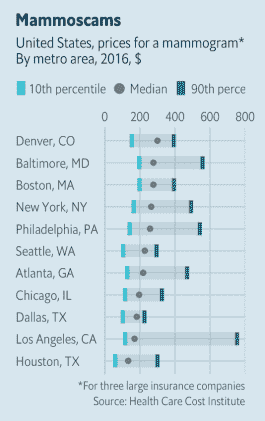

# 快速命中:用{ggeconodist}对发行版的不同(小)看法

> 原文：<https://dev.to/hrbrmstr/quick-hit-a-different-diminutive-look-at-distributions-with-ggeconodist-4gah>

尽管我是所有数字事物的正式居民，但我收到了相当数量的死树印刷杂志，因为没有什么比近距离亲自看到令人惊叹的大型全彩色印刷数据驱动的可视化更好的了。我也喜欢通过订阅来支持数据新闻，因为没有现金，我们只会有疯狂的、极端的左翼/右翼观点。

其中一份出版物是《经济学家》(The Economist)杂志(我也会订阅《金融时报》的非自由观点，但我现在不需要另一笔抵押贷款)。《经济学人》的图形人员是顶尖的 [](https://res.cloudinary.com/practicaldev/image/fetch/s--V92BH2Wf--/c_limit%2Cf_auto%2Cfl_progressive%2Cq_auto%2Cw_880/https://s.w.oimg/core/emoji/12.0.0-1/72x72/2122.png) ，他们是制作视觉效果时“做得更好”的灵感源泉。

在读了最近一期后，他们的一种可视化风格深深印在了我的脑海中。具体来说，这是一个关于乳房 x 光检查费用的故事。我把它放在下面:

[](https://i1.wp.com/rud.is/b/wp-content/uploads/2019/07/mammoscams-te-1.png?ssl=1)

本质上，这是一个剔除了异常值的箱线图，与我们习惯看到的相比，它有着明显不同的美学特征。我不会用它来进行探索性的数据分析，也不会在处理问题时与其他数据科学团队成员一起工作，但我真的很喜欢让“分布”更容易为普通观众所接受的想法，并且相信经济学人制图团队在关注基础(统计和美学)方面做得非常好。

在{ggplot2}中有很多方法可以手动删除类似的内容，但如果在决定使用分布图进行“生产”时，能够用`geom_boxplot()`替换某些内容就更好了。从而诞生了 [{ggeconodist}](https://cinc.rud.is/web/packages/ggeconodist/) 。

由于这只是一个“快速点击”的帖子，我们将避免一些临时的废话，以说明我们可以使用{ggplot2}(和{grid}的 *touch* )进行以下操作:

[](https://i2.wp.com/rud.is/b/wp-content/uploads/2019/07/mammoscams-gg-2.png?ssl=1)

只需一点点 R 代码:

```
library(ggeconodist)

ggplot(mammogram_costs, aes(x = city)) +
  geom_econodist(
    aes(ymin = tenth, median = median, ymax = ninetieth), stat = "identity"
  ) +
  scale_y_continuous(expand = c(0,0), position = "right", limits = range(0, 800)) +
  coord_flip() +
  labs(
    x = NULL, y = NULL,
    title = "Mammoscams",
    subtitle = "United States, prices for a mammogram*\nBy metro area, 2016, $",
    caption = "*For three large insurance companies\nSource: Health Care Cost Institute"
  ) +
  theme_econodist() -> gg

grid.newpage()
left_align(gg, c("subtitle", "title", "caption")) %>% 
  add_econodist_legend(econodist_legend_grob(), below = "subtitle") %>% 
  grid.draw() 
```

<svg width="20px" height="20px" viewBox="0 0 24 24" class="highlight-action crayons-icon highlight-action--fullscreen-on"><title>Enter fullscreen mode</title></svg> <svg width="20px" height="20px" viewBox="0 0 24 24" class="highlight-action crayons-icon highlight-action--fullscreen-off"><title>Exit fullscreen mode</title></svg>

### 鳍

未来的帖子(甚至可能是一个新的屏幕共享视频)将描述制作这个新的 geom、stat 和主题的过程(以及一些关于我如何设法为 vis 复制数据的信息，因为没有提供任何数据)。

在此期间，点击{ ggeconodist }上的 [CINC 页面](https://cinc.rud.is/web/packages/ggeconodist/)了解更多关于该套餐的信息。你*可能*想快速浏览一下 [{hrbrthemes}](https://cinc.rud.is/web/packages/hrbrthemes/) ，因为它*可能*有一些助手来使用所有需要的主题组件。

因此，踢踢轮胎，提交问题/公关，并留意导演对{ggeconodist}制作的剪辑。