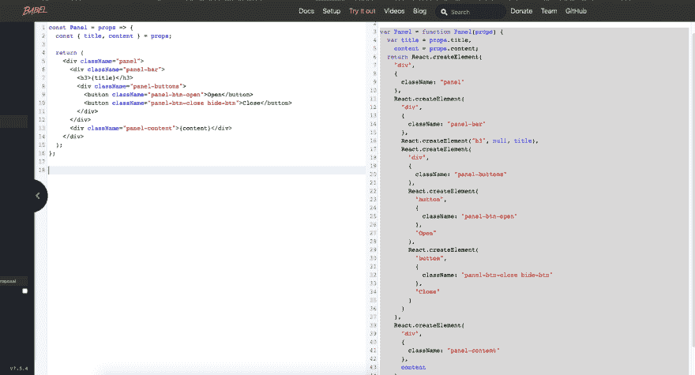

# 具有 document.createElement、React.createElement 和 JSX 的功能组件

> 原文：<https://dev.to/coffeecraftcode/functional-components-with-document-createelement-react-createelement-and-jsx-28kp>

上周，我旁听了 Lambda 学校的学生学习如何用 vanilla JS 创建可重用的功能组件。本周他们将学习如何在 React 中创建功能组件。我想在他们的知识之间架起一座桥梁，所以我采用了他们用 vanilla JS 编写的组件，并用 React.createElement 和 JSX 重新创建了它们。

所以让我们开始吧。首先，我们有一个普通的 JS 组件。目标是创建一个可重用的面板组件。(我已经删除了这篇博文不需要的一些代码和目标)
[https://codepen.io/cgorton/embed/RzzyvZ?height=600&default-tab=result&embed-version=2](https://codepen.io/cgorton/embed/RzzyvZ?height=600&default-tab=result&embed-version=2)

学生们学习了功能组件以及如何使用 document.createElement 向 DOM 添加元素。

我想展示如何用 React.createElement 和 JSX 的“反应方式”做到这一点。
我们先来看看 React.createElement。

## React.createElement

```
var Panel = function Panel(props) {
  var title = props.title,
    content = props.content;
  return React.createElement(
    "div",
    {
      className: "panel"
    },
    React.createElement(
      "div",
      {
        className: "panel-bar"
      },
      React.createElement("h3", null, title),
      React.createElement(
        "div",
        {
          className: "panel-buttons"
        },
        React.createElement(
          "button",
          {
            className: "panel-btn-open"
          },
          "Open"
        ),
        React.createElement(
          "button",
          {
            className: "panel-btn-close hide-btn"
          },
          "Close"
        )
      )
    ),
    React.createElement(
      "div",
      {
        className: "panel-content"
      },
      content
    )
  );
}; 
```

<svg width="20px" height="20px" viewBox="0 0 24 24" class="highlight-action crayons-icon highlight-action--fullscreen-on"><title>Enter fullscreen mode</title></svg> <svg width="20px" height="20px" viewBox="0 0 24 24" class="highlight-action crayons-icon highlight-action--fullscreen-off"><title>Exit fullscreen mode</title></svg>

从上面的代码中可以看出 React.createElement 的方式非常类似于使用 document.createElement

### React.createElement

```
React.createElement(
          "button",
          {
            className: "panel-btn-open"
          },
          "Open"
        ), 
```

<svg width="20px" height="20px" viewBox="0 0 24 24" class="highlight-action crayons-icon highlight-action--fullscreen-on"><title>Enter fullscreen mode</title></svg> <svg width="20px" height="20px" viewBox="0 0 24 24" class="highlight-action crayons-icon highlight-action--fullscreen-off"><title>Exit fullscreen mode</title></svg>

### 文档。CreateElement

```
 const buttonOpen = document.createElement('button');
 buttonOpen.classList.add('panel-btn-open');
 buttonOpen.textContent = 'Open'; 
```

<svg width="20px" height="20px" viewBox="0 0 24 24" class="highlight-action crayons-icon highlight-action--fullscreen-on"><title>Enter fullscreen mode</title></svg> <svg width="20px" height="20px" viewBox="0 0 24 24" class="highlight-action crayons-icon highlight-action--fullscreen-off"><title>Exit fullscreen mode</title></svg>

我们创造了一个元素。在本例中是一个 div。我们给它一个类，panel-btn-open，并给它它的文本内容，“open”

这两种方法都很好，但是非常冗长。这就是 JSX 的用武之地。

## JSX

JSX 看起来几乎和 HTML 一模一样，但是它能够使用 JavaScript 为你的组件添加更多的功能。下面是我们在 JSX 的代码的一个例子，通过使用 React.createElement 来比较它的外观

[](https://res.cloudinary.com/practicaldev/image/fetch/s--gkJST_4X--/c_limit%2Cf_auto%2Cfl_progressive%2Cq_auto%2Cw_880/https://thepracticaldev.s3.amazonaws.com/i/nyudqteoctwa2jmvyy0g.png)T3】

```
const Panel = props => {
  const { title, content } = props;

  return (
    <div className="panel">
      <div className="panel-bar">
        <h3>{title}</h3>
        <div className="panel-buttons">
          <button className="panel-btn-open">Open</button>
          <button className="panel-btn-close hide-btn">Close</button>
        </div>
      </div>
      <div className="panel-content">{content}</div>
    </div>
  );
}; 
```

<svg width="20px" height="20px" viewBox="0 0 24 24" class="highlight-action crayons-icon highlight-action--fullscreen-on"><title>Enter fullscreen mode</title></svg> <svg width="20px" height="20px" viewBox="0 0 24 24" class="highlight-action crayons-icon highlight-action--fullscreen-off"><title>Exit fullscreen mode</title></svg>

在我看来，这比前两种方式更容易阅读和理解。我们正在创建每一个元素，给它们类名和文本内容，就像我们之前做的一样。

这是用 document.createElement、React.createElement 和 JSX 创建组件的快速比较，希望有助于解释如何使用它们。你可以看看这个代码沙箱，看看这里使用的所有代码，看看我们将如何使用 props，以及一种获取数据的方法。
[https://codesandbox.io/embed/3qw2c](https://codesandbox.io/embed/3qw2c)