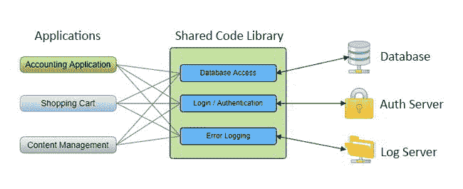

# 可重用代码:好的、坏的和丑陋的

> 原文：<https://dev.to/pluralsight/reusable-code-the-good-the-bad-and-the-ugly-3do6>

神话般的“可重用代码”思想已经存在了几十年。它在第一行代码编写后不久就出现了。我们宣扬可重用性，有时也为之奋斗，但这很少成为现实。这些年来，我看到了不同程度的成功。从“我们有一个 75%的人都在使用的可重用库”到“我们在这里共享代码库，但是从来没有在你的项目中使用它们”。

最近的一次讨论让我想到了这个问题。为什么没有更多的软件开发组织共享代码库？是那些头发尖尖的老板们阻止了它？团队冲突？还是开发商自己？

这一次我们不能责怪那些头发尖尖的老板。如果你向管理层解释可重用代码的基本概念，大多数人会同意这是个好主意。一次建一个东西，就不用反复建了？很容易找到好的一面。

团队冲突也可能是原因之一，通常是人们对谁来决定共享什么代码有分歧。开发人员自己也可能会反对，因为没有足够的时间来构建它们。

所有这些都是导致缺乏采用的因素，但是你应该问的问题是我们到底需要可重用的代码库吗？

### 什么是共享库，我们为什么关心？

如果您的开发人员正在构建的任务包含您可以用于其他用途的代码，您可以将该代码放在它自己的“库”中以供以后使用。这可以是一个 DLL，一个代码片断的文件夹，一个节点模块，等等。连接到数据库？没有理由为每一个访问数据库的软件编写代码。创建一个 DB_Connect 类，并把它放在一个文件中，以后可以复制到另一个项目中。

很简单。你拿一个函数，如果它足够抽象，参数化它，并使它可供其他项目使用。当您开始项目时，您不必编写代码来连接数据库、提取库并输入您的参数。以下是一些优点:

*   您只需编写一次代码，就可以多次使用(节省周期时间)
*   如果测试彻底，它会减少回归误差
*   它强制执行其他团体可以遵循的标准

这些都是使用共享库的好理由。关于代码重用的文章和书籍不计其数，大多数人对此都很熟悉。这样做的最大卖点是不必一遍又一遍地编写“无聊的东西”,也不必在野外对相同的方法进行大量的修改。这样可以腾出时间来开发令人兴奋的功能。

### 它们是如何使用的？

以下是共享库在商业中的一些使用方式:

*   **内部使用**与内部团队共享并用于项目的代码
*   **外部使用**为组织外的程序员设计的代码
*   **分叉** -用户可以获取你的初始代码并“分叉”它，使它为他们的特定需求服务

这符合软件开发的 DRY 原则。不要重复自己。

### 我们想要共享代码库吗？

为什么不是每个人都这样做？您的组织可能有充分的理由避免共享库。不是每个项目或团队都能从中受益，也不是解决所有开发问题的灵丹妙药。以下是不使用代码库的一些原因。

*   如果你把某样东西放进图书馆，每个人都使用它，这并不意味着它不是坏的。低效的数据库连接器设计意味着每个人都在使用低效的数据库连接器。对实现的更改仍然会产生负面的级联效应。一个 API 的小变化可能意味着每个系统都崩溃了。

*   依赖地狱(Dependency Hell)-如果每一个软件都依赖于你的库，那么就存在紧密耦合。将会有无数的依赖，例如，依赖 Angular 这样的框架。如果你有一个特定版本的软件，升级它会在你的应用程序中产生连锁反应。

*   不灵活的设计——有时候你会被要求以一种与你实际需要不同的方式使用一个设计。因为“其他所有人都在这么做”，所以你不得不让你的代码绕过它，这会增加开发时间。等等，我们当初为什么要建立共享库？

*   编程语言锁定——我听过太多次“我们的库是用 ____ 写的，所以你必须使用它”，这意味着你被锁定在单一的编程语言中。这会导致在工作中使用错误的工具。
    所以不要以为因为你的团队不使用共享库就意味着他们不开明，不想要更好的产品。

### 如果想使用可重用代码库，要考察什么

如果你正在考虑创建可重用的代码库，你应该首先看看这样做是否有意义。

*   仔细看看设计 -然后再看一遍。真的会从中受益吗？现在有没有重码？有什么问题可能会鼓励紧耦合吗？
*   仔细检查你的依赖关系 -你是否在创造依赖关系，让其他人不得不绕开它？它们多久改变一次？他们能绕过你创造的吗？
*   **尽可能开始抽象**——你希望你的库是高度抽象的，以便它们执行预期的功能，但是可以被覆盖或扩展以满足特定的用例。给他们基本的东西，但让他们按照自己喜欢的方式发展。

### 如何让开发者实现它们

所以你决定要一个共享库。以下是一些帮助团队采用你的库的方法:

*   从现有项目中窃取它 -这是创建新库最简单的方法。拿一个现有的项目，去掉所有专门化的东西，保留所有可以重复使用的、可靠的东西。

*   **彻底测试它**——你最不想做的事情就是把问题引入软件。构建抽象库后，彻底测试它，这样你就可以依赖它，并帮助开发人员找到回归。不要给他们垃圾，还指望他们用。

*   **检查所有当前用例**——通过深入研究和了解人们将如何使用你的库，你可以确定它是否会让他们受益，以及是否做出改变。一种方法接一种方法地做，以确保你要求他们使用对他们来说最省力的方法。
    像商业中的大多数事情一样，成功来自良好的沟通。在这里，自顶向下的设计不是你的朋友，你需要检查团队的需求，并根据这些需求设计一个库。

### 结论

我参与的大多数组织都不使用共享代码库。它们通常以某种形式朝着一个目标努力，只有两个目标已经实现并且运行良好。

在一个极端，你有一个模式，所有重复的代码都在一个库中。另一方面，你没有代码库，每个人都为自己的项目开发软件。你会在两者之间找到成功。你向每个极端倾斜的程度将取决于你的需要。

有些抽象的功能应该总是共享的。想到的一些是认证/授权、数据库连接和日志记录。它应该是你开发的一个共享库，或者是一个开源的由别人构建的库。其他的都要考察，考虑整体设计。

不要妄下结论，接下一个大项目去构建一个庞大的代码库，这会让开发者的日子更不好过。但是不要完全排除这个想法。要有目的性和观察力，找到最适合你的项目的策略。