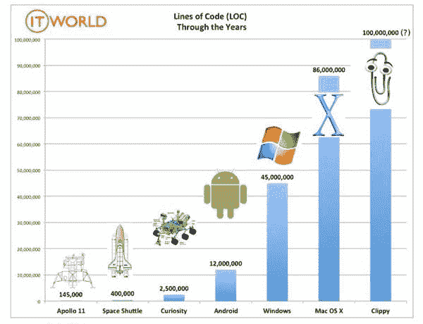
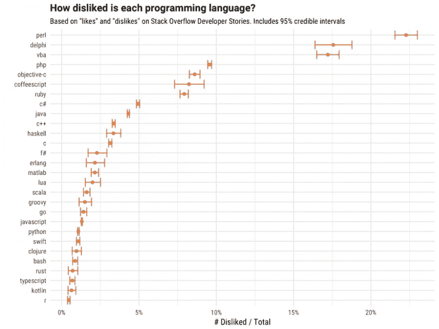

# 所有开发人员都应该在大学里学习的东西

> 原文：<https://dev.to/taillogs/what-developers-should-actually-learn-in-college-2nen>

## 忘掉“代码行”

T3】

[Source](https://images.techhive.cimg/article/2015/09/historic_loc-chart-100615917-large.idge.jpg)

作为一名开发人员，你会听到很多疯狂的、难以置信的关于“代码行”意味着什么的理论。一个都不相信。代码行数是一个荒谬的决策依据。在极少数情况下，它会告诉你一些东西，在所有其他情况下，它什么也不会告诉你。使用代码行来做决策就像用页数来评定书的质量。

有些人可能会认为应用程序中的代码行越少，就越容易阅读。这只是部分正确，我对可读代码的衡量标准是:

*   代码应该一致
*   代码应该是自描述的
*   代码应该被很好地记录
*   代码应该利用稳定的现代特性
*   代码不应该过于复杂
*   代码不应该是无性能的(不要故意写缓慢的代码)

一旦减少代码行的数量影响到其中任何一行，就会成为一个问题。实际上，它几乎总是会干扰，因此几乎总是一个问题。但是事情是这样的，如果你努力达到上述标准，你的代码将会是完美的行数，不需要计算。

## 语言不一定“好”或“坏”

*Except for php, just kidding. [Source](https://stackoverflow.blog/wp-content/uploads/2017/10/languages-1-900x675.png)*

我看到人们一直在说这样的话:

> c 比 X 好，因为性能

> Python 比 X 好，因为简洁

> Haskell 比 X 强，因为外星人

那种认为语言对比可以简化为一句话的想法几乎是一种侮辱。它们是语言，不是口袋妖怪。

不要误会，语言之间肯定是有差异的。只是，很少有“不能用”的语言(虽然有很多过时/死亡的语言)。每种语言都有自己独特的权衡。在这方面，语言类似于工具箱中的工具。螺丝刀能做锤子做不到的事，但你会说螺丝刀比锤子好吗？

> 显然锤子更好

在我谈论我如何评价语言之前，我想澄清一些事情。很少有情况下语言选择真的很重要。有些事情在某些语言中你显然不能做。如果你写前端代码，你没有语言选择。但是一般来说，语言选择通常是项目中最不重要的问题之一。

这里是核心方面(有序的)，我相信应该支配你的语言选择(这些是它的口袋妖怪统计)

*   可用在线资源的密度(堆栈流量密度)
*   发展速度(vroom vroom)
*   错误倾向(eeek)
*   包装生态系统的质量和广度(是 npm，它说的是质量)
*   性能特征(更多点)
*   可移植性(抱歉，COBOL)

也有一些强耦合超出了您的控制范围。如果你从事数据科学，实际上你需要使用 Python、R 或 Scala(也许是 Java)。如果这是一个爱好项目，用任何能让你最开心的东西。我只有一条不可妥协的原则。我拒绝使用没有我会遇到的大部分问题，直接在 StackOverflow 上解决的语言。不是我解决不了，只是不值得花时间。

## 阅读别人的代码很难

[Source](http://www.sph.as/why-bible-reading-can-be-hard-for-kids-and-what-to-do-about-it/)

阅读其他人的代码是困难的。罗伯特·c·马丁在《干净的代码》中谈到了这一点:

> 事实上，花在阅读和写作上的时间比远远超过 10 比 1。作为编写新代码工作的一部分，我们不断地阅读旧代码。...[因此，]使其易于阅读也就更易于书写。

很长一段时间，我认为我只是不擅长阅读别人的代码。随着时间的推移，我意识到这是几乎每个程序员每天都要面对的问题。读别人的代码几乎感觉像在读外语。即使您对作者的编程语言选择感到满意，您仍然需要适应不同的风格和架构选择。这还假设作者编写了一致且可靠的代码，这些代码可能是命中的，也可能是未命中的。这是一个很难克服的困难。我发现有几件事很有帮助。

审查其他人的代码将极大地提高你的代码阅读技能。在过去的两年里，我回顾了不少 Github 的公关。每一次公关，我都觉得阅读其他人的代码稍微舒服一些。出于这些原因，Github 的公关尤其出色

*   可以随时练习，只要找一个你觉得自己想贡献的开源项目就可以了。
*   在限定范围的上下文中练习阅读(驱动 PR 的特性或 bug)。
*   需要注意细节，这将迫使你评估每一行。

第二种方法可以帮助你阅读其他人的代码，这种方法有点独特。这是我想出的一个技巧，它真的减少了我在一个外国代码库中感到舒适的时间。在查看了我想要阅读的代码的样式之后，我首先打开 vi，开始按照项目使用的样式编写代码。当你用新的风格写代码时，它也会提高你的阅读技巧。这种风格会让你感觉不那么陌生，因为你实际上已经体验过了。即使我只是在 Github 上随便浏览一个项目，我也会很快做到这一点。试试看。

## 你永远不会写出“完美”的代码

T3】

[Source](https://www.youtube.com/watch?v=WPoQfKQlOjg)

在我开始在团队中工作之前，我是一名“独狼”开发人员，做了 4 年。在大部分时间里，我只是有这样一个假设，即业内每个程序员都写出了完美的代码。我认为在我写出“完美”的代码之前，这只是一个时间和精力的问题。这是我过去非常担心的事情。一旦我加入了一个团队，我很快发现没有人能写出“完美”的代码。但是进入系统的代码几乎总是“完美的”，这是怎么回事呢？答案是，代码审查。

我和一个非常优秀的工程师团队一起工作。这些都是花钱能买到的最有能力、最自信的程序员。如果有人建议提交未评审的代码，我们团队的每一个成员(包括我)都会惊慌失措。即使你认为自己是下一个比尔·盖茨，你也会犯错。我说的甚至不是逻辑错误，我说的是错别字，漏字。一些你的大脑忽略了的事情，永远也不会注意到。你需要另一双眼睛去看的东西。

努力与那些关注细节并愿意批评你工作的人一起工作。起初，听取批评是困难的，但这是唯一持续改进的方法。在代码评审期间，尽最大努力不要变得具有防御性，并且永远不要把任何评论当成人身攻击。你不是你的代码。

当我审查其他人的代码时，我只是谷歌搜索他们做出的每个选择，看看它是否与强烈的流行意见不同。很多时候，用“初学者的思维”来看同一个问题，可以捕捉到这个人永远不会回头去看的东西。

## 做程序员并不意味着一天 8 小时编程

这是一个很常见的问题，但人们似乎从来没有给出一个明确的答案。

很少有人每天写代码超过 4 个小时

不同意这一点的人要么是规则的例外，要么在应该对他们更好的公司工作。编程是一项耗费脑力、集中注意力的任务。期望任何人一天 8 小时，一周 5 天写代码是完全不合理的。在极少数情况下，你需要在截止日期前完成任务，或者额外做一些事情，但是这种情况很少。当我说“罕见”的时候，我的意思是几乎从来没有。不要容忍一个工作场所虐待你，让你因为计划不周/招聘不足而加班。

需要说明的是，一天 8 个小时的积极编程甚至都不符合你公司的最佳利益。你的老板可能认为是这样，但这是短视的，忽视了对生产力和心理健康的长期影响。

澄清一下，我并不是建议你一天只工作四个小时。其他四个小时通常是最好的:

*   研究工作相关和非工作相关的主题
*   与同事讨论你的工作
*   帮助在工作中挣扎的同事
*   规划你未来的工作
*   代码审查
*   会议

我也强烈建议每天定时休息，锻炼身体(即使只是短暂的)。锻炼对精神疲劳的好处是有据可查的。我个人发现，如果我难以集中注意力，锻炼尤其有帮助。

更新:[/u/terriblesarcism 建议我添加一个开发者在他们不编程的 4 个小时里应该做什么](https://old.reddit.com/r/programming/comments/cdi3l0/things_all_developers_should_learn_in_college/)。我增加了一个章节来解决这个问题。

## 结论

这些是我希望他们在大学里教的一些东西，而不是纯理论。在写这篇文章的过程中，我想出了一大堆其他的东西，但是这些东西将会在下一篇文章中出现。