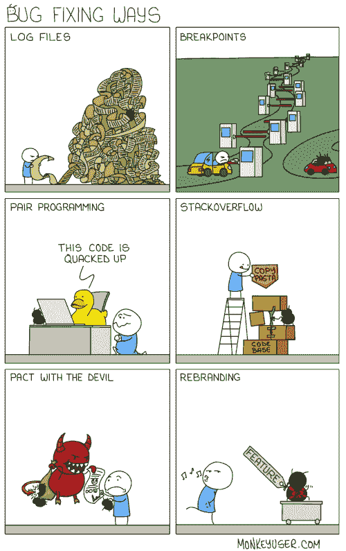
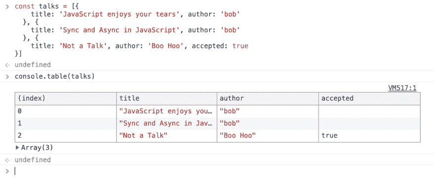
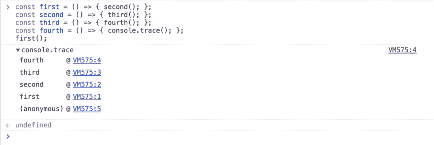

# bug:正常调试

> 原文：<https://dev.to/rfornal/bugs-sane-debugging-2ci8>

> “调试器不会删除 bug。他们只以慢动作展示它们。”未知

[](https://www.monkeyuser.com/2019/bug-fixing-ways/)

所有现代浏览器和大多数其他环境都支持“调试”...开发人员工具中的一个特殊用户界面，使得查找和修复错误更加简单。

在这篇文章中，我将讨论 Chrome(以及我的经历)；在这方面它可能是功能最丰富的浏览器。

要打开开发人员工具，请按 F12 (Mac: Cmd+Opt+I)。

在控制台工具中，可以使用以下方法:

*   ***查看记录的消息***
*   ***运行 JavaScript***
*   使用**控制台实用程序**与浏览器交互。

## 查看记录的消息

前端开发人员经常将消息记录到控制台，以确保他们的 JavaScript 按预期运行。为了记录消息，他们可以在 JavaScript 中插入类似于

`console.log('Hello, Console!')`

的表达式。当 JavaScript 执行并看到这样的表达式时，它知道应该将消息记录到控制台。

**console.log** 可以表示代码到达了某一点；它也可以用来显示一些变量的状态。记录消息有两个一般原因:

*   确保代码以正确的顺序执行。
*   检查某一时刻变量的值。

在用于记录消息的控制台 API 选项中，以下是一些使用案例:

*   **console.count** 可以用来查看一个函数被调用了多少次，一些代码被迭代了多少次。
*   **console.group** 和 **console.groupEnd** 可用于创建“流程摘要”。请记住，组可以嵌套...这在好的测井工具中非常有效。
*   **console.table** 可以用来更有效的显示表格数据。
*   **控制台.时间**和**控制台.时间结束**可以非常有效地用于跟踪各种进程的性能。

## 运行 JavaScript

控制台也是一个[REPL(Read-Eval-Print-Loop)](https://en.wikipedia.org/wiki/Read%E2%80%93eval%E2%80%93print_loop):一个简单的交互式计算机编程环境，它接受单个用户输入(即单个表达式)，对它们进行求值(执行)，并将结果返回给用户。JavaScript 可以在控制台中运行，与被检查的页面进行交互。

这里有一个坚实的互动教程...[开始在控制台中运行 JavaScript](https://developers.google.com/web/tools/chrome-devtools/console/javascript)

## 记录消息(控制台 API)

控制台 API 用于从 JavaScript 代码中向控制台写入消息。

### console.assert(表达式，对象)

**日志级别:**错误

当表达式计算结果为 false 时，将错误写入控制台。

[](https://res.cloudinary.com/practicaldev/image/fetch/s--HN2eF7TN--/c_limit%2Cf_auto%2Cfl_progressive%2Cq_auto%2Cw_880/https://thepracticaldev.s3.amazonaws.com/i/mxoij5hzarye2uro14ca.png)

### console.clear()

清除控制台。

如果启用了保留日志，console.clear()将被禁用。

### console.count(【标签】)

**日志级别:**信息

在同一行和同一标签中写入 count()被调用的次数。调用 console.countReset([label])来重置计数。

[](https://res.cloudinary.com/practicaldev/image/fetch/s---SQvxTzc--/c_limit%2Cf_auto%2Cfl_progressive%2Cq_auto%2Cw_880/https://thepracticaldev.s3.amazonaws.com/i/8wi5fv28jopqaka1h5c5.png)

### console.countReset(【标签】)

重置计数。

### console.debug(对象[，对象，...])

**日志级别:**信息

与 console.log 相同(对象[，对象，...]).

[](https://res.cloudinary.com/practicaldev/image/fetch/s--bQFmy2C2--/c_limit%2Cf_auto%2Cfl_progressive%2Cq_auto%2Cw_880/https://thepracticaldev.s3.amazonaws.com/i/t0falzz1kq8f8ley9snu.png)

### console.dir(对象)

**日志级别:**信息

打印指定对象的 JSON 表示。

[](https://res.cloudinary.com/practicaldev/image/fetch/s--p2GJoakN--/c_limit%2Cf_auto%2Cfl_progressive%2Cq_auto%2Cw_880/https://thepracticaldev.s3.amazonaws.com/i/t7ge98z6w7zmwuef0f4z.png)

### console.dirxml(节点)

**日志级别:**信息

打印节点后代的 XML 表示形式。

[](https://res.cloudinary.com/practicaldev/image/fetch/s---zygjQt8--/c_limit%2Cf_auto%2Cfl_progressive%2Cq_auto%2Cw_880/https://thepracticaldev.s3.amazonaws.com/i/2lqkov8crriafi4ec2kg.png)

### console.error(对象[，对象，...])

**日志级别:**错误

将对象打印到控制台，将其格式化为错误，并包含堆栈跟踪。

[](https://res.cloudinary.com/practicaldev/image/fetch/s--Eo2aBgxU--/c_limit%2Cf_auto%2Cfl_progressive%2Cq_auto%2Cw_880/https://thepracticaldev.s3.amazonaws.com/i/kgyd50r30uwy2sw2jfvj.png)

### 控制台.组(标签)

在调用 console.groupEnd(label)之前，以可视方式将消息分组在一起。当组最初登录到控制台时，使用 console.groupCollapsed(label)折叠组。

[](https://res.cloudinary.com/practicaldev/image/fetch/s--pA_rslFm--/c_limit%2Cf_auto%2Cfl_progressive%2Cq_auto%2Cw_880/https://thepracticaldev.s3.amazonaws.com/i/l9w42ziqi7ovou7zcl51.png)

### console . group 折叠(标签)

与 console.group(label)相同，只是该组在登录到控制台时最初是折叠的。

### console.groupEnd(标签)

停止对邮件进行可视化分组。

(参见 console.group)

### console.info(对象[，对象，...])

**日志级别:**信息

与 console.log 相同(对象[，对象，...]).

### console.log(对象[，对象，...])

**日志级别**:信息

将消息打印到控制台。

[](https://res.cloudinary.com/practicaldev/image/fetch/s--D4jQM-HS--/c_limit%2Cf_auto%2Cfl_progressive%2Cq_auto%2Cw_880/https://thepracticaldev.s3.amazonaws.com/i/tuc6wd9zrjk740cceb7n.png)

### (数组)

**日志级别:**信息

将对象数组记录为表格。

[](https://res.cloudinary.com/practicaldev/image/fetch/s--sqX0Am7w--/c_limit%2Cf_auto%2Cfl_progressive%2Cq_auto%2Cw_880/https://thepracticaldev.s3.amazonaws.com/i/6qozasa5safdz2o6oqas.png)

### 控制台.时间(【标签】)

启动新的计时器。调用 console.timeEnd([label])停止计时器，并将经过的时间打印到控制台。

[](https://res.cloudinary.com/practicaldev/image/fetch/s--iiaQ8Yd3--/c_limit%2Cf_auto%2Cfl_progressive%2Cq_auto%2Cw_880/https://thepracticaldev.s3.amazonaws.com/i/43jbzkjo4fc68w1rfpse.png)

### console.timeEnd(【标签】)

**日志级别:**信息

停止计时器。

(参见 console.time)

### console.trace()

**日志级别:**信息

将堆栈跟踪打印到控制台。

[](https://res.cloudinary.com/practicaldev/image/fetch/s--QQd2SG6c--/c_limit%2Cf_auto%2Cfl_progressive%2Cq_auto%2Cw_880/https://thepracticaldev.s3.amazonaws.com/i/xpe8rs7bfdm3hk0gwnrg.png)

### console.warn(对象[，对象，...])

**日志级别:**警告

向控制台打印警告。

[](https://res.cloudinary.com/practicaldev/image/fetch/s--k0iROxw3--/c_limit%2Cf_auto%2Cfl_progressive%2Cq_auto%2Cw_880/https://thepracticaldev.s3.amazonaws.com/i/j3u2phyngzhhn4w7rabr.png)

## 控制台实用程序

这些是我发现在调试中有用的一些实用程序...

### $_

$_ 返回最近计算的表达式的值。

[](https://res.cloudinary.com/practicaldev/image/fetch/s--mLUtgWpU--/c_limit%2Cf_auto%2Cfl_progressive%2Cq_auto%2Cw_880/https://thepracticaldev.s3.amazonaws.com/i/nuixafkwt7er28f2itci.png)

### $0 - $4

$0、$1、$2、$3 和$4 命令用作对“元素”面板中检查的最后五个 DOM 元素或“配置文件”面板中选择的最后五个 JavaScript 堆对象的历史引用。$0 返回最近选择的元素或 JavaScript 对象，$1 返回第二个最近选择的元素或对象，依此类推。

[](https://res.cloudinary.com/practicaldev/image/fetch/s--c4RYvcFJ--/c_limit%2Cf_auto%2Cfl_progressive%2Cq_auto%2Cw_880/https://thepracticaldev.s3.amazonaws.com/i/sqgknyqmcrpfm6mtq3q3.png)

### $(选择器，[startNode])

$(选择器)使用指定的 CSS 选择器返回对第一个 DOM 元素的引用。此函数是 document.querySelector()函数的别名。

**在返回的结果上右击**,选择‘在元素面板中显示’在 DOM 中找到它，或者‘滚动查看’在页面上显示它。

该函数还支持第二个参数 startNode，它指定一个“元素”或节点，从该节点搜索元素。该参数的默认值是 document。

> 如果您正在使用一个像 jQuery 这样的使用$的库，那么这个功能将被覆盖，$将对应于那个库的实现。

### $$(选择器，[startNode])

$$(选择器)返回与给定 CSS 选择器匹配的元素数组。该命令等效于调用 document.querySelectorAll()。

该函数还支持第二个参数 startNode，它指定要从中搜索元素的元素或节点。该参数的默认值是 document。

### 复制(对象)

copy(object)将指定对象的字符串表示形式复制到剪贴板。

[](https://res.cloudinary.com/practicaldev/image/fetch/s--BKP9Xs0G--/c_limit%2Cf_auto%2Cfl_progressive%2Cq_auto%2Cw_880/https://thepracticaldev.s3.amazonaws.com/i/afr6x2wdcgof2tnbijrq.png)

复制的对象可以粘贴到任何合适的地方。

### 调试(功能)

当调用指定的函数时，调试器被调用并在源代码面板上的函数内部中断，从而允许单步执行代码并进行调试。

```
debug(getData); 
```

<svg width="20px" height="20px" viewBox="0 0 24 24" class="highlight-action crayons-icon highlight-action--fullscreen-on"><title>Enter fullscreen mode</title></svg> <svg width="20px" height="20px" viewBox="0 0 24 24" class="highlight-action crayons-icon highlight-action--fullscreen-off"><title>Exit fullscreen mode</title></svg>

使用 undebug(fn)停止函数上的中断，或者使用 UI 禁用所有断点。

### dir(object)

dir(object)显示所有指定对象属性的对象样式列表。此方法是控制台 API 的 console.dir()方法的别名。

### dirxml(对象)

dirxml(object)打印指定对象的 xml 表示，如 Elements 选项卡中所示。此方法等效于 console.dirxml()方法。

### 检查(对象/功能)

inspect(object/function)打开并在适当的面板中选择指定的元素或对象:DOM 元素的“元素”面板或 JavaScript 堆对象的“配置文件”面板。

### getEventListeners(对象)

getEventListeners(object)返回在指定对象上注册的事件侦听器。返回值是一个对象，其中包含每个注册事件类型的数组(例如，click 或 keydown)。每个数组的成员都是描述为每种类型注册的侦听器的对象。

如果在指定的对象上注册了多个侦听器，则数组为每个侦听器包含一个成员。

### 监视器(功能)

调用指定的函数时，控制台会记录一条消息，指示函数名称以及调用该函数时传递给该函数的参数。

使用 unmonitor(功能)停止监控。

### monitorEvents(对象[，事件])

当指定的事件之一在指定的对象上发生时，事件对象被记录到控制台。您可以指定要监视的单个事件、事件数组或映射到预定义事件集合的通用事件“类型”之一。

## 我的一般做法

1.  设置不同的日志级别(错误、调试、警告等)。).
2.  使调试日志的打开和关闭变得简单。
3.  使得触发罕见事件的通知变得容易。
4.  使用人类可读的消息编码(比如 JSON)。
5.  组织好应用程序状态。
6.  发送某处不常见错误的堆栈跟踪。
7.  添加查看应用程序运行状态的方法。
8.  很好的评论和文档！

## 我的用例(定位功能)

> 调试[di:b^g-ing]
> 
> 1.  在一桩你也是凶手的案子里当侦探。

这里，我将列出我在控制台中调试时使用的“定位”功能。

### 控制台

这里的主要用例是一个**日志**服务，它可以通过存储在本地存储中的值来关闭和打开。在检查复杂逻辑的故障时，这种日志记录是非常宝贵的。

请注意， **console.group** 和 **console.groupEnd** 可以增加对所提供信息的更深层次的理解。

创建 **PROFILING** 服务时，看一下 ***console.time* *和**console . time end**；它们可以提供一套可靠的时间安排，这比自行开发的工具要容易得多。

### console.log

**console.log** 有一个有趣的用例，将值放在括号 **{ }** 中，通过属性值速记利用键/值命名，给出如下内容:

[](https://res.cloudinary.com/practicaldev/image/fetch/s--VJ3osWFy--/c_limit%2Cf_auto%2Cfl_progressive%2Cq_auto%2Cw_880/https://thepracticaldev.s3.amazonaws.com/i/ta8r52v34tmjj9jreus5.png)

### 复制

使用 copy 将允许复制复杂的结构，并将其放入编辑器中进行更仔细的检查。这个工具非常有价值。

## 结论

所有现代浏览器和大多数其他环境都支持“调试”...开发人员工具中的一个特殊用户界面，使得查找和修复错误更加简单。

这些是我使用的控制台的一些主要部分...这里记录了一些用例。我们并没有试图用控制台工具来移除 bugs 只是让他们慢下来。