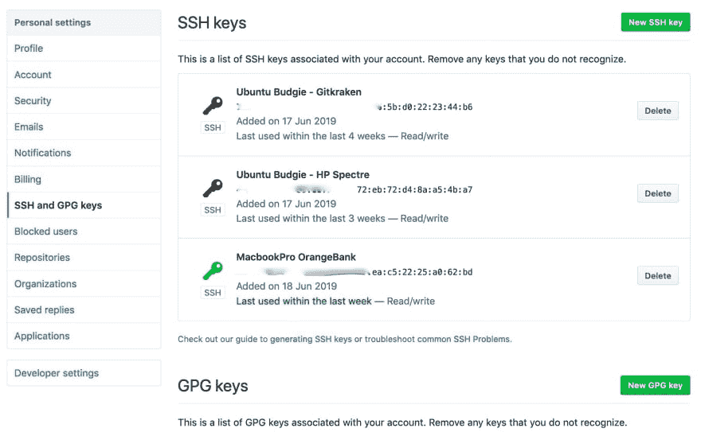
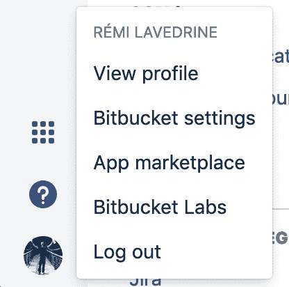

# 如何为多个 Github/Bitbucket 帐户设置多个 Ssh 密钥？

> 原文：<https://dev.to/shostarsson/how-to-setup-multiple-ssh-keys-for-multiple-github-bitbucket-accounts-2ji0>

*照片来自 [Jantine Doornbos](https://unsplash.com/@jantined) 上[Unsplash](https://unsplash.com)T5】*

大家好，

每次我得到一台新电脑(虽然不经常，但足够经常来写这篇文章)，我都在为我拥有的不同代码库帐户的 Git 配置而“挣扎”。

每次我有了新电脑，我都不记得几年前/几个月前我做了什么来正确设置它。因此，这篇文章更多是写给未来的我，而不是现在的你，因为你正在阅读它。🤔

* * *

### TL；博士；医生

总结一下我们要做的事情，我们将在 Github、Gitlab 和 Bitbucket 上为我们的个人和职业身份创建一组 SSH 密钥，并将它们添加到 SSH-Agent 中。
然后我们要根据主机用**配置**必须用哪个**键**。
然后我们要**给相应的服务** (Github，Gitlab，Bitbucket)添加相关的键。
因此，我们可以克隆、推送和拉取具有适当身份的存储库。
执行这些动作的每个命令如下所述。👨‍💻⬇️
享受。😎

* * *

## 简介

我在 [GitHub](https://github.com/) 、 [Bitbucket](https://bitbucket.org/) 和 [GitLab](https://about.gitlab.com/) 上有个人账户，在 GitHub、GitLab 和 Bitbucket 上也有一些工作账户。
我如何定义通过 SSH 密钥正常工作的一切，以便我的系统基于它必须使用的身份依赖于正确的 SSH 密钥。

对于这个特殊的职位，我们将连接每个帐户的个人和专业身份。但是你可以根据需要添加任意数量。😉

* * *

## 🔑密钥生成

我们将创建一些默认身份。

我们可以使用同一个 SSH 密钥来做到这一点，或者我们可以为每个帐户使用一个特定的密钥。
相同密钥:**id _ RSA**T3】每账户特定密钥:**id _ RSA _ github**；**id _ RSA _ bit bucket**； **id_rsa_gitlab**

让我们使用“**每个账户特定密钥**的方法。到时候大家理解概念就更清楚了。
此外，我们需要您用于这些账户的电子邮件地址
*，但是您可以随意做任何适合您需要的事情。*😉

### 👨‍💻🗝️个人密钥生成

#### ✍️信息必填

让我们用表格来总结一下我们需要的东西

| - | 默认 Github | Default Gitlab | Default Bitbucket |
| --- | --- | --- | --- |
| SSH 密钥名称 | id_rsa_github | id_rsa_gitlab | id_rsa_bitbucket |
| 电子邮件 | [name.github@gmail.com](mailto:name.github@gmail.com) | [name.gitlab@gmail.com](mailto:name.gitlab@gmail.com) | [name.bitbucket@gmail.com](mailto:name.bitbucket@gmail.com) |

#### 🛠️键创建

让我们运行这些命令来创建 SSH 密钥。

```
ssh-keygen -f "~/.ssh/id_rsa_github" -t rsa -b 4096 -C "name.github@gmail.com"
ssh-keygen -f "~/.ssh/id_rsa_gitlab" -t rsa -b 4096 -C "name.gitlab@gmail.com"
ssh-keygen -f "~/.ssh/id_rsa_bitbucket" -t rsa -b 4096 -C "name.bitbucket@gmail.com" 
```

<svg width="20px" height="20px" viewBox="0 0 24 24" class="highlight-action crayons-icon highlight-action--fullscreen-on"><title>Enter fullscreen mode</title></svg> <svg width="20px" height="20px" viewBox="0 0 24 24" class="highlight-action crayons-icon highlight-action--fullscreen-off"><title>Exit fullscreen mode</title></svg>

现在，我们有三把钥匙供自己使用。

### 🏢 🔑组织密钥生成

#### ✍️信息必填

让我们用表格来总结一下我们需要的东西

| - | Github 组织 | 组织 Gitlab | 组织位存储桶 |
| --- | --- | --- | --- |
| SSH 密钥名称 | id_rsa_github_companyName | id_rsa_gitlab_companyName | id_rsa_bitbucket_companyName |
| 电子邮件 | [name.github@company.com](mailto:name.github@company.com) | [name.gitlab@company.com](mailto:name.gitlab@company.com) | [name.bitbucket@company.com](mailto:name.bitbucket@company.com) |

#### 🛠️键创建

让我们运行这些命令来创建 SSH 密钥。

```
ssh-keygen -f "~/.ssh/id_rsa_github_companyName" -t rsa -b 4096 -C "name.github@company.com"
ssh-keygen -f "~/.ssh/id_rsa_gitlab_companyName" -t rsa -b 4096 -C "name.gitlab@company.com"
ssh-keygen -f "~/.ssh/id_rsa_bitbucket_companyName" -t rsa -b 4096 -C "name.bitbucket@company.com" 
```

<svg width="20px" height="20px" viewBox="0 0 24 24" class="highlight-action crayons-icon highlight-action--fullscreen-on"><title>Enter fullscreen mode</title></svg> <svg width="20px" height="20px" viewBox="0 0 24 24" class="highlight-action crayons-icon highlight-action--fullscreen-off"><title>Exit fullscreen mode</title></svg>

现在，我们有 3 把钥匙供组织使用。

### 📦将 SSH 密钥添加到 SSH 代理中

我们现在有 6 个 SSH 密钥。让我们将它们添加到 SSH 代理中。

```
# Add the personal keys
ssh-add ~/.ssh/id_rsa_github
ssh-add ~/.ssh/id_rsa_gitlab
ssh-add ~/.ssh/id_rsa_bitbucket

# Add the organisation keys
ssh-add ~/.ssh/id_rsa_github_companyName
ssh-add ~/.ssh/id_rsa_gitlab_companyName
ssh-add ~/.ssh/id_rsa_bitbucket_companyName 
```

<svg width="20px" height="20px" viewBox="0 0 24 24" class="highlight-action crayons-icon highlight-action--fullscreen-on"><title>Enter fullscreen mode</title></svg> <svg width="20px" height="20px" viewBox="0 0 24 24" class="highlight-action crayons-icon highlight-action--fullscreen-off"><title>Exit fullscreen mode</title></svg>

因此，在 SSH-Agent 中有 3 个供我们个人使用的密钥和 3 个供我们组织使用的密钥。

现在，必须设置配置，以便根据上下文定义必须使用哪个键。

* * *

## 📝配置

打开`~/.ssh/config`文件，如果它不存在，则创建它。

```
nano ~/.ssh/config 
```

<svg width="20px" height="20px" viewBox="0 0 24 24" class="highlight-action crayons-icon highlight-action--fullscreen-on"><title>Enter fullscreen mode</title></svg> <svg width="20px" height="20px" viewBox="0 0 24 24" class="highlight-action crayons-icon highlight-action--fullscreen-off"><title>Exit fullscreen mode</title></svg>

我们将根据主机定义一些规则。

```
Host github.com
  HostName github.com
  IdentityFile ~/.ssh/id_rsa_github

Host gitlab.com
  HostName gitlab.com
  IdentityFile ~/.ssh/id_rsa_gitlab

Host bitbucket.org
  HostName bitbucket.org
  IdentityFile ~/.ssh/id_rsa_bitbucket

Host companyname.github.com
  HostName github.com
  IdentityFile ~/.ssh/id_rsa_github_companyName

Host companyname.gitlab.com
  HostName gitlab.com
  IdentityFile ~/.ssh/id_rsa_gitlab_companyName

Host companyname.bitbucket.org
  HostName bitbucket.org
  IdentityFile ~/.ssh/id_rsa_bitbucket_companyName 
```

<svg width="20px" height="20px" viewBox="0 0 24 24" class="highlight-action crayons-icon highlight-action--fullscreen-on"><title>Enter fullscreen mode</title></svg> <svg width="20px" height="20px" viewBox="0 0 24 24" class="highlight-action crayons-icon highlight-action--fullscreen-off"><title>Exit fullscreen mode</title></svg>

通过按 Ctrl+O 保存并关闭文件(Ctrl+X 退出文件)。

* * *

## 💭将密钥添加到您的存储库帐户

一切都在本地正确设置。现在我们必须将 SSH **public** 密钥添加到您正在使用的服务中。

在 MacOS 上，将 SSH 密钥复制到剪贴板非常容易。

```
pbcopy < ~/.ssh/id_rsa.pub 
```

<svg width="20px" height="20px" viewBox="0 0 24 24" class="highlight-action crayons-icon highlight-action--fullscreen-on"><title>Enter fullscreen mode</title></svg> <svg width="20px" height="20px" viewBox="0 0 24 24" class="highlight-action crayons-icon highlight-action--fullscreen-off"><title>Exit fullscreen mode</title></svg>

### 🐙开源代码库

让我们登录你的 Github 账户，进入账户设置。

[](https://res.cloudinary.com/practicaldev/image/fetch/s--zMeSMF3a--/c_limit%2Cf_auto%2Cfl_progressive%2Cq_auto%2Cw_880/https://thepracticaldev.s3.amazonaws.com/i/x1vjz5xpylfmcp4t34yv.png)

选择“SSH 和 GPG 键”。

[](https://res.cloudinary.com/practicaldev/image/fetch/s--61Zvtbue--/c_limit%2Cf_auto%2Cfl_progressive%2Cq_auto%2Cw_880/https://thepracticaldev.s3.amazonaws.com/i/k6iacznldh4zpjlb0d2m.jpg)

单击“新建 SSH 密钥”按钮。

#### 1。将个人 SSH 密钥添加到 Github:

1.  为 SSH 密钥定义一个相关标题，例如“名字姓氏- MacBook Pro”。
2.  将公钥的内容复制到剪贴板。
    *   `pbcopy < ~/.ssh/id_rsa_github.pub`
3.  粘贴到 Github 界面上 key 的内容。
4.  点击“添加 SSH 密钥”保存它。

[](https://res.cloudinary.com/practicaldev/image/fetch/s--UG3H-UbG--/c_limit%2Cf_auto%2Cfl_progressive%2Cq_auto%2Cw_880/https://thepracticaldev.s3.amazonaws.com/i/y4h89bcedbvzko6edzl3.png)

#### 2。将组织 SSH 密钥添加到 Github:

1.  为 SSH 密钥定义一个相关标题，例如“名字姓氏- MacBook Pro - Organization”。
2.  将公钥的内容复制到剪贴板。
    *   `pbcopy < ~/.ssh/id_rsa_github_companyName.pub`
3.  粘贴到 Github 界面上 key 的内容。
4.  点击“添加 SSH 密钥”保存它。

[](https://res.cloudinary.com/practicaldev/image/fetch/s--UG3H-UbG--/c_limit%2Cf_auto%2Cfl_progressive%2Cq_auto%2Cw_880/https://thepracticaldev.s3.amazonaws.com/i/y4h89bcedbvzko6edzl3.png)

### 🦊Gitlab

> 待添加

### 🗑️ Bitbucket

让我们登录到您的 Bitbucket 帐户，并转到帐户的设置。

[](https://res.cloudinary.com/practicaldev/image/fetch/s--7spnYUBB--/c_limit%2Cf_auto%2Cfl_progressive%2Cq_auto%2Cw_880/https://thepracticaldev.s3.amazonaws.com/i/k4yuwtrp4xmnenxlrq13.png)

选择“位桶设置”和“SSH 密钥”。

[](https://res.cloudinary.com/practicaldev/image/fetch/s--sdpxrOlA--/c_limit%2Cf_auto%2Cfl_progressive%2Cq_auto%2Cw_880/https://thepracticaldev.s3.amazonaws.com/i/p2fg817rlwrac92gaoz5.png)

点击“添加密钥”按钮。

#### 1。将个人 SSH 密钥添加到 Bitbucket:

1.  为 SSH 密钥定义一个相关标题，例如“名字姓氏- MacBook Pro”。
2.  将公钥的内容复制到剪贴板。
    *   `pbcopy < ~/.ssh/id_rsa_bitbucket.pub`
3.  粘贴到 Bitbucket 接口上的 key 的内容。
4.  点击“添加密钥”保存。

[](https://res.cloudinary.com/practicaldev/image/fetch/s--X-Htxgth--/c_limit%2Cf_auto%2Cfl_progressive%2Cq_auto%2Cw_880/https://thepracticaldev.s3.amazonaws.com/i/mmmkf250togp06l6mfu5.png)

#### 2。将组织 SSH 密钥添加到 Bitbucket:

1.  为 SSH 密钥定义一个相关标题，例如“名字姓氏- MacBook Pro - Organization”。
2.  将公钥的内容复制到剪贴板。
    *   `pbcopy < ~/.ssh/id_rsa_bitbucket_companyName.pub`
3.  粘贴到 Bitbucket 接口上的 key 的内容。
4.  点击“添加密钥”保存。

[](https://res.cloudinary.com/practicaldev/image/fetch/s--X-Htxgth--/c_limit%2Cf_auto%2Cfl_progressive%2Cq_auto%2Cw_880/https://thepracticaldev.s3.amazonaws.com/i/mmmkf250togp06l6mfu5.png)

* * *

## 👨‍👦克隆存储库

现在我们已经为所有的环境设置好了，我们可以从 Github、Gitlab 或 Bitbucket 中克隆具有正确身份的存储库。

### 👨‍💻个人存储库

因此，我们可以使用一个您应该多次使用过的命令来克隆项目。

`git clone git@bitbucket.org:yourPersonalAccount/pet-project.git`

对于这个命令，git 使用的是“默认”SSH 密钥。它是在文件`~/.ssh/config`中为主机“Host github.com”定义的。

然后，您可以使用该身份通过`pull`或`push`访问存储库。

### 🏢专业知识库

对于您的组织项目，您只需克隆项目，替换`bitbucket.org`到`companyname.bitbucket.org`(如`~/.ssh/config`文件中所定义的)。

`git clone git@companyname.bitbucket.org:companyName/company-project.git`

因此，将使用正确的身份。
然后，你可以用你的组织的身份多次选择`pull`或`push`。

* * *

我希望这对你有帮助。

干杯🍻

*这篇文章的灵感来自于 [Fredrik Andersson](https://medium.com/@fredrikanderzon) 在 [Medium](https://medium.com) 的出色工作。*

* * *

视频由 [Wild & Secure](https://wildnsecure.com) 制作，这是您的安全和房地产咨询公司。
如果你想每周收到高质量的安全内容，请在我们的网站上订阅我们的时事通讯[。](https://wildnsecure.com/contact)