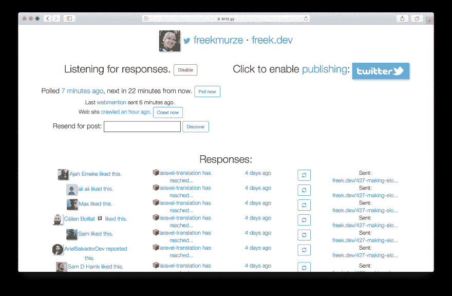
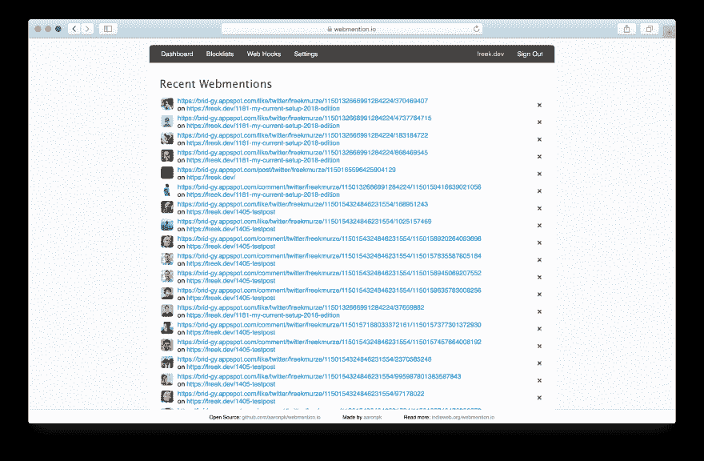
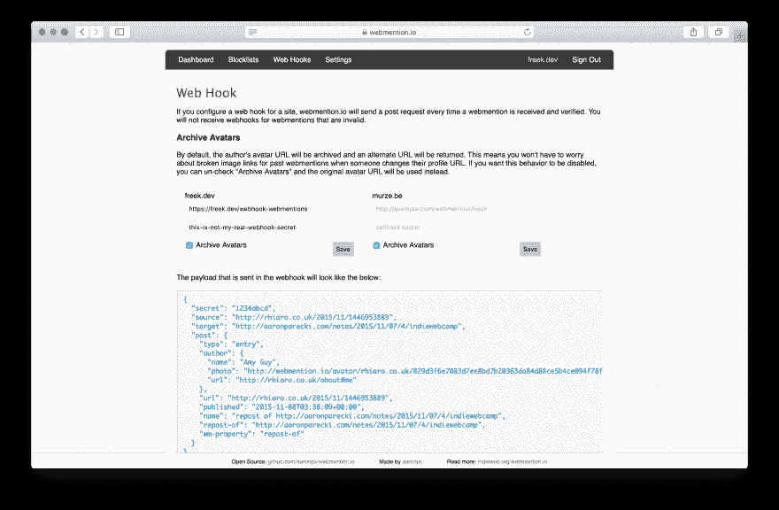

# ★如何在 Laravel powered 博客中添加网络提及

> 原文：<https://dev.to/freekmurze/how-to-add-webmentions-to-a-laravel-powered-blog-52oo>

这个博客的评论部分曾经由 [Disqus](https://disqus.com/) 提供支持。就其核心而言，Disqus 运行得相当好。但是我不喜欢这样的事实，即它引入了大量的 JavaScript 来使它工作。它也不是最漂亮的用户界面。

在这篇博客文章中，我想解释一下为什么我转到了 web references，以及它们是如何在这个博客上实现的。

## 什么是网络提及？

最近我的同事 [Seb](https://sebastiandedeyne.com/) 给[写了一篇非常有趣的博文](https://sebastiandedeyne.com/adding-webmentions-to-my-blog/)。读了那篇文章后，我对网络提及产生了兴趣。在这篇文章中，Seb 已经解释了什么是网络提及。

> 网站提及是网站之间相互交流的一种协议。web reference 标准的有趣之处在于，它并不局限于单个服务，而是一个协议。网络提及可以从一系列不同的服务中聚合，从 Twitter 到其他博客，甚至直接评论。

## 发送网页提及

每当我发布一篇博客文章，一条带有链接的推文就会被自动发布。理想情况下，每当这条推文(或任何包含我的博客链接的推文)被回复、点赞或转发时，我都希望得到 Twitter 的通知。

不幸的是，Twitter 本身并不支持网络提及。但幸运的是，一些服务可以添加这个。

其中一个就是 [Bridgy](https://brid.gy/) 。设置完成后，Bridgy 将扫描 Twitter 上任何包含 [https://freek.dev](https://freek.dev) 链接的推文。它还会扫描这些推文的新互动(回复、转发、喜欢)。

每当它找到我博客的链接，它就会在那个页面上寻找一个`link`标签。如果 Bridgy 找到这个标签，它将发送一个 web reference 到`href`中指定的 URL。稍后会详细介绍。

```
<link rel="webmention" href="..."> 
```

这是 Bridgy UI 的样子。

[](https://res.cloudinary.com/practicaldev/image/fetch/s--pjIsGT_M--/c_limit%2Cf_auto%2Cfl_progressive%2Cq_auto%2Cw_880/https://freek.dev/uploads/media/webmentions/bridgy.png)

这可能不是最漂亮的屏幕，但在这里你可以看到它什么时候会扫描 Twitter 的新提及，并在我的博客上搜索新的或更新的 web 提及目标。使用 UI，您可以手动启动这些操作。您也可以重新发送网络提及。在为这个博客开发 web reference 支持时，这些选项非常方便。

## 接收网页提及

所以 Bridgy 可以发送网络提及，但我们也应该注意接收网络提及。当然，你可以自己编写一个服务器来接收网络提及，但是也有专门的服务。通过使用一项服务，你可以确定即使你的服务器因为某种原因关闭了，网络提及仍然会被记录下来。

我用的是[web reference . io](https://webmention.io/)。它可以过滤掉由机器人执行的垃圾网站提及。为了让 Bridgy 将所有的 web reference 发送到 web reference . io，我需要在我博客的每个帖子页面上指定这个`href`。

```
<link rel="webmention" href="https://webmention.io/freek.dev/webmention" /> 
```

在 web reference . io UI 上，你可以看到 Bridgy 发送的每个 web reference。

[](https://res.cloudinary.com/practicaldev/image/fetch/s--0cAKQP-T--/c_limit%2Cf_auto%2Cfl_progressive%2Cq_auto%2Cw_880/https://freek.dev/uploads/media/webmentions/webmention.png)

web reference . io 支持发送 webhooks。我们可以对它进行配置，这样一旦他们得到一个网络提及(他们认为它不是垃圾邮件)，他们就把它发送到一个指定的 URL。[](https://res.cloudinary.com/practicaldev/image/fetch/s--ZzIrtu6m--/c_limit%2Cf_auto%2Cfl_progressive%2Cq_auto%2Cw_880/https://freek.dev/uploads/media/webmentions/webmention-webhook.png)

这样一来，让我们看看如何在 Laravel 应用程序中处理来自 web reference . ui 的 webhooks。

## 处理网页提及

几周前，我在 Spatie 的团队发布了一个名为 T2 的软件包。这个包使得在 Laravel 应用程序中处理任何传入的 webhook 变得容易。

安装包后，首先需要注意的是确保有一个 URL 可以接受 web reference . io 对我们应用程序的调用。使用该包，您需要使用`Route`上的`webhooks`宏。我已经把[这条线](https://github.com/spatie/freek.dev/blob/e1ec197e0183d8799caafe17af833bacf78b90cb/routes/web.php#L34)放到我的路线文件:

```
Route::webhooks('webhook-webmentions', 'webmentions'); 
```

第一个参数是 URL。第二个参数是配置文件中使用的密钥。在 GitHub 上查看这个包的 readme 中的这一节,以了解更多信息。

在上面的截图中，你可能已经注意到了`callback secret`字段。web reference . io 会将该字段的值添加到它发送的有效负载中。我还在`config/services.php`文件中创建了一个`webmentions.webhook_secret`条目，并将这个秘密放在那里。

当使用`laravel-webhook-client`包时，您可以指定一个负责确定 webhook 调用是否有效的类。

```
namespace App\Services\Webmentions;

use Illuminate\Http\Request;
use Spatie\WebhookClient\SignatureValidator\SignatureValidator;
use Spatie\WebhookClient\WebhookConfig;

class WebmentionWebhookSignatureValidator implements SignatureValidator
{
    public function isValid(Request $request, WebhookConfig $config): bool
    {
        if (! $request->has('secret')) {
            return false;
        }

        return $request->secret === config('services.webmentions.webhook_secret');
    }
} 
```

每当 web reference . io 通过 webhook 调用我们的应用程序时，我希望转换有效负载，将其与它关注的博客文章相关联，并将其添加到数据库的`webmentions`表中。

这一切都是在 [`ProcessWebhookJob`](https://github.com/spatie/freek.dev/blob/4f3b582fa5201ef7a512336f426bd924b1580c6b/app/Services/Webmentions/ProcessWebhookJob.php) 中完成的。下面是代码:

```
namespace App\Services\Webmentions

use App\Models\Post;
use App\Models\Webmention;
use Illuminate\Support\Arr;
use Spatie\Url\Url;
use Spatie\WebhookClient\ProcessWebhookJob as SpatieProcessWebhookJob;

class ProcessWebhookJob extends SpatieProcessWebhookJob
{
    public function handle()
    {
        $payload = $this->webhookCall->payload;

        if ($this->payloadHasBeenReceivedBefore($payload)) {
            return;
        }

        if (!$type = $this->getType($payload)) {
            return;
        }

        if (!$post = $this->getPost($payload)) {
            return;
        }

        Webmention::create([
            'post_id' => $post->id,
            'type' => $type,
            'webmention_id' => Arr::get($payload, 'post.wm-id'),
            'author_name' => Arr::get($payload, 'post.author.name'),
            'author_photo_url' => Arr::get($payload, 'post.author.photo'),
            'author_url' => Arr::get($payload, 'post.author.url'),
            'interaction_url' => Arr::get($payload, 'post.url'),
            'text' => Arr::get($payload, 'post.content.text'),
        ]);
    }

    private function payloadHasBeenReceivedBefore(array $payload): bool
    {
        $webmentionId = Arr::get($payload, 'post.wm-id');

        return Webmention::where('webmention_id', $webmentionId)->exists();
    }

    private function getType(array $payload): ?string
    {
        $types = [
            'in-reply-to' => Webmention::TYPE_REPLY,
            'like-of' => Webmention::TYPE_LIKE,
            'repost-of' => Webmention::TYPE_RETWEET,
        ];

        $wmProperty = Arr::get($payload, 'post.wm-property');

        if (!array_key_exists($wmProperty, $types)) {
            return null;
        }

        return $types[$wmProperty];
    }

    private function getPost(array $payload): ?Post
    {
        $url = Arr::get($payload, 'post.wm-target');

        if (!$url) {
            return null;
        }

        $postIdSlug = Url::fromString($url)->getSegment(1);

        [$id] = explode('-', $postIdSlug);

        return Post::find($id);
    }
} 
```

我不打算一步一步地浏览这段代码。大部分应该是不言自明的。

现在我们已经将网络提及存储在数据库中，并且它们[与帖子](https://github.com/spatie/freek.dev/blob/8d978aee6565ed71d1f7ba0ca85bccf530d5b06c/app/Models/Post.php#L55)相关联，我们可以在刀片视图中遍历它们[。](https://github.com/spatie/freek.dev/blob/0b1e992b8b7ffde9c27bb1fe98fda95f95fdbb14/resources/views/front/posts/partials/webmentions.blade.php#L18-L38)

## 使用 webmentions 作为评论系统 vs Disqus

我对 [Disqus](https://disqus.com/) 又爱又恨。核心功能工作得很好，支持嵌套评论，可以通过各种系统登录发表评论。

不利的一面是，Disqus 添加到网站上的用户界面很难看(imho ),不能定制太多。由于它在页面上的呈现方式，谷歌不会对评论进行索引。Disqus 还可以在评论中注入广告。

使用 Twitter webmentions 作为评论系统也是一个大杂烩。很高兴你能完全控制评论的呈现方式。你也可以自己把评论保存在某个地方，这样你就不需要依赖为你保存内容的服务。

另一方面，你必须记住，网络提及不会立即出现。评论者需要另一个服务的账户(在我的例子中，他们需要一个 Twitter 账户)。评论不能太长，因为一条推文的字数限制很低(当然你也可以使用多条推文。无论如何都不支持嵌套推文。

现在，我想我更喜欢网络提及的权衡。我对这个博客上的帖子没有太多的评论，但我的大多数观众似乎都活跃在 Twitter 上。也许以后我对此的想法会有所改变。我们走着瞧...

## 关闭思绪

我希望你喜欢这篇关于网络提及是如何在这个博客上实现的旅行。如果您想了解更多信息，请查看以下资源:

*   [Seb 在网上的博文提及次数](https://sebastiandedeyne.com/adding-webmentions-to-my-blog/)
*   [克里斯·奥尔德里奇的网络深度访谈](https://alistapart.com/article/webmentions-enabling-better-communication-on-the-internet/)
*   [桥梁](https://brid.gy/)
*   [web reference . io](https://webmention.io/)
*   [我们的 webhooks 包](https://github.com/spatie/laravel-webhook-client)

对此你怎么看？在下面的评论里让我知道？。