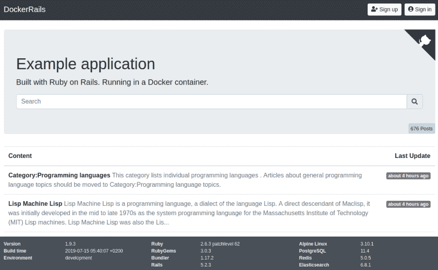
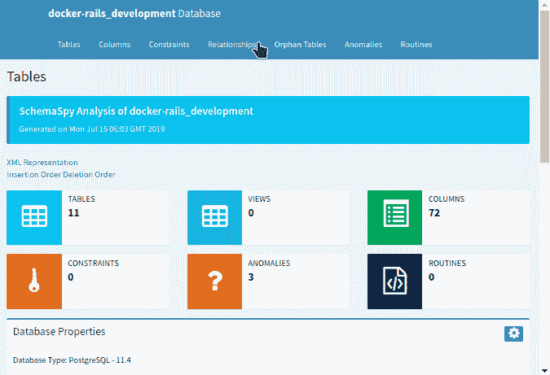

# 查看开发环境的 PostgreSQL 数据库表

> 原文：<https://dev.to/shihanng/looking-into-postgresql-db-s-tables-of-your-development-environment-1i0i>

您刚刚加入了一个已建立的项目，并被授予了访问源代码的权限。有时我们发现，通过查看数据库表和它们之间的关系，更容易理解项目的结构。最近，我发现自己正处于这种情况，有一个项目可以在本地用 T2 的 Docker Compose 构建。这是一个关于我在项目表中所做的一瞥的笔记。

# 设置

为了让读者有更多的实际操作体验，我们将使用由[乔治·莱德曼](https://github.com/ledermann)创建的 Dockerize Rails 应用程序作为“既定项目”该项目已经有了一个 [`docker-compose.yml`](https://github.com/ledermann/docker-rails/blob/c7e0e5d8be469638d21cd13d500d4e5cd4873f8e/docker-compose.yml) 设置，将 PostgreSQL 数据库连接到 Ruby on Rails 应用程序。

##  [莱德曼](https://github.com/ledermann) / [码头工人导轨](https://github.com/ledermann/docker-rails)

### 使用 ActionCable、Webpacker、Stimulus、Elasticsearch、Sidekiq 对 Rails 6 进行对接

<article class="markdown-body entry-content container-lg" itemprop="text">

# 码头栏杆

[ ](https://codeclimate.com/github/ledermann/docker-rails) [ ](https://microbadger.cimg/ledermann/docker-rails)

一个简单的 Rails 6 应用程序，演示了如何使用 Docker 进行生产部署。该应用程序是一个非常简单的 CMS(内容管理系统),允许管理职位。除了无聊的功能之外，它还有一些非默认的特性。

这个项目旨在建立一个精益码头形象用于生产。因此，它基于官方的 Alpine Ruby 图像，使用多阶段构建和一些我在博客中描述的[优化。这导致图像大小约为 80MB。](https://www.georg-ledermann.de/blog/2018/04/19/dockerize-rails-the-lean-way/)

## 特征

*   通过 [ActionCable](https://github.com/rails/rails/tree/master/actioncable) 自动刷新:如果显示的帖子被另一个用户/实例更改，它会使用发布/订阅模式自动刷新
*   通过 [Elasticsearch](https://www.elastic.co/products/elasticsearch) 和 [Searchkick](https://github.com/ankane/searchkick) gem 进行全文搜索，查找帖子内容(含建议)
*   用[自动完成器](https://github.com/kraaden/autocomplete)自动完成
*   用所见即所得的 JavaScript 编辑器编辑 HTML 内容 [Trix](https://github.com/basecamp/trix)
*   用[神龛](https://github.com/janko-m/shrine)宝石和[jQuery-文件-上传](https://github.com/blueimp/jQuery-File-Upload)直接上传图片到 S3
*   使用 [ActiveJob](https://github.com/rails/rails/tree/master/activejob) 和 [Sidekiq](http://sidekiq.org/) gem 的后台作业(to…

</article>

[View on GitHub](https://github.com/ledermann/docker-rails)

让我们参考[在本地设置这个项目。](https://github.com/ledermann/docker-rails/tree/c7e0e5d8be469638d21cd13d500d4e5cd4873f8e#check-it-out)存储库部分:

```
$  git clone https://github.com/ledermann/docker-rails.git
$  cd docker-rails
$  docker-compose build
$  docker-compose run app yarn install
$  docker-compose up -d 
```

此时，您应该有几个正在运行的服务，您可以使用`docker-compose ps`命令:
来检查这些服务

```
$  docker-compose ps
 Name                          Command               State            Ports
----------------------------------------------------------------------------------------------- docker-rails_app_1             docker/startup.sh                Up      0.0.0.0:32774->3000/tcp
docker-rails_db_1              docker-entrypoint.sh postgres    Up      5432/tcp
docker-rails_elasticsearch_1   /usr/local/bin/docker-entr ...   Up      9200/tcp, 9300/tcp
docker-rails_redis_1           docker-entrypoint.sh redis ...   Up      6379/tcp
docker-rails_worker_1          bundle exec sidekiq              Up      3000/tcp 
```

如果您想检查您的主机上运行的 web 应用程序，请访问 [http://localhost:32774](http://localhost:32774) 。注意`32774`的值来自`docker-compose ps`输出中`docker-rails_app_1`的`Ports`列:容器的端口`3000`暴露在主机的端口`32774`上。

[](https://res.cloudinary.com/practicaldev/image/fetch/s--LYJq3gQ3--/c_limit%2Cf_auto%2Cfl_progressive%2Cq_auto%2Cw_880/https://raw.githubusercontent.com/shihanng/dev.to/master/posts/look-postgresql/assets/docker_rails.png)

# 访问数据库

这里我们将展示如何使用两种不同的工具访问开发数据库:

1.  [pgcli](https://www.pgcli.com/) ，
2.  [SchemaSpy](https://github.com/schemaspy/schemaspy) 更直观的方法。

在此之前，我们需要知道数据库的凭证，这些凭证可以在 [`docker-compose.yml`](https://github.com/ledermann/docker-rails/blob/c7e0e5d8be469638d21cd13d500d4e5cd4873f8e/docker-compose.yml#L33-L34) 上找到。我们感兴趣的数据库是 [`docker-rails_development`](https://github.com/ledermann/docker-rails/blob/c7e0e5d8be469638d21cd13d500d4e5cd4873f8e/config/database.yml#L27-L29) 。让我们将这些值导出为环境变量:

```
$  export DB_USER=postgres
$  export DB_PASSWORD=foobar123
$  export DB_NAME=docker-rails_development 
```

## pgcli

根据[官方文件](https://www.pgcli.com/install)中的说明安装`pgcli`。基于下面的信息，我们想在端口`5432`上连接到数据库(`docker-rails_db_1`)。

```
$  docker-compose ps db
 Name                     Command              State    Ports
--------------------------------------------------------------------
docker-rails_db_1   docker-entrypoint.sh postgres   Up      5432/tcp 
```

但是，该端口不会暴露给主机。因此，执行以下操作将会失败

```
$  pgcli -h localhost -p 5432 -U "${DB_USER}" -d "${DB_NAME}"
could not connect to server: Connection refused
        Is the server running on host "localhost" (::1) and accepting
        TCP/IP connections on port 5432?
could not connect to server: Connection refused
        Is the server running on host "localhost" (127.0.0.1) and accepting
        TCP/IP connections on port 5432? 
```

在这种情况下，我们可以使用容器实例的 IP 地址来访问容器，而无需将端口暴露给主机。IP 地址可以通过
获得

```
$  docker inspect docker-rails_db_1 | grep IPAddress
 "SecondaryIPAddresses": null,
            "IPAddress": "",
                    "IPAddress": "172.24.0.4", 
```

使用上面的 IP 地址，我们可以通过
访问数据库

```
$  pgcli -h 172.24.0.4 -p 5432 -U "${DB_USER}" -d "${DB_NAME}"
Server: PostgreSQL 11.4
Version: 2.1.1
Chat: https://gitter.im/dbcli/pgcli Mail: https://groups.google.com/forum/#!forum/pgcli
Home: http://pgcli.com docker-rails_development> 
```

## 图式

对于 SchemaSpy，我们将尝试不同的方法:使用 [SchemaSpy 的 Docker 容器](https://hub.docker.com/r/schemaspy/schemaspy/)连接到现有的数据库，并为我们生成数据库图。为此，我们需要知道 docker-compose 为这个项目创建的网络的名称:

```
$  docker network list | grep docker-rails
27a3a7b42168        docker-rails_default   bridge              local 
```

现在我们知道了网络名称，我们可以使用`docker run`命令中的`--net`选项将 SchemaSpy 容器连接到现有的项目网络。下面将在`db_out/`目录中生成数据库图表。

```
$  export DB_HOST=docker-rails_db_1
$  export DB_NET=docker-rails_default
$  mkdir -p db_out
$  docker run --rm --net "${DB_NET}" \
  -v `pwd`/db_out:/output schemaspy/schemaspy:6.0.0 \
  -t pgsql \
  -db "${DB_NAME}" \
  -host "${DB_HOST}" \
  -port 5432 \
  -u "${DB_USER}" \
  -p "${DB_PASSWORD}" 
```

用浏览器打开`db_out/index.html`,检查生成的图表。

[](https://res.cloudinary.com/practicaldev/image/fetch/s--lIkNXcCW--/c_limit%2Cf_auto%2Cfl_progressive%2Cq_66%2Cw_880/https://raw.githubusercontent.com/shihanng/dev.to/master/posts/look-postgresql/assets/schemaspy.gif)

# 清理

这个帖子到此为止。上面提到的技巧似乎只限于 PostgreSQL，但是我们相信只要稍加修改，它也可以应用于其他类型的数据库。至于清理，既然是 Docker Compose 项目，清理就像:
一样简单

```
$  docker-compose stop
$  docker-compose rm 
```

* * *

#### 发现错别字？

感谢您的阅读！发现错别字？在这篇博文中，你看到了可以改进的地方或者应该更新的内容吗？感谢[这个项目](https://github.com/maxime1992/dev.to)，你可以很容易地在【https://github.com/shihanng/dev.to】的[上创建一个拉请求，提出一个修复方案，而不是发表评论。](https://github.com/shihanng/dev.to)