# 让生活更简单的 20 条 Vim 捷径

> 原文：<https://dev.to/thefern/20-vim-shortcuts-to-make-life-easier-44hm>

这是关于 vscode 快捷方式的惊人的[帖子](https://dev.to/jsmanifest/21-vscode-shortcuts-to-make-coding-faster-and-more-fun-3b4m)的后续帖子。我认为在 vim 上尝试制作相同或相似的快捷方式进行比较会很有趣。现在提醒你，我是一个相对新的 vimmer，更像一个休闲 vimmer lol。呆在家里的确能提供更快的工作流程，就像画家与画布结合一样。对于我的日常使用，我主要使用 Intellij/Android Studio 和 vscode。我打开了 vim 模式，当我觉得碍事时，我会关掉它。

我将使用这个 repo 作为例子
[coreutils](https://github.com/wertarbyte/coreutils) 只需将它克隆到你的 git 目录。

## 1 一次在所有文件中搜索文本

也许终端最好的工具之一是 [fzf](https://github.com/junegunn/fzf) ，如果你曾经在 windows 上使用过`everything`，那么你就知道我在说什么。fzf 顾名思义就是一个模糊查找器。fzf 有一堆很好的命令。要在 vim 上使用它，您需要先安装它。

```
brew install fzf 
```

<svg width="20px" height="20px" viewBox="0 0 24 24" class="highlight-action crayons-icon highlight-action--fullscreen-on"><title>Enter fullscreen mode</title></svg> <svg width="20px" height="20px" viewBox="0 0 24 24" class="highlight-action crayons-icon highlight-action--fullscreen-off"><title>Exit fullscreen mode</title></svg>

然后你把它添加到你的 Plug vimrc，我用的是同一作者的 [vim-plug](https://github.com/junegunn/vim-plug) 。

```
Plug '/usr/local/opt/fzf'
Plug 'junegunn/fzf.vim' 
```

<svg width="20px" height="20px" viewBox="0 0 24 24" class="highlight-action crayons-icon highlight-action--fullscreen-on"><title>Enter fullscreen mode</title></svg> <svg width="20px" height="20px" viewBox="0 0 24 24" class="highlight-action crayons-icon highlight-action--fullscreen-off"><title>Exit fullscreen mode</title></svg>

对于下一个例子，只需简单地做`:Lines`然后输入你想要的任何东西。Fzf 将在打开的缓冲区中查找，如果你只在当前缓冲区中查找，那么执行`:BLines`。关于 fzf 的一个很酷的事情是，它可以找到任何东西，即使这里或那里缺少几个字母。另外，如果你不想模糊查找，你可以用单引号`'`开始 fzf 命令。

[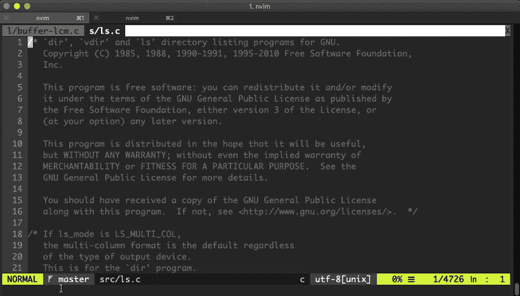](https://res.cloudinary.com/practicaldev/image/fetch/s--P3URhpJb--/c_limit%2Cf_auto%2Cfl_progressive%2Cq_66%2Cw_880/https://kodaman2.github.io/blimg/vim-shortcuts/fzf_lines.gif)

Fzf 是惊人的快，不开玩笑尝试在一个大项目。

## 2 选择括号内的行

在 vim 中有很多选择文本的方法，事实上你甚至不需要视觉模式就能做到。

将光标放在括号中或括号内。

```
ya(
ya{ 
```

<svg width="20px" height="20px" viewBox="0 0 24 24" class="highlight-action crayons-icon highlight-action--fullscreen-on"><title>Enter fullscreen mode</title></svg> <svg width="20px" height="20px" viewBox="0 0 24 24" class="highlight-action crayons-icon highlight-action--fullscreen-off"><title>Exit fullscreen mode</title></svg>

[](https://res.cloudinary.com/practicaldev/image/fetch/s--7ORV-7dO--/c_limit%2Cf_auto%2Cfl_progressive%2Cq_66%2Cw_880/https://kodaman2.github.io/blimg/vim-shortcuts/yanking_brackets.gif)

如果你想直观地做到这一点，把光标放在一个括号里，然后你可以做猛拉(y)或剪切(d)。

```
v% 
```

<svg width="20px" height="20px" viewBox="0 0 24 24" class="highlight-action crayons-icon highlight-action--fullscreen-on"><title>Enter fullscreen mode</title></svg> <svg width="20px" height="20px" viewBox="0 0 24 24" class="highlight-action crayons-icon highlight-action--fullscreen-off"><title>Exit fullscreen mode</title></svg>

[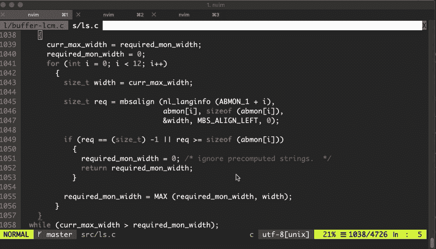](https://res.cloudinary.com/practicaldev/image/fetch/s--rJ_nQrFU--/c_limit%2Cf_auto%2Cfl_progressive%2Cq_66%2Cw_880/https://kodaman2.github.io/blimg/vim-shortcuts/select_visual.gif)

## 3 用 fzf 打开缓冲区中的文件

如果你需要关于 fzf 实用程序的帮助，你可以在 vim 中做`:help fzf`。您可以看到帮助文件，以及它所包含的所有命令。Buffers 命令显示当前打开的所有缓冲区。然后如果你开始输入，你可以做 fzf 查找，如果你有很多打开的缓冲区。

```
:Buffers 
```

<svg width="20px" height="20px" viewBox="0 0 24 24" class="highlight-action crayons-icon highlight-action--fullscreen-on"><title>Enter fullscreen mode</title></svg> <svg width="20px" height="20px" viewBox="0 0 24 24" class="highlight-action crayons-icon highlight-action--fullscreen-off"><title>Exit fullscreen mode</title></svg>

[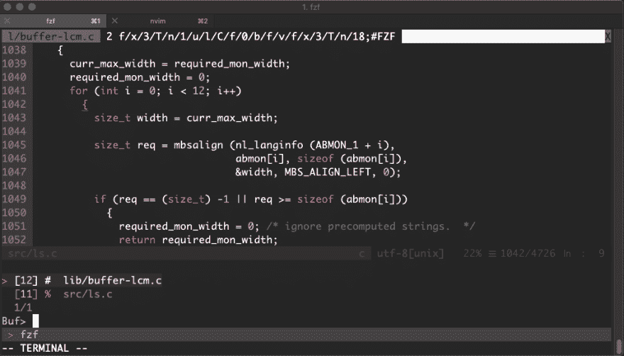](https://res.cloudinary.com/practicaldev/image/fetch/s--o4l9GmNL--/c_limit%2Cf_auto%2Cfl_progressive%2Cq_auto%2Cw_880/https://kodaman2.github.io/blimg/vim-shortcuts/open_buffers.png)

## 4 用 fzf 找到项目中的一个文件

与 buffers 命令相同，但适用于您正在处理的目录中的所有文件。

```
:Files 
```

<svg width="20px" height="20px" viewBox="0 0 24 24" class="highlight-action crayons-icon highlight-action--fullscreen-on"><title>Enter fullscreen mode</title></svg> <svg width="20px" height="20px" viewBox="0 0 24 24" class="highlight-action crayons-icon highlight-action--fullscreen-off"><title>Exit fullscreen mode</title></svg>

[](https://res.cloudinary.com/practicaldev/image/fetch/s--kljQcN7q--/c_limit%2Cf_auto%2Cfl_progressive%2Cq_auto%2Cw_880/https://kodaman2.github.io/blimg/vim-shortcuts/files_01.png)

请注意 fzf 在搜索 sum 时是如何选择 strnumcmp.c 的。如果你用`'`开始搜索，它会寻找整个单词。

[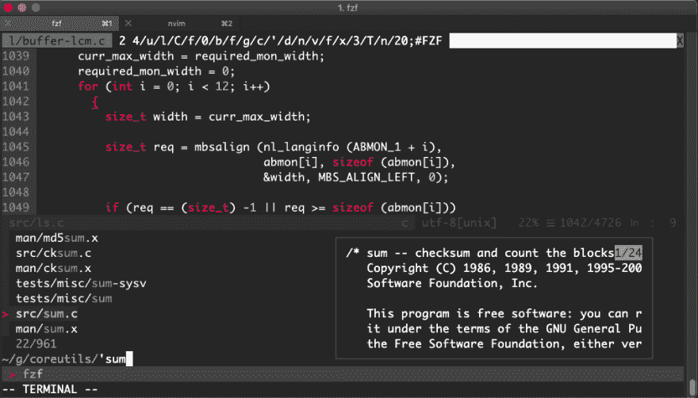](https://res.cloudinary.com/practicaldev/image/fetch/s--cprDQCRl--/c_limit%2Cf_auto%2Cfl_progressive%2Cq_auto%2Cw_880/https://kodaman2.github.io/blimg/vim-shortcuts/files_02.png)

## 5 发射终端

这只是个人偏好，因为当你在 vim 中时，你是在终端中，如果你使用 iTerm2，那么你可以相对容易地在选项卡之间切换。

如果你想在 vim 中有一个终端标签，我使用[分裂术语](https://github.com/vimlab/split-term.vim)插件。请记住，我使用 neovim，让我知道你是否也在 vim 中使用这个或其他插件。

有太多的配置要谈，以确保访问回购。

*   :Term 使用:new(水平拆分)打开新的终端缓冲区
*   :VTerm 使用:vnew(垂直拆分)打开新的终端缓冲区
*   :TTerm 使用:tabnew (new tab)打开一个新的终端缓冲区

[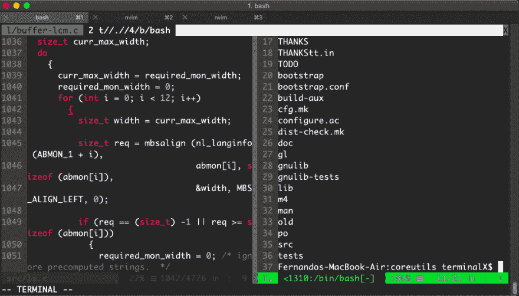](https://res.cloudinary.com/practicaldev/image/fetch/s--lAt6BCVC--/c_limit%2Cf_auto%2Cfl_progressive%2Cq_auto%2Cw_880/https://kodaman2.github.io/blimg/vim-shortcuts/terminal.png)

## 6 向左/向右删除所有内容

这对于 vim 来说太简单了。如果您想删除左边`d0`的所有内容，如果您想删除右边`d$`的内容，请使用 motions 或 hjkl 将光标移动到您想要的位置。

[](https://res.cloudinary.com/practicaldev/image/fetch/s--wD0Go7Ri--/c_limit%2Cf_auto%2Cfl_progressive%2Cq_66%2Cw_880/https://kodaman2.github.io/blimg/vim-shortcuts/delete_left_right.gif)

另一个好的是`t`(直到)。所以如果你想删除一个括号，你可以做`dt)`。

[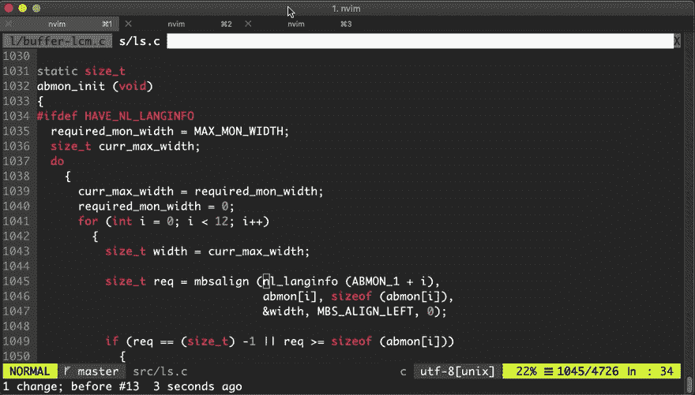](https://res.cloudinary.com/practicaldev/image/fetch/s--POlBb7qW--/c_limit%2Cf_auto%2Cfl_progressive%2Cq_66%2Cw_880/https://kodaman2.github.io/blimg/vim-shortcuts/delete_until.gif)

## 7 删除前面的字

如果你正在写一些文本，你犯了一个错误，退出插入模式，并做`daw`(删除一个单词)。

欲了解更多相关技巧，请访问 vim 中的`:help diw`。

[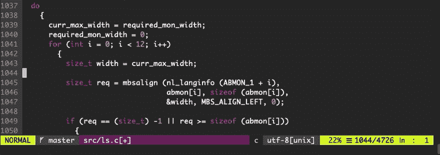](https://res.cloudinary.com/practicaldev/image/fetch/s--7CoQ5vbP--/c_limit%2Cf_auto%2Cfl_progressive%2Cq_66%2Cw_880/https://kodaman2.github.io/blimg/vim-shortcuts/daw.gif)

## 8 个选择词

vim 中的视觉模式本身就是另一个世界，它有行、块和列模式。要选择单词，点击下方的`v`，确保你处于可视模式。然后按下`w`选择下一个单词。假设你选择了一个你不想要的单词，点击`b`返回，大多数 vim 命令都有某种语法。还有字尾的`e`。

[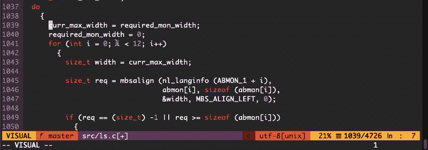](https://res.cloudinary.com/practicaldev/image/fetch/s--SsYLBePN--/c_limit%2Cf_auto%2Cfl_progressive%2Cq_66%2Cw_880/https://kodaman2.github.io/blimg/vim-shortcuts/word_select.gif)

## 第 9 行选择

视觉线条模式，让您轻松选择线条。
使用大写字母`V`进入线条模式。

[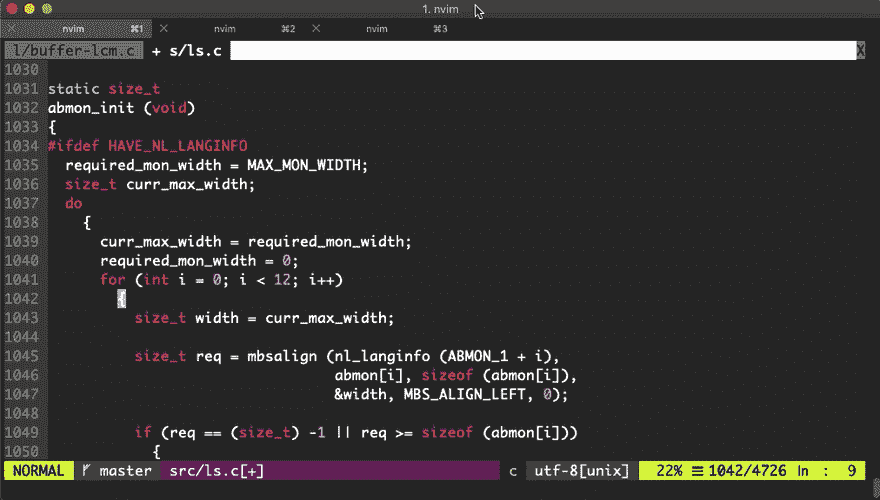](https://res.cloudinary.com/practicaldev/image/fetch/s--V_PDGP-m--/c_limit%2Cf_auto%2Cfl_progressive%2Cq_66%2Cw_880/https://kodaman2.github.io/blimg/vim-shortcuts/lines_select.gif)

## 10 重复一行

只需用`yy`猛拉线，用`p`猛拉糊。

[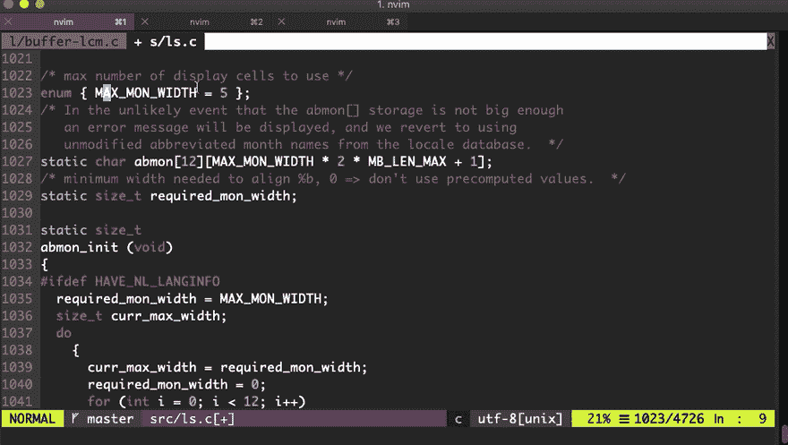](https://res.cloudinary.com/practicaldev/image/fetch/s--K-gC65BN--/c_limit%2Cf_auto%2Cfl_progressive%2Cq_66%2Cw_880/https://kodaman2.github.io/blimg/vim-shortcuts/duplicate_line.gif)

## 11 移动到文件的开头/结尾

在 vim 移动是如此的轻而易举。文件的顶端用`gg`，而`G`到文件的末端。

[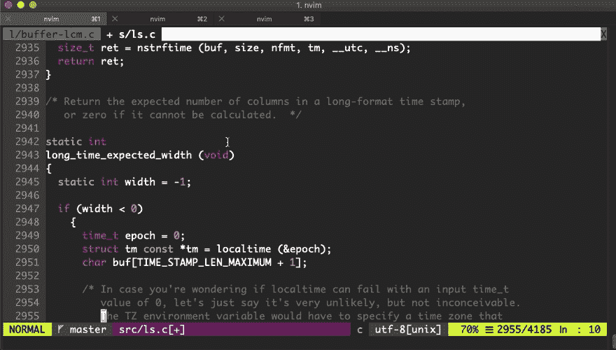](https://res.cloudinary.com/practicaldev/image/fetch/s--t3cJWJ-0--/c_limit%2Cf_auto%2Cfl_progressive%2Cq_66%2Cw_880/https://kodaman2.github.io/blimg/vim-shortcuts/start_end.gif)

## 12 上移/下移一个文件

使用`CTRL+U`和`CTRL+D`可以上下移动文件，也可以使用`SHIFT+ {`和`SHIFT+}`。

## 文件中的 13 个搜索字

用 vim 在文件中搜索单词很酷，但不如 fzf 酷。要搜索一个单词，你需要做`/`，然后输入要查找的单词。要转到下一个单词，你可以点击`n`，要转到上一个单词`N`。此外，您可以使用`?`向后搜索。

## 文件中的 14 个替换字

搜索和替换可以采取各种形式。

```
:%s/search/replace/gc 
```

<svg width="20px" height="20px" viewBox="0 0 24 24" class="highlight-action crayons-icon highlight-action--fullscreen-on"><title>Enter fullscreen mode</title></svg> <svg width="20px" height="20px" viewBox="0 0 24 24" class="highlight-action crayons-icon highlight-action--fullscreen-off"><title>Exit fullscreen mode</title></svg>

*   %表示在整个文件中搜索
*   g 代表全局，表示所有事件
*   c 代表确认

当您运行这个命令时，您将得到一个确认，您可以为每个实例点击 yes 或 no，或者简单地点击`a`来替换所有实例。

[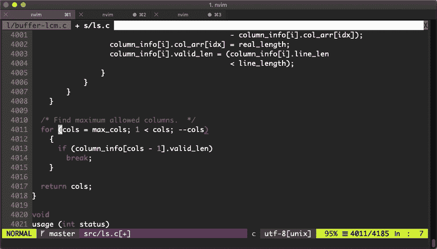](https://res.cloudinary.com/practicaldev/image/fetch/s--lYB2GeM0--/c_limit%2Cf_auto%2Cfl_progressive%2Cq_66%2Cw_880/https://kodaman2.github.io/blimg/vim-shortcuts/replace.gif)

## 15 上下移动线条

Vim 提供了一个移动命令来移动线条。

```
:move+1
:move-2 
```

<svg width="20px" height="20px" viewBox="0 0 24 24" class="highlight-action crayons-icon highlight-action--fullscreen-on"><title>Enter fullscreen mode</title></svg> <svg width="20px" height="20px" viewBox="0 0 24 24" class="highlight-action crayons-icon highlight-action--fullscreen-off"><title>Exit fullscreen mode</title></svg>

## 16 删除一行

如果要删除整行，可以做`dd`。

## 17 添加光标多行

*   将光标移动到第一行的位置。
*   进入视觉阻塞模式。
*   按 j 三次(或 3j)。
*   按 I(大写的 I)。
*   输入任何东西。按 esc。

看起来很多，但是一旦你习惯了，就很快了。

[](https://res.cloudinary.com/practicaldev/image/fetch/s--K7Fxvjbl--/c_limit%2Cf_auto%2Cfl_progressive%2Cq_66%2Cw_880/https://kodaman2.github.io/blimg/vim-shortcuts/multiline.gif)

## Vim 中的 18 EasyMotion

EasyMotion 是一个很酷的插件，可以帮助快速遍历文本，如果你有兴趣在 vscode 中尝试 vim，它也可以在 vscode 中工作，尽管在 vscode 中使用 vim 的缺点是除了 vscodevim 插件提供的插件之外，你不能引入任何其他插件。

请务必查看 [easymotion](https://github.com/easymotion/vim-easymotion) 以获得该插件的完整描述。

[VSCodeVim](https://github.com/VSCodeVim/Vim)

[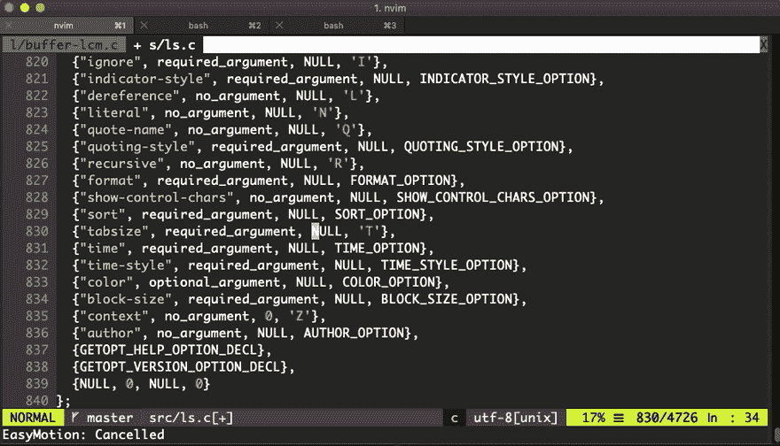](https://res.cloudinary.com/practicaldev/image/fetch/s--lFlzZATB--/c_limit%2Cf_auto%2Cfl_progressive%2Cq_66%2Cw_880/https://kodaman2.github.io/blimg/vim-shortcuts/easymotion.gif)

## 19 NerdTree

另一个查看目录的很酷的插件是 [NerdTree](https://github.com/scrooloose/nerdtree) 。

[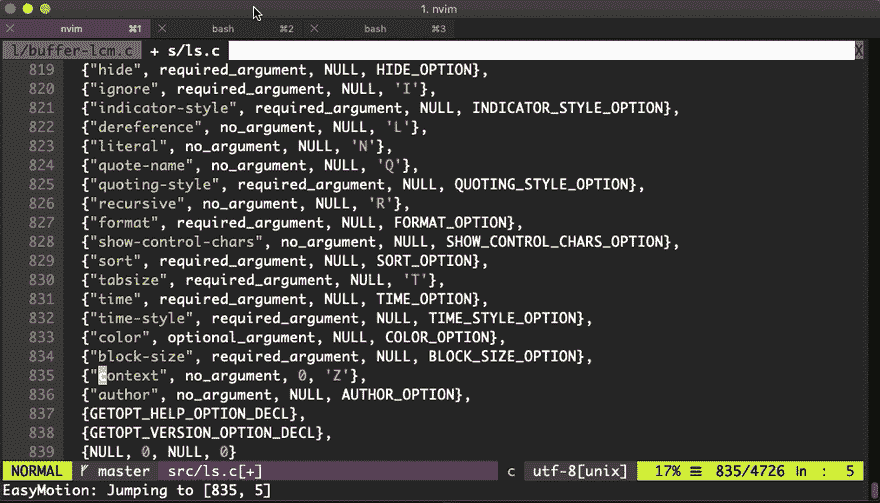](https://res.cloudinary.com/practicaldev/image/fetch/s--Z8kRi36q--/c_limit%2Cf_auto%2Cfl_progressive%2Cq_66%2Cw_880/https://kodaman2.github.io/blimg/vim-shortcuts/tree.gif)

更多插件请访问 https://vimawesome.com/

## 20 个书签又名标记

我不确定 vscode 是否有这个特性，但是在 vim 中还是很酷的。你只需将光标放在一行上，点击`m`和一个字母或数字。

如果你做了`ma`，那么你的分数将会是`a`

要查看您当前的标记，您可以做(标记与 fzf 插件一起使用):

```
:marks
:Marks 
```

<svg width="20px" height="20px" viewBox="0 0 24 24" class="highlight-action crayons-icon highlight-action--fullscreen-on"><title>Enter fullscreen mode</title></svg> <svg width="20px" height="20px" viewBox="0 0 24 24" class="highlight-action crayons-icon highlight-action--fullscreen-off"><title>Exit fullscreen mode</title></svg>

[](https://res.cloudinary.com/practicaldev/image/fetch/s--dRj9uFh5--/c_limit%2Cf_auto%2Cfl_progressive%2Cq_auto%2Cw_880/https://kodaman2.github.io/blimg/vim-shortcuts/marks.png)

您也可以删除标记:

```
:delmarks a 
```

<svg width="20px" height="20px" viewBox="0 0 24 24" class="highlight-action crayons-icon highlight-action--fullscreen-on"><title>Enter fullscreen mode</title></svg> <svg width="20px" height="20px" viewBox="0 0 24 24" class="highlight-action crayons-icon highlight-action--fullscreen-off"><title>Exit fullscreen mode</title></svg>

删除所有小写标记:

```
:delmarks! 
```

<svg width="20px" height="20px" viewBox="0 0 24 24" class="highlight-action crayons-icon highlight-action--fullscreen-on"><title>Enter fullscreen mode</title></svg> <svg width="20px" height="20px" viewBox="0 0 24 24" class="highlight-action crayons-icon highlight-action--fullscreen-off"><title>Exit fullscreen mode</title></svg>

如果你得到了太多的分数，你可以删除包含历史和分数的`~/.viminfo`。

## 结论

你可以用 vim 做很多很酷的事情，我特别希望我可以用所有的插件来做 Vim，但是是在 vscode 环境中，我认为这就是 Oni 正在努力完成的事情。让我知道你的想法或者你在 vim 中使用了哪些很酷的技巧或插件。再见了，宝贝！

如果你有兴趣查看我的 vimrc 文件，请点击[这里](https://gist.github.com/kodaman2/53ffc1e122c5319c90d4d898920a270a)