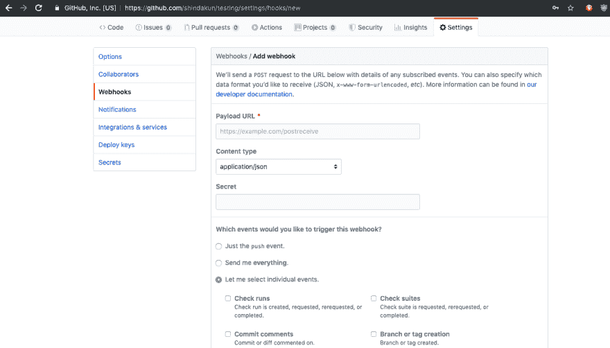

# 尝试学习围棋-发行者 04 -补遗

> 原文：<https://dev.to/shindakun/attempting-to-learn-go-issuer-04-addendum-3bf5>

## 呜呜

我们上一篇发帖人的帖子遗漏了一小段代码。让我们把它修好，然后把它包起来。此外，让我们讨论如何在迁移到 Google Cloud 功能之前测试 webhook。

* * *

### 错过了`if`

当我[向谷歌云功能发布发布者](https://dev.to/shindakun/attempting-to-learn-go-issuer-03-cloud-function-go-27co)时，我打算更新代码。这个想法是，只有当原始有效负载动作是`opened`时，才创建新问题。帖子的最终版本没有提到这一点，所以我们开始吧。再来看看我们更新的`HandleWebhook()`。

```
func HandleWebhook(res http.ResponseWriter, req *http.Request) {
  var Payload Payload
  defer req.Body.Close()

  p, err := github.ValidatePayload(req, []byte(Secret))
  if err != nil {
    http.Error(res, "bad request: "+err.Error(), 400)
    log.Printf("bad request: %v", err.Error())
    return
  }

  err = json.Unmarshal(p, &Payload)
  if err != nil {
    http.Error(res, "bad request: "+err.Error(), 400)
    log.Printf("bad request: %v", err.Error())
    return
  } 
```

Enter fullscreen mode Exit fullscreen mode

我们来了——我们检查`Payload.Action`以确保它是`opened`,如果是，那么我们创建我们的新问题。

```
 if Payload.Action == "opened" {
    err = createNewIssue(&Payload)
    if err != nil {
      log.Printf("bad request: %v", err.Error())
      return
    }
  }
} 
```

Enter fullscreen mode Exit fullscreen mode

* * *

## 测试网页挂钩

在推送 GCF 之前，有必要测试 webhooks，以确保我收到了我需要的内容。多亏了 [`ngrok`](https://ngrok.com/) ，这其实挺容易的。`ngrok`是一个命令行工具，允许我们从外部网络访问我们的内部程序。无需担心设置防火墙或隧道。

* * *

### `ngrok`

为此，我们需要确保已经安装了`ngrok`。在 Mac 上，这也是我最近大部分开发工作的地方，通过`brew`安装很简单。

```
brew install ngrok 
```

Enter fullscreen mode Exit fullscreen mode

如果你碰巧用的是 Windows，你可以从`ngrok`网站、【https://ngrok.com/download】下载。按照网站上的说明进行安装。安装后，你应该能够打开命令提示符或终端窗口并运行`ngrok`。

```
➜ ~ ngrok
NAME:
   ngrok - tunnel local ports to public URLs and inspect traffic

DESCRIPTION:
    ngrok exposes local networked services behinds NATs and firewalls to the
    public internet over a secure tunnel. Share local websites, build/test
    webhook consumers and self-host personal services.
    Detailed help for each command is available with 'ngrok help <command>'.
    Open http://localhost:4040 for ngrok's web interface to inspect traffic.
... 
```

Enter fullscreen mode Exit fullscreen mode

* * *

### 现在怎么办

现在怎么办？那很简单！让我们跑吧…

```
ngrok http 3000 
```

Enter fullscreen mode Exit fullscreen mode

假设您运行的是我们上次编写的代码，它运行在端口 3000 上。现在打开一个新的终端窗口，让我们运行我们的代码。

```
go run main.go 
```

Enter fullscreen mode Exit fullscreen mode

现在我们已经启动并运行了，让我们在 GitHub 上启用一些 webhooks 并做一些实际的测试。

* * *

### GitHub 网页挂钩

随着`ngrok`和我们的代码运行，我们进入 GitHub！选择一个回购，或者创建一个测试回购。在“设置”标签下，选择左侧的“Webhooks”。点击右上角的“添加 webhook”。输入我们的`ngrok`网址，例如:`https://9ba7d0f6.ngrok.io`，添加`/webhook`。在“内容类型”中，确保您选择了`application/json`。对于这个项目，我选择了“让我选择单个事件”，然后只选择了“问题”。然后点击底部的“添加 webhook”。

[ ](https://res.cloudinary.com/practicaldev/image/fetch/s--4vndC5nE--/c_limit%2Cf_auto%2Cfl_progressive%2Cq_auto%2Cw_880/https://shindakun.dev/imgs/webhook-01.png) [ ](https://res.cloudinary.com/practicaldev/image/fetch/s--H8ncERSd--/c_limit%2Cf_auto%2Cfl_progressive%2Cq_auto%2Cw_880/https://shindakun.dev/imgs/webhook-02.png)

GitHub 会发送一个测试帖子，我们应该马上就能看到一些东西。

[ ](https://res.cloudinary.com/practicaldev/image/fetch/s--l6XZjqd7--/c_limit%2Cf_auto%2Cfl_progressive%2Cq_auto%2Cw_880/https://shindakun.dev/imgs/webhook-03.png) [ ](https://res.cloudinary.com/practicaldev/image/fetch/s--Cp_F3nIs--/c_limit%2Cf_auto%2Cfl_progressive%2Cq_auto%2Cw_880/https://shindakun.dev/imgs/webhook-04.png)

我们做到了！它大部分是空白的，因为它只是一个测试，但它足以表明我们正在按预期工作。

* * *

你可以在 GitHub 上的 repo 中找到这个和大多数其他试图学习围棋的帖子的代码。

##  [【新达昆】](https://github.com/shindakun) / [ atlg](https://github.com/shindakun/atlg)

### 我在 dev.to 上发布的“尝试学习围棋”帖子的来源报告

<article class="markdown-body entry-content container-lg" itemprop="text">

# 尝试学习围棋

在这里你可以找到我为尝试学习围棋而写的代码，这些代码是我在 [Dev.to](https://dev.to/shindakun) 上写的。

## 帖子索引

| 邮政 | 密码 |
| --- | --- |
| [制作下载器第 01 部分](https://dev.to/shindakun/attempting-to-learn-go---building-a-downloader-part-01-44gl) | - |
| [制作下载器第 02 部分](https://dev.to/shindakun/attempting-to-learn-go---building-a-downloader-part-02-2k7i) | - |
| [制作下载器第 03 部分](https://dev.to/shindakun/attempting-to-learn-go---building-a-downloader-part-03-2214) | - |
| [制作下载器第 4 部分](https://dev.to/shindakun/attempting-to-learn-go---building-a-downloader-part-04-3ln9) | - |
| [建造下载器第 05 部分](https://dev.to/shindakun/attempting-to-learn-go---building-a-downloader-part-05-44o) | - |
| [使用 REST API](https://dev.to/shindakun/attempting-to-learn-go---consuming-a-rest-api-5c7g) | [src](https://raw.githubusercontent.com/shindakun/atlg/master//go-api-01/main.go) |
| [继续休息冒险](https://dev.to/shindakun/attempting-to-learn-go---continuing-rest-adventures-2l4l) | [src](https://raw.githubusercontent.com/shindakun/atlg/master//go-api-02/main.go) |
| [现在发送休息请求](https://dev.to/shindakun/attempting-to-learn-go---now-sending-rest-requests-akp) | [src](https://raw.githubusercontent.com/shindakun/atlg/master//go-api-03/main.go) |
| [REST API 和模板上的位](https://dev.to/shindakun/attempting-to-learn-go---rest-api-and-a-bit-on-templates-4kca) | [src](https://raw.githubusercontent.com/shindakun/atlg/master//go-api-04/main.go) |
| [再次通过 API 发送电子邮件](https://dev.to/shindakun/attempting-to-learn-go---sending-email-via-api-again-2e4e) | [src](https://raw.githubusercontent.com/shindakun/atlg/master//go-api-05/main.go) |
| [让我们模块化吧！](https://dev.to/shindakun/attempting-to-learn-go---lets-get-modular-390i) | [src](https://github.com/shindakun/mailgunner) |
| [让我们再一次模块化！](https://dev.to/shindakun/attempting-to-learn-go---lets-get-modular---again-10cd) | [src](https://github.com/shindakun/mailgunner) |
| [构建开发日志第 1 部分](https://dev.to/shindakun/attempting-to-learn-go---building-dev-log-part-01-1c3m) | [src](https://raw.githubusercontent.com/shindakun/atlg/master//go-devsite-01/main.go) |
| [构建开发日志第 2 部分](https://dev.to/shindakun/attempting-to-learn-go---building-dev-log-part-02-179c) | [src](https://raw.githubusercontent.com/shindakun/atlg/master//go-devsite-02/main.go) |
| [构建开发日志第 3 部分](https://dev.to/shindakun/attempting-to-learn-go---building-dev-log-part-03-7lk) | [src](https://raw.githubusercontent.com/shindakun/atlg/master//go-devsite-03/main.go) |
| [构建开发日志第 4 部分](https://dev.to/shindakun/attempting-to-learn-go---building-dev-log-part-04-2bok) | [src](https://raw.githubusercontent.com/shindakun/atlg/master//go-devsite-04/main.go) |
| [构建开发日志第 5 部分](https://dev.to/shindakun/attempting-to-learn-go---building-dev-log-part-05-4mo1) | [src](https://raw.githubusercontent.com/shindakun/atlg/master//go-devsite-05/main.go) |
| [按扩展名 01 列出文件](https://dev.to/shindakun/attempting-to-learn-go---listing-files-by-extension-1n10) | [src](https://raw.githubusercontent.com/shindakun/atlg/master//go-sort-01/main.go) |
| [按扩展名 02 列出文件](https://dev.to/shindakun/attempting-to-learn-go---sorting-and-moving-files-by-extension-227j) | [src](https://raw.githubusercontent.com/shindakun/atlg/master//go-sort-01/main.go) |
| [开发至 API 01](https://dev.to/shindakun/interacting-with-the-devto-article-api-4g34) | [src](https://raw.githubusercontent.com/shindakun/atlg/master//go-devtoapi-01/main.go) |
| [开发至 API 02](https://dev.to/shindakun/interacting-with-the-devto-article-api---again-sort-of-2o8g) | 参见上面的代码 |
| [发行人](https://dev.to/shindakun/attempting-to-learn-go-issuer-01-5f0k) |

…</article>

[View on GitHub](https://github.com/shindakun/atlg)

* * *

| 喜欢这篇文章吗？ |
| --- |
| 给我买杯咖啡怎么样？ |

* * *