# 在 10 分钟内学会 Git 的基础知识

> 原文：<https://dev.to/gothamv/learn-the-basics-of-git-in-under-10-minutes-475c>

是的，标题是一个点击诱饵。你不可能在 10 分钟内理解 git 技术的基础知识。但是你可以在 25 分钟内非常接近。这就是本文的目的。

如果您想开始学习 Git 技术，那么您来对地方了。这是一个全面的 Git 初学者指南。Git 有很多客户端。无论客户是谁，技术都是一样的。但是在本指南中，我们将使用 GitHub 来理解 Git。

### 我们开始吧！

## 什么是版本控制？

> 版本控制是一种系统，它记录一段时间内对一个文件或一组文件的更改，以便您可以在以后调用特定的版本。因此，理想情况下，我们可以将计算机中的任何文件置于版本控制之下。

### 嗯…好吧…但是为什么呢？

### 原因如下:

版本控制系统(VCS)允许您将文件恢复到以前的状态，将整个项目恢复到以前的状态，查看随着时间的推移所做的更改，查看谁最后修改了可能导致问题的内容，谁在何时引入了问题，等等。使用 VCS 还意味着，如果你搞砸了事情或丢失了文件，你通常可以很容易地恢复。有时你只是想知道**“谁写了这个垃圾”**，而获得这些信息是值得的😈。

## 那么什么是 Git 呢？

Git 是一个版本控制系统，用于跟踪计算机文件的变化，并协调多人对这些文件的工作。Git 是一个 ***分布式版本控制系统*** 。所以 Git 不需要依赖中央服务器来存储项目文件的所有版本。取而代之的是，每个用户“克隆”一个存储库(一个文件的集合)的副本，并且在他们自己的硬盘上有这个项目的 ***完整的*** 历史。这个克隆拥有原始版本的所有元数据，而原始版本存储在自托管服务器或 GitHub 等第三方托管服务上。

Git 帮助你 ***跟踪你对代码所做的变更*** 。它基本上是代码编辑器的历史选项卡(没有匿名模式🌚).如果在编码过程中的任何时候你遇到了致命的错误并且不知道是什么导致的，你总是可以回到稳定状态。所以对调试很有帮助。或者您可以简单地查看随着时间的推移您对代码做了哪些更改。

[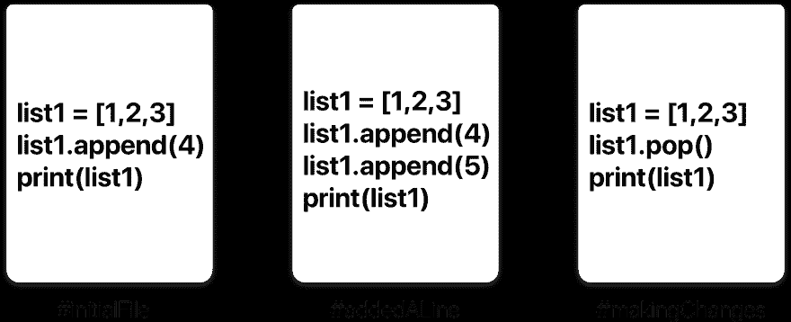 ](https://res.cloudinary.com/practicaldev/image/fetch/s--5O4xvY_u--/c_limit%2Cf_auto%2Cfl_progressive%2Cq_auto%2Cw_880/https://cdn-images-1.medium.com/max/4912/1%2ALp_67l9zwur7aaFAhpVDrg.png) *一个文件版本历史的简单例子。*

在上面的例子中，所有三张卡片代表同一个文件的不同版本。我们可以随时选择想要使用的文件版本。所以我可以在 git 时间连续体中来回跳转到文件的任何版本。

Git 还可以帮助你在多人之间同步代码 。想象一下你和你的朋友正在合作一个项目。你们都在处理相同的项目文件。现在，Git 将你和你的朋友独立完成的修改合并到一个“**主库**”中。因此，通过使用 Git，您可以确保双方都在使用最新版本的存储库。因此，您不必担心将您的文件邮寄给对方，也不必担心处理数量惊人的原始文件副本。远程协作变得像 HTML 一样简单🙃。

## Git 工作流程:

在我们开始使用 Git 命令之前，您有必要了解它代表了什么。

### 什么是储存库？

一个**库**又名**回购**只不过是源代码的集合。

### Git 工作流程中有四个基本要素。

**工作目录**、**中转区**、**本地库**和**远程库**。

[ ](https://res.cloudinary.com/practicaldev/image/fetch/s--vNzXFhEo--/c_limit%2Cf_auto%2Cfl_progressive%2Cq_auto%2Cw_880/https://cdn-images-1.medium.com/max/2000/1%2AiL2J8k4ygQlg3xriKGimbQ.png) *简单 Git 工作流程图*

如果考虑工作目录中的一个文件，它可能有三种状态。

1.  **可以上演。**这意味着具有更新的变更的文件被标记为提交到本地存储库，但是还没有提交。

2.  **可以修改**。这意味着带有更新更改的文件还没有存储在本地存储库中。

3.  **可以提交**。这意味着您对文件所做的更改会安全地存储在本地存储库中。

*   git add 是一个用于将工作目录中的文件添加到登台区的命令。

*   git commit 是一个命令，用于将暂存的所有文件添加到本地存储库中。

*   git push 是一个命令，用于将本地存储库中所有提交的文件添加到远程存储库中。因此，在远程存储库中，所有文件和更改对任何能够访问远程存储库的人都是可见的。

*   git fetch 是一个命令，用于将文件从远程存储库获取到本地存储库，而不是工作目录。

*   git merge 是一个命令，用于将文件从本地存储库放入工作目录。

*   git pull 是用于将文件从远程存储库直接放入工作目录的命令。这相当于 git 获取和 git 合并。

现在我们知道了什么是 Git 以及它的基本术语，让我们看看如何在 git 下放置一个文件。我们要用正确的方式和困难的方式去做。没有任何 GUI 应用程序。

我假设您已经有了一个想要进行版本控制的文件。如果没有，创建一个名为“MuskCult”的示例文件夹，并在其中放置一些示例代码文件。

## 第 0 步:制作 GitHub 账号。咄。

如果你还没有，你可以在这里做一个[。](https://github.com/join)

## 第一步:确保你的机器上安装了 Git。

如果您使用的是 **Mac** ，启动终端并输入以下命令:

```
$ git --version 
```

<svg width="20px" height="20px" viewBox="0 0 24 24" class="highlight-action crayons-icon highlight-action--fullscreen-on"><title>Enter fullscreen mode</title></svg> <svg width="20px" height="20px" viewBox="0 0 24 24" class="highlight-action crayons-icon highlight-action--fullscreen-off"><title>Exit fullscreen mode</title></svg>

如果您还没有 git，这将提示您打开一个安装程序。所以使用安装程序来设置它。如果你已经有了 git，它只会显示你安装了哪个版本的 git。

如果您运行的是 **Linux** (deb)，请在终端中输入以下内容:

```
$ sudo apt install git-all 
```

<svg width="20px" height="20px" viewBox="0 0 24 24" class="highlight-action crayons-icon highlight-action--fullscreen-on"><title>Enter fullscreen mode</title></svg> <svg width="20px" height="20px" viewBox="0 0 24 24" class="highlight-action crayons-icon highlight-action--fullscreen-off"><title>Exit fullscreen mode</title></svg>

如果您在**窗口**上:

```
$ get a mac 
```

<svg width="20px" height="20px" viewBox="0 0 24 24" class="highlight-action crayons-icon highlight-action--fullscreen-on"><title>Enter fullscreen mode</title></svg> <svg width="20px" height="20px" viewBox="0 0 24 24" class="highlight-action crayons-icon highlight-action--fullscreen-off"><title>Exit fullscreen mode</title></svg>

开个玩笑…放松…我触发的人数…唷…
去这个[链接](https://www.apple.com/macos/what-is/)或这个[链接](https://gitforwindows.org/)了解更多关于如何获得它的信息。

## 第二步:告诉 Git 你是谁。

自我介绍一下。滑进去。说真的，提及你的 Git 用户名和电子邮件地址，因为每次 Git 提交都会使用这些信息来识别你是作者。

```
$ git config --global user.name "YOUR_USERNAME"

$ git config --global user.email "im_satoshi@musk.com"

$ git config --global --list # To check the info you just provided 
```

<svg width="20px" height="20px" viewBox="0 0 24 24" class="highlight-action crayons-icon highlight-action--fullscreen-on"><title>Enter fullscreen mode</title></svg> <svg width="20px" height="20px" viewBox="0 0 24 24" class="highlight-action crayons-icon highlight-action--fullscreen-off"><title>Exit fullscreen mode</title></svg>

[](https://res.cloudinary.com/practicaldev/image/fetch/s--HAt099Sw--/c_limit%2Cf_auto%2Cfl_progressive%2Cq_66%2Cw_880/https://cdn-images-1.medium.com/max/2000/1%2AJbyUdhLMEdglRxQk6PH7Vg.gif)

## 第三步:生成/检查机器上现有的 SSH 密钥。(可选)

为什么这么问？使用 **SSH 协议**，您可以连接并认证远程服务器和服务。使用 SSH 密钥，您可以连接到 GitHub，而无需在每次访问时提供您的用户名或密码。

点击此[链接](https://help.github.com/articles/about-ssh/)了解更多关于 SSH 的信息。
去[这里](https://help.github.com/articles/checking-for-existing-ssh-keys/)检查你是否有一个现有的 SSH 密钥。
转到[这里](https://help.github.com/articles/generating-a-new-ssh-key-and-adding-it-to-the-ssh-agent/)生成一个 SSH 密钥。
转到[这里](https://help.github.com/articles/adding-a-new-ssh-key-to-your-github-account/)将 SSH 密钥添加到您的 GitHub 帐户。
最后，到[这里](https://help.github.com/articles/testing-your-ssh-connection/)测试其连接。

如果您设置了 SSH，那么每一个带有链接的 git 命令都会被替换为:

```
**Instead of: https://github.com/username/reponame**

**You use    : git@github.com/username/reponame.git**

      **Note: You can use both ways alternatively** 
```

<svg width="20px" height="20px" viewBox="0 0 24 24" class="highlight-action crayons-icon highlight-action--fullscreen-on"><title>Enter fullscreen mode</title></svg> <svg width="20px" height="20px" viewBox="0 0 24 24" class="highlight-action crayons-icon highlight-action--fullscreen-off"><title>Exit fullscreen mode</title></svg>

在本教程中，我将使用 SSH 协议。

## 第四步:走吧

在 GitHub 上创建一个新的资源库。跟着这个[链接](https://github.com/new)。
现在，在你的终端中找到你想放在 git 下的文件夹。

```
$ cd Desktop/MuskCult 
```

<svg width="20px" height="20px" viewBox="0 0 24 24" class="highlight-action crayons-icon highlight-action--fullscreen-on"><title>Enter fullscreen mode</title></svg> <svg width="20px" height="20px" viewBox="0 0 24 24" class="highlight-action crayons-icon highlight-action--fullscreen-off"><title>Exit fullscreen mode</title></svg>

### 初始化 Git:

要将它放在 git 下，请输入:

```
$ touch README.md   # To create a README file for the repository
$ git init          # Initiates an empty git repository 
```

<svg width="20px" height="20px" viewBox="0 0 24 24" class="highlight-action crayons-icon highlight-action--fullscreen-on"><title>Enter fullscreen mode</title></svg> <svg width="20px" height="20px" viewBox="0 0 24 24" class="highlight-action crayons-icon highlight-action--fullscreen-off"><title>Exit fullscreen mode</title></svg>

[](https://res.cloudinary.com/practicaldev/image/fetch/s--nQJ-j8SJ--/c_limit%2Cf_auto%2Cfl_progressive%2Cq_66%2Cw_880/https://cdn-images-1.medium.com/max/2000/1%2AQ_DUXRghgFQb9F47mUB6LQ.gif)

现在编辑 README.md 文件以提供关于存储库的信息。

### 将文件添加到暂存区进行提交:

现在将文件添加到 git 存储库中进行提交:

```
$ git add . 
# Adds all the files in the local repository and stages them for commit

OR if you want to add a specific file

$ git add README.md
# To add a specific file 
```

<svg width="20px" height="20px" viewBox="0 0 24 24" class="highlight-action crayons-icon highlight-action--fullscreen-on"><title>Enter fullscreen mode</title></svg> <svg width="20px" height="20px" viewBox="0 0 24 24" class="highlight-action crayons-icon highlight-action--fullscreen-off"><title>Exit fullscreen mode</title></svg>

### 在我们提交之前，让我们看看存放了哪些文件:

```
$ git status # Lists all new or modified files to be committed 
```

<svg width="20px" height="20px" viewBox="0 0 24 24" class="highlight-action crayons-icon highlight-action--fullscreen-on"><title>Enter fullscreen mode</title></svg> <svg width="20px" height="20px" viewBox="0 0 24 24" class="highlight-action crayons-icon highlight-action--fullscreen-off"><title>Exit fullscreen mode</title></svg>

[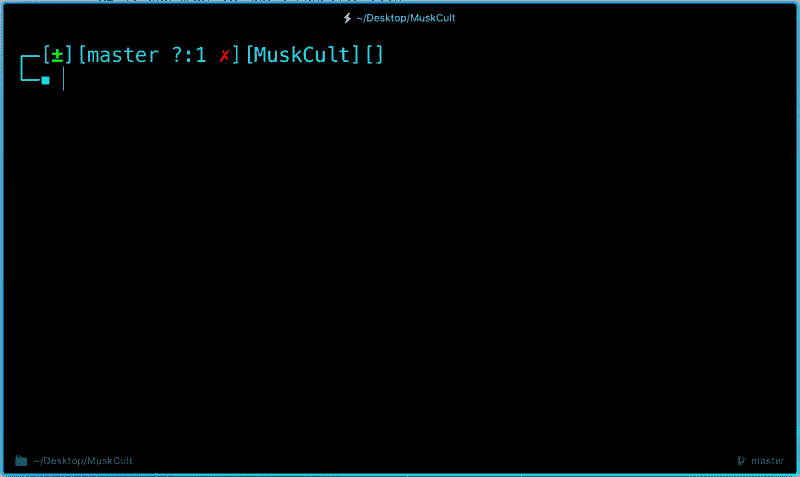](https://res.cloudinary.com/practicaldev/image/fetch/s--G-8LJDch--/c_limit%2Cf_auto%2Cfl_progressive%2Cq_66%2Cw_880/https://cdn-images-1.medium.com/max/2000/1%2Aa2_hw7cMe2R9R_aI86dB-A.gif)

### 提交您对 Git Repo 所做的更改:

现在提交添加到 git repo 中的文件:

```
$ git commit -m "First commit"
# The message in the " " is given so that the other users can read the message and see what changes you made 
```

<svg width="20px" height="20px" viewBox="0 0 24 24" class="highlight-action crayons-icon highlight-action--fullscreen-on"><title>Enter fullscreen mode</title></svg> <svg width="20px" height="20px" viewBox="0 0 24 24" class="highlight-action crayons-icon highlight-action--fullscreen-off"><title>Exit fullscreen mode</title></svg>

[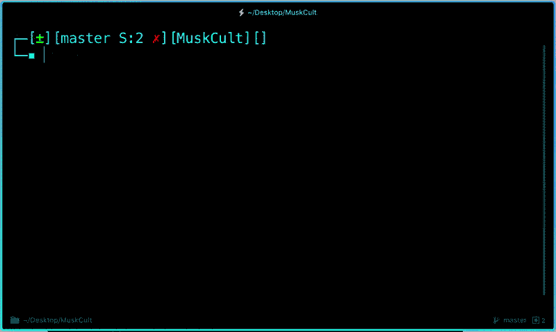](https://res.cloudinary.com/practicaldev/image/fetch/s--bqzDX_p8--/c_limit%2Cf_auto%2Cfl_progressive%2Cq_66%2Cw_880/https://cdn-images-1.medium.com/max/2000/1%2ALoUwFy29RkgCS7hCajd_3g.gif)

### 取消提交您刚刚对 Git Repo 所做的更改:

现在，假设您在代码中犯了一些错误，或者在存储库中放置了一个不需要的文件，您可以使用以下命令来卸载刚刚添加的文件:

```
$ git reset HEAD~1
# Remove the most recent commit
# Commit again! 
```

<svg width="20px" height="20px" viewBox="0 0 24 24" class="highlight-action crayons-icon highlight-action--fullscreen-on"><title>Enter fullscreen mode</title></svg> <svg width="20px" height="20px" viewBox="0 0 24 24" class="highlight-action crayons-icon highlight-action--fullscreen-off"><title>Exit fullscreen mode</title></svg>

[](https://res.cloudinary.com/practicaldev/image/fetch/s--1x2fsrC0--/c_limit%2Cf_auto%2Cfl_progressive%2Cq_66%2Cw_880/https://cdn-images-1.medium.com/max/2000/1%2ArxOX_U-ZRmGfhgIhNWlDIQ.gif)

### 添加远程原点和推送:

现在，每次你在文件中进行更改并保存时，它不会在 GitHub 上自动更新。我们在文件中所做的所有更改都会在本地存储库中更新。现在要更新对母版的更改:

```
$ git remote add origin remote_repository_URL
# sets the new remote 
```

<svg width="20px" height="20px" viewBox="0 0 24 24" class="highlight-action crayons-icon highlight-action--fullscreen-on"><title>Enter fullscreen mode</title></svg> <svg width="20px" height="20px" viewBox="0 0 24 24" class="highlight-action crayons-icon highlight-action--fullscreen-off"><title>Exit fullscreen mode</title></svg>

git remote 命令允许您创建、查看和删除与其他存储库的连接。

```
$ git remote -v
# List the remote connections you have to other repositories. 
```

<svg width="20px" height="20px" viewBox="0 0 24 24" class="highlight-action crayons-icon highlight-action--fullscreen-on"><title>Enter fullscreen mode</title></svg> <svg width="20px" height="20px" viewBox="0 0 24 24" class="highlight-action crayons-icon highlight-action--fullscreen-off"><title>Exit fullscreen mode</title></svg>

git remote -v 命令列出了到其他存储库的远程连接的 URL。

```
$ git push -u origin master # pushes changes to origin 
```

<svg width="20px" height="20px" viewBox="0 0 24 24" class="highlight-action crayons-icon highlight-action--fullscreen-on"><title>Enter fullscreen mode</title></svg> <svg width="20px" height="20px" viewBox="0 0 24 24" class="highlight-action crayons-icon highlight-action--fullscreen-off"><title>Exit fullscreen mode</title></svg>

现在， **git push** 命令将本地存储库中的更改推送到您指定为源的远程存储库中。

[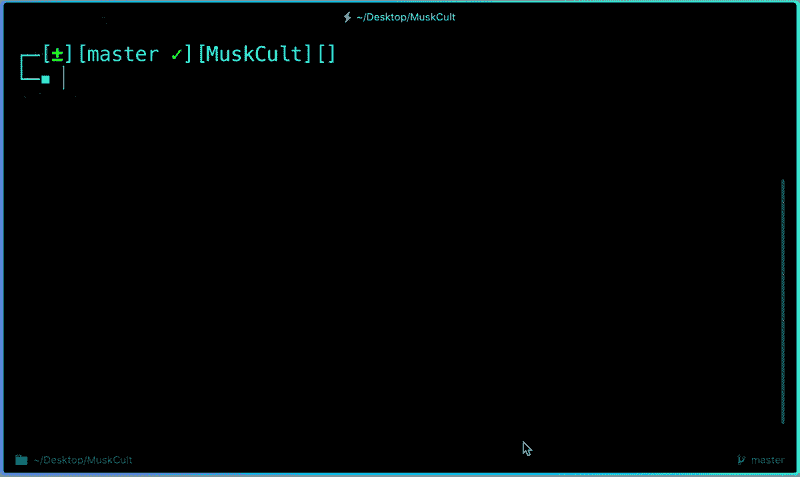](https://res.cloudinary.com/practicaldev/image/fetch/s--6VMVc2xj--/c_limit%2Cf_auto%2Cfl_progressive%2Cq_66%2Cw_880/https://cdn-images-1.medium.com/max/2000/1%2Aw-nfopsKIks_JRzFe5D8xA.gif)

现在，如果我们去查看我们在 GitHub 上的存储库页面，它应该是这样的:

[](https://res.cloudinary.com/practicaldev/image/fetch/s--KmgNjcrY--/c_limit%2Cf_auto%2Cfl_progressive%2Cq_auto%2Cw_880/https://cdn-images-1.medium.com/max/4080/1%2AaQljQFkytY84BgmlVtpgmw.png)

仅此而已。您已经将文件添加到了刚刚在 GitHub 上创建的存储库中。

### 查看您对文件所做的更改:

一旦您开始对您的文件进行更改并保存它们，该文件将不会与提交给 git 的上一个版本相匹配。要查看您刚才所做的更改:

```
$ git diff # To show the files changes not yet staged 
```

<svg width="20px" height="20px" viewBox="0 0 24 24" class="highlight-action crayons-icon highlight-action--fullscreen-on"><title>Enter fullscreen mode</title></svg> <svg width="20px" height="20px" viewBox="0 0 24 24" class="highlight-action crayons-icon highlight-action--fullscreen-off"><title>Exit fullscreen mode</title></svg>

[](https://res.cloudinary.com/practicaldev/image/fetch/s--1D-wEcQ---/c_limit%2Cf_auto%2Cfl_progressive%2Cq_66%2Cw_880/https://cdn-images-1.medium.com/max/2000/1%2Axym1QvvvWorfoyGMXv28Yg.gif)

### 恢复到 Git Repo 的最后一个提交版本:

现在，您可以通过输入以下内容选择恢复到上次提交的版本:

```
$ git checkout .

OR for a specific file

$ git checkout -- <filename> 
```

<svg width="20px" height="20px" viewBox="0 0 24 24" class="highlight-action crayons-icon highlight-action--fullscreen-on"><title>Enter fullscreen mode</title></svg> <svg width="20px" height="20px" viewBox="0 0 24 24" class="highlight-action crayons-icon highlight-action--fullscreen-off"><title>Exit fullscreen mode</title></svg>

[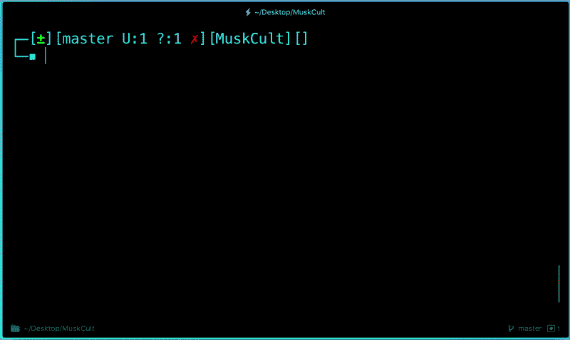](https://res.cloudinary.com/practicaldev/image/fetch/s--fKMarYFm--/c_limit%2Cf_auto%2Cfl_progressive%2Cq_66%2Cw_880/https://cdn-images-1.medium.com/max/2000/1%2AHYgYkfo3W4MUA8CJl12rXg.gif)

### 查看提交历史:

您可以使用 **git log** 命令来查看您提交文件的历史记录:

```
$ git log 
```

<svg width="20px" height="20px" viewBox="0 0 24 24" class="highlight-action crayons-icon highlight-action--fullscreen-on"><title>Enter fullscreen mode</title></svg> <svg width="20px" height="20px" viewBox="0 0 24 24" class="highlight-action crayons-icon highlight-action--fullscreen-off"><title>Exit fullscreen mode</title></svg>

[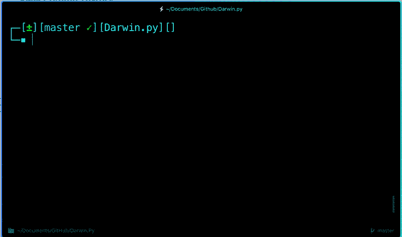](https://res.cloudinary.com/practicaldev/image/fetch/s--nhZk2ekb--/c_limit%2Cf_auto%2Cfl_progressive%2Cq_66%2Cw_880/https://cdn-images-1.medium.com/max/2000/1%2A9w7uBJcQMxc708DBw8Sewg.gif)

每当您做出希望反映在 GitHub 上的更改时，以下是最常见的命令流:

```
$ git add .
$ git status # Lists all new or modified files to be committed
$ git commit -m "Second commit"
$ git push -u origin master 
```

<svg width="20px" height="20px" viewBox="0 0 24 24" class="highlight-action crayons-icon highlight-action--fullscreen-on"><title>Enter fullscreen mode</title></svg> <svg width="20px" height="20px" viewBox="0 0 24 24" class="highlight-action crayons-icon highlight-action--fullscreen-off"><title>Exit fullscreen mode</title></svg>

[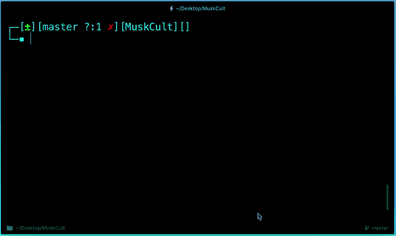](https://res.cloudinary.com/practicaldev/image/fetch/s--zJNhTNY---/c_limit%2Cf_auto%2Cfl_progressive%2Cq_66%2Cw_880/https://cdn-images-1.medium.com/max/2000/1%2ArWBJnBdF1V8YO_mi-jEfxA.gif)

现在，如果我们去查看我们的 repo，我们可以通过查看每个文件的提交消息来确定提交是否成功。

[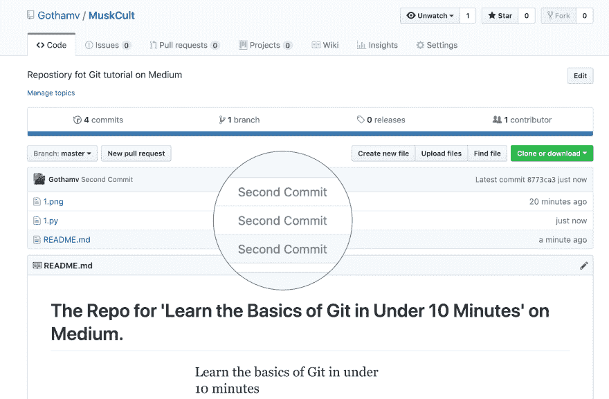](https://res.cloudinary.com/practicaldev/image/fetch/s--mRrChVPd--/c_limit%2Cf_auto%2Cfl_progressive%2Cq_auto%2Cw_880/https://cdn-images-1.medium.com/max/4216/1%2AQHM8m5HGavHkdzPz06UWGw.png)

## 第五步:这很好，但是我如何在 GitHub 上下载和运行其他的库呢？

### 克隆 Git 回购:

找到要克隆存储库的目录。复制所需存储库的链接，并输入以下内容:

```
$ git clone remote_repository_URL 
```

<svg width="20px" height="20px" viewBox="0 0 24 24" class="highlight-action crayons-icon highlight-action--fullscreen-on"><title>Enter fullscreen mode</title></svg> <svg width="20px" height="20px" viewBox="0 0 24 24" class="highlight-action crayons-icon highlight-action--fullscreen-off"><title>Exit fullscreen mode</title></svg>

请随意使用:[https://github.com/Gothamv/MuskCult](https://github.com/Gothamv/MuskCult)复制我在上面创建的回购协议

[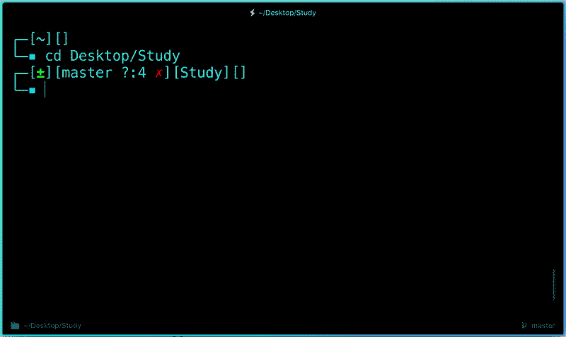](https://res.cloudinary.com/practicaldev/image/fetch/s--o_DiZKm5--/c_limit%2Cf_auto%2Cfl_progressive%2Cq_66%2Cw_880/https://cdn-images-1.medium.com/max/2000/1%2A6NACk8-IiBjbauM-k-aesQ.gif)

### 推式修改 Git 回购:

现在，您可以处理您想要的文件，并在本地提交更改。如果您想要将变更推送到该存储库，您要么必须被添加为该存储库的合作者，要么您必须创建一个称为拉请求的东西。去看看如何做一个[这里](https://help.github.com/articles/creating-a-pull-request/)，给我一个拉你的代码文件的请求。

### 协作:

想象一下你和你的朋友正在合作一个项目。你们都在处理相同的项目文件。每次你做了一些改变并把它推送到主回购中，你的朋友必须把你推送到 git 回购中的改变拉回来。也就是说，为了确保每次开始工作时都使用最新版本的 git repo，可以使用 git pull 命令。

下面是我和我朋友合作的一个项目的例子:

[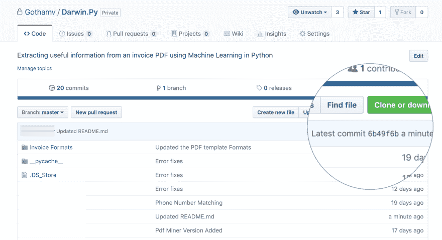 ](https://res.cloudinary.com/practicaldev/image/fetch/s--tujkQlow--/c_limit%2Cf_auto%2Cfl_progressive%2Cq_auto%2Cw_880/https://cdn-images-1.medium.com/max/4216/1%2A2-tl2rHsgPqiv88aI55CPw.png) **刚刚有一个回购上的提交**

因此，为了确保这些更改反映在我的本地回购副本上:

```
$ git pull origin master 
```

<svg width="20px" height="20px" viewBox="0 0 24 24" class="highlight-action crayons-icon highlight-action--fullscreen-on"><title>Enter fullscreen mode</title></svg> <svg width="20px" height="20px" viewBox="0 0 24 24" class="highlight-action crayons-icon highlight-action--fullscreen-off"><title>Exit fullscreen mode</title></svg>

[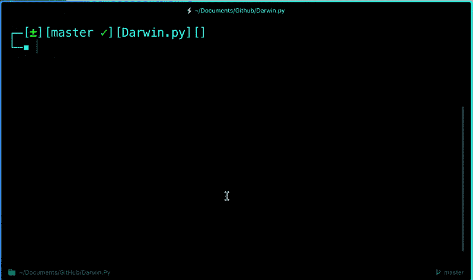](https://res.cloudinary.com/practicaldev/image/fetch/s--GJ2O6mq7--/c_limit%2Cf_auto%2Cfl_progressive%2Cq_66%2Cw_880/https://cdn-images-1.medium.com/max/2000/1%2AySDKu2OEdkc26yOUp-TJJQ.gif)

### 这里有两个更有用的 git 命令:

```
$ git fetch
    AND
$ git merge 
```

<svg width="20px" height="20px" viewBox="0 0 24 24" class="highlight-action crayons-icon highlight-action--fullscreen-on"><title>Enter fullscreen mode</title></svg> <svg width="20px" height="20px" viewBox="0 0 24 24" class="highlight-action crayons-icon highlight-action--fullscreen-off"><title>Exit fullscreen mode</title></svg>

用最简单的术语来说，git fetch 后跟 git merge 等于 git pull。但是这些为什么会存在呢？

当您使用 git pull 时，git 会尝试自动为您完成工作。**它是上下文相关的**，所以 Git 会将任何提取的提交合并到您当前工作的分支中。git pull **会自动合并提交，而不会让您先检查它们**。

当您获取 git 时，Git 从目标分支收集任何在您的当前分支中不存在的提交，并将它们存储在您的本地存储库中。然而，**并没有将它们与你当前的分支**合并。如果您需要保持您的存储库是最新的，但是如果您更新您的文件，您正在处理的东西可能会中断，这是非常有用的。要将提交集成到您的主分支中，您可以使用 git merge。

## 还有一件事:

```
.gitignore 
```

<svg width="20px" height="20px" viewBox="0 0 24 24" class="highlight-action crayons-icon highlight-action--fullscreen-on"><title>Enter fullscreen mode</title></svg> <svg width="20px" height="20px" viewBox="0 0 24 24" class="highlight-action crayons-icon highlight-action--fullscreen-off"><title>Exit fullscreen mode</title></svg>

那是什么呢？

。gitignore 告诉 git 应该忽略哪些文件(或模式)。它通常用于避免提交工作目录中对其他合作者无用的临时文件，如编译产品、ide 创建的临时文件等。

[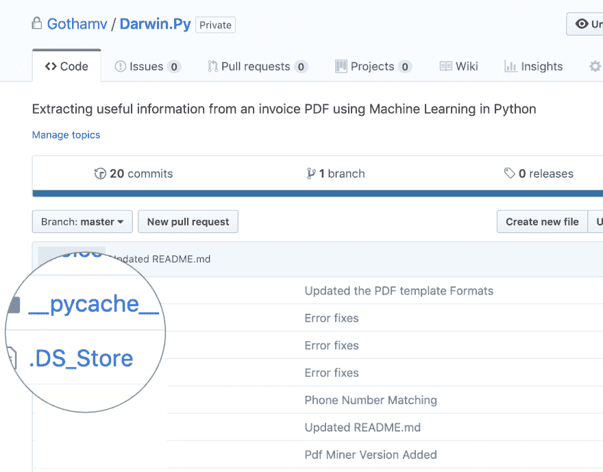](https://res.cloudinary.com/practicaldev/image/fetch/s--xvbhMI7X--/c_limit%2Cf_auto%2Cfl_progressive%2Cq_auto%2Cw_880/https://cdn-images-1.medium.com/max/2914/1%2A3NFtOjfz0NvNSwba7YCmDA.png)

所以在上面的例子中，像 **pycache** 这样的文件。系统使用 DS_Store 来存储信息以便更快地访问。这对其他合作者没有用。所以我们可以通过添加一个. gitignore 文件来告诉 git 忽略它们。

使用 touch 命令创建。gitignore 文件:

```
$ touch .gitignore 
```

<svg width="20px" height="20px" viewBox="0 0 24 24" class="highlight-action crayons-icon highlight-action--fullscreen-on"><title>Enter fullscreen mode</title></svg> <svg width="20px" height="20px" viewBox="0 0 24 24" class="highlight-action crayons-icon highlight-action--fullscreen-off"><title>Exit fullscreen mode</title></svg>

并且您可以添加以下模式来告诉 git 忽略此类文件。

```
/*.cmake

/*.DS_Store

/.user

/build

etc. depending upon the files you want git to untrack 
```

<svg width="20px" height="20px" viewBox="0 0 24 24" class="highlight-action crayons-icon highlight-action--fullscreen-on"><title>Enter fullscreen mode</title></svg> <svg width="20px" height="20px" viewBox="0 0 24 24" class="highlight-action crayons-icon highlight-action--fullscreen-off"><title>Exit fullscreen mode</title></svg>

## 
  
基本情况就这么多了。请继续关注第 2 部分，该部分将重点关注分支、合并、隐藏、Rebase 等。

## [t1【和平外出】](#peace-out)

**参考文献:**

[https://help . github . com/articles/adding-an-existing-project-to-github-using-the-command-line/](https://help.github.com/articles/adding-an-existing-project-to-github-using-the-command-line/)

[https://blog . github . com/2015-06-08-how-to-undo-almost-any-with-git/](https://blog.github.com/2015-06-08-how-to-undo-almost-anything-with-git/)

[https://don-be-fear-to-commit . readthedocs . io/en/latest/git/command line git . html](https://dont-be-afraid-to-commit.readthedocs.io/en/latest/git/commandlinegit.html)

[https://docs . git lab . com/ee/git lab-basics/start-using-git . html](https://docs.gitlab.com/ee/gitlab-basics/start-using-git.html)

[https://stack overflow . com/questions/292357/git-pull-and-git-fetch 的区别是什么](https://stackoverflow.com/questions/292357/what-is-the-difference-between-git-pull-and-git-fetch)

[https://youtu . be/3a 2x 1 ijfjwc](https://youtu.be/3a2x1iJFJWc)