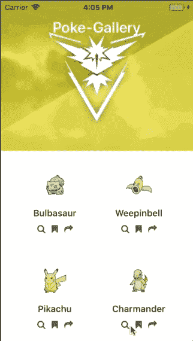
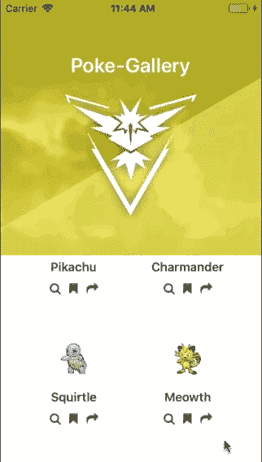
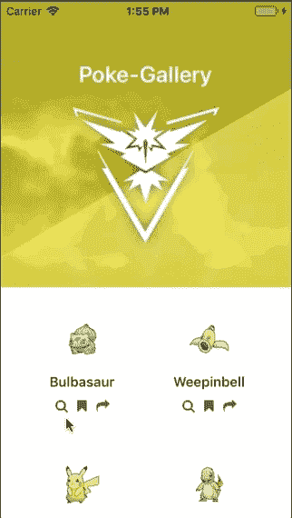
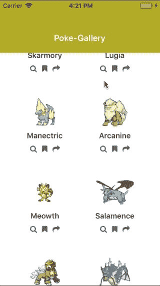

# 向 React 本机应用程序添加动画——第 2 部分:过渡动画

> 原文：<https://dev.to/wernancheta/adding-animations-to-your-react-native-app-part-2-transition-animations-n4>

欢迎来到向 React 本机应用程序添加动画的三部分系列的第二部分。在这一部分，你将学习如何添加过渡动画。具体来说，我们将:

*   当用户在列表上滚动时动画显示标题。
*   自定义由 React 导航设置的页面过渡动画。
*   使用 LayoutAnimation 制作受状态更改影响的组件的动画。

## 先决条件

要学习本教程，您需要了解 React 和 React Native 的基础知识。

阅读本系列的第一部分很有帮助，但不是必需的。尽管本教程假设您知道如何在 React Native 上实现基本动画。您应该已经知道如何实现缩放、旋转和序列动画。我们将在实现过渡动画时应用这些相同的概念。

我们还将使用第二版的[反应导航](https://reactnavigation.org/)。了解堆栈导航器很有帮助，但不是必需的。

## 你将建造什么

以下是您将要构建的内容:

[](https://res.cloudinary.com/practicaldev/image/fetch/s--GV_HUxq1--/c_limit%2Cf_auto%2Cfl_progressive%2Cq_66%2Cw_880/https://d2mxuefqeaa7sj.cloudfront.net/s_C1809527E2B34D744AF2137B86B5994B06DACA31E57B532677A9809007467FAE_1529898864181_rn-animations2-final.gif)

你可以在其 [GitHub repo](https://github.com/anchetaWern/RNRealworldAnimations) 上找到本教程的完整源代码。我们将对第一部分的最终源代码进行修改。如果在任何时候，您对需要进行哪些具体的更改感到困惑，请务必检查包含本系列这一部分的最终源代码的分支的提交历史(`part2`)。

## 设置项目

要跟进，首先需要克隆回购:

```
git clone https://github.com/anchetaWern/RNRealworldAnimations.git 
```

之后，切换到`part1`分支并安装依赖项:

```
cd RNRealworldAnimations
git checkout part1
npm install 
```

接下来，设置`android`和`ios`文件夹:

```
react-native upgrade 
```

链接本机依赖项。在这种情况下，只有[反应本地矢量图标](https://github.com/oblador/react-native-vector-icons):

```
react-native link 
```

完成后，您应该能够在您的设备或模拟器上运行该应用程序:

```
react-native run-android
react-native run-ios 
```

`part1`分支包含该系列第一部分的最终输出。我们将在第一部分已经实现的动画的基础上添加新的动画。该部分的最终源代码可在`part2`分支获得。

## 标题滚动动画

首先，让我们看看如何在用户滚动列表时实现标题动画:

[](https://res.cloudinary.com/practicaldev/image/fetch/s--JdsdCwds--/c_limit%2Cf_auto%2Cfl_progressive%2Cq_66%2Cw_880/https://d2mxuefqeaa7sj.cloudfront.net/s_C1809527E2B34D744AF2137B86B5994B06DACA31E57B532677A9809007467FAE_1529482087843_header-animation.gif)

要实现动画，我们需要进行以下更改:

1.  更新`App.js`文件以添加一个动画值，该动画值将被内插以制作标题动画。该动画值将与当前滚动位置直接相关。从而允许我们根据当前滚动位置来执行不同种类的动画。
2.  创建一个实现动画的`AnimatedHeader`组件。

### 重构代码

在我们继续之前，让我们首先重构代码。在`App.js`文件中，将`getRandomInt`功能移动到一个单独的文件(`src/lib/random.js`):

```
// src/lib/random.js
const getRandomInt = (max, min) => {
  return Math.floor(Math.random() * (max - min) + min);
};

export { getRandomInt }; 
```

然后将其导入到`App.js`文件中:

```
import { getRandomInt } from "./src/lib/random"; 
```

### 添加动画值

现在我们可以从动画头的实现开始。

创建一个`src/settings/layout.js`文件。这是我们保存动画标题布局设置的地方:

*   `HEADER_MAX_HEIGHT` -动画标题的最大高度。当用户还没有滚动列表时，这将是页眉的默认高度。
*   `HEADER_MIN_HEIGHT` -割台的最小高度。这将根据应用程序当前运行的平台略有不同，因为从屏幕顶部到应用程序呈现的实际空间的高度在两个平台之间会有所不同。
*   `HEADER_SCROLL_DISTANCE` -为了应用`HEADER_MIN_HEIGHT`，需要滚动的高度。

```
// src/settings/layout.js
import { Platform } from "react-native";
const HEADER_MAX_HEIGHT = 250;
const HEADER_MIN_HEIGHT = Platform.OS === "ios" ? 40 : 53;
const HEADER_SCROLL_DISTANCE = HEADER_MAX_HEIGHT - HEADER_MIN_HEIGHT;

export { HEADER_MAX_HEIGHT, HEADER_MIN_HEIGHT, HEADER_SCROLL_DISTANCE }; 
```

接下来，打开`App.js`文件并导入我们需要的模块:

```
import { View, ScrollView, Platform, Animated } from "react-native";
import { HEADER_MAX_HEIGHT } from "./src/settings/layout"; 
```

在`constructor`中，初始化我们将使用的动画值。默认情况下，这应该有一个值`0`,因为当页面加载时我们还没有真正滚动。但是 iOS 却因为[的内容插页](https://developer.apple.com/documentation/uikit/uiscrollview/1619406-contentinset)而有所不同。我们必须使用动画标题最大高度的负等值(`-HEADER_MAX_HEIGHT`)作为初始值。如果我们只指定了`0`，输出将如下所示:

[](https://res.cloudinary.com/practicaldev/image/fetch/s--2tp2T1JR--/c_limit%2Cf_auto%2Cfl_progressive%2Cq_66%2Cw_880/https://d2mxuefqeaa7sj.cloudfront.net/s_C1809527E2B34D744AF2137B86B5994B06DACA31E57B532677A9809007467FAE_1529896096485_ios-animated-header-default.gif)

代码如下:

```
// App.js
constructor(props) {
  super(props);
  this.pokemon_stats = [];

  // add this:
  this.nativeScrollY = new Animated.Value(
    Platform.OS === "ios" ? -HEADER_MAX_HEIGHT : 0
  );
}
// next: add code for render method 
```

接下来，在`render`方法中，我们需要将滚动值带回`0`。我们可以通过使用`Animated.add`方法来做到这一点。这允许我们向现有的动画值添加一个新值，在本例中，它是`this.nativeScrollY`。第二个参数是要添加的值。

前面，我们已经将 iOS 的默认动画值设置为标题最大高度(`-HEADER_MAX_HEIGHT`)的负值。所以我们需要加上等价的正值，使其回到`0`。我知道要理解这个想法有点困难，所以把它看作是处理 iOS 滚动条内容插件的一个小技巧。如果您不应用它，您将会得到一个类似于前面演示的问题。代码如下:

```
// App.js
render() {
  let nativeScrollY = Animated.add(
    this.nativeScrollY,
    Platform.OS === "ios" ? HEADER_MAX_HEIGHT : 0
  );

  // next: add code for rendering the CardList
} 
```

接下来，将一个`onScroll`道具传递给`CardList`组件。稍后，这个属性的值将被直接传递给`src/components/CardList.js`文件中`ScrollView`组件的`onScroll`属性。这将动画值绑定到`ScrollView`的当前滚动位置。我们通过使用`Animated.event`并将映射传递给本地事件来实现这一点。在这种情况下，`nativeEvent.contentOffset.y`被映射到`this.nativeScrollY`:

```
// App.js
{this.nativeScrollY && (
  <CardList
    ...previously added props here...
    onScroll={Animated.event(
      [{ nativeEvent: { contentOffset: { y: this.nativeScrollY } } }],
      {
        useNativeDriver: true
      }
    )}
  /> )} 
```

接下来，打开`src/components/CardList.js`文件，导入我们需要的模块:

```
import { View, FlatList, Animated, Platform } from "react-native";
import { HEADER_MAX_HEIGHT } from "../settings/layout"; 
```

提取我们之前通过的`onScroll`道具:

```
// src/components/CardList.js
const CardList = ({
  // ..previously extracted props
  onScroll // add this
}) => {
  // next: update render code
}; 
```

接下来，用`Animated.ScrollView`替换`ScrollView`并提供`onScroll`道具。我们还需要提供一些其他的道具:

*   `scrollEventThrottle` -控制滚动时触发滚动事件的频率。关于滚动的信息是通过网桥发送的，所以这需要保持尽可能低，这样应用程序的性能就不会受到影响。较低的值意味着发送频率较低。
*   `contentInset`和`contentOffset` -应用于动画标题的偏移量。这些设置仅适用于 iOS。这允许我们指定标题的高度。这样，标题就不会与下面的列表重叠。如果这两个都没有应用，它看起来会是这样的:

[](https://res.cloudinary.com/practicaldev/image/fetch/s--1JgWM0jd--/c_limit%2Cf_auto%2Cfl_progressive%2Cq_66%2Cw_880/https://d2mxuefqeaa7sj.cloudfront.net/s_C1809527E2B34D744AF2137B86B5994B06DACA31E57B532677A9809007467FAE_1529898273551_ios-content-inset-offset-issue.gif)

看到它是如何在滚动的瞬间跳到最终高度的吗？

代码如下:

```
// src/components/CardList.js
return (
  <Animated.ScrollView
    style={styles.scroll}
    scrollEventThrottle={1}
    onScroll={onScroll}
    contentInset={{
      top: HEADER_MAX_HEIGHT
    }}
    contentOffset={{
      y: -HEADER_MAX_HEIGHT
    }}
  >
    ..previously added scrollview contents
  </Animated.ScrollView> ); 
```

最后，添加样式。这里需要记住的重要一点是，`flex`属性应该应用于动画 ScrollView，而`paddingTop`属性应该应用于 Android。这就是我们如何处理将卡片列表放在标题正下方的问题，这样它们在 Android 上就不会重叠。对于 iOS，已经考虑到了内容插入，所以我们只需将`paddingTop`设置为`0`:

```
// src/components/CardList.js
const styles = {
  scroll: {
    flex: 1
  },
  scroll_container: {
    alignItems: "center",
    paddingTop: Platform.OS == "android" ? HEADER_MAX_HEIGHT : 0
  }
}; 
```

### 动画标题

现在我们准备添加动画头部的代码。首先导入我们需要的模块:

```
// src/components/AnimatedHeader.js
import React from "react";
import { View, Text, Animated, Platform } from "react-native";
import { HEADER_MAX_HEIGHT, HEADER_SCROLL_DISTANCE } from "../settings/layout"; 
```

组件如下:

```
const AnimatedHeader = ({ title, nativeScrollY }) => {
  if (nativeScrollY) {
    // next: add the animation code
  }
}; 
```

此时，我们现在可以根据`nativeScrollY`的当前值制作动画。这是我们稍后将从`App.js`文件传递的当前滚动位置。正如您在前面的演示中所看到的，我们实际上是在同时制作多个组件的动画:

*   **标题** -动画显示 Y 位置。
*   **背景图像** -动画显示 Y 位置和不透明度。
*   **标题** -动画显示刻度和 Y 位置。

从上面的分解中，你可以看到我们需要制作所有相关组件的动画。说到动画，没有继承这回事。动画头部的容器实际上不会以同样的方式动画它的孩子。因此，您必须为每个组件应用您想要使用的单个动画。

下面是动画显示标题的 Y 位置的代码。从下面的代码中，您可以看到我们依赖于`HEADER_SCROLL_DISTANCE`的输入和输出范围。该值是滚动条需要滚动的最大高度，以便标题动画显示到其最终位置。所以我们将它设置为`inputRange`的最终值，而`outputRange`的最终值将是它的倒数。为什么？因为我们正在设置 Y 位置的动画，所以应用负值意味着组件将被移动到顶部:

```
// src/components/AnimatedHeader.js
const headerTranslate = nativeScrollY.interpolate({
  inputRange: [0, HEADER_SCROLL_DISTANCE],
  outputRange: [0, -HEADER_SCROLL_DISTANCE],
  extrapolate: "clamp" // so it wont go over the output range
}); 
```

下面是制作背景图像动画的代码:

```
// src/components/AnimatedHeader.js
// for animating the opacity
const BGImageOpacity = nativeScrollY.interpolate({
  inputRange: [0, HEADER_SCROLL_DISTANCE / 2, HEADER_SCROLL_DISTANCE],
  outputRange: [1, 0.3, 0],
  extrapolate: "clamp"
});

// for animating the Y position
const BGImageTranslate = nativeScrollY.interpolate({
  inputRange: [0, HEADER_SCROLL_DISTANCE],
  outputRange: [0, 100],
  extrapolate: "clamp"
}); 
```

下面是动画字幕的代码:

```
// for animating the scale
const titleScale = nativeScrollY.interpolate({
  inputRange: [0, HEADER_SCROLL_DISTANCE / 2, HEADER_SCROLL_DISTANCE],
  outputRange: [1, 0.8, 0.7],
  extrapolate: "clamp"
});

// for animating the Y position
const titleTranslateY = nativeScrollY.interpolate({
  inputRange: [0, HEADER_SCROLL_DISTANCE / 2, HEADER_SCROLL_DISTANCE],
  outputRange: [25, 35, 15],
  extrapolate: "clamp"
}); 
```

以下是动画风格:

```
const headerStyles = { transform: [{ translateY: headerTranslate }] };

const headerBarStyles = {
  transform: [{ scale: titleScale }, { translateY: titleTranslateY }]
};

const BGImageStyles = {
  opacity: BGImageOpacity,
  transform: [{ translateY: BGImageTranslate }]
}; 
```

接下来，将动画样式应用于我们想要定位的每个组件:

```
return (
  <View style={styles.header_container}>
    <Animated.View pointerEvents="none" style={[styles.header, headerStyles]}>
      <Animated.Image
        style={[styles.header_bg, BGImageStyles]}
        resizeMode={"cover"}
        source={require("../img/team-instinct.jpg")}
      />
    </Animated.View> 
    <Animated.View style={[styles.header_bar, headerBarStyles]}>
      <Text style={styles.header_text}>{title}</Text>
    </Animated.View>
  </View> );
// next: add code for rendering default component if nativeScrollY isn't present 
```

接下来，我们需要在`nativeScrollY`不可用时呈现一个默认组件:

```
if (nativeScrollY) {
  // ...previously added code here
}

// add this:
return (
  <View style={styles.header}>
    <View>
      <Text style={styles.header_text}>{title}</Text>
    </View>
  </View> ); 
```

接下来，添加样式:

```
const styles = {
  header_container: {
    ...Platform.select({
      ios: {
        zIndex: 1 // only applied to iOS, for some reason the cards is laid on top of the header when scrolling
      }
    })
  },
  header: {
    position: "absolute",
    top: 0, // so it's at the very top of its container
    left: 0, // for 100% width
    right: 0, // for 100% width
    backgroundColor: "#B4A608",
    overflow: "hidden", // for containing the background image because this container is absolutely positioned
    height: HEADER_MAX_HEIGHT, // needed for absolutely positioned elements
    zIndex: 1 // so the header will be laid on top of the list
  },
  header_bar: {
    backgroundColor: "transparent",
    height: 32,
    alignItems: "center",
    justifyContent: "center",
    position: "absolute",
    top: 0,
    left: 0,
    right: 0,
    zIndex: 1
  },
  header_bg: {
    position: "absolute",
    top: 0,
    left: 0,
    right: 0,
    width: null, // important so we can apply resizeMode=cover
    height: HEADER_MAX_HEIGHT
  },
  header_text: {
    color: "#FFF",
    fontSize: 25,
    fontWeight: "bold"
  }
};

export default AnimatedHeader; 
```

最后，更新`App.js`文件以使用`AnimatedHeader`组件而不是`Header`组件。别忘了传递`nativeScrollY`道具:

```
// App.js
import AnimatedHeader from "./src/components/AnimatedHeader";
export default class App extends Component<Props> {
  render() {
    return (
      <View style={styles.container}>
        <AnimatedHeader title={"Poke-Gallery"} nativeScrollY={nativeScrollY} />
        ..previously added code here
      </View>
    );
  }
} 
```

一旦完成，你应该能够滚动列表，标题将根据其当前位置显示动画。

## 页面过渡动画

我们要实现的下一个动画是页面过渡动画，它看起来像这样:

[](https://res.cloudinary.com/practicaldev/image/fetch/s--oc1N4EsR--/c_limit%2Cf_auto%2Cfl_progressive%2Cq_66%2Cw_880/https://d2mxuefqeaa7sj.cloudfront.net/s_C1809527E2B34D744AF2137B86B5994B06DACA31E57B532677A9809007467FAE_1529637787360_custom-transition-animation.gif)

如果你没有注意到，当我们导航到下一页时，我们正在执行一点弹跳动画和不透明动画。当我们回到上一页时，我们也在做同样的事情，但是这变得很微妙，因为我们也将不透明度设置回零。

对于这个动画，我们将使用 [React 导航](https://reactnavigation.org/)库。这个库就像 React 应用程序中实现导航的事实上的标准。所以我们要利用它，而不是实现我们自己的导航。这个库已经有了默认的动画，但是我们将对它进行自定义。

要实现自定义页面过渡动画，我们首先需要注意以下几点:

1.  安装依赖项。
2.  设置应用程序的主屏幕。
3.  创建一个新的“共享”屏幕。这是我们将导航到的地方，这样我们可以应用一些动画。
4.  设置导航器，以便在主屏幕和共享屏幕之间导航。
5.  创建将在两个屏幕之间导航时应用的自定义过渡。

我们将在这一部分讨论一些代码。如果在任何时候你不确定需要改变什么，你可以在 GitHub repo 上查看提交。我试图尽可能地描述提交消息，所以您应该能够找到确切的变化。

**安装依赖项**

我们将需要 React 导航库来实现应用程序内的导航。您可以使用以下命令安装它。如果您已经切换到`part1`分支并安装了依赖项，那么它应该已经安装好了:

```
npm install --save react-navigation 
```

### 设置主屏幕

首先，在`src`目录中创建`screens`文件夹。这是我们将在应用程序中放置所有屏幕的地方。

接下来，在刚刚创建的`screens`文件夹中创建一个`Main.js`文件和`Share.js`文件。

打开`App.js`文件，将其所有内容复制到`Main.js`文件中。这将作为应用程序的默认屏幕。

在`Main.js`文件中，更新我们正在导入的文件的路径。只需在你的文本编辑器上进行多重搜索和替换，搜索`./src/`并用`../`替换它，这应该能帮你完成任务。一旦你做到了这一点，你甚至不必介意下面的代码:

```
// src/screens/Main.js
import pokemon from "../data/pokemon";
import pokemon_stats from "../data/pokemon-stats";

import AnimatedHeader from "../components/AnimatedHeader";
import CardList from "../components/CardList";
import AnimatedModal from "../components/AnimatedModal";

Next, rename the component from `App` to `Main`:

// src/screens/Main.js
export default class Main extends Component<Props> {
  // next: add navigation options
} 
```

接下来，添加 React 导航要使用的导航选项:

```
static navigationOptions = ({ navigation }) => {
  return {
    headerTitle: "", // empty because we're using the label inside the AnimatedHeader
    headerStyle: {
      elevation: 0, // only applied to Android to remove the shadow in the header
      shadowOpacity: 0, // for removing the shadow in the header
      backgroundColor: "#B4A608"
    },
    headerTitleStyle: {
      color: "#FFF"
    }
  };
}; 
```

至于`App.js`文件，暂时删除其中的所有代码。

### 创建共享屏幕

接下来，让我们创建共享屏幕。我将简单介绍一下这个屏幕的代码解释，因为我们创建它只是为了导航到另一个屏幕。我们不会真的在这个屏幕上添加任何动画代码。

代码如下:

```
// src/screens/Share.js
import React, { Component } from "react";
import { View } from "react-native";

import IconLabel from "../components/IconLabel";

type Props = {};
export default class Share extends Component<Props> {
  static navigationOptions = ({ navigation }) => {
    return {
      headerTitle: "Share",
      headerStyle: {
        backgroundColor: "#B4A608"
      },
      headerTitleStyle: {
        color: "#FFF"
      }
    };
  };

  render() {
    return (
      <View style={styles.container}>
        <IconLabel
          icon="facebook-f"
          label="Share to Facebook"
          bgColor="#4267b2"
        />

        <IconLabel
          icon="google-plus"
          label="Share to Google+"
          bgColor="#db4437"
        />

        <IconLabel icon="twitter" label="Share to Twitter" bgColor="#1B95E0" />

        <IconLabel
          icon="linkedin"
          label="Share to LinkedIn"
          bgColor="#0077B5"
        />
      </View>
    );
  }
}

const styles = {
  container: {
    flex: 1,
    padding: 20
  }
}; 
```

在上面的代码中，我们使用一个`IconLabel`组件来呈现一个带有图标和标签的按钮。

下面是`IconLabel`组件的代码:

```
// src/components/IconLabel.js
import React from "react";
import { Text, TouchableOpacity } from "react-native";
import Icon from "react-native-vector-icons/FontAwesome";

const IconLabel = ({ icon, label, bgColor }) => {
  let backgroundColor = { backgroundColor: bgColor };
  return (
    <TouchableOpacity
      onPress={this.share}
      style={[styles.shareButton, backgroundColor]}
    >
      <Icon name={icon} style={styles.icon} size={30} color="#fff" />
      <Text style={styles.label}>{label}</Text>
    </TouchableOpacity>
  );
};

const styles = {
  shareButton: {
    padding: 10,
    marginBottom: 10,
    flexDirection: "row",
    justifyContent: "space-between"
  },
  icon: {
    flex: 2
  },
  label: {
    flex: 8,
    marginTop: 5,
    color: "#fff",
    fontSize: 16,
    fontWeight: "bold"
  }
};

export default IconLabel; 
```

完成后，您现在可以更新`Main.js`文件，以便它导航到共享屏幕:

```
// src/screens/Main.js
shareAction = (pokemon, image) => {
  this.props.navigation.navigate("Share"); // add this inside the existing shareAction function
}; 
```

### 设置导航器

现在我们准备设置导航器。这包括两个部分。首先，我们更新`App.js`文件来呈现`Root`组件。该组件是导航器将被声明的地方:

```
// App.js
import React, { Component } from "react";
import { View, YellowBox } from "react-native";

import Root from "./Root";

YellowBox.ignoreWarnings([
  "Warning: isMounted(...) is deprecated",
  "Module RCTImageLoader"
]);

type Props = {};
export default class App extends Component<Props> {
  render() {
    return (
      <View style={styles.container}>
        <Root />
      </View>
    );
  }
}

const styles = {
  container: {
    flex: 1,
    backgroundColor: "#fff"
  }
}; 
```

请注意，我忽略了`isMounted(...) is deprecated`和`Module RCTImageLoader`警告。[这些问题](https://github.com/react-navigation/react-navigation/issues/3956)似乎只有在安装了 React Navigation 后才会出现。我还没有找到任何解决方案，所以现在让我们忽略这个警告。

接下来，让我们继续处理`Root.js`文件。首先导入我们将使用的模块和屏幕:

```
// Root.js
import React from "react";
import { Animated, Easing } from "react-native";
import { createStackNavigator } from "react-navigation";

import MainScreen from "./src/screens/Main";
import ShareScreen from "./src/screens/Share"; 
```

接下来，为两个屏幕创建一个[堆栈导航器](https://reactnavigation.org/docs/en/stack-navigator.html)。`transitionConfig`是一个我们可以传递给堆栈导航器的选项。当在两个屏幕之间导航时，我们将在这里声明想要执行的动画:

```
const RootStack = createStackNavigator(
  {
    Main: {
      screen: MainScreen
    },
    Share: {
      screen: ShareScreen
    }
  },
  {
    initialRouteName: "Main", // set the default page
    transitionConfig // the animation
  }
); 
```

`transitionConfig`是一个包含动画配置的对象。如果您仔细观察，您会注意到它使用的选项与您用于`Animated` API 的选项相同。唯一不同的是`timing`属性。这是要使用的动画类型。我们以前用过`Animated.timing`和`Animated.spring`，你也可以用它们。

如果您想要自定义动画，不要忘记为每种类型的动画提供附加选项。例如，`Animated.spring`可以有一个名为`friction`的属性:

```
// Root.js
const transitionConfig = () => {
  return {
    transitionSpec: {
      duration: 400, // how long the transition will take
      easing: Easing.bounce, // easing function to use (https://facebook.github.io/react-native/docs/easing.html)
      timing: Animated.timing, // the type of animation to use (timing, spring, decay)
      useNativeDriver: true // delegate all the animation related work to the native layer
    },
    screenInterpolator: sceneProps => {
      // next: add code for customizing the transition animation
    }
  };
}; 
```

一般动画设置下面是`screenInterpolator`功能。当应用程序从一个屏幕导航到下一个屏幕时，您可以在这里指定想要执行的实际动画。

首先从`sceneProps`中提取我们需要的所有数据:

*   `layout` -包含关于屏幕布局的信息。比如屏幕的高度和宽度。在这种情况下，我们只使用它来确定当前屏幕的初始宽度(`initWidth`)。
*   `position` -当前屏幕的位置。这是我们为了执行动画可以插入的动画值。
*   `scene` -包含关于我们正在导航的屏幕的信息。在这种情况下，我们将只使用它来获取下一个屏幕的索引。请记住，我们使用的是 Stack Navigator，所以屏幕是堆叠在一起的。这意味着下一个屏幕将比当前屏幕具有更高的索引。除非我们向后导航。

```
// Root.js
const { layout, position, scene } = sceneProps;
const thisSceneIndex = scene.index; // the index of the current screen
const width = layout.initWidth; // the width of the current screen 
```

现在，我们可以开始播放动画了。默认情况下，堆栈导航器使用变换来转换屏幕的 X 位置。如果您正在导航到新屏幕，新屏幕会从右向左滑动，直到它取代当前屏幕。向后导航时，执行相反的操作(当前屏幕从左向右滑动，直到从视图中消失。当它结束时，这揭示了前一屏幕的整体)。下面的代码做了同样的事情，但是我们也制作了不透明度的动画。除此之外，过渡会有一点反弹，因为我们应用了`Easing.bounce`作为缓和函数。这将在前进时逐渐淡入下一个屏幕，在后退时淡出当前屏幕:

```
// Root.js
const translateX = position.interpolate({
  inputRange: [thisSceneIndex - 1, thisSceneIndex],
  outputRange: [width, 0],
  extrapolate: "clamp" // clamp so it doesn't go beyond the outputRange. Without this, you'll see a few black portions in the screen while navigating
});

const opacity = position.interpolate({
  inputRange: [thisSceneIndex - 1, thisSceneIndex - 0.5, thisSceneIndex],
  outputRange: [0, 0.2, 1],
  extrapolate: "clamp"
});
return { opacity, transform: [{ translateX }] }; // return the animated styles to be applied to the current view upon navigation 
```

从上面的代码中，您可以看到我们实际上使用了之前使用过的相同的动画 API。这意味着您实际上可以应用旋转、缩放、弹簧和我们之前实现的所有其他动画。你的想象力是极限！不过，不要做得太过火，过渡动画应该快速简单，以免惹恼用户。

注意，我们不必指定当返回到上一页时如何对`position`进行插值。React 导航也负责这一点。

最后，不要忘记导出`RootStack`:

```
export default RootStack; 
```

### 调整页眉标题

由于 React Navigation 添加了标题，我们必须相应地调整标题。打开`src/components/AnimatedHeader.js`文件，替换下面一行:

```
const titleTranslateY = nativeScrollY.interpolate({
  /*previously added inputRange and extrapolate value here*/
  outputRange: [25, 35, 15] // existing outputRange
}); 
```

使用这一行:

```
const titleTranslateY = nativeScrollY.interpolate({
  outputRange: [0, -10, -8] // only replace existing outputRange with this line, other lines inside this are still intact
}); 
```

因为现在在动画标题的上方有一个标题，我们不再需要添加一个 Y 位置。我们甚至可以添加一个负的 Y 位置，它不会越过状态栏。

### 解决表头问题

此时，您应该能够在您的设备或仿真器中尝试过渡了。但是如果你尝试我们在第一部分实现的动画模式，你会看到这个:

[](https://res.cloudinary.com/practicaldev/image/fetch/s--f8x2TckS--/c_limit%2Cf_auto%2Cfl_progressive%2Cq_66%2Cw_880/https://d2mxuefqeaa7sj.cloudfront.net/s_C1809527E2B34D744AF2137B86B5994B06DACA31E57B532677A9809007467FAE_1529560539029_issue-with-header.gif)

上面的问题是,`AnimatedModal`组件的父组件的 z 索引值比头组件的低。这很好，因为我们希望标题在所有内容之上。也就是说，模式窗口除外。这是使用 React Native 的`Modal`组件的好处之一，因为它位于所有其他组件之上。但是我们选择退出，因为我们想完全控制动画。

为了解决这个问题，我们将创建一个新的屏幕，显示与`AnimatedModal`相同的内容。然后我们会告诉 React Navigation 将新屏幕视为模态，而不是屏幕。

第一步是将`src/components/AnimatedModal.js`文件的内容复制到名为`src/screens/Details.js`的新文件中。以下是需要进行的更改:

*   删除所有激活动画模式的代码。动画现在将使用 React 导航实现，因此我们不再需要自己实现它。
*   更新代码，使其不再使用`Header`组件。新的详细信息页面将是无标题的。
*   道具应该来自导航，而不是直接提供给组件。
*   添加一个关闭模式的按钮。这将简单地向后导航用户，但是它将使用与模态相同的动画。屏幕也可以像模态一样向下滑动。

完成这些更改后，代码应该如下所示:

```
// src/screens/Details.js
import React, { Component } from "react";
import { View, Text, TouchableOpacity } from "react-native";

import BigCard from "../components/BigCard";

type Props = {};
export default class Details extends Component<Props> {
  render() {
    const { navigation } = this.props;
    const title = navigation.getParam("title");
    const image = navigation.getParam("image");
    const data = navigation.getParam("data");

    return (
      <View style={styles.container}>
        <View style={styles.modalContent}>
          <TouchableOpacity
            style={styles.closeButton}
            onPress={() => {
              navigation.goBack();
            }}
          >
            <Text style={styles.closeText}>Close</Text>
          </TouchableOpacity>
          <BigCard title={title} image={image} data={data} />
        </View>
      </View>
    );
  }
}

const styles = {
  container: {
    flex: 1,
    backgroundColor: "#fff"
  },
  modalContent: {
    flex: 1,
    alignItems: "stretch",
    paddingTop: 30
  },
  closeButton: {
    alignSelf: "flex-end"
  },
  closeText: {
    color: "#333",
    paddingRight: 10
  }
}; 
```

你还需要更新`src/components/BigCard.js`，这样它只会在`componentDidMount`而不是`componentDidUpdate`上启动动画。这是因为它不再驻留在`AnimatedModal`组件中，它只是被隐藏起来。为此，只需将`componentDidUpdate`替换为`componentDidMount`。里面的所有代码仍然完好无损。

接下来，更新`src/screens/Main.js`文件，这样当点击**视图**按钮时，它不再使用`AnimatedModal`组件。它应该导航到详细信息屏幕:

```
viewAction = (pokemon, image) => {
  this.props.navigation.navigate("Details", {
    title: pokemon,
    image: image,
    data: this.getPokemonStats()
  });
};
// next: add function declaration for getPokemonStats() 
```

此时，您也可以删除`src/components/AnimatedModal.js`文件。

下面是`getPokemonStats`函数的代码:

```
// src/screens/Main.js
// add right after viewAction
getPokemonStats = () => {
  let pokemon_stats_data = [];
  pokemon_stats.forEach(item => {
    pokemon_stats_data.push({
      label: item,
      value: getRandomInt(25, 150)
    });
  });

  return pokemon_stats_data;
}; 
```

接下来，从`Root.js`文件导入`DetailsScreen`:

```
import DetailsScreen from "./src/screens/Details"; 
```

仍然在`Root.js`文件中，我们需要告诉 React Navigation 细节屏幕应该被当作一个模态。下面是这样做的步骤。

创建新的堆栈导航器。这包含了应用程序的屏幕。这些和我们之前的一样，所以你要做的就是复制现有的`RootStack`并将新的粘贴到现有的上面，然后将其重命名为`MainStack`。完成后，您的代码应该如下所示:

```
// Root.js
const MainStack = createStackNavigator(
  {
    Main: {
      screen: MainScreen
    },
    Share: {
      screen: ShareScreen
    }
  },
  {
    initialRouteName: "Main",
    transitionConfig
  }
);

const RootStack = createStackNavigator({...}); //next: add config options in place of "..." 
```

现在，`RootStack`将拥有`MainStack`和`DetailsScreen`作为它的屏幕。我们还提供了一个对象，指定`mode`应该是`modal`，如果是，那么就不会显示任何标题。这种设置之所以有效，是因为我们将屏幕(主屏幕和详细屏幕)包装在一个堆栈导航器中。因此，只有按原样使用的屏幕才会被视为模态屏幕:

```
const RootStack = createStackNavigator(
  {
    Main: {
      screen: MainStack // MainStack was previously MainScreen
    },
    Details: {
      // existing ShareScreen is remove and replaced with this one
      screen: DetailsScreen
    }
  },
  // replace initialRouteName and transitionConfig with below code:
  {
    mode: "modal",
    headerMode: "none" // don't display a header if modal
  }
); 
```

最后一步是清理`src/screens/Main.js`上剩余的 AnimatedModal 代码。请确保从该文件中删除以下特定代码:

```
<AnimatedModal
  title={"View Pokemon"}
  visible={this.state.isModalVisible}
  onClose={() => {
    this.setState({
      isModalVisible: false
    });
  }}
>
  <BigCard
    title={this.state.pokemon}
    image={this.state.image}
    data={this.state.stats}
  /> </AnimatedModal> 
```

一旦您进行了必要的更改，它现在将看起来像这样:

[](https://res.cloudinary.com/practicaldev/image/fetch/s--QKNwDp4G--/c_limit%2Cf_auto%2Cfl_progressive%2Cq_66%2Cw_880/https://d2mxuefqeaa7sj.cloudfront.net/s_C1809527E2B34D744AF2137B86B5994B06DACA31E57B532677A9809007467FAE_1529562631830_modal-react-navigation.gif)

## 布局动画

我们要实现的最后一个动画是 LayoutAnimation，它看起来像这样:

[](https://res.cloudinary.com/practicaldev/image/fetch/s--wyC_nMjv--/c_limit%2Cf_auto%2Cfl_progressive%2Cq_66%2Cw_880/https://d2mxuefqeaa7sj.cloudfront.net/s_C1809527E2B34D744AF2137B86B5994B06DACA31E57B532677A9809007467FAE_1529569361615_layout-animation.gif)

React Native 的 [LayoutAnimation](https://facebook.github.io/react-native/docs/layoutanimation.html) 只对简单动画有用。这些动画会自动应用到状态最近更新过的组件。

在上面的演示中，当点击标题中的按钮时，我们将移动口袋妖怪数据的数组。然后用新排序的数据更新状态。这就产生了你在上面看到的弹簧动画。

布局动画可以通过三个步骤实现:

1.  导入`LayoutAnimation`模块。
2.  指定状态更新时要执行的动画。
3.  在状态更新之前调用`LayoutAnimation.configureNext`。

在我们继续之前，请注意默认情况下 Android 上没有启用 LayoutAnimation。这是因为它仍然被认为是 Android 中的一个实验性功能。对于 iOS，默认情况下应该可以。

首先打开`src/screens/Main.js`文件，导入以下内容:

```
import { /* existing modules here */ Platform, UIManager } from "react-native"; 
```

然后检查平台是否是 Android，然后启用 LayoutAnimation:

```
if (Platform.OS === "android") {
  UIManager.setLayoutAnimationEnabledExperimental(true);
} 
```

既然已经解决了，让我们开始吧。

首先，导入`LayoutAnimation`模块:

```
// src/screens/Main.js
import { /* existing modules here */ LayoutAnimation } from "react-native"; 
```

接下来，指定动画的类型。这需要提供`type`和`property`:

*   `type` -您想要执行的动画类型。目前包括以下预设值:`easeIn`、`easeInEaseOut`、`easeOut`、`linear`、`spring`。
*   `property` -您想要制作动画的属性。目前只有`scaleXY`和`opacity`可用。`scaleXY`动画显示组件的宽度和高度，而`opacity`动画显示不透明度。
*   你想对弹簧施加多大的阻力。这应该是一个小于或等于 1 的值。数字越小，施加到组件上的弹簧就越多。

```
// src/screens/Main.js
const springAnimationProperties = {
  type: LayoutAnimation.Types.spring,
  property: LayoutAnimation.Properties.scaleXY,
  springDamping: 0.3
}; 
```

接下来，构造实际的动画配置。指定渲染新组件(`create`)、更新现有组件(`update`)和删除组件(`delete`)时要执行的动画。在这种情况下，我们为所有三个指定相同的动画。但是你也可以省略`update`和`delete`，因为我们将只使用`create`，稍后你会看到:

```
const animationConfig = {
  duration: 500, // how long the animation will take
  create: springAnimationProperties,
  update: springAnimationProperties,
  delete: springAnimationProperties
}; 
```

接下来，给`AnimatedHeader`加上一个`onPress`道具。当用户点击标题按钮时，您传递给它的函数将被执行，稍后我们将添加标题按钮:

```
<AnimatedHeader
  title={"Poke-Gallery"}
  nativeScrollY={nativeScrollY}
  onPress={this.shuffleData}
/> 
```

之后，更新`AnimatedHeader`，让它用`TouchableOpacity`包裹标题文本。然后我们将`onPress`属性传递给它，这样当用户点击它时，它就会被执行。不要忘记先从`react-native`中析构`TouchableOpacity`，以及在此之前从传递给`AnimatedHeader`的道具中析构`onPress`:

```
// src/components/AnimatedHeader.js
<Animated.View style={[styles.header_bar, headerBarStyles]}>
  <TouchableOpacity onPress={onPress}>
    <Text style={styles.header_text}>{title}</Text>
  </TouchableOpacity> </Animated.View> 
```

回到主屏幕，下面是`shuffleData`功能。这是布局动画的最后一部分。就在用混洗的数据更新状态之前，调用`LayoutAnimation.configureNext()`并提供之前的`animationConfig`:

```
// src/screens/Main.js
shuffleData = () => {
  LayoutAnimation.configureNext(animationConfig); // configure next LayoutAnimation
  let newArray = shuffleArray(this.state.pokemon); // randomly order the items in the array
  this.setState({
    pokemon: newArray
  });
}; 
```

不要忘记设置默认的`pokemon`数组的状态:

```
export default class Main extends Component<Props> {
  state = {
    pokemon: pokemon
  };
} 
```

然后将其设置为`CardList`组件的数据源:

```
// this is inside the render method of src/screens/Main.js
<CardList
  data={this.state.pokemon}
  ...previously added props
/> 
```

`shuffleArray`函数在`src/lib/random.js`文件中声明:

```
const shuffleArray = arr => {
  return arr
    .map(a => [Math.random(), a])
    .sort((a, b) => a[0] - b[0])
    .map(a => a[1]);
};
export { /* existing exports here */ shuffleArray }; 
```

不要忘记将其导入到`src/screens/Main.js`文件中:

```
import { /* existing imports here */ shuffleArray } from "../lib/random"; 
```

完成后，当您单击标题文本时，就会出现 spring 动画。

## 结论

就是这样！在本教程中，您已经学习了如何向 React 本机应用程序添加过渡动画。正如您所看到的，React 导航库使我们能够轻松实现定制的页面过渡动画。您也已经看到，在实现相同的动画之前，我们需要处理每个平台的一些变化。

本教程的完整源代码可以在这个 [GitHub repo](https://github.com/anchetaWern/RNRealworldAnimations) 上获得。如果您只想要系列的这一部分的最终输出，请务必切换到`part2`分支。

*原载于[推手博客](https://blog.pusher.com/animation-react-native-part-2/)*