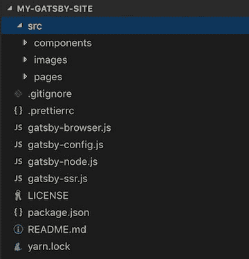
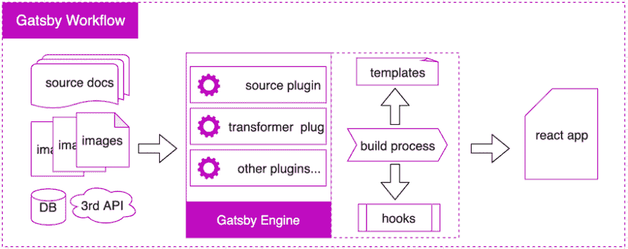

# 为什么更多的开发者应该转向盖茨比

> 原文：<https://dev.to/lwz7512/thinking-in-gatsby-way-series-to-build-a-static-web-application-overview-9mh>

[](https://res.cloudinary.com/practicaldev/image/fetch/s---wcKXL9r--/c_limit%2Cf_auto%2Cfl_progressive%2Cq_auto%2Cw_880/https://raw.githubusercontent.com/lwz7512/my-dev.to/master/blog-posts/thinking-in-gatsby-overview/assets/ovidiu-gruescu-boJRk86YW5k-unsplash-2000.jpg)

作为顶级静态网站生成器之一，《盖茨比》自去年以来势头强劲。根据最近的统计数据[图表](https://npm-stat.com/charts.html?package=gatsby&from=2018-07-04&to=2019-07-04)显示，平均每周下载量达到 20 万左右。很多 web 开发者都被它的口号所吸引: **`build blazing fast websites and apps`** ，幸运的是我也在其中。乍一看，这似乎很容易开始，但当你深入研究后，事情并非如此。

### 为什么选择盖茨比

7 个月前，我在寻找一个 web 开发框架来构建一个新的电子学习产品，理想的候选人应该满足以下技术要求:

*   易于上手
*   没有数据库依赖性
*   reactjs 作为前端
*   将文件标记为内容源
*   跑步时的出色性能
*   定制开发的可扩展性
*   降低部署成本
*   后端不需要内容编辑器

所有这些条件共同指向一个最终的解决方案:一个静态 CMS，然后我找到了 StaticGen。前 5 大框架中，Jekyll，Hugo，Hexo，我都不陌生。它们都使用 markdown 文件作为内容源，但不使用 reactjs 技术栈。第一个是 Next.js，而默认情况下不支持将 markdown 文件呈现到 html 页面。最终，我选择了 Gatsby 作为我的最终开发平台，因为它几乎满足了我的所有需求。

### 如何设计项目结构

我们都知道如何使用 **`create-react-app`** 创建 reactjs 应用框架。Gatsby 也有其 cli 工具 **`gatsby`** 来完成一些任务，如项目创建，启动开发服务器，构建项目到生产部署等。

一个典型的[盖茨比的网站结构](https://www.gatsbyjs.org/docs/gatsby-project-structure/)创建的 **`$ gatsby new my-gatsby-site`** 可能是这样的:

[](https://res.cloudinary.com/practicaldev/image/fetch/s--NmbK13Yt--/c_limit%2Cf_auto%2Cfl_progressive%2Cq_auto%2Cw_880/https://raw.githubusercontent.com/lwz7512/my-dev.to/master/blog-posts/thinking-in-gatsby-overview/assets/gatsby_default_20190706_7.png)

当你只是把它当作一个使用 reactjs 的 SSR(服务器端渲染)框架时，它与 Next.js 非常相似，但事实是两者完全不同。实际上，Gatsby 在收到请求时并不呈现页面，它使用 **`render at build time`** 方法输出已经在构建阶段转换静态 html 内容。这两个框架的另一个区别在于:

> Gatsby 使用 markdown，json，csv，yaml 文件，甚至数据库作为内容源。结合 GraphQL，这些内容被映射到模板组件，然后呈现到静态 web 应用程序中。

这就是 Gatsby 的工作方式，它更像是一个引擎，利用各种插件将不同的数据源转换成 GraphQL 查询可以读取的统一数据格式，开发人员只需编写模板页面和 GraphQL 语句来显示您的动态内容。

然后，回到我们的项目结构，我们如何重新组织项目，以便让 Gatsby 将我们的内容文件呈现给浏览器？这就是使盖茨比不同于其他框架的 **`magical part`** 。

以第一个 Gatsby 官方首发项目 [gatsby-starter-blog](https://github.com/gatsbyjs/gatsby-starter-blog) 为例，我们使用 **`gatsby new`** 命令将一个 gatsby-starter-blog 克隆到 my-blog-starter 目录:

```
# create a new Gatsby site using the blog starter
$ gatsby new my-blog-starter https://github.com/gatsbyjs/gatsby-starter-blog 
```

<svg width="20px" height="20px" viewBox="0 0 24 24" class="highlight-action crayons-icon highlight-action--fullscreen-on"><title>Enter fullscreen mode</title></svg> <svg width="20px" height="20px" viewBox="0 0 24 24" class="highlight-action crayons-icon highlight-action--fullscreen-off"><title>Exit fullscreen mode</title></svg>

新创建的 my-blog-starter 项目的目录结构如下:

[](https://res.cloudinary.com/practicaldev/image/fetch/s--Z6KeUubo--/c_limit%2Cf_auto%2Cfl_progressive%2Cq_auto%2Cw_880/https://raw.githubusercontent.com/lwz7512/my-dev.to/master/blog-posts/thinking-in-gatsby-overview/assets/gatsby_blog_20190706_10.png)

顶部的红色矩形勾勒出 **`content`** 目录，其中包含 markdown 格式的博客文章内容(。md)和帖子中引用的图片。这是以前的 my-gatsby-site 结构中没有的附加目录。此外， **`templates`** 目录也是一个新目录，其中包含了 post 模板组件，负责通过 GraphQL 将 markdown 文件内容取到 reactjs 组件中。

> 将内容目录放在项目根目录下是 Gatsby 项目中的一个好做法，模板目录也放在 src 目录下。

规划项目结构的其他好做法可能包括将 **`hooks`** 和 **`style`** 目录放在 src 目录下，hooks 包含所有的 hook 组件，style 包含从那些模板和页面组件中分离出来的所有 css 模块文件。我偏爱的 **`src`** 结构可能是这样的:

```
├── src
  ├── components
  ├── hooks
  ├── pages
  ├── stye
  ├── templates
  ├── utils 
```

<svg width="20px" height="20px" viewBox="0 0 24 24" class="highlight-action crayons-icon highlight-action--fullscreen-on"><title>Enter fullscreen mode</title></svg> <svg width="20px" height="20px" viewBox="0 0 24 24" class="highlight-action crayons-icon highlight-action--fullscreen-off"><title>Exit fullscreen mode</title></svg>

正式的盖茨比项目结构文件是[这里](https://www.gatsbyjs.org/docs/gatsby-project-structure/)

### Gatsby dev 工作流程看起来怎么样

在 my-blog-starter 项目中，我们看到了内容。md 文件和 blog-post.js 模板。那么，谁来做组合任务，它是如何工作的？答案在 **`gatsby-node.js`** 。

> 基本上，gatsby-node.js 文件充当组装工厂，它首先将内容源转换为节点模型，然后使用源自节点对象模板和上下文参数创建页面组件。

关于 Gatsby 构建生命周期的官方文档是[这里](https://www.gatsbyjs.org/docs/gatsby-lifecycle-apis/)，也是必读的[与 Gatsby 内部的幕后](https://www.gatsbyjs.org/docs/gatsby-internals/)，给开发者一个内部工作机制的彻底描述。

在这里，我想把这个过程总结成一个简单的图表:

[](https://res.cloudinary.com/practicaldev/image/fetch/s--or0Ja_gT--/c_limit%2Cf_auto%2Cfl_progressive%2Cq_auto%2Cw_880/https://raw.githubusercontent.com/lwz7512/my-dev.to/master/blog-posts/thinking-in-gatsby-overview/assets/gatsy_node_cb_20190707_11.png)

在开发 Gatsby 应用程序时，我们必须先了解两个重要的配置文件: **`gatsby-config.js`** 和 **`gatsby-node.js`** 。一个是用于网站元数据定义和插件引用，另一个是用于构建过程回调函数的实现。

这是与传统网站开发的主要区别。在传统的 web 开发工作流中，我们启动 web 服务器，读取与应用程序相关的配置，如端口号、数据库访问帐户和其他全局参数，然后向客户端请求公开服务。但在 Gatsby 中，我们不在服务器中运行服务，我们通过插件和回调函数在构建时创建内容，然后交付给 CDN。

简单地说，盖茨比的工作流程可以用这样一个图表来概括:

[](https://res.cloudinary.com/practicaldev/image/fetch/s--Dx_ke_Hx--/c_limit%2Cf_auto%2Cfl_progressive%2Cq_auto%2Cw_880/https://raw.githubusercontent.com/lwz7512/my-dev.to/master/blog-posts/thinking-in-gatsby-overview/assets/gatsby_workflow_20190707_13.png)

然后，我们的常规迭代开发工作可以从准备工作开始，这可能包括编写配置文件和页面模板，以及内容源，然后在 gatsby-node.js 中实现回调函数，最后运行 **`$ gasby develop`** 来查看结果。

在这些文件中，模板组件开发将花费大量时间。您需要实现 UI、交互逻辑，在 **`graphql explorer`** 中编写 GraphQL 语句来测试您想要显示的数据，然后复制这些查询语句并粘贴到模板组件中以供以后构建使用。模板组件就像是连接数据源和 UI 层的粘合剂。

等等，如果数据不在文件中，而是在数据库或第三方系统中呢？anwser 正在使用现有的 gatsby 插件或开发自己的 gatsby 插件。

所以，要和盖茨比一起工作，你必须用盖茨比的方式思考，就像上图描述的那样:

*   使用 **`Plugin`** 获取源数据并将其转换为 Gatsby 已知数据模型
*   使用 **`Graphql`** 从 Gatsby 中查询 UI/模板需要的数据
*   使用构建 **`Hooks`** (回调函数)从模板组件生成 html 内容。

### 它对前端开发有什么改变

Web 框架层出不穷，但是优秀的框架却少之又少。在众多的 JAMstack 解决方案中，我认为 Gatsby 是最具特色和创新性的。Gatsby 声称它可以用极快的用户体验建立网站，Lighthouse test 在其[官方文件](https://www.gatsbyjs.org/docs/audit-with-lighthouse/)中证明了他们的说法。他们是怎么做到的？

产品背后的理念和他们遵循的[架构模式](https://www.gatsbyjs.org/docs/prpl-pattern/)确保了它的高性能。

对于一个普通的开发人员来说，当你想开发一个原型 web 应用程序，向用户提供一个很好的用户体验而不需要一点一点地调整它时，这可能意味着很多，此外，你没有太多的钱来购买数据库服务和 web 服务器。

以我的第一个 Gatsby 项目 [UltronEle](http://ultronele.com) 为例，我花了近 3 个月(60~70 个工作日)的开发时间来实现功能丰富的电子学习产品的第一个版本。我所有的开发时间都花在业务逻辑和交互逻辑实现上，不需要处理数据库，不需要在发布环境中部署服务器。这使得我的产品非常轻，而且成本低。

如果没有盖茨比框架，我怀疑我的产品会不会这么快诞生。虽然在盖茨比最初的探索阶段感觉有点迷茫，但是整个开发体验就是这么爽。

盖茨比的流行可能预示着一个更好的互联网，下一代互联网技术，具有高速显示，出色的用户体验，轻量级部署，较低的开发和使用成本。这种变化将给网络开发者和 IT 服务部门带来大量的潜在机会。

### 还有坑存在吗

不幸的是，在撰写这篇文章的时候，Gatsby v2.3.27 中仍然存在一个令人讨厌的 bug，那就是历史性的错误声明: **`TypeError: Cannot read property 'childImageSharp' of null`** 。

[](https://res.cloudinary.com/practicaldev/image/fetch/s--goOHhQEz--/c_limit%2Cf_auto%2Cfl_progressive%2Cq_auto%2Cw_880/https://raw.githubusercontent.com/lwz7512/my-dev.to/master/blog-posts/thinking-in-gatsby-overview/assets/gatsby_error_20190706_8.png)

这个困惑了我很久，偶尔它会蹦出来，给你一个意外的惊喜。2017 年 10 月 21 日 [#2567](https://github.com/gatsbyjs/gatsby/issues/2567) 早有报道。那个问题的解决方案以移除 **`.cache`** 文件夹而告终。所以，每次出现错误时，我会先通过 **`ctrl+c`** 停止服务器，然后执行下面的命令并刷新页面来恢复它:

```
# in Mac OSX enviroment:
$ rm -rf .cache && gatsby develop 
```

<svg width="20px" height="20px" viewBox="0 0 24 24" class="highlight-action crayons-icon highlight-action--fullscreen-on"><title>Enter fullscreen mode</title></svg> <svg width="20px" height="20px" viewBox="0 0 24 24" class="highlight-action crayons-icon highlight-action--fullscreen-off"><title>Exit fullscreen mode</title></svg>

这真的很有效，也是目前唯一能消除错误的方法。这个错误对我的产品的负面影响是，每次我用生成器创建教程内容时，我必须先停止服务器，然后创建教程，最后执行上面的命令，导致用户体验不佳。

### 说服客户使用它的最佳做法是什么

从市场营销的角度来看，如何向最合适的客户销售您的 Gatsby 解决方案可能是最优先考虑的问题。这个主题有几篇在[如何向客户和你的团队谈论盖茨比](https://www.gatsbyjs.org/blog/2019-03-07-sell-gatsby-to-clients/)和[如何识别盖茨比何时适合你的客户](https://www.gatsbyjs.org/blog/2019-06-10-how-to-recognize-when-gatsby-is-a-good-fit-for-your-client/)中讨论的文章，以及来自其官方网站的[一页](https://www.gatsbyjs.org/gatsby-one-pager.pdf)中关于盖茨比优势的解释。

互联网世界本质上由各种内容组成，文本、图像、音乐、视频...为了推动这些媒体内容以及 web 资源 html、javascript、css 的分发边界，Gatsby 的设计借用了最先进的 web 技术和最智能的设计模式，也参考了其他 CMS 框架的良好实践:[主题化](https://www.gatsbyjs.org/blog/2019-07-03-announcing-stable-release-gatsby-themes/)使其更具适应性、可重用性和可定制性。那么，当你面对你的潜在客户时，你如何说服你的客户愿意投资这样的技术升级，承担系统转换的风险，并相信投资回报？

除了这些如何做，我总结了以下观点，以改善客户业务中采用 Gatsby:

*   通过插件提取利用遗留系统内容或数据
*   通过盖茨比方式解决性能瓶颈问题
*   从内部项目开始，次要功能单元
*   向基于 reactjs 堆栈的开发团队介绍
*   一点一点地逐步采用和迁移
*   面向希望使用云服务并削减 IT 基础架构成本的客户

这是我目前能想到的关于传统 web 系统迁移到 Gatsby 的一个简短的想法列表。随着我参与的项目越来越多，我相信这个列表会继续增长。网络技术在不断发展，乐趣和效率，这就是盖茨比的由来，让我们弄清楚，与盖茨比合作，过上更好的生活。