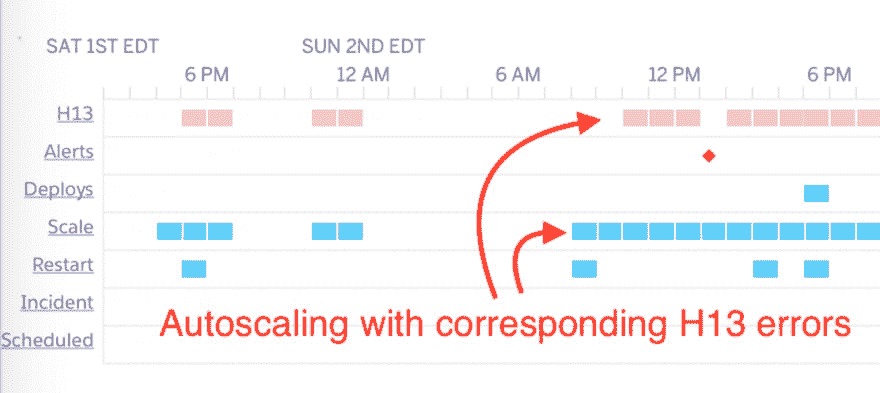

# 彪马 4:锤炼 H13s——一个调试的故事

> 原文：<https://dev.to/heroku/puma-4-hammering-out-h13s-a-debugging-story-fbm>

很长一段时间以来，我们从我们的大客户那里收到关于 Ruby 应用程序出现神秘的 [H13 -连接关闭错误](https://devcenter.heroku.com/articles/error-codes#h13-connection-closed-without-response)的报告。奇怪的是，这只发生在他们部署或扩展 dynos 的时候。更奇怪的是，这只发生在相对大规模的应用中。我们无法在示例应用程序上重现这种行为。这是一个关于分布式协调、TCP API 以及我们如何调试和修复 Puma 中一个只有大规模出现的 bug 的故事。

[](https://res.cloudinary.com/practicaldev/image/fetch/s--9vO9K5NL--/c_limit%2Cf_auto%2Cfl_progressive%2Cq_auto%2Cw_880/https://heroku-blog-files.s3.amazonaws.com/posts/1562883126-Screenshot%25202019-06-23%252015.04.50.png)

## 连接关闭

首先，什么是 H13 错误？从我们的错误页面文档中:

> 当您的 web dyno 中的进程接受连接，但随后关闭套接字而不向其写入任何内容时，会引发此错误。可能发生这种情况的一个例子是，当 Unicorn web 服务器配置了一个短于 30 秒的超时，并且在超时发生之前一个请求还没有被一个工作进程处理。在这种情况下，Unicorn 会在写入任何数据之前关闭连接，从而导致 H13。

有趣的事实:我们的错误代码从它们来自的组件的字母开始。我们的路由代码都是用 Erlang 编写的，并被命名为“Hermes ”,因此 Heroku 中任何以“H”开头的错误代码都表示来自路由器的错误。

文档给出了一个关于 unicorn webserver 的 H13 错误代码的例子，但是它可以在任何时候通过服务器关闭连接，但是没有响应的时候发生。这里有一个例子，展示了如何使用节点应用程序显式地[再现 H13。](https://github.com/hunterloftis/heroku-node-errcodes/blob/master/h13)

申请获得 H13 意味着什么？实际上，这些错误中的每一个都与收到错误页面的客户相关。每次应用程序重启、部署或自动缩放时出现少量错误是一种糟糕的用户体验，所以找到并修复这些错误是值得的。

## 调试

我已经维护 Ruby buildpack 好几年了，其中一部分工作是处理对我们的核心支持者来说太棘手的支持升级。除了正常的部署问题，我还对性能、可伸缩性和 web 服务器产生了兴趣(我最近开始帮助维护 Puma web 服务器)。因为这些利益，当一个棘手的问题来自我们的大客户时，特别是如果它只是大规模发生，我会特别感兴趣。

要理解这个问题，您需要了解一点关于发送分布式消息的本质。web 服务器本质上是分布式系统，更复杂的是，我们经常使用分布式系统来管理我们的分布式系统。

在这种情况下，这个错误似乎不是来自客户的应用程序代码，也就是说，他们似乎没有任何配置错误。它似乎也只发生在 dyno 被关闭的时候。

要关闭一个 dyno 必须发生两件事，我们需要发送一个`SIGTERM`到 dyno 上的进程，这个进程[告诉 web 服务器安全关闭](https://devcenter.heroku.com/articles/what-happens-to-ruby-apps-when-they-are-restarted)。我们还需要告诉路由器停止向那个 dyno 发送请求，因为它很快就会关闭。

这两个操作发生在两个不同的系统上。dyno 运行在一个服务器上，为我们的请求服务的路由器是一个独立的系统。它本身就是一个分布式系统。事实证明，虽然两个系统几乎同时收到消息，但路由器可能仍然会让一些请求进入在收到`SIGTERM`后被关闭的 dyno。

这就解释了问题所在，对吗？这种情况只发生在具有大量流量的应用程序上的原因是，它们收到如此多的请求，在路由器停止发送请求和 dyno 收到`SIGTERM`之间有更多的机会出现竞争情况。

那听起来像是路由器的问题，对吗？在我们深入讨论分布式协调的困难之前，我注意到其他具有相同负载的应用程序没有出现 H13 错误。这告诉了我什么？它告诉我，我们系统的分布式行为不是罪魁祸首。如果其他 web 服务器可以很好地处理这个问题，那么我们需要更新我们的 web 服务器，在本例中是 Puma。

## 繁衍后代

当您处理依赖于竞争条件的分布式系统 bug 时，重现问题可能是一件棘手的事情。在与另一位 Heroku 工程师 [Chap Ambrose](https://twitter.com/chapambrose?lang=en) 就这个问题进行配对时，我们想到了一个主意。首先，我们将在任何应用程序中重现 H13 行为，以确定我们将得到什么样的 [curl 退出代码](https://curl.haxx.se/libcurl/c/libcurl-errors.html)，然后我们可以尝试用一个更复杂的例子来重现确切的故障条件。

一个简单的复制架 app 是这样的:

```
app = Proc.new do |env|
  current_pid = Process.pid
  signal = "SIGKILL"
  Process.kill(signal, current_pid)
  ['200', {'Content-Type' => 'text/html'}, ['A barebones rack app.']]
end

run app 
```

当您用 Puma 运行这个`config.ru`并用一个请求点击它时，您将得到一个关闭的连接，而没有写入请求。这很简单。

像这样关闭连接时的 curl 代码是`52`，所以现在我们可以检测到它何时发生。

```
$ curl localhost:9292
  % Total % Received % Xferd Average Speed Time Time Time Current
                                 Dload Upload Total Spent Left Speed
  0 0 0 0 0 0 0 0 --:--:-- --:--:-- --:--:-- 0
curl: (52) Empty reply from server 
```

当调用 SIGTERM 时，会发生更复杂的复制，但请求会不断出现。为了方便起见，我们最终得到了一个类似这样的复制品:

```
app = Proc.new do |env|
  puma_pid = File.read('puma.pid').to_i
  Process.kill("SIGTERM", puma_pid)
  Process.kill("SIGTERM", Process.pid)

  ['200', {'Content-Type' => 'text/html'}, ['A barebones rack app.']]
end

run app 
```

这个`config.ru` rack 应用程序在第一次请求时向它自己和它的父进程发送一个`SIGTERM`。因此，当服务器关闭时，其他未来的请求将会到来。

然后，我们可以编写一个脚本来引导这个服务器，并用一堆并行请求来访问它:

```
threads = []

threads << Thread.new do
  puts `puma > puma.log` unless ENV["NO_PUMA_BOOT"]
end

sleep(3)
require 'fileutils'
FileUtils.mkdir_p("tmp/requests")

20.times do |i|
  threads << Thread.new do
    request = `curl localhost:9292/?request_thread=#{i} &> tmp/requests/requests#{i}.log`
    puts $?
  end
end

threads.map {|t| t.join } 
```

当我们运行这个再现时，我们看到它给出了我们想要再现的确切行为。更好的是，当这段代码部署在 Heroku 上时，我们可以看到一个 H13 错误被触发:

```
2019-05-10T18:41:06.859330+00:00 heroku[router]: at=error code=H13 desc="Connection closed without response" method=GET path="/?request_thread=6" host=ruby-h13.herokuapp.com request_id=05696319-a6ff-4fad-b219-6dd043536314 fwd="<ip>" dyno=web.1 connect=0ms service=5ms status=503 bytes=0 protocol=https 
```

你可以在[复制脚本 repo](https://github.com/schneems/puma_connection_closed_reproduction) 上获得所有这些代码和更多细节。这是我用来追踪行为的[美洲狮号](https://github.com/puma/puma/issues/1802)

## 关闭连接关闭 Bug

有了再现脚本，我们就有可能向 Puma 内部添加调试语句，以查看它在遇到这个问题时的行为。

稍微调查一下，发现 Puma 从来没有显式关闭过连接的套接字。相反，它依赖于进程停止来关闭它。

那到底是什么意思？每次你在浏览器中输入一个 URL，请求就会被路由到一个服务器。在 Heroku 上，请求被发送到我们的路由器。然后，路由器尝试连接到 dyno(服务器)并向其传递请求。允许这样做的底层机制是 dyno 上的 webserver (Puma)在 PORT 上打开一个 TCP 套接字。请求在套接字上被接受，它将一直呆在那里，直到 web 服务器(Puma)准备好读取并响应它。

那么，为了避免这种 H13 错误，我们需要做些什么呢？在错误的情况下，路由器尝试连接到 dyno，它成功了，因为 Puma 接受了请求，它期望 dyno 处理请求的写入。相反，如果套接字在试图传递请求时被关闭，它将知道 Puma 无法响应。然后，它会重试将连接传递给另一个 dyno。有时候，web 服务器可能会拒绝一个连接，例如，如果套接字已满(默认情况下只允许套接字 backlog 上有 1024 个连接)，或者如果整个服务器已经崩溃。

在我们的例子中，关闭套接字是我们想要的。它正确地与路由器通信以做正确的事情(尝试将连接传递给另一个 dyno 或在所有 dyno 都重新启动的情况下保持连接)。

因此，这个问题的解决方案是在尝试显式关闭之前关闭套接字。下面是 [PR](https://github.com/puma/puma/pull/1808) 。主要的魔法只有一行:

```
@launcher.close_binder_listeners 
```

如果你是一个杞人忧天者(我知道我是)，你可能害怕关闭套接字会阻止任何正在进行的请求被成功完成。幸运的是，关闭套接字阻止了传入的请求，但仍然允许我们对现有的请求做出响应。如果你不相信我，想想你如何用我上面的例子来测试它。

## 测试分布式行为

我不知道彪马的这种行为是不是坏了，也可能从来就没起作用。为了确保它在未来继续工作，我想为它写一个测试。我联系了曾在 Puma 其他问题上提供帮助的 [dannyfallon](https://twitter.com/touchingvirus?lang=en) ，我们在测试中使用[对和元组](https://tuple.app/)进行了远程配对。

测试的结果是[与我们在](https://github.com/puma/puma/pull/1808/files#diff-ad8d9f1e0cf07519c2372ca5f60ca4d2)上面的示例复制没有太大的不同，但是让它有一致的行为是相当棘手的。

除非在大规模的应用程序中，否则问题不会经常出现，测试是必不可少的，正如慈善专业人士会说的“在生产中”。我们有几个看到这个错误的 Heroku 客户试用了我的补丁。他们报告了一些其他问题，我们能够解决这些问题，修复这些问题后，看起来这些错误已被修复。

[](https://res.cloudinary.com/practicaldev/image/fetch/s--YX2Se5sp--/c_limit%2Cf_auto%2Cfl_progressive%2Cq_auto%2Cw_880/https://heroku-blog-files.s3.amazonaws.com/posts/1562883272-59190728-7bf56a80-8b4b-11e9-8e01-84238fecf24c.png)

## 铺开修罗

Puma 4，带有这个补丁，[最近发布了](https://github.com/puma/puma/releases/tag/v4.0.0)。我们联系了一个使用 Puma 的客户，他看到了大量的 H13，这个版本阻止了他们。

下面了解更多关于 Puma 4 的信息。

> <video loop="" controls=""><source src="https://video.twimg.com/ext_tw_video/1143577341634994176/pu/vid/640x360/VCVNd2c8NcCILhmb.mp4?tag=10" type="video/mp4"></video>理查德·施尼曼🤠[@ schneems](https://dev.to/schneems)由穿着睡衣给你送羊驼的编码员。全新的影院级 Ruby 服务器体验。由 [@evanphx](https://twitter.com/evanphx) 执导， [@nateberkopec](https://twitter.com/nateberkopec) 摄影， [@schneems](https://twitter.com/schneems) 制片。
> 
> 介绍-彪马:4 快 4 怒
> 
> [github.com/puma/puma/rele…](https://t.co/06PG0lzubk)2019 年 6 月 25 日下午 17:52[](https://twitter.com/intent/tweet?in_reply_to=1143577608791220224)[](https://twitter.com/intent/retweet?tweet_id=1143577608791220224)39[](https://twitter.com/intent/like?tweet_id=1143577608791220224)135