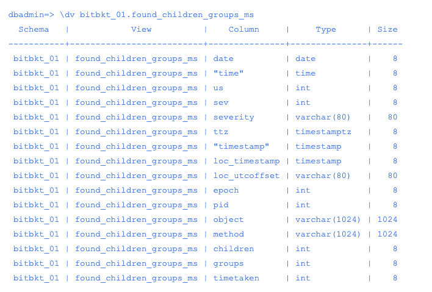
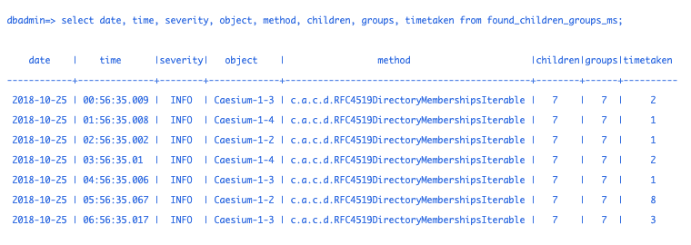

# Developers shouldn’t waste time structuring logs

> 原文：[https://dev.to/gdcohen/developers-shouldn-t-waste-time-structuring-logs-5goo](https://dev.to/gdcohen/developers-shouldn-t-waste-time-structuring-logs-5goo)

As either a developer or a member of a DevOps team, you have undoubtedly dealt with logs; probably lots and lots of messy logs. It's one of the first things we all look to when trying to get to the bottom of an issue and determine root cause.

The big problem with all these logs is that they're unstructured and in a myriad of formats. In syslog alone, you'll have potentially dozens of different log generators (processes) logging events with their own prefix styles (timestamp formats, severity, representation of process/module/function/object names, ordering of fields, etc.). And with the complex distributed systems we're all building and maintaining nowadays, the problem is amplified by the number of micro-services, use of open source packages and commercial products or utilities that all have their own logging formats.

These unstructured logs represent an enormous challenge when trying to search efficiently, identify relationships between log events, find anomalous behaviors (which is often what we're trying to do when we're looking for root cause) or perform analytics on the nuggets of information in those logs. Even something as simple and obvious as viewing interleaved logs from multiple sources in correct time-order (across time zones) could stymie us if these logs aren't at least minimally structured.

I'm sure most all of us have dealt with these issues first-hand and have probably taken some steps to ease the pain. Using any of the popular index-based log management systems can be a good first step. They'll certainly handle many of the popular open source logs out-of-the-box and know how to structure the prefix information for indexing and normalizing timestamp formats for example. Beyond that, you undoubtedly are creating and having to maintain regexes or grok patterns to handle some of your custom application logs especially to "structure" (and index) some events you've pre-determined as being important to you. It's also likely you haven't had the time to write regexes for every event and data element within the entire stack (that would be a big job). And at the end of the day, you're still stuck with an index.

There may be a better approach...
Enter, STRUCTURED LOGGING

What if all of your log events were structured? What if every event in syslog, my-app.log and my-opensource.log were represented as JSON or name-value pairs? You'd be done! Well, not quite. Let's look at what that would entail.

You'd have to change every log event in your product to use a new structured logging mechanism. Say something like Golang's sirupsen/logrus or NLog for .NET or Apache Log4Net or maybe just roll-your-own.

To get an idea how much work that might be, I did a study of three 3rd party products (3P) to understand the scale of log events in each one. Each test captured a sample set of log events from systems under trivial load for a few hours only. So, the data will likely under-represent the full scope of effort:

Let’s take a look at what it might mean to structure a single simple log event (you would have to do this for each unique event type):

Now you have to get all your engineering teams to convert their existing events to a predefined and agreed upon (consistent) structure for each of the thousands and thousands of events and variables within those events. And then commit to using that for all new events in all new development. An informal survey of some (heretofore and otherwise friendly) engineers generally yielded comments like:

"are you kidding, that's ridiculous"
"that ain't happening"

OK, let's assume you've convinced your engineers and they didn't all quit. Now you've got this beautifully structured JSON and your log files now look like this:

This structure could be a little messy for your engineers to deal with if they use utilities like grep or a text editor to view raw log data. But presumably it’s going to be much easier to deal with for your log management system assuming it handles JSON. It should map those tens of thousands of fields in your index automatically. Just be aware of possible "Mapping Explosion" now that you've gone to all this effort to structure.

As you can see, the effort to convert to structured logging is substantial and ongoing and will likely have some impact on your product development timelines when you undertake this effort.

Next up in the structured logging queue: The open source software you're using... And then the vendors whose libraries you're using... And then the kernel... And on and on.

It's pretty clear this solution would either be limited in its application or a non-starter altogether. So, then what?

Here's a better way, DO NOTHING
Let me explain...

Actually, it may make sense to simply show you what you get with this "do nothing" approach. What you get is a fully structured, massively scalable, analytics “logs” warehouse. It's that simple. In case you’re interested, we use unsupervised machine learning to structure logs and metrics. Each log line is schematized by event type, with parameters captured into their own typed columns and optimized for query.

Let's see what we have in our database after ingesting the same log event we showed earlier. This was done without having to do any manual structuring whatsoever. These logs are from our on-premise Atlassian Server. We structured the entire corpus of our BitBucket, Confluence, Jira and syslog events in 215 seconds.

Let me first show you the definition of the table that was automatically created for the log event I’ve been using in the examples:

And here's a couple simple SQL statements exercising that structure.
This query shows the values of the columns for all instances of this event type:

And this one just gets the min, max and average time taken for the entire data set:

What you have is a database table for every event type and the full power of SQL to query the data. And we automatically maintain the schema as logs change across versions (more on this in another blog). This works for your application logs; any open source logs; any third-party libraries you're using; your build and test logs - absolutely any log. There's no effort and no boundaries. You can imagine the possibilities now that every log event is perfectly structured regardless of its source.

We’re about to start our beta program and would love some feedback on what we’re doing. If you’re interested in a live demo, please click [here](https://www.zebrium.com/#getademo).

(Posted with permission of the author Rod Bagg)