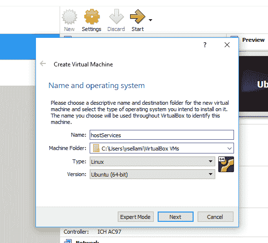
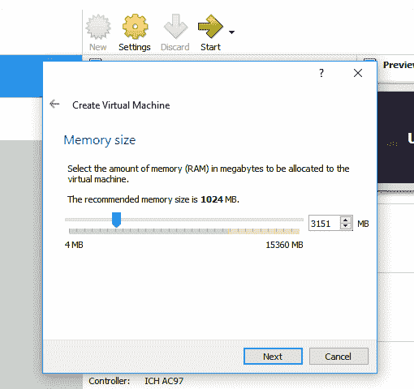
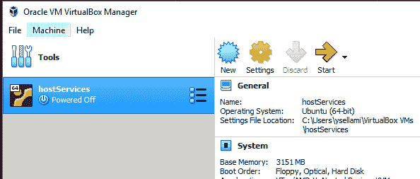
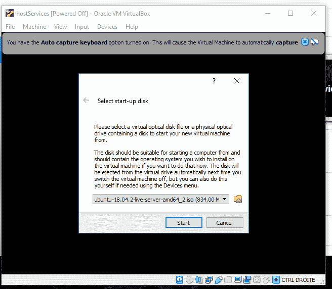

# 如何:在 VirtualBox 上安装 ubuntu

> 原文：<https://dev.to/ysellami/how-to-install-ubuntu-on-virtualbox-562>

嗨，在这篇文章中，我们将看到如何在虚拟机中使用 Linux，以及如何让您选择在 Windows 中尝试 Linux。本指南逐步向您展示如何使用 VirtualBox 在 Windows 中安装 ubuntu server。

# 什么是虚拟化？

虚拟化是一种允许您从单个物理硬件系统创建多个模拟环境的技术。

## 在 VM virtualbox 上安装 ubuntu 服务器:

1.打开 Virtualbox 并点击新建按钮。
将出现设置向导，输入您的虚拟机名称，并从下拉菜单中选择您的客户操作系统和架构(32 位与 64 位),然后单击下一步按钮。

1.  输入要为虚拟机保留的内存(RAM ),然后单击下一步按钮。 3。勾选启动盘，创建新硬盘，点击下一步按钮。选择要用于虚拟磁盘的文件类型，然后单击下一步按钮。 3.2 选择您的存储详情，然后点击“下一步”按钮。
2.  输入虚拟磁盘的大小(MB ),然后单击“下一步”按钮。根据您的硬盘设置所需的空间，然后单击“创建”按钮完成向导。您将在这里看到您输入的详细信息。单击创建按钮继续。

“新建虚拟机向导”将关闭并返回 VirtualBox Manager。选择您的虚拟机，然后单击开始按钮。
[T3】](https://res.cloudinary.com/practicaldev/image/fetch/s--2lfYp30D--/c_limit%2Cf_auto%2Cfl_progressive%2Cq_auto%2Cw_880/https://thepracticaldev.s3.amazonaws.com/i/2encn0azh8pyrbn5yyad.png)

点击“文件夹”图标，选择你的 Ubuntu iso 目录，然后选择你的 Ubuntu iso 文件，点击下一步按钮。点击开始按钮，在 ubuntu 启动时显示屏幕。
