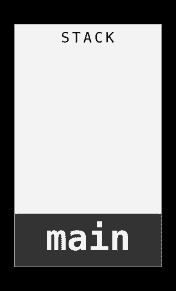
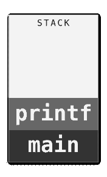
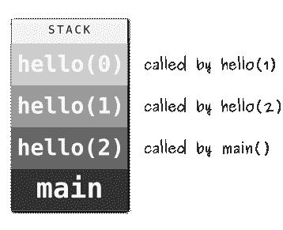
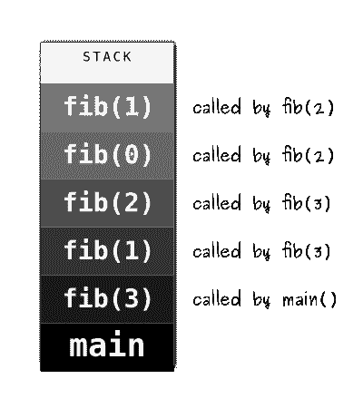
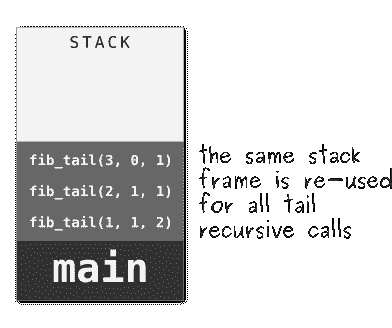

# 揭开尾部调用优化的神秘面纱

> 原文：<https://dev.to/rohit/demystifying-tail-call-optimization-5bf3>

[](https://res.cloudinary.com/practicaldev/image/fetch/s--WZUWUld7--/c_limit%2Cf_auto%2Cfl_progressive%2Cq_auto%2Cw_880/https://rohitawate.github.img/posts/2019-07-10-tail-call-optimization/dog_tail.jpg)

*最初发表于[我的个人博客](https://rohitawate.github.io/2019/07/11/tail-call-optimization)。*

尾部调用优化(也称为尾部调用消除)是语言实现者用来提高程序递归性能的一种技术。这是一个聪明的小技巧，消除了递归的内存开销。在本帖中，我们将讨论递归是如何实现的，什么是尾部递归，以及它如何为一些重要的优化提供机会。

# 递归 101

如果你熟悉函数调用栈和递归，可以跳过这一节。

大多数语言使用堆栈来跟踪函数调用。让我们举一个非常简单的例子:一个用 c 语言编写的“hello，world”程序

```
#include <stdio.h> 
int main()
{
    printf("hello, world!\n");
    return 0;
} 
```

程序中的每个函数调用都将自己的帧推送到堆栈上。该帧包含该呼叫的本地数据。当您执行上面的程序时，`main`函数将是堆栈上的第一帧，因为那是您的程序开始执行的地方。堆栈中最顶层的帧是当前正在执行的帧。在它完成执行后，它从堆栈中弹出，底部框架继续执行。

[](https://res.cloudinary.com/practicaldev/image/fetch/s--EoCBwK2O--/c_limit%2Cf_auto%2Cfl_progressive%2Cq_auto%2Cw_880/https://rohitawate.github.img/posts/2019-07-10-tail-call-optimization/main.png)

在我们的示例中，`main`依次调用另一个函数`printf`，从而将新帧推送到堆栈上。该帧将包含`printf`的本地数据。一旦`printf`完成执行，其框架被弹出，控制返回到`main`框架。

[](https://res.cloudinary.com/practicaldev/image/fetch/s--jAFGC4Nq--/c_limit%2Cf_auto%2Cfl_progressive%2Cq_auto%2Cw_880/https://rohitawate.github.img/posts/2019-07-10-tail-call-optimization/printf.png)

递归函数也是如此。每个递归调用在堆栈上都有自己的帧。这里有一个递归函数的*可怕的例子*，它打印“hello”`n`次:

```
// hello_recursive.c

void hello(int n)
{
    if (n == 0) return;

    printf("hello\n");
    hello(n - 1);
}

int main()
{
    hello(2);
    return 0;
} 
```

上面的代码给出了以下输出:

```
hello
hello 
```

函数调用堆栈如下所示:

[](https://res.cloudinary.com/practicaldev/image/fetch/s--gAd8oO9Y--/c_limit%2Cf_auto%2Cfl_progressive%2Cq_auto%2Cw_880/https://rohitawate.github.img/posts/2019-07-10-tail-call-optimization/hello.png)

前两个调用会打印出“hello”并用`n - 1`进行递归调用。一旦我们用`n = 0`完成了最后一个调用，我们就开始展开堆栈。

现在想象一下，我们希望将“hello”打印一百万次。我们需要一百万个堆栈帧！我试了一下，我的程序耗尽了内存并崩溃了。因此，递归需要`O(n)`空间复杂度，`n`是递归调用的次数。这是个坏消息，因为对于许多算法和数据结构来说，递归通常是一种自然、优雅的解决方案。然而，内存对堆栈增长的高度(或深度，取决于您如何看待它)构成了物理限制。迭代算法通常更有效，因为它们消除了多个堆栈帧的开销。但是它们会变得笨拙而复杂。

# 尾部递归

既然我们已经理解了什么是递归以及它的局限性，那么让我们来看看一种有趣的递归类型:**尾递归**。

每当递归调用是函数中的最后一条语句时，我们称之为尾递归。然而，有一个问题:递归调用后不能有任何计算。我们的`hello_recursive.c`例子是尾部递归，因为递归调用是在函数的最后进行的，在它之后没有执行任何计算。

```
 ...
    hello(n - 1);
} 
```

既然这个例子很傻，那么让我们来看一些严肃的东西:**斐波那契数列**。这里有一个非尾部递归的变体:

```
// Returns the nth Fibonacci number.
// 1 1 2 3 5 8 13 21 34 ...
int fib(int n)
{
    if (n <= 1) return n;
    return fib(n - 1) + fib(n - 2);
} 
```

你可能会说这是尾部递归，因为递归调用出现在函数的末尾。然而，调用的结果在返回后被添加到*。由此可见，`fib`不是尾递归的。*

下面是尾部递归变体:

```
int fib_tail(int n, int a, int b)
{
    if (n == 0)
        return a;   
    if (n == 1)
        return b;

    return fib_tail(n - 1, b, a + b);
} 
```

递归调用最后出现，后面没有计算。酷毙了。

你可能在想，*“嗯，尾部递归很有趣，但是这有什么意义呢？”*。事实证明，它不仅仅是编写递归函数的一种方式。它为一些巧妙的优化提供了可能性。

# 尾部调用优化

尾部调用优化将递归的空间复杂度从`O(n)`降低到`O(1)`。我们的函数将需要持续的内存来执行。它通过消除对每个调用都有一个单独的堆栈框架的需要来做到这一点。

如果一个函数是尾递归的，它要么进行一个简单的递归调用，要么从那个调用中返回值。**对返回值**不进行任何计算。因此，没有必要为该调用保留堆栈帧。一旦进行了尾部递归调用，我们将不再需要任何本地数据:我们不再需要任何语句或计算。我们可以简单地根据调用参数修改帧的状态，并跳回到函数的第一条语句。不需要推新的栈帧！我们可以一次又一次地用一个堆栈框架来完成这个任务！

让我们来看一下我们的非尾递归`fib`函数的例子。为了找出第三个斐波那契数，我们做:

```
...
int third_fib = fib(3);
... 
```

假设从右到左优先(即表达式求值的方向)，调用堆栈将如下所示:

[](https://res.cloudinary.com/practicaldev/image/fetch/s--b5_5i-Va--/c_limit%2Cf_auto%2Cfl_progressive%2Cq_auto%2Cw_880/https://rohitawate.github.img/posts/2019-07-10-tail-call-optimization/fib.png)

相当大，不是吗？想象一下找出一个后来的斐波那契数的堆栈的大小！这里的问题是所有的堆栈帧都需要保留。你可以在加法中使用一个局部变量，因此编译器需要保留框架。如果您查看这个程序的汇编输出，您会看到一个针对`fib`函数的`call`指令。

您可以使用 GCC 上的`-S`标志来输出汇编代码。我特意使用了`-O2`标志，它使用了 GCC 0-3 级中的第二级优化。O2 支持尾音优化。如果你不熟悉汇编，在编译时使用 GCC 的`-fverbose-asm`标志。它将 C 代码作为注释添加到相应的汇编输出之前。下面是最后一条命令，它将生成一个`.s`文件:

```
gcc fib.c -S -O2 -fverbose-asm 
```

这就是我们的尾调用的意思:

```
# Snippet extracted from: fib.s 
# fib.c:7:  return fib(n - 1) + fib(n - 2); movl    %ecx, %edi  # ivtmp.22,
call    fib #
subl    $2, %ecx    #, ivtmp.22
addl    %eax, %edx  # _4, add_acc_7 
```

现在，我不会假装我完全明白这一点，因为我不明白。我们只关心指令，不关心操作数细节。注意到`call fib`指令了吗？这就是递归调用。它将一个新的帧推送到堆栈上。一旦完成并弹出，我们就有了加法指令。因此，我们得出结论，即使在第二级优化中，由于增加了递归调用，递归调用也无法消除。

```
 ...
    return fib_tail(n - 1, b, a + b);
} 
```

再来看看我们的尾部递归斐波那契函数，`fib_tail`。一旦进行了上面的递归调用，就不需要保存本地数据了。语句后面没有计算，它只是返回递归调用返回的值；我们可以直接从递归调用开始。

这提供了一个机会，可以简单地用递归调用中使用的值替换局部变量`n`、`a`和`b`的值。与之前的`call`指令不同，编译器可以简单地将执行流重定向到函数中的第一条指令，有效地模拟递归调用。但是，没有开销！基本上，编译器是这样的:

[](https://res.cloudinary.com/practicaldev/image/fetch/s--2F-ejzhv--/c_limit%2Cf_auto%2Cfl_progressive%2Cq_auto%2Cw_880/https://bit.ly/2XQZZob)

调用堆栈如下所示:

[](https://res.cloudinary.com/practicaldev/image/fetch/s--59pp6a8r--/c_limit%2Cf_auto%2Cfl_progressive%2Cq_auto%2Cw_880/https://rohitawate.github.img/posts/2019-07-10-tail-call-optimization/fib_tail.png)

你不必相信我的话，我们来看看`fib_tail`的汇编输出。我们像以前一样编译:

```
gcc fib_tail.c -S -O2 -fverbose-asm 
```

对于我们的尾部递归调用，我看到了以下汇编代码片段:

```
# fib_tail.c:11:    return fib(n - 1, b, a + b);
    movl    %eax, %edx  # <retval>, b

# fib_tail.c:11:    return fib(n - 1, b, a + b);
    leal    (%rsi,%rdx), %eax   #, <retval>

# fib_tail.c:11:    return fib(n - 1, b, a + b);
    leal    (%rcx,%rdx), %esi   #, _5

# fib_tail.c:11:    return fib(n - 1, b, a + b);
    movl    %esi, %edx  # _5, b 
```

正如我所说的，我并不真正理解汇编，但我们只是检查我们是否已经消除了`call fib`递归调用。我不太确定 GCC 是如何重定向控制流的。然而，重要的是代码中没有`call fib`指令。这意味着没有递归调用。尾音已经消除了。请随意深入装配并亲自验证。

[](https://res.cloudinary.com/practicaldev/image/fetch/s--VMFdV5iZ--/c_limit%2Cf_auto%2Cfl_progressive%2Cq_auto%2Cw_880/https://bit.ly/2XVE9zQ)

# 支持

*   因为 GCC 和 Clang 都支持尾部调用优化(TCO ),所以我们在这篇文章中一直使用 **C** 。
*   对于 C++ ，微软的 Visual C++也提供了支持。
*   **Java** 和 **Python** 不支持 TCO，意图是为调试保留堆栈跟踪。一些内部 Java 类也依赖于堆栈帧的数量。Python 的 BDFL·吉多·范·罗苏姆明确表示，任何 Python 实现都不应该支持 TCO。
*   **Kotlin** 甚至提供了一个专用的`tailrec`关键字，将递归函数转换成迭代函数，因为 JVM (Kotlin 编译成 JVM 字节码)不支持 TCO。
*   TCO 是 ECMAScript 6 的一部分，即 **JavaScript** 规范，然而，只有 Safari 的 JavaScriptCore 引擎支持 TCO。Chrome 的 V8 收回了对 TCO 的支持。
*   **C#** 不支持 TCO，但是，它在其中运行的 VM，公共语言运行时(CLR)支持 TCO。
*   函数式语言如 **Haskell** 、 **F#** 、 **Scala** 和**elixin**支持 TCO。

对于语言实现者来说，支持 TCO 似乎更多的是一种意识形态上的选择，而不是技术上的。它确实以程序员意想不到的方式操纵堆栈，因此使调试更加困难。参考您最喜欢的语言的具体实现的文档，检查它是否支持尾部调用优化。

# 结论

我希望你理解 TCO 背后的思想和技术。我猜这里的要点是更喜欢迭代解决方案而不是递归解决方案*(从性能角度来看，这几乎总是一个好主意)*。如果你绝对需要使用递归，试着分析一下使用非尾部调用你的栈会增长到多大。

如果这两个条件都不适合你，而你的语言实现支持尾部调用优化，那就去做吧。请记住，调试将变得越来越困难，因此您可能希望在开发阶段关闭 TCO，并且只为经过全面测试的生产版本启用它。

今天就到这里，下期见！