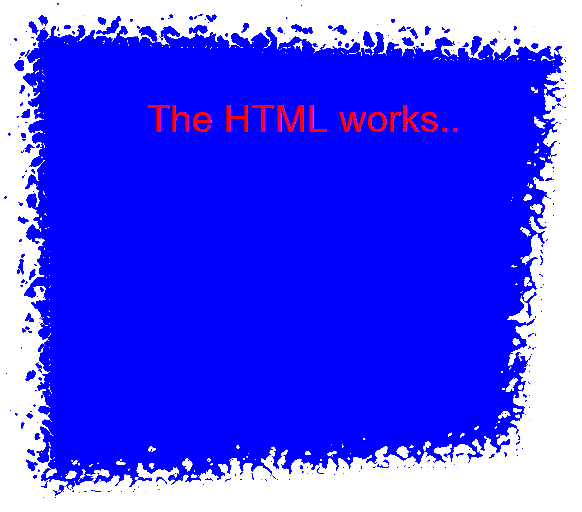
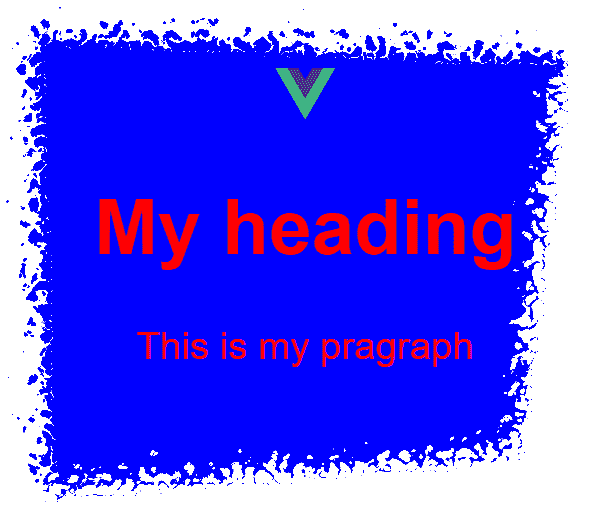

# 使用 Vue.js 在 HTML 上应用 SVG 过滤器

> 原文：<https://dev.to/thisdotmedia/apply-svg-filters-on-html-using-vue-js-254l>

SVG 是一种基于 XML 的强大格式，以其可伸缩性而闻名。

这种图像格式通常因其在徽标、图标和图形上的应用而闻名，但在本文中，我们将在 VueJs 的帮助下使用它来创建一个动态样式的 HTML 容器。

## 开场白

这个项目的想法是我在听 Sara Soueidan 的 Syntax FM 播客时想到的。我以前从未有机会使用 SVG，听到这种图像格式中的无数可能性时，我感到非常惊讶，我想亲眼看看。

这篇文章将介绍生产一个完整的工作组件所需的所有步骤。该代码的完整版本可在以下代码栏中找到:

[vuejs-SVG-component-with-filter-and-html-slot-bne jy](https://codesandbox.io/embed/vuejs-svg-component-with-filter-and-html-slot-bnejy)

CSS 过滤器属性已经为我们提供了对元素应用大量过滤器的可能性，甚至可以使用 URL 过滤器函数直接加载 SVG 过滤器。但是在本文中，我们将使用普通的 SVG。

## 组件

我们的第一步需要创建一个 Vue 组件:

```
<template>
</template>

<script>
export default {};
</script> 
```

接下来，我们将在模板标签中添加一个非常简单的 SVG。我们的对象将包括四个主要部分:基本结构，形状，过滤器和 foreignObject。

### 基本结构

首先，我们将创建 SVG 的结构。在我们的例子中，我们将创建一个简单的 SVG，带有固定大小的视图框:

```
<svg 
    width="600" 
    height="600" 
    viewBox="0 0 250 250" 
    xmlns="http://www.w3.org/2000/svg">
</svg> 
```

### 形状

SVG 以其标准中的大量简单形状元素而闻名。如果您以前使用过 HTML，那么 SVG 元素看起来会很熟悉，因为它们展示了普通 HTML 元素的相同特性，并添加了特定的 XML 属性。

在我们的例子中，我们将创建一个简单的多边形。这种形状被描述为:

多边形由直线组成，形状是“封闭的”(所有的线都连接起来)。

[https://www.w3schools.com/graphics/svg_polygon.asp](https://www.w3schools.com/graphics/svg_polygon.asp)

下一个代码将定义一个由 4 条线组成的多边形，并用蓝色填充:

```
<polygon points="5,5 225,15 205,180 10,195" fill="blue"/> 
```

### 滤镜

SVG 文档中可以使用大量的过滤器原语。它们的强大之处在于可以将多个图元合并在一起，以创建非常复杂的结果，并且能够将过滤器应用于 SVG 文档中的单个形状/对象。过滤器的实际定义是:

> filter [SVG](https://developer.mozilla.org/en-US/docs/Web/SVG) 元素通过对原子过滤器原语进行分组来定义自定义过滤器效果。它本身从不呈现，但必须由 SVG 元素上的[过滤器](https://developer.mozilla.org/en-US/docs/Web/SVG/Attribute/filter)属性使用，或者由 SVG/HTML 元素的[过滤器](https://developer.mozilla.org/en-US/docs/Web/CSS/filter) [CSS](https://developer.mozilla.org/en-US/docs/Glossary/CSS) 属性使用。

[https://developer . Mozilla . org/en-US/docs/Web/SVG/Element/filter](https://developer.mozilla.org/en-US/docs/Web/SVG/Element/filter)

在我们的例子中，我们将应用两个不同的过滤器:**扰动**和 **feDisplacementMap** 。这将为应用它的所有元素提供失真的效果。

```
<filter id="turbulence">
  <feTurbulence
    type="turbulence"
    baseFrequency="0.20"
    numOctaves="2"
    result="turbulence"></feTurbulence>
  <feDisplacementMap
    in2="turbulence"
    in="SourceGraphic"
    scale="25"
    xChannelSelector="R"
    yChannelSelector="G"></feDisplacementMap>
</filter> 
```

如上所述，过滤器需要在另一个对象中使用**过滤器属性**。在我们的例子中，我们必须将湍流的 ID 应用到我们的多边形:

```
 <polygon
    points="5,5 225,15 205,180 10,195"
    fill="blue"
    filter="url(#turbulence)"></polygon> 
```

组件的渲染版本将如下所示:

[](https://res.cloudinary.com/practicaldev/image/fetch/s--ey7eABKh--/c_limit%2Cf_auto%2Cfl_progressive%2Cq_auto%2Cw_880/https://thepracticaldev.s3.amazonaws.com/i/bxh6zllvzjwlzp3m8z4y.png)

### HTML 对象

我们的 SVG 终于成型了。所需的最后一步涉及到使用 **foreignObject** 元素。这个元素允许我们在 SVG 中包含普通的 HTML 元素。

我们的第一步需要在 SVG 中添加元素。这将被添加到形状旁边，但它将完全独立于形状。这意味着我们已经应用到多边形的过滤器将渗入到这个 SVG 元素中。

```
<foreignObject
  x="5%"
  y="10%"
  width="90%"
  height="90%">
  ...HTML CODE HERE
</foreignObject> 
```

现在我们已经定义了我们的元素，我们可以在它的标签中添加任何我们想要的 HTML。值得注意的是，这种方法可能会在不同的浏览器上产生不必要的行为，并影响站点性能。

由于 SVG 的性质，foreignObject 元素中的所有元素都可以被屏幕阅读器读取，并可用于辅助功能。

出于示例的目的，我们将在 SVG 中添加一些简单的元素:

```
<foreignObject
  x="5%"
  y="10%"
  width="90%"
  height="90%">
    <div style="color:red" xmlns="http://www.w3.org/1999/xhtml">
      <p>The HTML works..</p>
    </div>
</foreignObject> 
```

> **提示:**我们可以在 SVG 中使用任何 CSS 声明，甚至可以使用现有的声明。例如，我们会将`<p>`定义为全局绿色，这个声明也会应用到我们的元素中。

我们的组件将呈现如下:

[](https://res.cloudinary.com/practicaldev/image/fetch/s--wgani6I---/c_limit%2Cf_auto%2Cfl_progressive%2Cq_auto%2Cw_880/https://thepracticaldev.s3.amazonaws.com/i/late39s6sj4x3jibof4v.png)

## 使之充满活力

上面的组件工作正常，但是它仍然是静态的。在下一节中，我们将通过使用 VueJs 框架中的可用特性来使它更加动态。

### [插槽](#slot)

首先，我们将修改代码，使 foreignObject 的内容实际上是一个槽。当您想要提供将任何 HTML 传递给组件的灵活性时，这些非常有用。

```
<foreignObject x="5%" y="10%" width="90%" height="90%">
 <div style="color:red" xmlns="http://www.w3.org/1999/xhtml">
   <slot>
     <p>The HTML works..</p>
   </slot>
 </div>
</foreignObject> 
```

然后我们将在使用我们新引入的 slot 的父组件中传递一些 HTML:

```
<finalComponent>
 
 <h1>My heading</h1>
 <p>This is my paragraph</p>
</finalComponent> 
```

在浏览器中运行此代码将产生以下设计:

[](https://res.cloudinary.com/practicaldev/image/fetch/s--HSyoNaNQ--/c_limit%2Cf_auto%2Cfl_progressive%2Cq_auto%2Cw_880/https://thepracticaldev.s3.amazonaws.com/i/y6e94hb5kfxg42zif15d.png)

## 总结

我们完全正常工作的 VueJs SVG 组件现在已经完成。代码可以在下面的 codesandbox 中找到: [vueJs Svg 组件，带有 HTML 槽](https://codesandbox.io/embed/codesandbox-bnejy?fontsize=14)

在一个框架中使用 SVG 可能有点棘手，因为反应性和虚拟 DOM 会产生不想要的结果，如果没有正确的测试集，这个例子可能不会用于生产。

本文仅涵盖了几个示例并介绍了几个主题，但是可能性是无限的。我们可以提供一组形状作为道具，引入 SVG 动画，最后创建一组可以轻松应用于传递的 HTML 的过滤器。

我希望这个概念证明会有所帮助，我期待着在线看到这种方法的不同排列和应用。

## 参考文献

语法 FM:[https://syntax.fm/show/154/svgs-with-sara-soueidan](https://syntax.fm/show/154/svgs-with-sara-soueidan)

SVG 定义:[https://en.wikipedia.org/wiki/Scalable_Vector_Graphics](https://en.wikipedia.org/wiki/Scalable_Vector_Graphics)

CSS 过滤器:[https://css-tricks.com/almanac/properties/f/filter/](https://css-tricks.com/almanac/properties/f/filter/)

SVG 过滤器解释:[https://tympanus.net/codrops/2019/01/15/svg-filters-101/](https://tympanus.net/codrops/2019/01/15/svg-filters-101/)

SVG 过滤器:[https://developer . Mozilla . org/en-US/docs/Web/SVG/Element/filter](https://developer.mozilla.org/en-US/docs/Web/SVG/Element/filter)

https://vuejs.org/v2/guide/components-slots.html[VUE](https://vuejs.org/v2/guide/components-slots.html)

这篇文章是由 Simone Cuomo 写的，他是 Dot 的高级软件工程师。

你可以在推特上关注他们，地址是 [@zelig880](https://dev.to/zelig880) 。

需要 JavaScript 咨询、指导或培训帮助吗？请在 [This Dot Labs](http://thisdot.co/labs) 查看我们的服务列表。