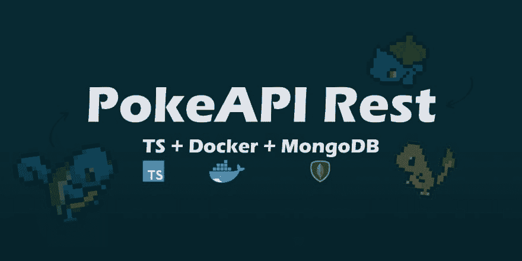
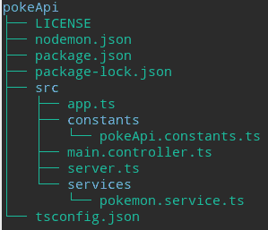

# PokeAPI REST 在 NodeJS 中包含 Express、Typescript、MongoDB 和 Docker —第 1 部分

> 原文：<https://dev.to/nyagarcia/pokeapi-rest-in-nodejs-with-express-typescript-mongodb-and-docker-part-1-5f8g>

[](https://res.cloudinary.com/practicaldev/image/fetch/s--yxIxPmjh--/c_limit%2Cf_auto%2Cfl_progressive%2Cq_auto%2Cw_880/https://thepracticaldev.s3.amazonaws.com/i/j0gnabvx489t3xha8hfa.png)

## 前言

这是展示如何在 NodeJS 中创建 RESTful API 的系列文章的第 1 部分。如需进一步阅读，请查看以下链接:

[PokeAPI REST 在 NodeJS 中包含 Express、TypeScript、MongoDB 和 Docker —第二部分](https://dev.to/nyagarcia/pokeapi-rest-in-nodejs-with-express-typescript-mongodb-and-docker-part-2-b56)

[PokeAPI REST 在 NodeJS 中包含 Express、TypeScript、MongoDB 和 Docker —第 3 部分](https://dev.to/nyagarcia/pokeapi-rest-in-nodejs-with-express-typescript-mongodb-and-docker-part-3-494a)

如果你喜欢查看完整的代码，你可以在这里找到完整的 PokeApi 项目。

## 简介

在这一系列的文章中，我们将学习如何在 NodeJS 中创建我们自己的 RESTful API，使用一个名为 [Express](https://expressjs.com/) 的优秀 web 框架。然而，在我们开始之前，有一点理论:

[休息](https://en.wikipedia.org/wiki/Representational_state_transfer) =具象状态转移。Roy Fielding 为他的博士论文设计的令人敬畏的软件架构风格。REST 允许我们通过使用 HTTP 协议来设计松散耦合的应用程序。

HTTP 为我们提供了以下动词，或者说方法:GET、POST、PUT 和 DELETE，分别对应于 Read、Create、Update 和 Delete (CRUD 操作)。还有一些其他的动词，但是它们不经常使用。我们将使用这些动词来发出请求，这些请求将对我们的数据执行各种操作。

因为(依我拙见) [TypeScript](https://www.typescriptlang.org/) 是自切片面包以来最好的东西，这是我们将使用的语言。对于那些不熟悉它的人来说，TypeScript 是 JavaScript 的一个类型化超集，我们将它编译成普通的 JavaScript，并允许我们向 JavaScript 添加类型(TS FTW)。

由于我们需要一个数据库来存储我们的数据，我们将使用 MongoDB 的一个 dockerized 实例，以及[mongose](https://mongoosejs.com/)，一个 ODM，它使得与 MongoDB 的交互更加容易。

现在我们知道了我们将要做什么，以及如何做，让我们坐下来开始编码。

## 设置我们的项目

### 预览

在我们开始之前，我想给你展示一下我们的目录树在本文结束时的样子:

[](https://res.cloudinary.com/practicaldev/image/fetch/s--Wqx6hBCk--/c_limit%2Cf_auto%2Cfl_progressive%2Cq_auto%2Cw_880/https://thepracticaldev.s3.amazonaws.com/i/e2j2sqopbbc74cy5xj4v.png)

如果有人对我如何生成目录树图像感到好奇，我使用了 linux 的“tree”命令，并抓拍了我的终端的屏幕截图。很简单。

### 安装节点

由于我们将在项目中使用 NodeJS，首先要做的是确保它安装在我们的机器上。

> 提示:打开您的终端并键入以下命令来检查是否安装了 Node:**Node-v**

如果没有，可以在这里安装[。](https://nodejs.org/en/)

### 安装 Docker 和 Docker-compose

Docker 是一个奇妙的工具，它允许我们通过使用容器来创建、部署和运行应用程序(或者几乎任何我们想要的东西)。我们可以用几个简单的命令在几分钟内部署一个 MongoDB 数据库(或任何其他数据库)。

> 提示:运行这个命令来查看您的机器上是否有 docker:**docker-v**

如果没有，可以在这里安装[。](https://docs.docker.com/install/)

正如我刚才提到的，Docker 非常棒。然而，这纯粹是个人喜好，我更喜欢使用 Docker Compose 部署我的容器。这是 Docker 提供的一个工具，它允许我们创建一个. yml 配置文件，我们可以在其中指定容器的所有细节，并且只需一个简单的命令就可以部署所述容器。

> 提示:运行这个命令来检查您是否有 docker-compose:**docker-compose-v**

如果没有，可以在这里安装[。](https://docs.docker.com/compose/install/)

## 开始编码

### 入门

有了所有的先决条件，我们现在可以开始真正的编码了。让我们开始吧:

第一步是创建我们的项目将要存在的文件。我将把我们的项目文件命名为“pokeApi”。打开你的终端，输入这个:

```
mkdir pokeApi
cd pokeApi 
```

<svg width="20px" height="20px" viewBox="0 0 24 24" class="highlight-action crayons-icon highlight-action--fullscreen-on"><title>Enter fullscreen mode</title></svg> <svg width="20px" height="20px" viewBox="0 0 24 24" class="highlight-action crayons-icon highlight-action--fullscreen-off"><title>Exit fullscreen mode</title></svg>

进入项目文件后，我们希望创建 package.json 文件。同样，在您的终端中键入以下命令:

```
npm init 
```

<svg width="20px" height="20px" viewBox="0 0 24 24" class="highlight-action crayons-icon highlight-action--fullscreen-on"><title>Enter fullscreen mode</title></svg> <svg width="20px" height="20px" viewBox="0 0 24 24" class="highlight-action crayons-icon highlight-action--fullscreen-off"><title>Exit fullscreen mode</title></svg>

在运行这个命令之后，我们将被询问一系列问题，在回答这些问题之后，我们的 package.json 文件将被创建。

> 提示:如果您不想回答 npm 的问题，可以使用以下命令: **npm init -y**
> 您可以随时返回 package.json 文件，稍后再编辑它。

### 安装依赖项

能够使用 express，mongoose，TypeScript 等。我们必须安装一些依赖项。为此，运行以下命令:

```
npm i body-parser cors express mongoose 
```

<svg width="20px" height="20px" viewBox="0 0 24 24" class="highlight-action crayons-icon highlight-action--fullscreen-on"><title>Enter fullscreen mode</title></svg> <svg width="20px" height="20px" viewBox="0 0 24 24" class="highlight-action crayons-icon highlight-action--fullscreen-off"><title>Exit fullscreen mode</title></svg>

我们还需要安装几个开发所需的依赖项。类型:

```
npm i -D @types/body-parser @types/cors @types/express @types/mongoose @types/node nodemon ts-node typescript 
```

<svg width="20px" height="20px" viewBox="0 0 24 24" class="highlight-action crayons-icon highlight-action--fullscreen-on"><title>Enter fullscreen mode</title></svg> <svg width="20px" height="20px" viewBox="0 0 24 24" class="highlight-action crayons-icon highlight-action--fullscreen-off"><title>Exit fullscreen mode</title></svg>

> 提示:通过向 npm i 命令添加-D 或- save-dev，安装的依赖项将在 package.json 文件中的“devDependencies”下列出

### 添加 npm 脚本

为了能够运行我们的项目，我们必须在 package.json 文件中创建以下脚本:

```
"scripts": {
"start": "nodemon"
}, 
```

<svg width="20px" height="20px" viewBox="0 0 24 24" class="highlight-action crayons-icon highlight-action--fullscreen-on"><title>Enter fullscreen mode</title></svg> <svg width="20px" height="20px" viewBox="0 0 24 24" class="highlight-action crayons-icon highlight-action--fullscreen-off"><title>Exit fullscreen mode</title></svg>

### 配置节点

Nodemon 是一个开发 nodeJS 应用程序的好工具。每当它检测到代码中的变化时(基本上，每当您保存时)，它会自动重新启动应用程序。

创建一个名为 nodemon.json 的文件，并键入以下内容:

```
{
"watch": ["src"],
"ext": "ts",
"exec": "ts-node ./src/server.ts"
} 
```

<svg width="20px" height="20px" viewBox="0 0 24 24" class="highlight-action crayons-icon highlight-action--fullscreen-on"><title>Enter fullscreen mode</title></svg> <svg width="20px" height="20px" viewBox="0 0 24 24" class="highlight-action crayons-icon highlight-action--fullscreen-off"><title>Exit fullscreen mode</title></svg>

这告诉 nodemon 应该监视和执行哪些文件。

### 配置打字稿

要生成我们的 tsconfig.json 文件，运行以下命令:

```
tsc --init 
```

<svg width="20px" height="20px" viewBox="0 0 24 24" class="highlight-action crayons-icon highlight-action--fullscreen-on"><title>Enter fullscreen mode</title></svg> <svg width="20px" height="20px" viewBox="0 0 24 24" class="highlight-action crayons-icon highlight-action--fullscreen-off"><title>Exit fullscreen mode</title></svg>

注意，这个文件包含许多许多配置选项。当然，您可以根据自己的喜好配置 TypeScript。如果没有，下面是我使用的配置:

```
"compilerOptions": {
"target": "es6",
"module": "commonjs",
"outDir": "./dist",
"resolveJsonModule": true,
"strict": true,
"esModuleInterop": true,
"experimentalDecorators": true,
"emitDecoratorMetadata": true
},                         
"exclude": ["node_modules"], 
"include": ["src/**/*.ts"] 
```

<svg width="20px" height="20px" viewBox="0 0 24 24" class="highlight-action crayons-icon highlight-action--fullscreen-on"><title>Enter fullscreen mode</title></svg> <svg width="20px" height="20px" viewBox="0 0 24 24" class="highlight-action crayons-icon highlight-action--fullscreen-off"><title>Exit fullscreen mode</title></svg>

### 创建. gitignore 文件

在这个文件中，我们可以列出我们希望 git 忽略的所有文件/目录，这意味着当我们添加并提交对项目所做的更改时，这些文件对 git 来说仍然是“不可见的”。

> 提示:将 node_modules 添加到我们的. gitignore 中非常非常重要。我们绝对不希望这个巨大的文件被推到我们的存储库中！！

来创造我们的。gitignore 文件，键入以下内容(当然是在根目录中):

```
touch .gitignore 
```

<svg width="20px" height="20px" viewBox="0 0 24 24" class="highlight-action crayons-icon highlight-action--fullscreen-on"><title>Enter fullscreen mode</title></svg> <svg width="20px" height="20px" viewBox="0 0 24 24" class="highlight-action crayons-icon highlight-action--fullscreen-off"><title>Exit fullscreen mode</title></svg>

然后，在文件中添加以下几行:

```
//.gitignore

node_modules
package-lock.json
dist 
```

<svg width="20px" height="20px" viewBox="0 0 24 24" class="highlight-action crayons-icon highlight-action--fullscreen-on"><title>Enter fullscreen mode</title></svg> <svg width="20px" height="20px" viewBox="0 0 24 24" class="highlight-action crayons-icon highlight-action--fullscreen-off"><title>Exit fullscreen mode</title></svg>

## 配置够了，真正的编码在哪里？

现在开始，我发誓。我们走吧:

### 设置我们的服务器

我们要做的第一件事是创建我们的基本目录结构。我们将创建一个名为 src 的目录，它将包含我们所有的项目文件(除了 config 之外):

```
mkdir src
cd src 
mkdir constants
touch server.ts
touch app.ts 
```

<svg width="20px" height="20px" viewBox="0 0 24 24" class="highlight-action crayons-icon highlight-action--fullscreen-on"><title>Enter fullscreen mode</title></svg> <svg width="20px" height="20px" viewBox="0 0 24 24" class="highlight-action crayons-icon highlight-action--fullscreen-off"><title>Exit fullscreen mode</title></svg>

让我们打开刚刚创建的 app.ts 文件，它将包含我们的基本快速配置:

```
//src/app.ts

import express, { Application } from 'express';
import bodyParser from 'body-parser';
import cors from 'cors';

class App {
  public app: Application;

  constructor() {
    this.app = express();
    this.setConfig();
  }

  private setConfig() {
    //Allows us to receive requests with data in json format
    this.app.use(bodyParser.json({ limit: '50mb' }));

    //Allows us to receive requests with data in x-www-form-urlencoded format
    this.app.use(bodyParser.urlencoded({ limit: '50mb', extended:true}));

    //Enables cors 
    this.app.use(cors());
  }
}

export default new App().app; 
```

<svg width="20px" height="20px" viewBox="0 0 24 24" class="highlight-action crayons-icon highlight-action--fullscreen-on"><title>Enter fullscreen mode</title></svg> <svg width="20px" height="20px" viewBox="0 0 24 24" class="highlight-action crayons-icon highlight-action--fullscreen-off"><title>Exit fullscreen mode</title></svg>

我们将快速浏览快速配置:

*   Body parser 允许我们接收不同格式的数据请求，比如 json 或 x-www-form-urlencoded。
*   CORS(跨源资源共享)使用额外的 HTTP 头，让我们的浏览器知道它必须允许在一个域中运行的 web 应用程序访问来自不同源的服务器的资源。

完成后，我们将创建一个文件来存储应用程序的常量。为什么？因为这样我们只需要声明每个常量一次。每当我们需要使用它的时候，我们只需要导入它。

此外，如果我们的常量的值改变了(是的，即使它是一个常量，有时我们需要改变它的值)，它将在我们项目的任何地方改变，因为它只在一个地方被声明。说了这么多，让我们创建我们的常量文件:

```
cd constants
touch pokeApi.constants.ts 
```

<svg width="20px" height="20px" viewBox="0 0 24 24" class="highlight-action crayons-icon highlight-action--fullscreen-on"><title>Enter fullscreen mode</title></svg> <svg width="20px" height="20px" viewBox="0 0 24 24" class="highlight-action crayons-icon highlight-action--fullscreen-off"><title>Exit fullscreen mode</title></svg>

我们要声明的第一个常量是我们的端口，它将存储我们要为我们的服务器打开的端口号:

```
//src/constants/pokeApi.constants.ts

export const PORT = 9001; 
```

<svg width="20px" height="20px" viewBox="0 0 24 24" class="highlight-action crayons-icon highlight-action--fullscreen-on"><title>Enter fullscreen mode</title></svg> <svg width="20px" height="20px" viewBox="0 0 24 24" class="highlight-action crayons-icon highlight-action--fullscreen-off"><title>Exit fullscreen mode</title></svg>

现在，转到我们的 server.ts 文件，我们将在这里设置我们的服务器:

```
//src/server.ts

import app from "./app";
import { PORT } from "./constants/pokeApi.constants.ts";

app.listen(PORT, () => console.log(`Listening on port ${PORT}`)); 
```

<svg width="20px" height="20px" viewBox="0 0 24 24" class="highlight-action crayons-icon highlight-action--fullscreen-on"><title>Enter fullscreen mode</title></svg> <svg width="20px" height="20px" viewBox="0 0 24 24" class="highlight-action crayons-icon highlight-action--fullscreen-off"><title>Exit fullscreen mode</title></svg>

> 提示:如果有人不熟悉我在 console.log 中使用的语法，这是一种名为 template literals 的技术，在这里，您可以将所有内容键入到抑引号(也称为反引号)中，并使用插值( **${}** )来嵌入变量。更多关于这种技术[在这里](https://developer.mozilla.org/en-US/docs/Web/JavaScript/Reference/Template_literals)。

请注意，我们正在导入之前创建的应用程序和我们的端口常量。

就凭这三个 lil 文件，我们就创建了自己的服务器！启动您的终端并执行我们之前创建的 npm 启动脚本。您可以通过键入:
来完成此操作

```
npm run start 
```

<svg width="20px" height="20px" viewBox="0 0 24 24" class="highlight-action crayons-icon highlight-action--fullscreen-on"><title>Enter fullscreen mode</title></svg> <svg width="20px" height="20px" viewBox="0 0 24 24" class="highlight-action crayons-icon highlight-action--fullscreen-off"><title>Exit fullscreen mode</title></svg>

> 提示:由于我们使用 nodemon 来查看我们的项目文件，我们只需要执行一次前面的命令。每次我们保存更改时，nodemon 都会自动为我们重新启动应用程序。

执行该命令后，您应该会在终端上看到“监听端口 9001”消息。耶！我们现在已经启动并运行了我们的服务器。

你也可以去你最喜欢的浏览器查看一下。键入这个:

```
localhost:9001 
```

<svg width="20px" height="20px" viewBox="0 0 24 24" class="highlight-action crayons-icon highlight-action--fullscreen-on"><title>Enter fullscreen mode</title></svg> <svg width="20px" height="20px" viewBox="0 0 24 24" class="highlight-action crayons-icon highlight-action--fullscreen-off"><title>Exit fullscreen mode</title></svg>

您应该会看到类似这样的消息:“无法获取/”。我知道，不是很令人兴奋…但是如果你看到这条信息，它是有效的！如果没有，返回并重新检查您的代码，以确保没有任何遗漏。

### 创建我们的第一条获取路线

既然我们现在已经启动并运行了服务器，我们将创建第一个 GET 路由并显示一条漂亮的欢迎消息。毕竟，“得不到/”不是很受欢迎…

为此，创建一个名为“main.controller.ts”的文件，并键入以下内容:

```
//src/main.controller.ts

import { Application } from 'express';

export class Controller {
  private pokeService: PokeService;

  constructor(private app: Application) {
    this.routes();
  }

  public routes() {
    this.app.route('/').get();
  }
} 
```

<svg width="20px" height="20px" viewBox="0 0 24 24" class="highlight-action crayons-icon highlight-action--fullscreen-on"><title>Enter fullscreen mode</title></svg> <svg width="20px" height="20px" viewBox="0 0 24 24" class="highlight-action crayons-icon highlight-action--fullscreen-off"><title>Exit fullscreen mode</title></svg>

您可能已经注意到，我们的控制器将充当路由器；这是我们将为这个项目定义所有路线的地方。每个路由将执行不同的操作，这些操作将在服务文件中定义。

为什么我们要在不同的文件中分离我们的行为？假设您在控制器中定义了所有与数据库交互的函数。对于这个项目，我们将使用 MongoDB 作为我们的数据库。现在假设您想要更改数据库，使用 MySQL。你必须回到你的控制器，改变**的一切**，以适应 MySQL 数据库。然而，如果你已经在一个不同的文件中声明了所有的数据库函数，你根本不需要改变控制器。您可以将带有 MongoDB 查询函数的文件换成带有 MySQL 查询函数的文件。通过使用服务，我们保持代码**松散耦合**。

因此，我们现在将在名为“services”的目录下创建一个名为“pokeApi.service.ts”的文件，并键入以下内容:

```
//src/services/pokemon.service.ts

import { Request, Response } from "express";

export class PokeService {
  public welcomeMessage(req: Request, res: Response) {
    return res.status(200).send("Welcome to pokeAPI REST by Nya ^^");
  }
} 
```

<svg width="20px" height="20px" viewBox="0 0 24 24" class="highlight-action crayons-icon highlight-action--fullscreen-on"><title>Enter fullscreen mode</title></svg> <svg width="20px" height="20px" viewBox="0 0 24 24" class="highlight-action crayons-icon highlight-action--fullscreen-off"><title>Exit fullscreen mode</title></svg>

一个非常简单的函数，返回我们可爱的欢迎信息。现在，转到我们的控制器，导入我们刚刚创建的服务:

```
//src/main.controller.ts

import { Application } from 'express';
import { PokeService } from './services/pokemon.service';

export class Controller {
  private pokeService: PokeService;

  constructor(private app: Application) {
    this.pokeService = new PokeService();
    this.routes();
  }

  public routes() {
    this.app.route('/').get(this.pokeService.welcomeMessage);
  }
} 
```

<svg width="20px" height="20px" viewBox="0 0 24 24" class="highlight-action crayons-icon highlight-action--fullscreen-on"><title>Enter fullscreen mode</title></svg> <svg width="20px" height="20px" viewBox="0 0 24 24" class="highlight-action crayons-icon highlight-action--fullscreen-off"><title>Exit fullscreen mode</title></svg>

如您所见，我们的主要 GET 路径将调用我们刚刚在 pokemon 服务中创建的 welcomeMessage 函数。

到目前为止，一切顺利。是时候将我们的控制器导入到我们的应用程序中了

```
//src/app.ts

import express, { Application } from 'express';

//importing our controller
import { Controller } from './main.controller';
import bodyParser from 'body-parser';
import cors from 'cors';

class App {
  public app: Application;

  //declaring our controller
  public pokeController: Controller;

  constructor() {
    this.app = express();
    this.setConfig();

    //Creating and assigning a new instance of our controller
    this.pokeController = new Controller(this.app);
  }

  private setConfig() {
    this.app.use(bodyParser.json({ limit: '50mb' }));
    this.app.use(bodyParser.urlencoded({ limit: '50mb', extended: true }));
    this.app.use(cors());
  }
}

export default new App().app; 
```

<svg width="20px" height="20px" viewBox="0 0 24 24" class="highlight-action crayons-icon highlight-action--fullscreen-on"><title>Enter fullscreen mode</title></svg> <svg width="20px" height="20px" viewBox="0 0 24 24" class="highlight-action crayons-icon highlight-action--fullscreen-off"><title>Exit fullscreen mode</title></svg>

我们完事了。打开你的浏览器，如果你做的一切都正确，你应该会看到你的欢迎信息，就像这样:

[](https://res.cloudinary.com/practicaldev/image/fetch/s--GpvmRl5D--/c_limit%2Cf_auto%2Cfl_progressive%2Cq_auto%2Cw_880/https://thepracticaldev.s3.amazonaws.com/i/8xrqnpsm2klda6f6yd2t.png)

### 一点点的重构

还记得我们创建了一个存储所有常量的文件吗？您可能已经意识到，在我们的 welcomeMessage 函数(在我们的 pokemon 服务中)中，我们返回了一个包含消息的字符串，我们将它“硬编码”到我们的服务中。不是很整齐，对吧？如果我们想改变信息呢？我不得不修改服务。不太好。

因此，我们将获取该消息，并在我们的常量文件中声明它:

```
//src/constants/pokeApi.constants.ts

export const PORT = 9001;
export const WELCOME_MESSAGE = "Welcome to pokeAPI REST by Nya ^^"; 
```

<svg width="20px" height="20px" viewBox="0 0 24 24" class="highlight-action crayons-icon highlight-action--fullscreen-on"><title>Enter fullscreen mode</title></svg> <svg width="20px" height="20px" viewBox="0 0 24 24" class="highlight-action crayons-icon highlight-action--fullscreen-off"><title>Exit fullscreen mode</title></svg>

一旦我们完成了这些，我们将在我们的服务中导入常量文件，就像这样:

```
//src/services/pokemon.service.ts

import { Request, Response } from "express";
import { WELCOME_MESSAGE } from "../constants/pokeApi.constants";

export class PokeService {
  public welcomeMessage(req: Request, res: Response) {
    return res.status(200).send(WELCOME_MESSAGE);
  }
} 
```

<svg width="20px" height="20px" viewBox="0 0 24 24" class="highlight-action crayons-icon highlight-action--fullscreen-on"><title>Enter fullscreen mode</title></svg> <svg width="20px" height="20px" viewBox="0 0 24 24" class="highlight-action crayons-icon highlight-action--fullscreen-off"><title>Exit fullscreen mode</title></svg>

如果您返回浏览器，您应该仍然会看到欢迎消息。

## 结论

在这篇文章中，我们涵盖了从设置项目的配置，到定义我们的第一条路由和成功地发出我们的第一个 GET 请求的所有内容。

如果你想查看这篇文章的完整代码，你可以在这里找到它(pokeAPI 项目的“part1”分支)。

非常感谢你的阅读，我希望你喜欢并发现这篇文章是有用的。请随意与您的朋友和/或同事分享，如果您有任何意见，请随时联系我！这是我的推特页面的链接。

在接下来的文章中，我们将把我们的应用程序连接到一个用 docker-compose 部署的 MongoDB 实例。我们还将使用 Mongoose 来创建数据模型和模式。

最后，但并非最不重要的是，这里是以下帖子的链接:

[PokeAPI REST 在 NodeJS 中包含 Express、TypeScript、MongoDB 和 Docker —第二部分](https://dev.to/nyagarcia/pokeapi-rest-in-nodejs-with-express-typescript-mongodb-and-docker-part-2-b56)