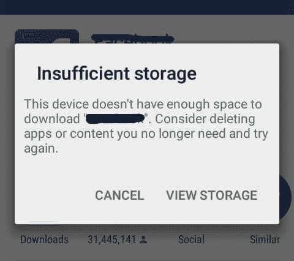
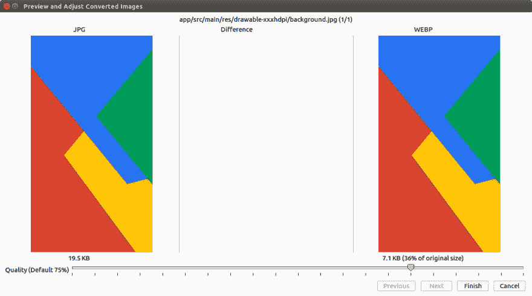
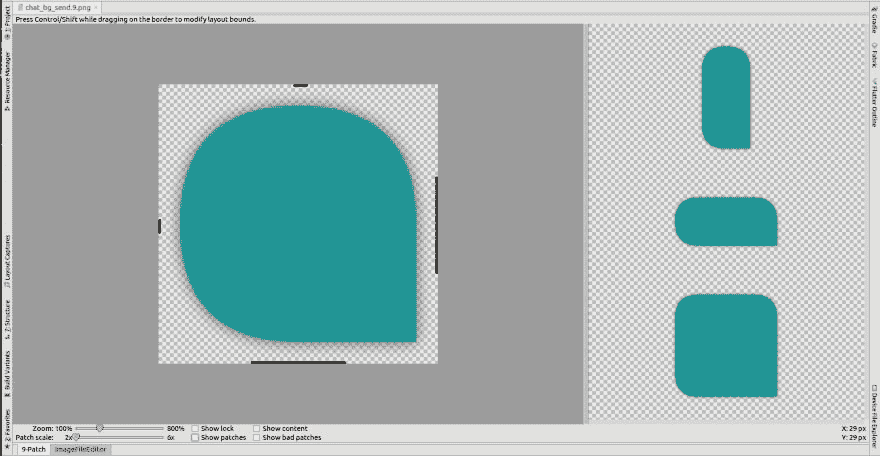
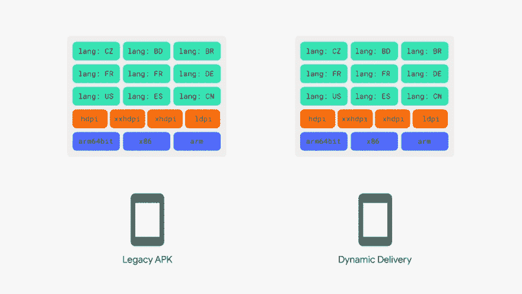

# 安卓教程:如何缩小安卓应用大小？

> 原文：<https://dev.to/amitspaceo/how-to-reduce-android-app-size-android-tutorial-578i>

你知道吗，在新兴市场，大约 70%的人在下载应用程序之前会考虑它的大小，因为他们担心数据成本和手机存储空间。？您在上传应用程序时是否会因为它们太大而遇到麻烦？这里有一个教程解释了如何在开发人员的层面上减少 android 应用程序的大小，以及 Android 应用程序捆绑包如何使这项任务变得容易。

**你会学到什么？**

如何在开发者层面上减少 android 应用程序的大小，

*   移除未使用的资源、代码和类，并尽可能重用资源。
*   缩小图像尺寸
*   减少本机和 Java 代码库的大小
*   简要说明 Android 应用捆绑包在减少应用大小方面的作用

如果应用程序很大，人们不愿意全部下载。让我们想象一下，当用户安装你的应用程序时，弹出这条消息。

用户认为没有应用程序他们可能会过得更好。谁会为了一个应用程序而大费周章地查找和删除未使用的文件和应用程序呢？即使他们有足够的存储空间，但网速很慢，他们可能会对下载所花的时间感到厌倦，并停止下载过程。

这就是为什么开发一个具有高性能、高质量设计和无缝用户体验且不占用太多空间的应用程序是极其重要的。

问题是——怎么做？

Space-O Technologies 的 Android 开发人员收到了许多关于他们如何构建有效的小型应用程序的询问，这启发我们编写了一个实用的 Android 教程，介绍如何减少 Android 应用程序的大小。我们将首先了解开发人员在开发应用程序时应该采用的方法，然后继续了解 Android 应用程序捆绑包。

在减少应用程序大小之前，让我们使用 APK 分析器分析应用程序大小，并了解 APK 结构。

**目录**

META-INF/ -包含证书。SF 和 CERT。RSA 签名文件以及清单。MF 清单文件。assets/ -应用程序的所有资产都包含在此。应用程序可以使用 AssetManager 对象检索它们。
res/ -包含未编译成 resources.arsc.
lib/ -包含特定于处理器软件层的编译代码。

**文件**

它包含编译过的资源。所有的语言字符串和风格，布局文件和图像都包括在这。基本上，它包含来自 res/values/文件夹的所有配置的 XML 内容。

classes . dex——它包含以 Dalvik/ART 虚拟机理解的 DEX 文件格式编译的类。你可能有多个。如果方法数量超过 64K，则使用 dex 文件

AndroidManifest.xml:它有核心的 AndroidManifest 文件，列出了应用程序的名称、版本、访问权限和引用的库文件。该文件使用 Android 的二进制 XML 格式。

# 如何缩小安卓应用大小或 APK 大小

**1。移除未使用的资源、代码和类**

lint 工具检测代码没有引用的 res/文件夹中的资源。lint 工具只检测潜在未使用的资源，并打印如下消息，

res/layout/preferences.xml:警告:资源 R.layout.preferences 似乎未使用[UnusedResources]

启用资源收缩并使用 proguard 收缩代码。通过将 minifyEnabled 设置为 true，proguard 删除所有未使用的方法，并精简 classes.dex 文件。

也可以重复利用资源。不要使用不同的资源，而是以不同的方式利用一种资源。这是一个来自 Android 开发者网站的例子，

Android:drawable = " @ drawable/IC _ thumb _ up "
Android:pivotX = " 50% "
Android:pivotY = " 50% "
Android:from degrees = " 180 "/>

如果您的应用程序只需要一种语言，例如英语，那么您应该使用 resConfig。启用 resConfig 只会在您的 apk 文件中添加英语资源。以下是你可以做到的方法，

**2。缩小图像尺寸**

这可以用许多不同的方法来实现，但是我们将只讨论几个主要的方法

a)你可以使用像这样的可绘制形状

b)使用。webp 图像格式:转换。jpg 和。png 图像到。webp 格式。您可以看到，图像质量没有下降，但尺寸却大大减小了。

c)压缩 PNG 和 JPG 文件

要压缩 PNG 文件，您可以使用 pngcrush、pngquant 或 zopflipng 等工具。

要压缩 JPG 文件，像 packJPG 和 guetzli 这样的工具非常有效。

d)对简单图像使用矢量图形，因为它们利用空间

e)使用 9 片图像可以节省大量空间。Draw 9-patch 工具用于创建自动调整大小以适应视图内容和屏幕大小的位图图像。

**3。减少本机和 Java 代码库的大小**

这可以通过几种方式实现，

*   删除自动生成的不必要的代码。
*   避免枚举:使用@IntDef 注释和 ProGuard 来去掉枚举并将它们转换成整数。
*   减小本机二进制文件的大小:有两种方法可以做到这一点

–删除调试符号:使用 Android NDK 中提供的 arm-eabi-strip 工具，删除不必要的调试符号。始终在发布版本中发布您的应用程序。

–避免提取原生库:通过设置 Android:extractNativeLibs = " false "防止 PackageManager 复制。所以在安装过程中，文件从 APK 转移到文件系统。这使得你的应用程序更新更小。

这是一个开发者在他的水平上可以做到的，但是对于 Android 应用开发者来说还有很多事情要做。我们正在讨论 Android 应用捆绑格式。那是什么？

随着功能的增加，Android 应用程序的大小不断增加，导致安装数量减少。这就是 Android studio 推出 Android 应用捆绑包的原因。

什么是安卓应用捆绑包(。aab)格式？为什么要使用 Android 应用捆绑包？

Android 应用捆绑格式是什么？

最初，开发者可以在。apk 格式有两种方式，

*   或者作为一个文件，包含您的应用程序支持的不同设备配置的所有代码和资源。

*   或者作为单独处理不同设备配置的多个文件。

使用发布应用程序。aab 格式是 Android studio 提供的第三种选择。Android 应用捆绑包是 Android 应用的新发布格式。如果你想减少 Android 应用程序的大小，这是最好的格式。

# 为什么要用安卓 App 捆绑？

Android 应用捆绑包仅提供用户在其特定设备上运行应用所需的代码和资源。与通用 APK 相比，使用这种格式可以节省 35%的空间。你不需要使用不完整的解决方案，如多 APK，从而节省你大量的时间和精力。

应用捆绑包使用动态交付服务模型来减少 Android 应用的大小。应用程序大小的减小主要有两种方式，

**1。使用配置 APK**

使用上传您的应用程序。aab 格式。Google Play 将使用它来生成 2 个 APK:一个基本 APK 和多个配置 apk。基本 APK 包含交付应用程序基本功能所需的所有代码和资源。用户将首先收到这个 APK 和随后的 APK 将依赖于此。这是从项目的应用程序或基础模块中生成的。

在此之后，Google Play 将扫描设备配置以生成配置 apk。每次，应用程序被下载到设备上，配置被扫描，动态交付模式开始发挥作用。只有定制的配置 APK 相对于其单独的配置被下载到设备上。

因此，应用程序只需要有限的空间。

**2。使用按需功能**

如果你希望创建一个模块化的应用程序，比如游戏应用程序，那么这个就是为你准备的。您的应用程序中有许多用户不需要的特性，他们可能只下载需要的特性。您可以将您的功能分发到动态功能模块中，从而缩小您的 APK，使其成为一个动态的 Android 应用程序。

当用户需要这些模块中的一个功能时，他将安装 apks，动态交付将提供动态功能 APK 编译资源和代码以运行该特定功能。

# 总结一下吧！

在这个 Android 教程中，我们学习了如何，

*   移除未使用的资源、代码和类。如果可能，尽可能重复使用资源。
*   使用可绘制形状、矢量图像、9 片图像或转换为 webp 格式或压缩 png 和 jpg 图像来缩小图像
*   减少本机和 Java 代码库的大小
*   使用 Android 应用捆绑包

我们希望这个教程能帮助你减少你的应用程序的大小，你可以考虑开发小尺寸的功能丰富的应用程序。

如果你知道任何其他更简单或更快的方法来减少 Android 应用程序的大小，请在评论部分分享。